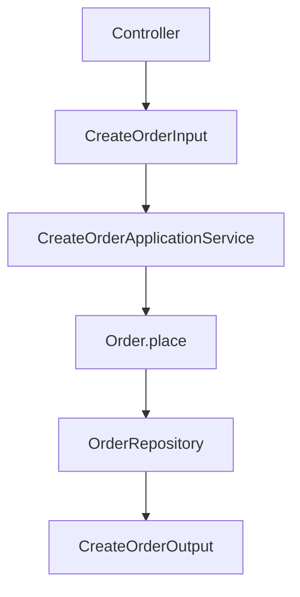
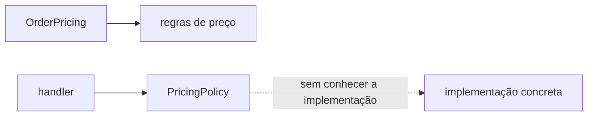
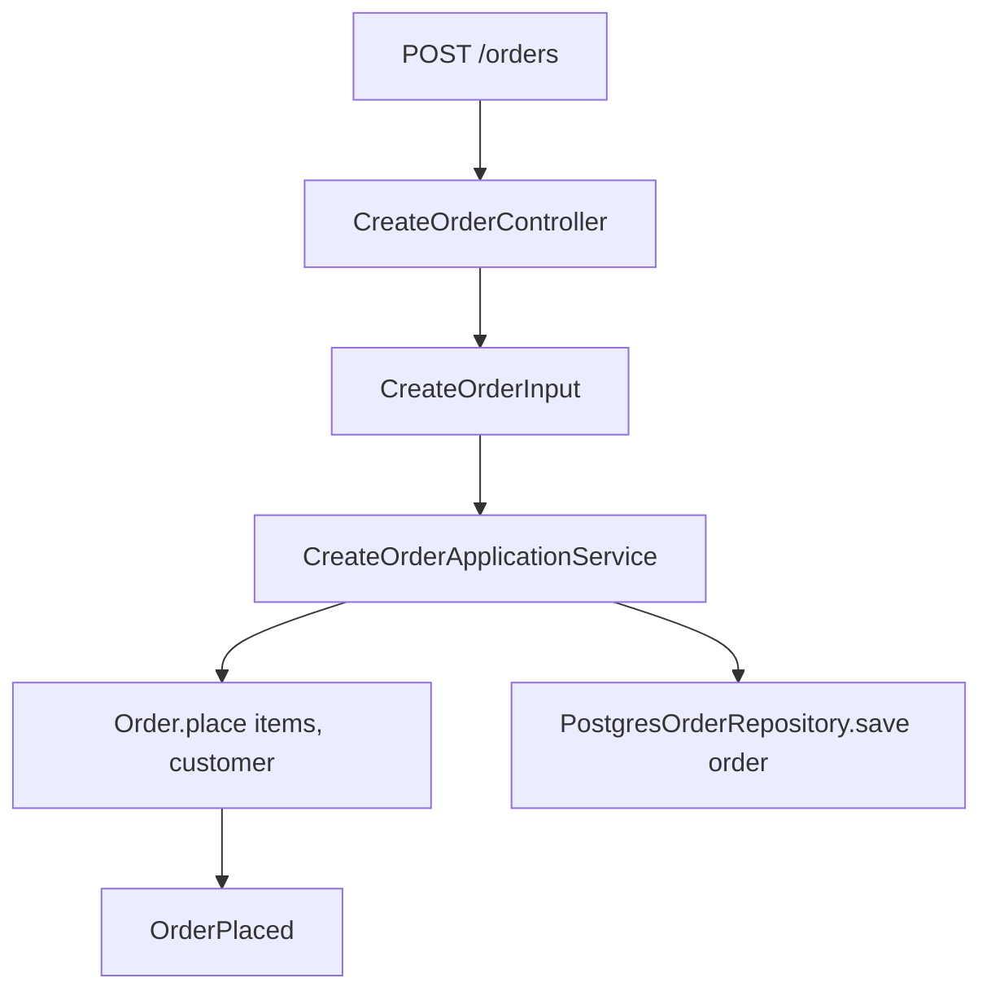

# Componentes de aplicação

Esta página reúne termos que aparecem na fronteira entre apresentação, aplicação, domínio e infraestrutura. O objetivo é distinguir responsabilidades que muitas vezes recebem o mesmo nome em projetos diferentes.

## Componentes da apresentação

Um controller recebe uma entrada de um protocolo e delega para a aplicação. Ele pode interpretar rota, autenticação, autorização, formato e status HTTP, mas não deve decidir regras centrais do domínio.

Um validator verifica forma, tipos e pré-condições de entrada. Validação de sintaxe, como "campo é um UUID", costuma ficar na borda. Uma regra como "pedido pago não pode ser cancelado" pertence ao domínio, mesmo que também seja validada para produzir uma mensagem amigável.

Um DTO transporta dados entre fronteiras. `CreateOrderInput` pode conter os campos recebidos pelo controller; `OrderSummary` pode conter os campos que uma query devolve. DTOs protegem contratos quando não são confundidos com entities, aggregates ou modelos de banco.

## Serviços

Service é um nome genérico e insuficiente sozinho. Application Service coordena um use case, chama ports, gerencia transação e monta o resultado. Domain Service encapsula uma regra de domínio que não pertence naturalmente a uma única entity ou value object. Infrastructure Service implementa uma capacidade técnica, como enviar e-mail ou acessar um provedor.

Se um service apenas repassa uma chamada, ele pode não estar adicionando uma fronteira útil. Se concentra regras de várias áreas sem ownership claro, virou um objeto genérico difícil de testar.

## Coesão e acoplamento

Cohesion é o grau em que os elementos de um componente pertencem à mesma responsabilidade. Um `OrderPricingService` que calcula preço, envia e-mail e atualiza permissões tem baixa coesão.

Coupling é o grau de dependência entre componentes. Um controller que conhece tabelas, eventos, detalhes de cache e classes internas de vários módulos tem alto acoplamento. A meta não é eliminar toda dependência, mas fazer dependências explícitas, estáveis e orientadas para contratos.

Coesão e acoplamento são critérios de design, não uma contagem automática de arquivos. Uma abstração adicional pode reduzir acoplamento ou apenas esconder uma chamada direta.

## CRUD e comportamento

CRUD significa Create, Read, Update e Delete. É uma descrição útil de operações sobre dados, mas não garante que esses verbos representam o domínio. "Aprovar pedido", "cancelar assinatura" e "recalcular fatura" podem ter invariantes que um `update` genérico não expressa.

Um sistema pode usar CRUD na persistência e commands na aplicação. O importante é não deixar a forma da tabela definir sozinha o contrato do negócio.

## Termos complementares

Os termos abaixo aparecem em diferentes estilos arquiteturais e precisam ser lidos pelo comportamento que representam:

| Termo | Significado | Exemplo |
| --- | --- | --- |
| Handler | Componente que processa uma mensagem ou operação específica | `PlaceOrderCommandHandler` |
| Read Operation | Operação que apenas obtém informação | `GetOrderQuery` |
| Write Operation | Operação que altera estado persistente ou relevante | `PlaceOrderCommand` |
| Shared Database | CQRS com leitura e escrita no mesmo banco e schema | readers e writers no PostgreSQL |
| Separate Read/Write Stores | Leitura e escrita em armazenamentos diferentes | PostgreSQL para escrita e uma projeção para leitura |
| Feature Folder | Diretório que agrupa os arquivos de uma funcionalidade | `features/orders/place-order/` |
| Technical Layer Folder | Diretório que agrupa um tipo técnico | `controllers/` ou `repositories/` |

Um `Handler` pode ser síncrono ou publicar trabalho assíncrono, mas seu contrato deve deixar claro o resultado e a política de erro. `Read Operation` não deve gravar dados apenas para preparar a própria resposta. `Write Operation` precisa declarar transação, idempotência e autorização quando essas propriedades forem relevantes.

## Exemplo de contrato

O controller conhece HTTP. O application service conhece a sequência do caso de uso. O domínio conhece regras do pedido. O repository conhece persistência. Cada componente possui uma razão mais específica para mudar.

## Relações

- [Arquitetura em camadas](fronteiras/arquitetura-em-camadas.md) mostra a posição desses componentes.
- [Arquitetura Hexagonal](fronteiras/arquitetura-hexagonal.md) define ports e adapters para separar o núcleo dos detalhes.
- [CQRS](cqrs/cqrs.md) usa DTOs, commands, queries e handlers para separar leitura e escrita.
- [DDD](modelagem/ddd.md) define entities, value objects, aggregates, repositories e domain services.
- [Vertical Slice Architecture](organizacao/vertical-slice.md) aproxima os componentes de uma feature.
