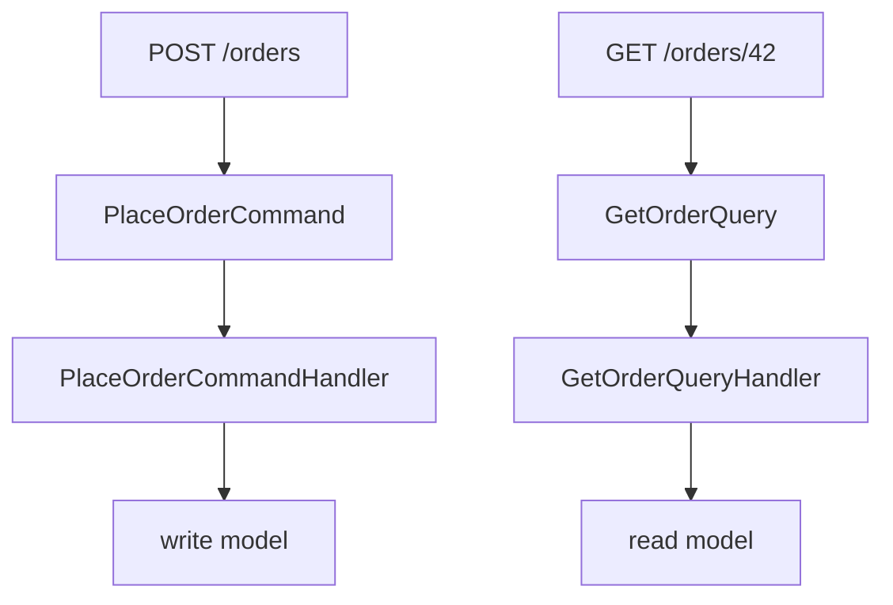
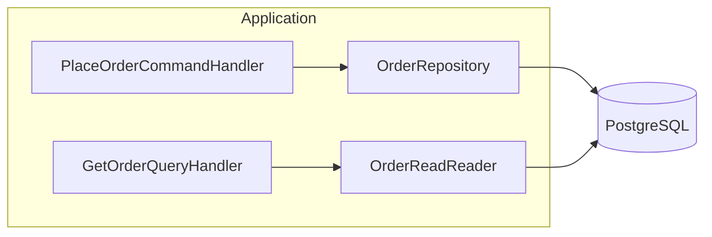
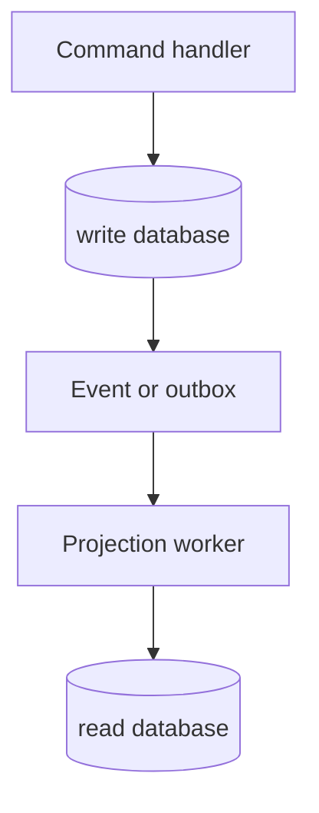

# CQRS

CQRS, Command Query Responsibility Segregation, separa operações que alteram estado das operações que apenas obtêm informação. A separação pode ser apenas de classes e modelos dentro do mesmo processo, ou chegar a armazenamentos, bancos e serviços diferentes.

## Command e query

Um command expressa a intenção de mudar o sistema. `PlaceOrderCommand` carrega a intenção e seus dados, mas não deveria ser uma chamada genérica como `UpdateOrderTable`.

Uma query tem como objetivo obter informação sem alterar estado persistente. `GetOrderQuery` pode selecionar apenas as colunas e joins necessários para uma tela. Uma query que popular cache, registrar acesso ou corrigir dados deixou de ser uma leitura sem efeitos colaterais.



## Handlers

Um command handler processa um command e coordena a operação de escrita. Um query handler processa uma query e retorna o resultado da leitura. O handler representa uma operação específica e não deve virar um service genérico que concentra fluxos não relacionados.

O controller pertence à apresentação. Ele autentica e traduz a requisição para um input DTO ou command, chama o handler e traduz o resultado para a resposta. O trabalho de negócio não deve ser implementado na camada HTTP.

## DTOs

Data Transfer Object é uma estrutura de transporte entre fronteiras. Um input DTO valida a forma de entrada. Um output DTO define os campos de saída. DTO não é automaticamente uma entity, um aggregate ou um modelo de banco.

```php
final readonly class GetOrderQuery
{
  public function __construct(public int $orderId)
  {
  }
}

final readonly class OrderResult
{
  public function __construct(
    public int $id,
    public string $status,
    public int $totalCents,
  ) {
  }
}
```

O output pode omitir colunas internas, normalizar nomes e apresentar um formato estável. Um DTO compartilhado por todas as operações pode parecer conveniente, mas costuma vazar campos e acoplar contratos que mudam em ritmos diferentes.

## Read side e write side

Write side aplica regras, invariantes, transações e autorização. Write model é o modelo adequado para executar alterações, frequentemente próximo do domínio.

Read side responde consultas. Read model pode ser uma projeção denormalizada, uma view, uma tabela de consulta ou um resultado SQL específico. O modelo de leitura pode ter nomes e estrutura diferentes do write model porque otimiza uma pergunta concreta.

```text
write model: Order, OrderItem, Payment
read model: OrderSummary { id, customer_name, total, status }
```

Separar os modelos não obriga separar os bancos. CQRS com shared database mantém leitura e escrita no mesmo banco e schema, mas já pode separar classes, índices, consultas e responsabilidades. Separate read/write stores usam armazenamentos distintos e exigem replicação, projeções, observabilidade e uma política para consistência eventual.

## Projection

Projection é uma representação derivada de eventos ou dados de origem, construída para uma consulta. Ela precisa ser reconstruível ou possuir um procedimento de recuperação. Uma projeção que perde um evento ou aplica a mesma mensagem duas vezes precisa de idempotência, versão ou uma estratégia de rebuild.

## Command Query Separation

Command Query Separation é o princípio de separar métodos que mudam estado dos que retornam dados. CQRS aplica essa ideia em uma escala arquitetural maior. Nem toda classe precisa ter dois modelos, e uma query não deve ser chamada de command só porque está em um módulo de aplicação.

## CQRS com banco compartilhado



Esse modelo preserva simplicidade operacional. A leitura pode usar SQL projetado, `select` mínimo, índices e paginação, enquanto a escrita protege invariantes. O risco é as duas partes compartilharem tabelas sem uma política clara de ownership.

## CQRS com stores separados



O ganho pode ser escala independente e consultas especializadas. O custo inclui atraso de projeção, reprocessamento, duplicação de dados, operação de dois armazenamentos e necessidade de explicar ao usuário quando uma alteração ainda não aparece na leitura.

## Quando usar

CQRS ajuda quando leitura e escrita têm modelos, cargas, regras ou ritmos de evolução diferentes. Também pode ser útil quando um domínio de escrita rico precisa alimentar várias consultas específicas.

Para um CRUD simples, separar command, query, DTO, handler e repository pode produzir mais arquivos sem reduzir risco. Comece com a separação lógica e só introduza stores separados quando medições e requisitos justificarem o custo.

## Relações

- [DDD](../modelagem/ddd.md) fornece aggregates, entidades e regras que normalmente vivem no write side.
- [Event Sourcing](../event-sourcing/event-sourcing.md) pode fornecer a fonte do write side, mas CQRS não exige histórico de eventos.
- [Barramento interno](../bus-interno.md) mostra command bus, query bus e event bus em um monólito.
- [Event bus](../../comunicacao/event-bus.md) descreve a distribuição de fatos entre consumidores.
- [Outbox](../../dados/mensageria/outbox.md) reduz a janela entre commit e publicação.

## Fontes

- [Martin Fowler, CQRS](https://martinfowler.com/bliki/CQRS.html)
- [Martin Fowler, Event Sourcing](https://martinfowler.com/eaaDev/EventSourcing.html)
- [Microsoft, CQRS pattern](https://learn.microsoft.com/en-us/azure/architecture/patterns/cqrs)
