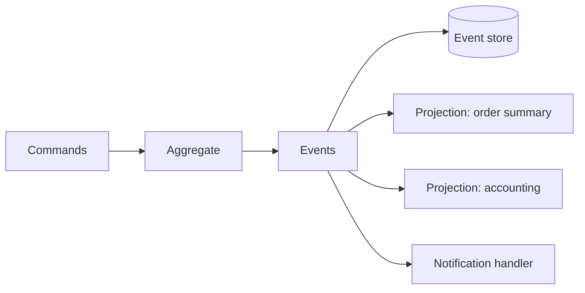

# Event Sourcing

Event Sourcing é uma estratégia em que o estado de uma entidade é reconstruído a partir de uma sequência de eventos imutáveis. Em vez de guardar somente "pedido está pago", o sistema guarda fatos como `OrderPlaced`, `PaymentAuthorized` e `OrderPaid`.

O evento é uma descrição de algo que aconteceu, não uma instrução futura. `OrderPaid` é diferente de `PayOrder`. O primeiro pode ser consumido por vários leitores; o segundo é um command destinado a um responsável.

## Modelo



O aggregate recebe um command, verifica invariantes e produz eventos. O event store grava os eventos em ordem por stream. Para reconstruir o aggregate, o sistema lê a sequência e aplica cada evento. O estado atual é uma consequência derivada, não a única fonte de verdade.

## Eventos

Um event é um fato relevante do sistema. Um domain event é um fato relevante do domínio, como `OrderCancelled` ou `SubscriptionRenewed`. Eventos de integração podem ter um contrato público, versionamento e consumidores fora do bounded context.

O envelope normalmente inclui identificador, tipo, versão, stream, sequência, timestamp, correlation ID e payload. O payload deve ser evoluído sem quebrar consumidores antigos. Renomear um evento já publicado pode ser uma alteração de contrato, mesmo que o código local compile.

## Exemplo

```json
{
  "event_id": "evt-123",
  "type": "OrderPlaced",
  "stream_id": "order-42",
  "sequence": 1,
  "occurred_at": "2026-09-26T12:00:00Z",
  "data": {
    "customer_id": "customer-7",
    "total_cents": 12500,
    "currency": "BRL"
  }
}
```

O exemplo não deve ser entendido como um schema universal. A escolha de nomes, envelope e serialização depende do contrato do sistema. Identificadores e sequências ajudam a detectar duplicação, lacunas e eventos fora de ordem.

## Concorrência e versão

Um aggregate pode carregar uma versão esperada. A gravação falha se outra operação já tiver gravado a mesma stream, evitando que dois comandos confirmem uma decisão baseada em estados diferentes.

```text
read stream order-42 at version 4
append OrderPaid with expected version 4
if current version != 4, reject and retry after rereading
```

Isso é optimistic concurrency, não um bloqueio universal. A regra de retry precisa ser limitada e idempotente. Comandos que produzem efeitos externos devem usar uma chave de idempotência ou uma outbox.

## Projeções

Uma projection consome eventos e constrói um read model. A projeção de pedidos pode armazenar `id`, `customer_name`, `status` e `total` em uma tabela otimizada para a tela. Outra projeção pode alimentar contabilidade.

Projeções podem ficar temporariamente atrasadas. Elas devem registrar posição, lidar com duplicação e permitir rebuild a partir do event store. Uma mensagem inválida não deve fazer o worker perder silenciosamente o ponto de processamento.

## Eventual consistency

Quando a leitura depende de uma projeção assíncrona, o usuário pode gravar um pedido e ainda não vê-lo em uma consulta imediatamente seguinte. Isso é eventual consistency. A interface pode mostrar confirmação baseada no resultado da escrita, aguardar uma posição de projeção ou informar que a leitura será atualizada.

Consistência eventual não significa ausência de garantias. O sistema ainda deve definir ordenação, durabilidade, comportamento em duplicação, recuperação, limites de atraso e o que é considerado confirmado.

## Snapshots

Streams longos podem ser acelerados com snapshots do estado em uma versão conhecida. O snapshot é uma otimização derivada, não substitui os eventos. Ele precisa indicar a versão e poder ser descartado e reconstruído.

## Retenção e privacidade

Eventos imutáveis dificultam correções, expurgo e atendimento a requisitos de privacidade. Antes de adotar Event Sourcing, defina criptografia, retenção, anonimização, direito de exclusão, controle de acesso, backup e destruição segura. Não grave dados sensíveis no evento apenas porque o schema atual os possui.

## Event bus e outbox

O event store registra fatos do domínio. Um event bus distribui eventos para consumidores. Eles podem ser o mesmo componente em algumas tecnologias, mas são responsabilidades diferentes. Se a alteração precisa ser confirmada junto com a publicação, uma outbox ou um event store transacional evita a janela entre banco e broker.

## Custos e limites

Event Sourcing fornece auditoria temporal, replay e múltiplas projeções, mas exige versionamento, migração de eventos, observabilidade, reprocessamento e disciplina de contratos. Não é automaticamente melhor que armazenar o estado atual. Para um CRUD sem necessidade de histórico ou reconstrução, um modelo convencional pode ser mais simples.

## Relações

- [CQRS](../cqrs/cqrs.md) frequentemente usa eventos para alimentar o read side, mas os dois padrões são independentes.
- [Event bus](../../comunicacao/event-bus.md) distribui fatos entre consumidores.
- [Outbox](../../dados/mensageria/outbox.md) registra publicação confiável junto da transação.
- [DDD](../modelagem/ddd.md) fornece domain events e aggregates que podem produzir eventos.

## Fontes

- [Martin Fowler, Event Sourcing](https://martinfowler.com/eaaDev/EventSourcing.html)
- [Martin Fowler, What do you mean by "Event-Driven"?](https://martinfowler.com/articles/201701-event-driven.html)
- [Microsoft, Event Sourcing pattern](https://learn.microsoft.com/en-us/azure/architecture/patterns/event-sourcing)
