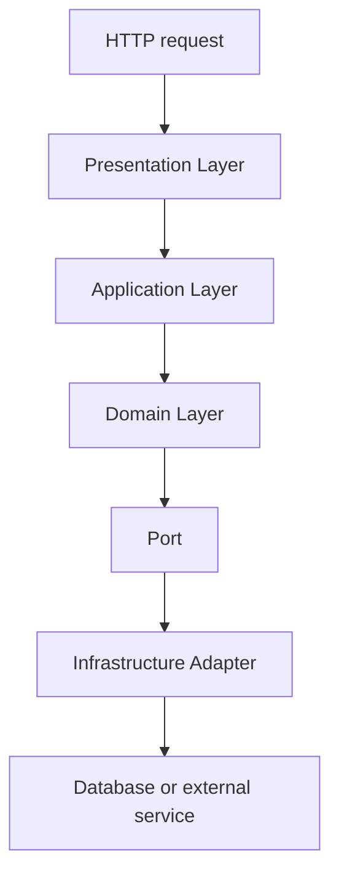

# Arquitetura em camadas

Layered Architecture organiza uma aplicação por responsabilidades técnicas. Uma camada oferece contratos para a camada acima e esconde detalhes da camada abaixo. A divisão pode reduzir acoplamento, mas só funciona quando as regras de dependência são respeitadas.

## Camadas comuns

Uma composição frequente possui apresentação, aplicação, domínio e infraestrutura.

| Camada | Responsabilidade | Exemplo |
| --- | --- | --- |
| Presentation Layer | Receber e apresentar dados | controller HTTP, CLI, presenter |
| Application Layer | Coordenar casos de uso | `PlaceOrderHandler` |
| Domain Layer | Proteger regras e invariantes | `Order`, `Money`, políticas |
| Infrastructure Layer | Implementar efeitos externos | PostgreSQL, fila, filesystem |

Esses nomes são convenções, não uma prova de qualidade. Uma pasta `services` pode conter regras de domínio, orquestração de aplicação e chamadas remotas ao mesmo tempo. A responsabilidade deve ser avaliada pelo comportamento.

## Caminho de uma requisição



O controller valida formato, autenticação e autorização aplicáveis à entrada, cria um input DTO e delega. O application service coordena a operação. O domínio aplica regras. Um repository ou outra porta representa a necessidade de acesso externo. A infraestrutura converte essa porta em SQL, uma chamada HTTP ou uma publicação de mensagem.

O retorno percorre o caminho inverso, mas não precisa reutilizar o modelo de persistência. Um output DTO pode expor apenas os campos do contrato público.

## Limites entre camadas

As fronteiras devem especificar quem conhece quem, quais tipos podem atravessar e onde erros são traduzidos. O domínio não deve depender de uma exceção do driver PostgreSQL. A apresentação não deve decidir como recalcular o total do pedido. A infraestrutura não deve escolher a política de negócio porque conhece melhor o ORM.

Uma camada pode chamar mais de uma camada inferior, mas chamadas que pulam repetidamente a aplicação e acessam o banco a partir dos controllers indicam uma erosão do desenho. O objetivo não é impedir toda chamada direta, e sim tornar a direção compreensível e testável.

## Exemplo

```text
Presentation: CreateOrderController
Application: CreateOrderHandler
Domain: Order.place, Money, OrderPolicy
Infrastructure: PostgresOrderRepository
```

`CreateOrderController` recebe JSON e produz `CreateOrderInput`. `CreateOrderHandler` chama `Order.place`, salva pelo contrato `OrderRepository` e retorna `CreateOrderOutput`. `PostgresOrderRepository` conhece SQL e mapeia linhas para o modelo. O teste da regra de preço não precisa iniciar um servidor HTTP.

## Vantagens e custos

Camadas explícitas facilitam testes, substituição de detalhes e revisão de responsabilidades. Também podem tornar o fluxo previsível para equipes novas. O custo aparece em mapeamentos, interfaces, boilerplate e risco de criar serviços anêmicos que apenas repassam chamadas.

Em um CRUD pequeno, uma separação simples pode ser suficiente. Em um domínio com regras, integrações e vários canais, as camadas devem proteger as partes estáveis. Não crie uma camada apenas para satisfazer uma contagem de diretórios.

## Camadas e outros estilos

Arquitetura em camadas descreve uma organização de responsabilidades. [Arquitetura Limpa](../../engenharia-software/arquitetura-limpa.md) torna a direção das dependências mais rigorosa. [Arquitetura Hexagonal](arquitetura-hexagonal.md) usa portas e adapters para proteger o núcleo. [Vertical Slice Architecture](../organizacao/vertical-slice.md) reorganiza os arquivos por caso de uso e pode manter as mesmas responsabilidades dentro de cada fatia.

## Fontes

- [Martin Fowler, Presentation Domain Data Layering](https://martinfowler.com/bliki/PresentationDomainDataLayering.html)
- [Microsoft, Common web application architectures](https://learn.microsoft.com/en-us/azure/architecture/guide/architecture-styles/web-queue-worker)
