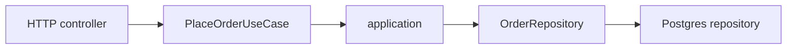
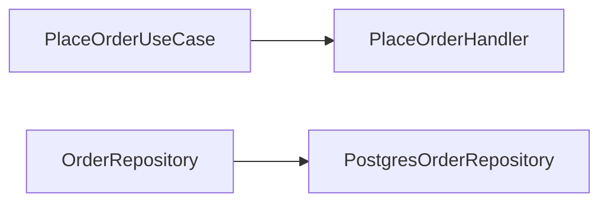

# Arquitetura Hexagonal

Arquitetura Hexagonal, também chamada Ports and Adapters, isola o núcleo da aplicação de tecnologias externas. O hexágono é uma metáfora para mostrar que pode haver vários pontos de entrada e saída, não um desenho obrigatório nem uma quantidade fixa de camadas.

## Portas

Uma port é uma interface que descreve uma capacidade necessária ou oferecida pelo núcleo. Há portas de entrada, como `PlaceOrderUseCase`, e portas de saída, como `OrderRepository` ou `PaymentGateway`.

Uma porta deve expressar a linguagem da aplicação, não detalhes do adapter. `PaymentGateway.authorize(Money $amount)` comunica uma necessidade melhor que `HttpClient.post('/v1/payments', $payload)`. A porta também define erros, idempotência e invariantes que o núcleo precisa conhecer.

## Adapters

Um adapter traduz um mecanismo externo para uma porta. Um controller HTTP é um adapter de entrada. Um consumidor de fila pode ser outro. Um repository PostgreSQL, um cliente de pagamento e um publisher de eventos são adapters de saída.



O controller não deve carregar regra de negócio só porque é a porta mais visível. Ele converte JSON, autenticação e erros de transporte. O repository não deve decidir se um pedido pode ser pago; ele persiste o resultado produzido pelo núcleo.

## Exemplo de composição

```php
interface PlaceOrderUseCase
{
  public function handle(PlaceOrderCommand $command): OrderResult;
}

interface OrderRepository
{
  public function save(Order $order): void;
}
```

O `HttpPlaceOrderController` implementa a tradução de entrada para `PlaceOrderCommand`. `PlaceOrderHandler` implementa a porta de entrada. `PostgresOrderRepository` implementa a porta de saída. No bootstrap, a aplicação conecta as implementações concretas:



O domínio e a aplicação não precisam importar o framework web ou o driver do banco.

## Direção de dependências

Dependency Direction é a regra que define quem pode conhecer quem. Em uma aplicação hexagonal, o núcleo declara portas e os adapters dependem dessas abstrações. O composition root conhece todos os lados para montar o sistema.

O sentido da chamada em runtime pode ser diferente do sentido da dependência de código. Um handler chama `OrderRepository`, mas o código do handler depende da interface, enquanto a implementação PostgreSQL depende da interface para cumprir o contrato.

## Testabilidade

Um teste do handler pode usar um `InMemoryOrderRepository` e um `FakePaymentGateway`, desde que os fakes respeitem as portas. Isso não prova que o SQL ou o contrato do provedor externo estão corretos; esses adapters precisam de seus próprios testes de integração e contrato.

Mockar todas as portas por hábito pode esconder problemas de integração. A arquitetura define pontos de substituição, mas a estratégia de testes deve combinar testes de domínio, integração, contrato e ponta a ponta.

## O que não é

Hexagonal não é uma exigência de microsserviços, não impede o uso de um ORM e não significa que cada classe deva ter uma interface. Uma porta é justificável quando existe uma fronteira, uma variação, um efeito externo ou uma necessidade de isolamento real.

## Relações

- [Arquitetura em camadas](arquitetura-em-camadas.md) organiza responsabilidades por níveis; Hexagonal enfatiza fronteiras e adapters.
- [Arquitetura Limpa](../../engenharia-software/arquitetura-limpa.md) aplica a mesma preocupação de dependências apontando para políticas internas.
- [DDD](../modelagem/ddd.md) fornece conceitos de domínio que podem viver no núcleo hexagonal.
- [CQRS](../cqrs/cqrs.md) pode definir portas diferentes para comandos e consultas.

## Fontes

- [Alistair Cockburn, Hexagonal Architecture](https://alistair.cockburn.us/hexagonal-architecture/)
- [Martin Fowler, Inversion of Control](https://martinfowler.com/articles/injection.html)
