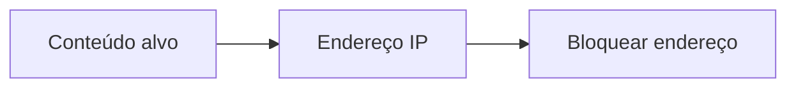
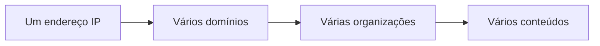
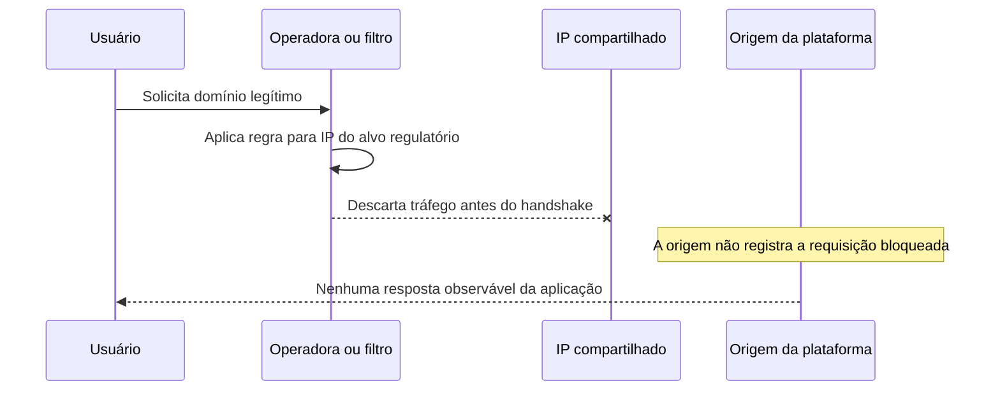

# Bloqueios silenciosos

Um bloqueio silencioso é uma interrupção em que o usuário percebe timeout,
conexão recusada, `SERVFAIL`, erro TLS ou resposta genérica, mas não recebe uma
explicação clara de que houve filtragem por uma operadora, autoridade ou
provedor de trânsito. O proprietário do serviço pode observar somente uma queda
regional de disponibilidade e não saber que o tráfego foi descartado antes de
chegar à sua infraestrutura.

O adjetivo "silencioso" não significa necessariamente que ninguém conheça a
ordem. Significa que a aplicação, o usuário e às vezes até o mantenedor da rede
não recebem uma indicação verificável no ponto em que a conexão falhou. O mesmo
sintoma pode ser produzido por erro de DNS, rota ausente, firewall, falha de
certificado ou aplicação fora do ar.

## O erro de associar conteúdo a endereço

O bloqueio por IP parte de uma associação simples:

Na Web moderna, a associação raramente é exclusiva:

O mesmo endereço pode atender hosts distinguíveis somente por hostname, SNI,
certificado, rota HTTP ou configuração interna. Se o enforcement acontece no
IP, essas informações deixam de ser usadas para separar alvos legítimos.

O problema não é apenas a CDN. Hospedagem compartilhada, proxies reversos,
plataformas de deploy, GitHub Pages e redes anycast utilizam o mesmo princípio
de concentração. A economia de escala melhora custo e latência, mas cria um
domínio de falha comum.

## Camadas possíveis de bloqueio

| Camada | O que consegue distinguir | Sintomas comuns | Risco de dano colateral |
| --- | --- | --- | --- |
| DNS | Nome consultado, desde que o resolvedor seja o ponto de enforcement | `NXDOMAIN`, `SERVFAIL`, resposta alterada | Afeta quem usa aquele resolvedor e pode quebrar dependências que compartilham domínio |
| SNI ou hostname | Host TLS ou HTTP, conforme protocolo e visibilidade | Timeout, reset ou bloqueio de handshake | Pode falhar com criptografia, HTTP/3, proxies e aplicações que compartilham infraestrutura |
| IP | Endereço de destino | Timeout, conexão recusada ou rota blackhole | Afeta todos os domínios e serviços que compartilham o endereço |
| Porta ou protocolo | Classe de tráfego | Falha seletiva de TCP, UDP ou QUIC | Pode afetar aplicações legítimas que usam o mesmo transporte |
| BGP | Prefixo e caminho entre ASes | Serviço desaparece regionalmente ou globalmente | Pode redirecionar ou descartar tráfego de muitos clientes e domínios |
| Aplicação | URL, conta, conteúdo ou requisição | Resposta de bloqueio observável | Geralmente tem maior precisão, mas exige integração e capacidade de operar o filtro |

Quanto mais baixo o enforcement, menos contexto de identidade ele possui. Isso
não torna o bloqueio baixo sempre errado. Um operador pode precisar conter um
ataque ou cumprir uma ordem rapidamente. A decisão precisa, porém, declarar qual
precisão é sacrificada e como o dano colateral será medido.

## Brasil

O debate brasileiro envolve ordens judiciais, pedidos de bloqueio, operadoras,
Anatel, provedores de DNS e infraestrutura compartilhada. Não é correto atribuir
automaticamente todo bloqueio à Anatel. A autoridade, o tribunal, a entidade
requerente e a operadora podem ter papéis diferentes, e a lista efetivamente
aplicada nem sempre é pública.

O [NIC.br registrou o debate do IX Fórum sobre bloqueios de IP e DNS](https://nic.br/noticia/na-midia/bloqueios-de-ip-e-dns-expoem-risco-de-dano-colateral-na-internet/).
O relato menciona a avaliação de que um IP da Cloudflare entrou em uma lista e
milhares de sites ficaram inacessíveis por aproximadamente 40 horas, além de um
subdomínio associado ao Google Drive que teria ficado indisponível por horas.
Esse material registra falas e evidências apresentadas no evento. Não deve ser
tratado como uma auditoria pública completa de todas as listas, operadoras e
horários.

Também existe a discussão [GitHub Pages no Brasil](https://github.com/orgs/community/discussions/143145).
Usuários de múltiplas operadoras relataram que sites `github.io` expiravam ou
não conectavam, enquanto VPN e IPv6 alteravam o resultado. A discussão cita os
endereços publicados na configuração de domínio do [GitHub Pages](https://docs.github.com/en/pages/configuring-a-custom-domain-for-your-github-pages-site/managing-a-custom-domain-for-your-github-pages-site),
mas não é um post-mortem oficial e não prova, sozinha, qual autoridade
determinou cada filtro.

O que pode ser afirmado com segurança é o padrão técnico: uma faixa usada por
uma plataforma compartilhada pode ser inacessível em uma operadora e saudável
em outra. A atribuição política exige evidência adicional.

## Espanha e LaLiga

Em 2025, a Vercel publicou [Update on Spain and LALIGA blocks of the internet](https://vercel.com/blog/update-on-spain-and-laliga-blocks-of-the-internet).
Segundo a Vercel, uma decisão judicial autorizou ISPs espanhóis a bloquear IPs
associados a transmissões não autorizadas. A empresa afirmou que os bloqueios
atingiam IPs compartilhados sem distinguir o domínio infrator de serviços
legítimos.

O artigo documenta `66.33.60.129` e `76.76.21.142`, informa que os endereços
serviam conteúdo legítimo de organizações como Tinybird e Hello Magazine e
registra que Cloudflare, GitHub Pages e BunnyCDN também foram afetados. Em uma
atualização de 18 de abril, a Vercel informou que os dois endereços deixaram de
estar bloqueados e que vinha trabalhando com a LaLiga para remover conteúdo
ilegal.

A [posição oficial da LaLiga](https://www.laliga.com/en-GB/news/official-statement-in-relation-to-the-blocking-of-ips-during-the-recent-ea-sports-laliga-matchdays-linked-to-illegal-cloudflare-practices)
descreve os bloqueios como limitados e temporários e afirma que foram solicitados
para combater acesso ilegal ao conteúdo esportivo. A diferença de enquadramento
é relevante: a ordem pode ser específica quanto ao objetivo, mas o mecanismo de
enforcement pode ser amplo quanto ao endereço.

A pesquisa [Collateral Damage of IP-Based Blocking During LALIGA Football Streaming in Spain](https://labs.ooni.io/post/2026-laliga-collateral/)
da OONI relata que, na metodologia e no período estudados, o bloqueio de quatro
a vinte IPs em uma janela de uma hora afetou mais de 400 mil domínios únicos por
causa de hospedagem compartilhada. O número deve ser citado como resultado
daquela medição, não como constante universal.

## Por que Vercel e GitHub Pages amplificam o efeito

Vercel e GitHub Pages entregam conteúdo de muitas organizações por conjuntos
limitados de endereços, CDNs e domínios de infraestrutura. Um projeto legítimo
é identificado no nível de Host, SNI, certificado e configuração interna, mas
um filtro IP não enxerga necessariamente esses campos.

O mesmo endereço pode servir um site pessoal, documentação, aplicação SaaS,
assets estáticos e endpoints usados por automação. Um bloqueio aplicado no
roteador de acesso não precisa entender qual projeto está sendo acessado: ele
descarta todos os pacotes para o destino.

Para o usuário, o site parece quebrado. Para a plataforma, o tráfego pode cair
somente em um país, ASN ou operadora. Para o mantenedor, os logs da origem não
registram as requisições. Essa assimetria explica por que o problema pode ser
silencioso por horas.

## O que foi feito corretamente

### A Vercel tornou o mecanismo visível

A Vercel publicou os IPs afetados, explicou a diferença entre bloqueio por
domínio e por IP e ofereceu canal para abuso e remoção de conteúdo. Tornar o
objeto técnico visível permite que sites legítimos comparem seus sintomas e
contestem o dano.

### A LaLiga descreveu colaboração com plataformas

A estratégia de identificar streams e desativar conteúdo no ponto mais próximo
do originador reduz a necessidade de bloquear uma infraestrutura compartilhada.
Essa abordagem é mais precisa quando há capacidade operacional para investigar e
remover rapidamente o conteúdo ilícito.

### A comunidade criou observabilidade independente

Comparar IPv4, IPv6, DNS, VPN e múltiplos ASNs ajuda a separar falha de origem,
falha de resolução e filtragem regional. Nenhum teste isolado prova a causa,
mas um conjunto de medições reproduzíveis reduz a incerteza.

## O que foi feito de forma frágil

### A mensagem não comunica a causa

Um timeout não diz se houve filtro, queda de rota ou aplicação indisponível. Sem
código verificável, horário, escopo e canal de contestação, o mantenedor pode
passar horas alterando sua aplicação quando nenhuma requisição está chegando.

### O enforcement foi mais amplo que o objeto da ordem

O alvo jurídico pode ser domínio, URL ou stream, enquanto o mecanismo utiliza
IP. A tradução perde identidade e transforma um conteúdo em uma classe inteira
de serviços.

### A centralização criou dependência comum

Concentrar entrega em poucas plataformas melhora custo, latência e segurança,
mas adiciona um ponto comum de falha técnica e regulatória. Isso não significa
que a plataforma deva ser evitada; significa que a dependência deve aparecer no
threat model e no plano de recuperação.

## Diagnóstico sem atribuição precipitada

1. Registrar hostname, horário, ASN, país, IPv4 ou IPv6 e resolvedor utilizado.
2. Comparar DNS em mais de um resolvedor, sem presumir que uma resposta seja
   autoritativa.
3. Testar cada endereço `A` e `AAAA` separadamente, incluindo TCP e QUIC quando
   aplicável.
4. Observar o handshake TLS, SNI e certificado sem concluir que erro TLS é
   prova de bloqueio.
5. Comparar um domínio afetado com outro domínio conhecido na mesma plataforma.
6. Repetir o teste a partir de mais de um ASN e registrar rota e resposta.
7. Consultar status da plataforma e medições independentes.
8. Só atribuir a uma autoridade, operadora ou plataforma quando houver fonte que
   sustente essa afirmação.

A diferença entre "o tráfego foi filtrado em determinado ASN" e "a autoridade X
ordenou este bloqueio" é relevante técnica e juridicamente.

## O que poderia ser evitado

1. Preferir remoção no originador, projeto ou domínio, em vez de bloquear IP
   compartilhado.
2. Enumerar serviços legítimos, APIs e domínios que usam o endereço antes de
   aplicar o filtro.
3. Publicar fundamento, início, fim, escopo geográfico e mecanismo de
   contestação.
4. Aplicar prazo automático de expiração para bloqueios temporários.
5. Medir impacto por domínio, ASN, IPv4, IPv6 e serviço afetado.
6. Manter contatos entre autoridade, operadora, plataforma e mantenedores.
7. Para plataformas, oferecer uma rota de recuperação, sem prometer que trocar
   de IP resolverá uma ordem que acompanha o conteúdo.

## Lições para quem publica um serviço

Uma aplicação pequena não precisa operar dois CDNs para qualquer cenário, mas
deve saber qual é o domínio de falha do provedor. Para serviços críticos, é
razoável avaliar domínio próprio, origem independente, cache que preserve
leituras, segunda rota de publicação e testes regionais por ASN.

Também é útil registrar no plano de incidente que uma queda somente em uma rede
não prova que a aplicação esteja quebrada. A ausência de logs na origem pode ser
uma evidência de que o problema está antes do serviço, desde que seja comparada
com testes de redes que ainda funcionam.

## Matriz de diagnóstico por camada

O primeiro teste deve separar o tipo de falha, porque cada resultado aponta para
uma investigação diferente:

| Camada | Observação | Hipótese compatível |
| --- | --- | --- |
| DNS | Nome não resolve em um resolvedor específico | Manipulação, cache, falha de autoridade ou diferença regional |
| Rota | Prefixo ou caminho AS diverge entre redes | Route leak, hijack, política de trânsito ou filtragem |
| TCP | SYN não recebe resposta em uma rede, mas recebe em outra | Filtro de endereço, firewall ou caminho quebrado |
| TLS | TCP conecta, mas o handshake falha | SNI, certificado, inspeção ou incompatibilidade de protocolo |
| HTTP | TLS termina e a aplicação responde erro | Aplicação, autorização, rate limit ou origem |
| Origem | Não há requisição correspondente no log | Falha anterior à plataforma ou cache intermediário |

Essa matriz não identifica a causa sozinha. Ela evita, porém, que uma equipe
altere o frontend para corrigir um filtro de rede ou atribua um bloqueio a uma
autoridade sem comparar ASNs, horários e camadas.

## Reduzir dependência sem prometer invisibilidade

Domínio próprio, origem alternativa, múltiplos provedores e cache independente
podem reduzir o impacto de uma dependência compartilhada. Nenhuma dessas medidas
torna um serviço imune a filtragem: um bloqueio pode acompanhar o domínio, o
conteúdo, o ASN ou a infraestrutura de origem.

O objetivo é preservar uma rota de recuperação e tornar a dependência explícita.
Para cada serviço crítico, documente quem controla DNS, certificado, origem,
CDN, anúncios BGP e canais de suporte. Teste uma migração de endpoint antes de
precisar dela e confirme que a mudança não remove os logs, as credenciais e o
processo de atualização.

## Fontes

- [NIC.br, debate sobre bloqueios de IP e DNS](https://nic.br/noticia/na-midia/bloqueios-de-ip-e-dns-expoem-risco-de-dano-colateral-na-internet/).
- [Vercel, bloqueios da LaLiga na Espanha](https://vercel.com/blog/update-on-spain-and-laliga-blocks-of-the-internet).
- [LaLiga, posição oficial](https://www.laliga.com/en-GB/news/official-statement-in-relation-to-the-blocking-of-ips-during-the-recent-ea-sports-laliga-matchdays-linked-to-illegal-cloudflare-practices).
- [OONI, medição de dano colateral na Espanha](https://labs.ooni.io/post/2026-laliga-collateral/).
- [GitHub Community, indisponibilidade de GitHub Pages no Brasil](https://github.com/orgs/community/discussions/143145).
- [Cloudflare, consequências do bloqueio de IP](https://blog.cloudflare.com/pt-br/consequences-of-ip-blocking/).
