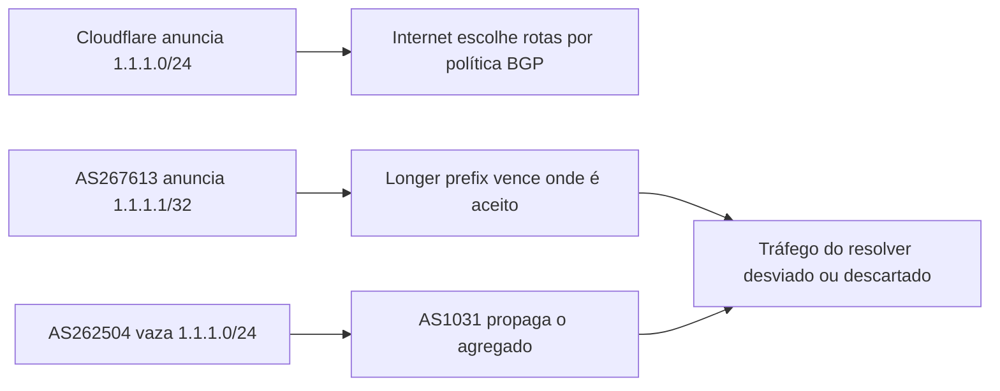

# Incidente do Cloudflare 1.1.1.1 em 2024

Em 27 de junho de 2024, o resolvedor público 1.1.1.1 ficou inacessível ou
degradado para uma parcela pequena, mas geograficamente distribuída, dos
usuários. A causa foi a combinação de um hijack BGP de um endereço mais
específico com um route leak de um prefixo maior.

O caso é particularmente didático porque mostra três camadas que às vezes são
confundidas: autorização de origem por RPKI, seleção de rota por longest prefix
match e política de exportação entre sistemas autônomos. Uma organização pode
configurar corretamente uma camada e ainda permanecer exposta pelas outras.

A fonte primária é o [relato da Cloudflare sobre o incidente do 1.1.1.1](https://blog.cloudflare.com/cloudflare-1111-incident-on-june-27-2024/).

## Contexto de endereçamento e anycast

A Cloudflare anunciava `1.1.1.0/24` por anycast. Anycast permite que vários
pontos de presença anunciem o mesmo prefixo e que cada rede escolha, segundo sua
política BGP, um caminho próximo ou preferido. O endereço lógico é único para o
usuário, mas o caminho físico pode terminar em locais diferentes.

Durante o evento, o AS267613, Eletronet S.A., originou `1.1.1.1/32`. Esse
anúncio representa um único endereço e é muito mais específico que o `/24`
legítimo. Pelo longest prefix match, um roteador que aceite as duas rotas pode
escolher o `/32` mesmo que o caminho para o `/24` seja normalmente mais curto,
estável ou pertencente à Cloudflare.

Em paralelo, o AS262504, Nova Rede de Telecomunicações Ltda, vazou o
`1.1.1.0/24` para uma relação de trânsito, e o AS1031, Peer-1 Global Internet
Exchange, propagou o anúncio de forma ampla. O evento combinou, portanto, um
anúncio extremamente específico com um vazamento do agregado.

## Onde o RPKI ajudou

A Cloudflare mantinha um ROA RPKI para o prefixo. Um ROA informa quais ASNs
estão autorizados a originar determinado prefixo e qual comprimento máximo pode
ser anunciado. Uma rede que coleta RPKI pode classificar o anúncio indevido como
`Invalid` e rejeitá-lo por política de ROV.

Isso reduziu o alcance do evento, mas não o tornou impossível. O proprietário do
prefixo publica a autorização. Quem recebe a rota decide se valida e se bloqueia
o resultado inválido. Se uma rede de trânsito não aplicar ROV, o ROA não remove a
rota de sua tabela. O mecanismo é cooperativo, não uma assinatura que force todos
os roteadores da Internet a obedecer.

Também há uma diferença entre origem e caminho. ROV verifica principalmente a
relação entre prefixo e ASN originador. Ele não prova que cada ASN intermediário
deveria exportar aquele anúncio ao vizinho. Um route leak pode ocorrer mesmo
quando o originador original é legítimo. Por isso políticas de cliente,
max-prefix, IRR e mecanismos de validação de caminho continuam necessários.

## Impacto observado

A Cloudflare observou a indisponibilidade em mais de 300 redes distribuídas por
70 países. O percentual global era pequeno, mas o efeito era completo para quem
recebia a rota inválida. Em alguns países, menos de 1% dos usuários foi afetado;
em outros, o caminho legítimo continuou prevalecendo.

Essa distribuição é uma armadilha para métricas médias. Uma medição mundial pode
mostrar disponibilidade próxima de 100% enquanto uma operadora inteira não
consegue alcançar o serviço. A observabilidade precisa agrupar resultados por
ASN, país, família IP, coletor e caminho, e não apenas por região comercial.

## Como diagnosticar um evento desse tipo

Uma verificação de aplicação pode dizer apenas que o DNS falhou. O diagnóstico
deve separar o caminho de resolução do caminho BGP:

1. verificar os anúncios do prefixo agregado e de rotas mais específicas;
2. comparar origin ASN, AS path, communities e estado RPKI;
3. consultar múltiplos coletores BGP em regiões e provedores diferentes;
4. testar resolução por redes que recebem o `/32` e por redes que recebem o
   `/24` legítimo;
5. comparar IPv4 e IPv6, porque uma família pode ser afetada e a outra não;
6. medir se a conexão chega ao ponto de presença ou é desviada antes do TLS;
7. registrar horário e evidências antes de atribuir intenção ao originador.

O teste não deve se limitar a `dig 1.1.1.1`. É necessário observar a rota que
leva ao servidor autoritativo ou resolver, pois DNS, TCP e BGP podem falhar em
camadas diferentes.

## O que foi feito corretamente

### O prefixo estava autorizado

Os ROAs permitiram que redes com ROV classificassem as rotas inválidas. A
Cloudflare atribuiu parte da baixa propagação à adoção de validação pelos
intermediários.

### O relato explicou o mecanismo

A publicação não tratou o caso como uma indisponibilidade misteriosa. Ela
explicou longest prefix match, hijack, leak, ROV e as limitações da proteção.
Isso é importante porque operadores precisam reconhecer o padrão em seu próprio
ambiente, não apenas saber que um fornecedor sofreu uma falha.

### A resposta considerou o ecossistema

Não havia uma correção puramente local na Cloudflare. A mitigação depende de
operadores, provedores de trânsito, registros, contatos de NOC e regras de
filtragem. Reconhecer essa fronteira evitou prometer que uma mudança interna
resolveria toda a exposição.

## O que permaneceu insuficiente

### RPKI depende de adoção e política

Um ROA não impede um anúncio inválido de existir. Ele fornece evidência para
quem escolhe validar. Redes sem ROV podem continuar aceitando o anúncio e
propagando o tráfego desviado.

### ROV não detecta todo route leak

Uma rota pode ter origem autorizada e ainda ser exportada por uma relação que não
deveria transportá-la. O problema exige políticas de importação e exportação,
listas de prefixos, limites de quantidade e, quando disponível, validação do
caminho AS.

### Um endereço popular aumenta o impacto operacional

1.1.1.1 aparece em tutoriais, configurações manuais e laboratórios. Um operador
que reutiliza ou anuncia o endereço de forma errada pode gerar conflito sem
intenção de ataque. A memorização facilita o uso, mas também concentra
dependências em um nome muito conhecido.

## Controles preventivos

1. Publicar ROAs com comprimento máximo correto e revisar mudanças de RPKI como
   mudanças de rede de produção.
2. Aplicar ROV em sessões de peering e trânsito, definindo o tratamento de
   rotas `Invalid` em vez de apenas instalar o validador.
3. Manter filtros derivados de IRR e listas de prefixos esperados por cliente.
4. Definir `max-prefix` e ações de contenção quando o número de anúncios exceder
   o comportamento conhecido.
5. Usar communities de não exportação quando um anúncio tiver escopo restrito.
6. Monitorar more-specifics, mudanças de origin ASN e AS paths inesperados.
7. Usar ASPA e controles de caminho à medida que a infraestrutura e o ecossistema
   ofereçam suporte suficiente.
8. Manter contatos operacionais que possam retirar uma rota em minutos, não em
   dias.

## Aprendizado arquitetural

Anycast melhora latência e tolerância a falhas locais, mas transforma a
disponibilidade em uma propriedade do ecossistema BGP. A organização controla
seus anúncios e autorizações, mas não controla a política de cada rede que
recebe o anúncio.

Por isso, a hipótese de disponibilidade deve ser formulada como "o serviço está
alcançável pelos ASNs que atendem nossos usuários" e não somente como "todos os
processos no ponto de presença estão saudáveis". Essa diferença deve aparecer em
testes externos, SLOs, contatos de incidente e exercícios de retirada de rota.

## O que medir antes de confiar em um ROA

Um ROA precisa ser analisado junto com a tabela de rotas que os receptores
realmente usam. A revisão deve conferir o prefixo, o comprimento máximo, o ASN
de origem e a existência de anúncios antigos que continuam autorizados. Um
`maxLength` mais amplo que o necessário pode tornar válido um more-specific que
não deveria existir; um valor estreito demais pode classificar como inválida uma
rota legítima durante uma mudança de engenharia de tráfego.

O operador também deve observar a diferença entre o estado do validador RPKI e a
política que consome esse estado. `Valid`, `Invalid` e `NotFound` são resultados
de validação. Eles só produzem bloqueio quando a política de importação decide
rejeitar ou dar menor preferência à rota. Um dashboard que mostra apenas a existência de
ROAs não prova que os vizinhos aplicam ROV.

## Runbook de uma suspeita de hijack

Durante uma suspeita, a prioridade é preservar evidência e evitar uma reação que
crie um segundo incidente:

1. registrar horário, prefixo, origin ASN e coletores que observaram a rota;
2. verificar se o anúncio é `Valid`, `Invalid` ou `NotFound` em mais de um
   validador;
3. comparar o prefixo agregado com os more-specifics e seus AS paths;
4. medir alcance por ASN consumidor, sem usar a porcentagem de coletores como
   porcentagem de usuários;
5. confirmar se a aplicação ainda está saudável no ponto de presença correto;
6. acionar contatos de NOC e registries com a evidência coletada;
7. só anunciar uma mitigação quando houver critério de parada e retirada.

Publicar um more-specific de emergência pode recuperar parte do tráfego, mas
também pode aumentar a disputa e a quantidade de rotas. A mitigação deve ser
avaliada como uma mudança de produção, com autorização, monitoramento e plano de
reversão.

## Fonte

- [Cloudflare, incidente do 1.1.1.1 em 27 de junho de 2024](https://blog.cloudflare.com/cloudflare-1111-incident-on-june-27-2024/).
