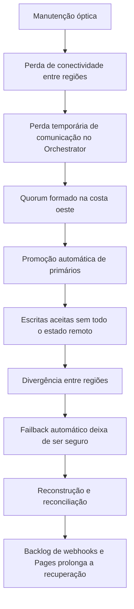

# Incidente do GitHub em 2018

Em 21 e 22 de outubro de 2018, o GitHub sofreu 24 horas e 11 minutos de
degradação. O caso é valioso porque não foi uma simples queda do banco. Uma
interrupção de rede, uma decisão automática de liderança, um modelo de escrita
que aceitava promoção entre regiões e uma grande quantidade de efeitos
assíncronos formaram uma cadeia única de falha.

Durante boa parte do incidente, a plataforma alternou entre indisponibilidade,
leituras antigas e operações que precisavam ser contidas. O GitHub informou que
não confirmou perda definitiva de dados, mas algumas escritas precisaram ser
reconciliadas manualmente. Webhooks, notificações e builds do GitHub Pages
continuaram atrasados mesmo depois de o caminho principal do banco voltar.

O relato primário é a [análise oficial do incidente de 21 de outubro](https://github.blog/news-insights/company-news/oct21-post-incident-analysis/).
O vídeo [How GitHub's Database Self-Destructed in 43 Seconds](https://www.youtube.com/watch?v=dsHyUgGMht0)
é material complementar. A análise abaixo usa os fatos do relato do GitHub e
separa conclusões arquiteturais de detalhes que pertencem à implementação
específica da empresa.

## Por que a arquitetura era vulnerável a esse cenário

O GitHub mantinha vários clusters MySQL, com sharding funcional, primários para
escrita e dezenas de réplicas de leitura. O Orchestrator administrava a
topologia e usava um mecanismo de consenso baseado em Raft para decidir qual
instância deveria ocupar determinados papéis.

O ponto que costuma ser perdido em resumos é a diferença entre a autoridade do
gerenciador e a autoridade da aplicação. O Orchestrator podia concluir que uma
região reunia condições para eleger um primário. Isso não significava que a
aplicação estivesse preparada para aceitar aquela região como fonte de verdade,
nem que ela contivesse todas as escritas confirmadas anteriormente.

Em um sistema com replicação assíncrona, uma confirmação de escrita significa
algo diferente de uma confirmação em armazenamento síncrono entre regiões. Se a
região primária aceitar uma transação e a conexão cair antes que a réplica
remota a receba, a região remota pode ser tecnicamente promovida, mas não possui
todo o estado lógico que os usuários já observaram.

O incidente não exigia que todos esses pressupostos fossem falsos. Bastava que a
automação tratasse uma eleição válida como se ela também garantisse consistência
da aplicação.

## Linha do tempo e transições de estado

| Momento | Estado do sistema | Decisão ou evento | Consequência |
| --- | --- | --- | --- |
| 21 de outubro, 22:52 UTC | Regiões conectadas, costa leste como primária | Uma manutenção substituiu equipamento óptico de 100G e interrompeu a conectividade entre o hub da costa leste e o data center primário | A comunicação entre regiões foi perdida, embora a aplicação e o banco local ainda estivessem ativos |
| Cerca de 43 segundos depois | Nós do Orchestrator sem comunicação completa | A liderança foi removida e os nós que permaneciam conectados formaram quorum na costa oeste | O sistema de coordenação passou a considerar a costa oeste apta a promover primários |
| Após o quorum | Costa oeste com novos primários | O Orchestrator aplicou o failover automático | A costa oeste começou a aceitar escritas sem possuir necessariamente as escritas recentes da costa leste |
| Cerca de 40 minutos | Duas regiões com estados divergentes | Engenheiros identificaram que a promoção não correspondia à topologia suportada pela aplicação | Um retorno automático deixou de ser seguro porque poderia sobrescrever ou duplicar operações |
| Investigação | Fonte autoritativa ainda em definição | Deployments foram bloqueados e o status público passou a indicar degradação grave | A equipe reduziu novas mudanças enquanto reconstruía a cadeia de autoridade |
| Recuperação | Costa leste escolhida como base de reconstrução | Réplicas foram sincronizadas e os serviços derivados começaram a consumir o estado reconciliado | Banco, filas e builds se recuperaram em ritmos diferentes |
| 22 de outubro, 23:03 UTC | Serviços principais recuperados e backlog processado | O status voltou a verde | O incidente operacional terminou, mas confirmações de consistência ainda exigiam verificação |

O detalhe importante é que a linha do tempo não é apenas cronológica. Cada etapa
mudou o tipo de problema: primeiro conectividade, depois eleição, depois
divergência de dados, depois reconstrução e finalmente processamento de efeitos
derivados.

## A cadeia causal

A interrupção óptica foi o gatilho, mas não explica sozinha as 24 horas. O
resultado prolongado surgiu porque a automação transformou uma perda de
conectividade em uma mudança de autoridade. Depois disso, a recuperação não
podia mais ser feita somente reconectando cabos ou reiniciando serviços.

## Por que a recuperação demorou

### Era necessário escolher a autoridade

Quando duas regiões aceitam operações diferentes, não há uma operação universal
de merge para todas as entidades do sistema. Alguns dados podem ser reconciliados
por chave ou por ordem temporal. Outros têm efeitos externos, como criação de
repositório, envio de webhook ou atualização de permissão, e exigem análise de
idempotência e causalidade.

O GitHub precisava primeiro determinar qual estado seria preservado e quais
escritas seriam reaplicadas. A reconexão apressada poderia produzir um sistema
com aparência de disponibilidade, mas com objetos duplicados, eventos fora de
ordem ou referências que apontassem para versões diferentes.

### A sincronização não escalava de forma linear

Réplicas atrasadas não recuperam necessariamente a uma velocidade constante.
Enquanto o processo de cópia consome dados, a produção pode continuar gerando
novas escritas e leituras podem competir por CPU, disco e rede. Por isso, uma
estimativa baseada apenas no tamanho do backlog tende a ser otimista.

### O banco não era o único estado

Mais de cinco milhões de webhooks e aproximadamente 80 mil builds do GitHub
Pages aguardavam processamento. Cerca de 200 mil payloads ultrapassaram a janela
de retenção e foram descartados. Isso mostra que o RTO do produto era maior que
o RTO do banco: o serviço só estaria realmente recuperado quando os
consumidores, filas e efeitos derivados retornassem a um estado aceitável.

## Decisões corretas durante a resposta

### Integridade teve prioridade sobre uma recuperação aparente

O GitHub manteve o estado de degradação enquanto determinava qual região era
autoritativa. Essa escolha foi mais lenta, mas evitou transformar uma falha de
disponibilidade em uma perda silenciosa ou em uma publicação de dados
inconsistentes.

### Mudanças concorrentes foram contidas

Bloquear deployments reduziu a quantidade de eventos novos durante a
reconstrução. A mesma ideia vale para um serviço menor: pausar jobs de escrita,
consumidores e sincronizações pode ser necessário para que o diagnóstico não
dispute recursos com a recuperação.

### A comunicação pública explicou a prioridade

O GitHub atualizou a página de status e explicou que a prioridade era preservar
a integridade dos dados. Isso não melhora a topologia, mas alinha a expectativa
dos usuários e reduz a pressão para declarar recuperação antes da hora.

### Havia cópias remotas e prática parcial de reconstrução

Backups eram produzidos em intervalos regulares e enviados a armazenamento
remoto. A reconstrução de réplicas era exercitada diariamente. A lacuna estava
na escala do exercício, não na inexistência total de um procedimento.

## Controles que falharam ou eram insuficientes

### Eleição não estava ligada à semântica da aplicação

O Orchestrator conhecia o quorum da coordenação, mas não o conjunto completo de
pré-condições da aplicação. Um gerenciador de banco não deve ser autorizado a
promover uma região apenas porque ela consegue formar quorum. Deve existir um
contrato explícito sobre fencing, atraso aceitável, topologia suportada e
capacidade de recuperação dos consumidores.

### Não havia uma barreira forte contra dupla escrita

Enquanto a região original pudesse continuar aceitando operações, promover
outra região criava um risco de split brain. O controle necessário é fencing:
revogar o caminho de escrita da região antiga antes de liberar a nova, ou usar
um mecanismo externo que torne impossível a coexistência de dois primários.

### O teste diário não representava o desastre completo

Reconstruir uma réplica menor não demonstra que todos os clusters podem ser
recuperados durante falha regional. O teste precisa incluir volume realista,
capacidade de disco, tráfego de replicação, filas, hooks expirados, builds e
reconciliação de escritas.

## Como um sistema menor pode aplicar a lição

Não é necessário copiar o desenho do GitHub. É necessário tornar explícitas as
decisões que muitas plataformas deixam implícitas:

1. Definir qual componente pode ser primário e qual autoridade aprova a
   promoção.
2. Definir o que acontece com uma escrita confirmada que ainda não chegou à
   réplica.
3. Impedir escrita na região antiga antes de promover a nova.
4. Separar o plano de recuperação da rede que está sendo recuperada.
5. Medir o tempo de reconstrução de banco, filas, cache, webhooks e artefatos.
6. Tornar o reprocessamento idempotente e observável.
7. Exibir no status a diferença entre leitura, escrita, efeitos assíncronos e
   consistência.

Uma regra útil é não chamar o serviço de recuperado quando apenas o processo
principal voltou a responder. O estado deve ser considerado recuperado quando as
dependências que definem o contrato do produto também retornaram ao nível
aceitável.

## O que não se deve concluir deste caso

O incidente não prova que failover automático entre regiões seja sempre errado.
Ele mostra que failover automático precisa de uma semântica de consistência
compatível com a aplicação. Uma arquitetura pode aceitar perda controlada,
usar escrita única com réplicas de leitura ou coordenar consenso entre regiões.
Cada opção tem custo de latência, disponibilidade e operação.

Também não é correto concluir que uma réplica é inútil. Ela reduz o tempo de
recuperação para algumas falhas. A conclusão correta é mais específica: réplica,
backup, fencing, consenso e recuperação de filas resolvem classes diferentes de
problemas e precisam ser avaliados em conjunto.

## Sinais que deveriam acompanhar uma promoção

Uma promoção segura precisa expor mais que o estado `healthy` do processo. O
controlador e a aplicação devem observar propriedades diferentes:

| Sinal | Pergunta respondida | Consequência quando inválido |
| --- | --- | --- |
| Atraso de replicação | A candidata possui todas as escritas necessárias? | Impedir promoção automática ou exigir perda explícita |
| Última posição confirmada | Qual ponto de recuperação é comum às regiões? | Escolher uma autoridade sem prometer dados além do ponto |
| Estado de fencing | O primário antigo ainda pode aceitar escrita? | Não liberar o novo primário |
| Capacidade de storage | A reconstrução cabe no disco e no tempo disponível? | Reduzir tráfego ou escolher outra estratégia |
| Backlog de efeitos | Webhooks e jobs podem ser reprocessados? | Pausar ou aplicar compensação antes de reabrir |

Um quorum de coordenação responde se os nós conseguem concordar sobre uma
decisão. Ele não responde se a aplicação possui os dados necessários nem se o
antigo primário foi impedido de escrever. Essa distinção deve aparecer no
contrato do controlador, nos alertas e nos testes de failover.

## Reconciliação não é apenas cópia de banco

Quando duas regiões aceitam operações, a equipe precisa classificar cada efeito.
Uma linha de banco pode ser comparada por versão, timestamp lógico ou chave de
negócio. Um webhook enviado para um sistema externo não pode ser simplesmente
"desfeito" se o destinatário já tomou uma decisão. Um build iniciado pode gerar
artefatos que continuam publicados mesmo depois de a linha que o originou ser
reconciliada.

Por isso, a recuperação deve registrar operações reaplicadas, descartadas e
compensadas. Cada consumidor precisa ter uma chave de idempotência e uma política
para eventos que ultrapassaram sua retenção. O estado do banco só pode ser
declarado recuperado quando os efeitos que fazem parte do contrato do produto
também tiverem uma decisão explícita.

## Fontes

- [Relato oficial do GitHub](https://github.blog/news-insights/company-news/oct21-post-incident-analysis/).
- [Vídeo complementar sobre o incidente](https://www.youtube.com/watch?v=dsHyUgGMht0).
