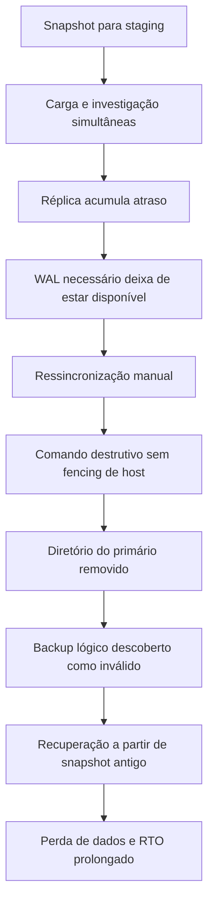

# Incidente do GitLab em 2017

Em 31 de janeiro de 2017, o GitLab perdeu alterações do banco principal depois
que um comando destrutivo removeu o diretório de dados do host primário. O
serviço ficou indisponível por várias horas e parte das alterações foi perdida.
O relato oficial estimou a janela de perda entre 17:20 UTC e 00:00 UTC, com
aproximadamente 5.000 projetos, 5.000 comentários e 700 contas afetados.
Repositórios e wikis não foram afetados porque estavam armazenados separadamente.

O caso não é apenas um exemplo de comando executado no servidor errado. Ele
mostra a interação entre réplica atrasada, WAL não arquivado, backup lógico
inutilizável, alerta entregue por um canal quebrado, snapshot sem finalidade de
disaster recovery e um procedimento destrutivo sem barreira de identidade.

A fonte primária é o [post-mortem do outage de banco de janeiro de 2017](https://about.gitlab.com/blog/postmortem-of-database-outage-of-january-31/).
O vídeo [Dev Deletes Entire Production Database, Chaos Ensues](https://www.youtube.com/watch?v=tLdRBsuvVKc)
é complementar. Quando houver diferença, o relato escrito do GitLab prevalece.

## O modelo de proteção que existia

O ambiente tinha um PostgreSQL primário, chamado `db1`, e uma réplica quente,
chamada `db2`. A réplica acompanhava o primário e podia ser usada em failover,
mas não constituía sozinha um sistema de recuperação independente.

Uma réplica de streaming depende de WAL suficiente para continuar a reprodução.
Se o primário remove os segmentos antes que a réplica os consuma, a réplica não
consegue simplesmente continuar. Ela precisa ser reconstruída a partir de uma
base consistente. Além disso, uma réplica pode reproduzir uma exclusão lógica ou
um comando incorreto feito no primário. Ela é uma cópia operacional, não uma
barreira contra todos os tipos de perda.

O desenho também mantinha dados importantes fora do PostgreSQL. Repositórios e
wikis sobreviveram porque seu armazenamento tinha outro ciclo de vida. Essa
separação reduziu o impacto, mas não protegia os objetos que existiam somente no
banco.

## Linha do tempo

| Momento | Estado | Ação | Efeito |
| --- | --- | --- | --- |
| 17:20 UTC | Produção funcionando, staging precisando de cópia | Um snapshot LVM começou a ser preparado para carregar dados em staging | O banco recebeu carga adicional e uma operação de armazenamento passou a coexistir com a investigação |
| Durante a noite | Comentários e operações de usuário falhando | Spam, jobs de remoção e limites de conexão foram investigados | O diagnóstico misturou sintomas de aplicação, carga e replicação |
| Aproximadamente 23:00 UTC | `db2` atrasada | Segmentos WAL necessários foram removidos antes do consumo | A réplica perdeu a possibilidade de recuperação incremental |
| Antes de 23:30 UTC | Ressincronização necessária | A equipe tentou remover o diretório da réplica e executar `pg_basebackup` | O procedimento parecia parado, aumentando a pressão para intervir |
| Durante a recuperação | Host primário e réplica com papéis semelhantes | Um comando destinado à réplica foi executado em `db1` | Cerca de 300 GB do diretório principal foram removidos |
| Depois da perda | Nenhuma cópia operacional recente disponível | O `pg_dump` diário foi descoberto como falho por incompatibilidade de versão | O backup que deveria limitar o RPO não podia ser restaurado |
| Recuperação | Snapshot antigo era a cópia mais confiável | Dados foram copiados para produção e webhooks foram restaurados em banco separado | O serviço voltou gradualmente, com perda do intervalo não coberto |

A sequência importa porque cada falha diminuiu as opções seguintes. O atraso
transformou uma ressincronização em reconstrução. A reconstrução exigiu comando
destrutivo. A identificação ambígua permitiu o alvo errado. O backup falho só foi
descoberto depois que a réplica deixou de ser útil.

## A cadeia causal

O ponto mais importante é que nenhum controle individual teria resolvido tudo.
Arquivamento de WAL teria mantido uma rota de reconstrução. Um backup lógico
válido teria reduzido o RPO. Um prompt que exibisse o papel do host teria evitado
o comando errado. A restauração testada teria reduzido a incerteza. A segurança
real veio da composição desses controles.

## O que aconteceu com o backup

O GitLab executava um `pg_dump` diário, mas o cliente usado pelo processo era da
versão 9.2 enquanto o servidor era PostgreSQL 9.6. O comando falhava, e a falha
não produzia um alerta efetivo porque as mensagens por email eram rejeitadas
por um problema relacionado a DMARC.

Isso cria uma diferença entre intenção e evidência. A existência de um agendamento
não prova que existe um backup. A existência de um arquivo não prova que ele é
completo. Um backup aceitável precisa ter, no mínimo:

1. execução observável, com código de saída e duração;
2. armazenamento fora do host protegido;
3. retenção compatível com o RPO;
4. verificação de integridade e conteúdo;
5. teste de restauração que mede o tempo real;
6. alerta por canal que não dependa do mesmo sistema que está sendo protegido.

## Decisões corretas durante a recuperação

### O GitLab publicou a sequência completa

O post-mortem registra horários, comandos, falhas de backup e estimativa de
perda. Também diferencia repositórios e wikis que não foram afetados. Essa
precisão permite que outras equipes estudem o caso sem reduzir tudo a "alguém
apagou o banco".

### A equipe preservou cópias externas ao banco

Dados armazenados fora do PostgreSQL continuaram disponíveis. A decisão de
restaurar webhooks em uma cópia separada também evitou que a recuperação de uma
função secundária competisse diretamente com a reconstrução do caminho principal.

### O RPO efetivo foi aceito explicitamente

Depois que o snapshot de aproximadamente seis horas antes foi identificado como
a cópia confiável, a recuperação passou a respeitar a perda correspondente. É
melhor declarar esse limite e reconstruir com segurança do que insinuar que todas
as alterações foram recuperadas.

## O que falhou e por que falhou

### A réplica cobria failover, não perda operacional

Ela estava no mesmo domínio lógico do primário, recebia as mesmas alterações e
dependia de WAL que podia ser removido. Não cobria exclusão no primário,
corrupção lógica, atraso prolongado ou erro humano na ressincronização.

### O backup existia como tarefa, mas não como propriedade verificada

O processo era incompatível com a versão do servidor e a falha não tinha
visibilidade. O erro não precisava ser sofisticado: uma verificação diária do
código de saída e um restore periódico teriam revelado o problema antes do
incidente.

### O canal de alerta também era uma dependência

Email rejeitado por política de autenticação pode ser um erro legítimo de
segurança, mas torna-se perigoso quando é o único canal de alerta. Alertas de
backup devem ser enviados a uma segunda superfície, como métrica, fila, pager ou
um verificador externo.

### A operação destrutiva não verificava o alvo

Primário e réplica tinham nomes de host parecidos e uma sessão interativa não era
uma barreira suficiente. Antes de apagar um diretório, o procedimento deveria
confirmar ambiente, papel, identidade do cluster, ponto de montagem, processo
ativo e presença de um backup restaurável.

### O snapshot de staging foi confundido com DR

Um snapshot criado para uma finalidade temporária pode ser útil na emergência,
mas não possui necessariamente retenção, isolamento, catálogo e testes exigidos
por uma política de backup. A recuperação não deveria depender de uma cópia que
existe por acaso.

## Como o procedimento poderia ser redesenhado

Uma ressincronização de réplica deve começar pela identificação e terminar por
uma verificação de papel. Um runbook seguro pode exigir:

1. consulta do identificador único do cluster e do papel atual;
2. bloqueio de comandos quando o host não estiver explicitamente em modo
   `replica`;
3. confirmação do operador em uma segunda etapa, incluindo ambiente e diretório;
4. cópia ou snapshot verificável antes da remoção;
5. execução com caminho absoluto e sem expansão ambígua;
6. observação do processo por métrica e log, não por aparência da sessão;
7. validação de replay, atraso e integridade depois da reconstrução.

No Kubernetes, o mesmo princípio se aplica a um pod ou volume. O nome do pod não
é uma prova suficiente de identidade. O procedimento deve consultar labels,
UID, namespace, claim, cluster e papel, e deve impedir que um comando de
produção seja executado em uma cópia de recuperação.

## Lições transferíveis

O incidente ensina cinco distinções que devem aparecer no design review:

| Termo | O que resolve | O que não resolve |
| --- | --- | --- |
| Réplica | Failover e redução de atraso de leitura | Exclusão lógica, corrupção replicada, perda de WAL e erro no primário |
| Snapshot | Ponto consistente ou quase consistente de recuperação, conforme tecnologia | Retenção longa, cópia independente e teste de restauração automático |
| Backup lógico | Portabilidade e recuperação de objetos | Restauração rápida de grande volume sem medição |
| Arquivamento de WAL | Recuperação incremental e PITR | Recuperação de um backup base inexistente ou de uma senha perdida |
| Alerta | Detecção de falhas do processo | Conserto automático se não houver runbook e autoridade |

Para PostgreSQL, RPO e RTO precisam ser conectados a `pgBackRest`, retenção de
WAL, espaço em disco, snapshots e restauração real. Um cluster que responde a
consultas não é evidência de que a recuperação está protegida.

## Como transformar backup em capacidade verificável

O controle que faltou não era somente uma segunda cópia. Era uma cadeia de
provas que ligasse a execução do backup ao estado que poderia ser restaurado.
Um processo de PostgreSQL mais confiável registra pelo menos:

1. versão do cliente e do servidor;
2. início, fim, código de saída e tamanho do artefato;
3. checksum e manifesto de arquivos;
4. posição de WAL ou identificador de consistência;
5. destino fora do domínio de falha do banco;
6. retenção e data de expiração;
7. último teste de restauração e duração observada;
8. resultado de uma consulta de negócio depois da restauração.

Um teste que somente descompacta o arquivo verifica integridade física, mas não
prova que o servidor consegue abrir o catálogo, reproduzir WAL, criar usuários,
aplicar extensões e atender as consultas da aplicação. A restauração deve ser
feita em um ambiente isolado, com credenciais e rede limitadas, para não
confundir uma validação com uma nova fonte de escrita.

## Separar falha de processo de falha de armazenamento

O incidente também mostra por que o diagnóstico precisa registrar a classe de
falha. Um backup pode não existir, existir incompleto, não ser legível, ser
legível mas incompatível, ou restaurar sem os dados necessários. Esses estados
produzem ações diferentes:

| Estado | Diagnóstico | Ação |
| --- | --- | --- |
| Processo não executou | Não há artefato ou log de início | Corrigir agendamento e alerta |
| Processo falhou | Código de saída ou erro conhecido | Impedir que a execução seja marcada como sucesso |
| Artefato incompleto | Tamanho, manifesto ou checksum divergente | Remover da cadeia de restauração |
| Artefato incompatível | Restore falha por cliente, extensão ou versão | Corrigir a ferramenta e repetir em ambiente de teste |
| Restore concluído, dados insuficientes | Contagens ou invariantes de negócio divergem | Ajustar escopo e declarar o RPO real |

Essa classificação deve aparecer no dashboard e no runbook. Um indicador
binário chamado `backup_ok` não distingue uma cópia recém-criada de uma cópia
antiga que nunca foi restaurada.

## Fontes

- [Post-mortem oficial do GitLab](https://about.gitlab.com/blog/postmortem-of-database-outage-of-january-31/).
- [Vídeo complementar sobre o incidente](https://www.youtube.com/watch?v=tLdRBsuvVKc).
