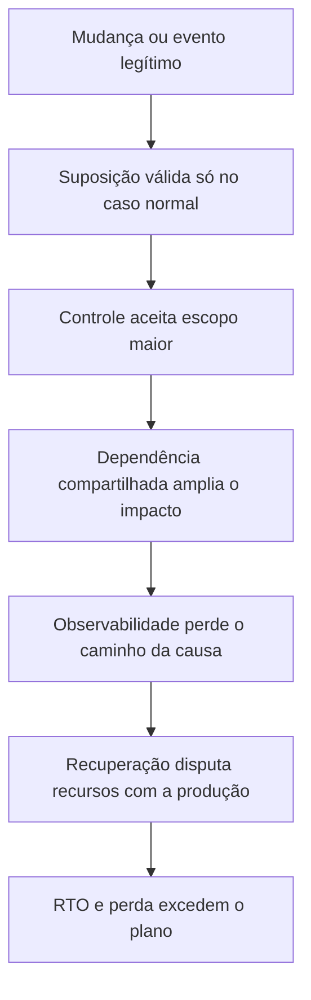

# Lições transferíveis

Os casos do GitHub, GitLab, Meta, Cloudflare, Uber, Discord, Figma, Google
Cloud e Azure têm tecnologias e escalas diferentes. O valor de estudá-los não
está em procurar uma causa única que sirva para todos, mas em reconhecer
estruturas recorrentes: mudança com escopo maior que o esperado, controle sem
contexto, observabilidade dependente do componente afetado e recuperação que não
foi medida sob as condições reais.

## Primeiro, separar as propriedades

Disponibilidade, consistência, durabilidade, integridade e recuperabilidade são
propriedades relacionadas, mas não intercambiáveis.

| Propriedade | Pergunta | Falha típica |
| --- | --- | --- |
| Disponibilidade | O usuário consegue obter uma resposta? | BGP retirado, serviço sem rota ou processo indisponível |
| Consistência | Diferentes leitores veem um estado compatível? | Dois primários aceitam escritas divergentes |
| Durabilidade | Uma confirmação continua existindo após falha? | WAL ou backup não persistido |
| Integridade | O dado mantém significado e relações válidas? | Reprocessamento fora de ordem ou restauração parcial |
| Recuperabilidade | Conseguimos retornar a um estado conhecido dentro do RTO? | Backup nunca restaurado ou plano de controle inacessível |

O GitHub priorizou integridade e consistência antes de reabrir todos os efeitos
assíncronos. O GitLab possuía uma réplica, mas não tinha uma cópia independente
e verificável que cobrisse o RPO desejado. A Meta tinha aplicações e DNS, mas
perdeu o backbone e o caminho normal de administração. Cada caso falhou em uma
propriedade diferente antes de afetar as demais.

## Comparação dos incidentes centrais

| Dimensão | GitHub, 2018 | GitLab, 2017 | Meta, 2021 | Cloudflare, 2024 |
| --- | --- | --- | --- | --- |
| Gatilho | Partição entre regiões durante manutenção | Ressincronização e comando no host errado | Comando de manutenção do backbone | Anúncios BGP indevidos |
| Mecanismo de ampliação | Eleição promoveu região sem todo o estado | Réplica atrasada e WAL indisponível | BGP e DNS perderam alcance | Mais-specific e route leak |
| Proteção insuficiente | Quorum não incluía semântica da aplicação | Backup e alerta não eram verificados | Auditoria e acesso dependiam da rede | RPKI não era aplicado em todos os receptores |
| Sintoma público | Leituras antigas, escrita contida e filas atrasadas | Indisponibilidade e perda de dados | `SERVFAIL` e serviços desaparecidos | Indisponibilidade por ASN e região |
| Recuperação | Autoridade, reconstrução, reconciliação e backlog | Snapshot antigo e recuperação gradual | Acesso fora do caminho normal e retorno de rotas | Retirada de rotas e coordenação entre ASes |
| Lição principal | Promoção não é autoridade automática | Réplica não é backup | Recuperação precisa de independência | Segurança BGP é cooperativa |

## A cadeia de falha recorrente

O padrão não significa que mudanças devam ser evitadas. Significa que uma
mudança precisa ter um limite de blast radius verificável. Se a ação afeta mais
componentes que o planejado, ela deve parar antes de alcançar a escala global.

## O que as equipes fizeram corretamente

### Tornaram o evento público

GitHub, GitLab, Cloudflare, Meta e os provedores citados publicaram relatos que
permitem comparar horário, mecanismo e impacto. A transparência não é somente
comunicação: ela cria uma superfície para que outras equipes verifiquem se
possuem a mesma falha latente.

### Contiveram ações concorrentes

Bloquear deployments, pausar consumidores, preservar uma região ou retirar
anúncios são formas de impedir que o estado continue mudando enquanto a equipe
define a autoridade. A contenção pode aumentar a indisponibilidade imediata,
mas reduz o risco de transformar uma recuperação em uma segunda divergência.

### Separaram parcialmente os efeitos

Repositórios e wikis do GitLab não estavam no mesmo diretório do banco. O
GitHub isolou builds e webhooks durante a reconciliação. Essas separações reduzem
o raio de uma perda e permitem recuperar uma parte do produto sem corromper a
parte que ainda está sendo reconstruída.

### Usaram evidência externa

Medições de BGP, coletores independentes, status público e testes de múltiplos
ASNs são importantes quando a origem não recebe a requisição. A análise não pode
depender somente do log do componente que está isolado.

## O que deveria ter sido tratado antes

### Compatibilidade entre automação e aplicação

Um controlador pode considerar um primário saudável e, ainda assim, produzir
uma topologia que o código não entende. O contrato deve declarar quais papéis,
versões e localidades são suportados, quais promoções exigem aprovação e como a
aplicação se comporta quando a leitura está atrás da escrita.

### Fencing antes da promoção

Em qualquer arquitetura com mais de um candidato a escrita, a promoção precisa
ter uma etapa que impeça o antigo candidato de continuar aceitando operações.
Fencing pode ser feito por energia, storage, lease externo, política de rede ou
credencial, conforme o ambiente. Um timeout de conexão não é fencing.

### Backup como processo testável

O caso do GitLab mostra que o nome do job não basta. É preciso medir execução,
versão do cliente, tamanho esperado, integridade, retenção, restauração e tempo.
Um backup que nunca foi restaurado é uma hipótese, não uma capacidade.

### Observabilidade independente

O alerta de backup do GitLab dependia de email que falhava. A Meta perdeu acesso
à própria rede de administração. A Cloudflare precisou comparar coletores
externos. O plano deve incluir um observador que sobreviva à perda do componente
observado.

### Escopo de exportação

O Verizon leak, o caso do Telegram e o incidente do 1.1.1.1 mostram a mesma
classe de problema em BGP: o resultado desejado era local, mas a política de
exportação tornou o anúncio global. O equivalente em Kubernetes é um recurso que
deveria ficar em um namespace e acaba sendo aplicado ao cluster inteiro.

## Como avaliar uma ação perigosa

Antes de executar uma mudança de alto impacto, o operador deve conseguir
responder:

1. Qual estado a ação modifica?
2. Qual é o maior conjunto de consumidores que pode observar a mudança?
3. Qual pré-condição interrompe o procedimento antes desse limite?
4. Como saberemos que a alteração ultrapassou o escopo esperado?
5. Qual caminho de rollback permanece disponível se a rede principal falhar?
6. O rollback é seguro se parte dos consumidores já observou a mudança?
7. Que autoridade decide parar, promover, restaurar ou declarar recuperação?

Se essas respostas dependem da memória do operador ou de uma sessão que pode
desaparecer, o controle ainda não é suficiente.

## Durante o incidente

### Preservar evidências

Guardar rotas, topologia, logs, métricas, horários, comandos e estados de
configuração evita que a equipe apague justamente a informação necessária para
explicar a causa. Isso não significa congelar tudo: significa criar uma cópia
antes de reiniciar, ressincronizar ou reconfigurar.

### Determinar autoridade

Quando há duas fontes de escrita, quando uma réplica pode estar atrasada ou
quando uma rota pode vir de dois ASes, a primeira decisão é saber qual estado
será preservado. Reabrir tráfego antes disso pode produzir uma recuperação
aparente e tornar a reconciliação impossível.

### Pausar o que amplia a divergência

Deployments, jobs, webhooks, replicação, retries e automações devem ser
classificados. Nem todos precisam parar, mas cada consumidor precisa de uma
decisão explícita, com limite de backlog e política de expiração.

### Comunicar sintomas diferentes

Status "degradado" é insuficiente quando usuários enfrentam leitura antiga,
escrita bloqueada, atraso de webhook, perda de rota ou risco de perda de dados.
Descrever cada sintoma evita que uma parte recuperada seja confundida com o
produto inteiro.

## Durante a recuperação

1. Restaurar em ambiente isolado antes de substituir a cópia remanescente.
2. Validar esquema, contagens, chaves, integridade e amostras de negócio.
3. Medir replay de WAL, reconstrução de réplica, migração e backlog.
4. Reprocessar somente operações idempotentes ou com compensação definida.
5. Proteger filas contra concorrência que exceda storage, CPU e rate limit.
6. Comparar efeitos derivados, como webhooks, builds, caches e índices.
7. Definir critérios de entrada e saída para cada fase da recuperação.
8. Só declarar encerramento quando os indicadores de produto e infraestrutura
   estiverem dentro do objetivo definido.

## Aplicação a uma plataforma Kubernetes pequena

GitOps declara deployments e recursos, mas não prova que a role existente no
PostgreSQL tem a senha declarada, que o WAL está arquivado ou que um backup pode
ser restaurado. A reconciliação do Argo CD é uma propriedade de configuração,
não uma validação completa do estado interno de cada sistema.

Em um cluster compartilhado, o benefício de reduzir overhead vem com um domínio
de falha maior. Cada banco ainda precisa de backup, restauração seletiva,
rotação, permissões e NetworkPolicy próprias. Em um único Raspberry Pi, é
possível melhorar durabilidade e recuperação, mas não é correto chamar a mesma
máquina de alta disponibilidade.

## Checklist final

Antes de aprovar uma arquitetura ou um procedimento, responda:

1. Qual é a única fonte autorizada a aceitar escrita?
2. Como impedir que a fonte antiga continue aceitando escrita?
3. Qual dado pode ser perdido e por quanto tempo?
4. Onde está a cópia independente e quando ela foi restaurada?
5. O alerta de falha funciona se o sistema protegido estiver fora do ar?
6. O procedimento identifica host, cluster, papel, namespace e diretório?
7. O RTO inclui migração, filas, caches, webhooks, índices e consumidores?
8. Que evidência permite declarar que a recuperação é segura?

## Matriz de controles

As recomendações ficam mais operáveis quando ligadas ao momento em que devem
interromper a cadeia. Um controle preventivo reduz a probabilidade de um estado
perigoso. Um controle de detecção torna a transição visível. Um controle de
recuperação devolve o sistema a um estado conhecido.

| Momento | Controle | Exemplo de teste |
| --- | --- | --- |
| Antes da mudança | Escopo e pré-condições | Rejeitar uma alteração que mencione mais enlaces, namespaces ou prefixos que o plano |
| Durante a mudança | Rollout progressivo | Aplicar primeiro a uma partição e verificar SLO antes de continuar |
| Após a mudança | Observação independente | Comparar métricas internas com probes de outra rede |
| Ao detectar divergência | Fencing e pausa | Revogar escrita antiga e interromper consumidores não idempotentes |
| Durante a restauração | Cópia isolada | Restaurar backup em ambiente separado e validar dados de negócio |
| Antes do encerramento | Critério de recuperação | Confirmar backlog, integridade, filas, rotas e caminhos administrativos |

Essa matriz impede que toda a responsabilidade seja colocada em um único
alerta. Um alerta pode detectar o problema, mas não substitui uma autoridade
para pausar nem uma cópia que permita recuperar o estado.

## O que medir depois da correção

Uma ação corretiva deve produzir evidência observável. Para uma mudança de banco,
isso pode incluir atraso de réplica, idade do último WAL arquivado, duração de
restore, erros de reconciliação e tamanho do backlog. Para uma mudança de rede,
inclui origin ASN, quantidade de prefixos, estado RPKI, AS path e resultados por
ASN consumidor. Para uma mudança de plataforma, inclui falhas de rollout,
tempo de recuperação, capacidade disponível e comportamento dos consumidores.

O objetivo não é coletar todos os sinais possíveis. É escolher sinais que
respondam se a hipótese da correção se tornou verdadeira. Sem essa relação, o
post-mortem termina com tarefas concluídas no sistema de tickets, mas sem prova
de que a propriedade protegida melhorou.

## Fontes

- [Análise oficial do incidente do GitHub](https://github.blog/news-insights/company-news/oct21-post-incident-analysis/).
- [Post-mortem oficial do GitLab](https://about.gitlab.com/blog/postmortem-of-database-outage-of-january-31/).
- [Vídeo sobre o incidente do GitHub](https://www.youtube.com/watch?v=dsHyUgGMht0).
- [Vídeo sobre o incidente do GitLab](https://www.youtube.com/watch?v=tLdRBsuvVKc).
