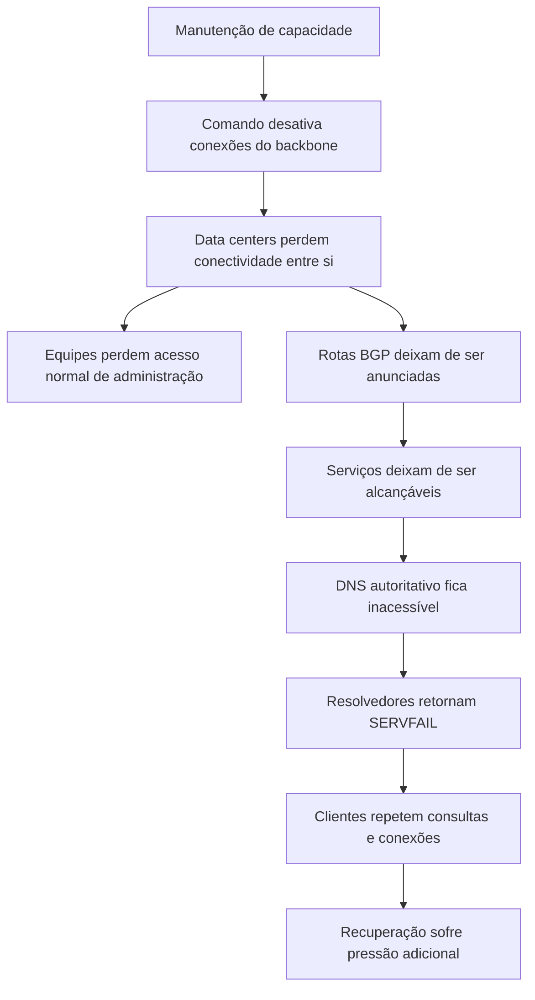

# Incidente da Meta em 2021

Em 4 de outubro de 2021, Facebook, Instagram e WhatsApp desapareceram da
Internet por várias horas. O incidente começou no backbone privado da Meta, mas
terminou visível como retirada de anúncios BGP, falha de resolução DNS e
indisponibilidade das aplicações.

O caso é um estudo de plano de controle. O problema não foi somente uma
interface desligada. A alteração afetou a rede que conectava data centers, a
publicação de rotas que tornava os serviços alcançáveis, os servidores DNS
autoritativos e os próprios canais administrativos usados para reparar o
ambiente.

As fontes são o relato da [Engineering at Meta](https://engineering.fb.com/2021/10/05/networking-traffic/outage-details/)
e a observação externa da [Cloudflare sobre o desaparecimento do Facebook](https://blog.cloudflare.com/october-2021-facebook-outage/).

## O modelo mental: dados, controle e recuperação

Uma rede de grande escala tem pelo menos três planos diferentes:

| Plano | Responsabilidade | Dependência observada no caso |
| --- | --- | --- |
| Dados | Transportar pacotes entre clientes e serviços | Conexões de backbone foram desativadas |
| Controle | Programar enlaces, publicar rotas e manter topologia | O comando e a auditoria alteraram o backbone |
| Recuperação | Permitir diagnóstico, acesso e reversão | A equipe perdeu caminhos normais de acesso |

O plano de recuperação precisa ser tratado como parte da arquitetura. Se o
mesmo backbone fornece conectividade de produção, acesso administrativo,
telemetria e caminho de reversão, uma falha no backbone remove várias opções ao
mesmo tempo.

## A cadeia técnica

Durante uma manutenção de rotina, um comando que deveria avaliar a capacidade
disponível do backbone desativou, sem intenção, todas as conexões do backbone.
Segundo a Meta, um bug na ferramenta de auditoria impediu que o comando fosse
bloqueado.

Com os data centers isolados, a Meta deixou de anunciar suas rotas BGP. O DNS
autoritativo dos serviços ficou inacessível para parte dos resolvedores. As
consultas passaram a retornar `SERVFAIL`, não porque o registro necessariamente
tivesse sido removido, mas porque a cadeia até o servidor autoritativo não
conseguia responder.

Uma leitura superficial diria que "o DNS caiu". A leitura causal mostra que o
DNS apareceu como sintoma de uma falha de transporte e controle. Essa distinção
evita reiniciar resolvedores quando o problema está na rota que deveria chegar
ao autoritativo.

## Por que a recuperação foi difícil

### O sistema perdeu seu próprio caminho de operação

Quando o backbone foi desativado, a equipe não podia simplesmente enviar um
comando pela mesma infraestrutura. O acesso de emergência precisava atravessar
caminhos alternativos, consoles ou procedimentos fora de banda. Em ambientes
menores, a analogia é perder a rede de gerenciamento porque ela compartilha
switch, energia ou firewall com a rede de produção.

### A retirada de BGP ampliou a aparência do problema

Mesmo que alguns componentes internos ainda estivessem funcionando, a retirada
de rotas fez os serviços parecerem inexistentes para a Internet. Isso dificulta
testar a aplicação, porque uma requisição não chega à borda e não produz log no
originador.

### `SERVFAIL` gerou comportamento de cliente

Clientes, resolvedores e bibliotecas interpretam erros temporários como motivo
para tentar de novo. Sem backoff, jitter e limites, uma falha global transforma
retries em tráfego adicional exatamente quando a equipe precisa de capacidade
para recuperar a rede.

### O plano de recuperação estava parcialmente acoplado

O acesso de emergência, a telemetria, a alteração de rotas e os dados de estado
dependiam de uma rede que não estava disponível. Isso aumenta o tempo entre
descobrir a causa e conseguir aplicar a primeira correção.

## O que foi feito corretamente

### A análise separou DNS de BGP

O primeiro sintoma foi `SERVFAIL`, mas as observações externas mostraram que o
DNS não era a causa primária. A separação entre resolução, anúncios e
conectividade evitou uma explicação errada.

### Havia uma barreira de auditoria planejada

O comando deveria passar por uma ferramenta capaz de impedir mudanças perigosas.
O controle existia conceitualmente, mesmo que um bug o tenha neutralizado. Isso
deu à investigação um ponto concreto: a ferramenta de auditoria precisava ser
tratada como componente crítico, com seus próprios testes de falha.

### O relato explicou dependências sistêmicas

A Meta descreveu backbone, BGP, DNS, acesso e recuperação como partes da mesma
cadeia. Esse enquadramento é mais útil do que culpar somente o operador ou
somente o protocolo.

## O que falhou

### O blast radius do comando era global

Uma ação de manutenção que pretendia avaliar capacidade podia afetar todas as
conexões do backbone. Mudanças desse alcance deveriam exigir escopo, pré-
condições, simulação, rollout progressivo e parada automática.

### A proteção compartilhava o caminho da mudança

O bug da auditoria retirou a barreira que deveria impedir a operação. A perda da
rede depois dificultou atualizar a ferramenta ou executar o rollback. Um
controle de segurança crítico precisa ter teste independente e um caminho de
recuperação que não dependa da mesma superfície.

### Telemetria e administração não tinham independência suficiente

Se a coleta de métricas fica inacessível junto com a produção, a ausência de
métrica não significa ausência de falha. O monitoramento precisa ter pelo menos
um caminho que sobreviva à perda do backbone monitorado.

## O que poderia ter sido evitado

1. Aplicar mudanças de capacidade por etapas, começando por um domínio pequeno.
2. Exigir confirmação de escopo, número de enlaces e dependências antes do
   comando global.
3. Fazer a ferramenta de auditoria falhar de modo fechado quando sua validação
   não puder ser executada.
4. Manter consoles, rede de gerenciamento e acesso de emergência fora do
   backbone de produção.
5. Testar retirada e restauração de anúncios BGP em um ambiente controlado.
6. Definir backoff, jitter e limites para retries de DNS e clientes.
7. Monitorar o serviço por vantage points externos, além das métricas internas.
8. Registrar um critério de recuperação para conectividade, rotas, DNS e
   aplicações, em vez de considerar somente o primeiro ping bem-sucedido.

## Como aplicar em um cluster pequeno

Um Raspberry Pi, um cluster Kubernetes ou uma instalação doméstica também pode
ter a mesma classe de risco em escala menor. Se Argo CD, SSH, DNS, métricas e
aplicações usam a mesma interface e o mesmo switch, uma mudança de rede pode
impedir justamente a ferramenta que deveria desfazê-la.

Medidas proporcionais incluem um acesso físico ou serial testado, um segundo
caminho de gerenciamento, configuração exportada antes da mudança, teste de
rollback e uma checagem externa que diferencie DNS, TCP, TLS e HTTP. O objetivo
não é criar uma segunda rede completa sem necessidade, mas saber qual ação ainda
é possível quando a rede principal está indisponível.

## Aprendizado

Uma falha de plano de controle pode fazer um sistema parecer simultaneamente
quebrado em várias camadas. A aplicação, o DNS e a borda podem ser apenas
vítimas de uma mudança de transporte. O diagnóstico deve reconstruir a cadeia
de dependências e procurar o primeiro ponto que alterou o estado.

Também é necessário separar o caminho que protege a produção do caminho usado
para recuperar a produção. Sem essa separação, a primeira falha transforma a
reversão em uma nova operação dependente do componente que já falhou.

## Teste do caminho de recuperação

Um caminho alternativo só é uma capacidade se puder ser usado sem a rede que ele
deve recuperar. O exercício precisa verificar, separadamente:

1. acesso ao console, serial ou gerenciamento fora de banda;
2. identidade e credenciais que continuam disponíveis;
3. estado da topologia e última configuração conhecida;
4. capacidade de restaurar o enlace ou reverter a mudança;
5. comunicação com as equipes e provedores envolvidos;
6. observação externa do retorno de rota, DNS, TLS e aplicação.

Um teste que apenas confirma que um segundo switch está ligado não prova que o
operador consegue reativar o backbone, publicar rotas e validar o produto. A
recuperação deve ter um critério de passagem para cada camada e uma autoridade
que possa parar o procedimento quando a hipótese não for confirmada.

## Backoff não substitui capacidade

Quando o DNS autoritativo desaparece, clientes podem repetir consultas. Quando o
serviço volta parcialmente, retries sincronizados podem consumir a capacidade
recuperada. Backoff exponencial, jitter, limites e circuit breakers reduzem essa
pressão, mas não corrigem um plano de controle indisponível.

O design precisa distinguir falha temporária, resposta negativa cacheável,
ausência de rota e timeout. Cada uma tem TTL, política de retry e impacto
diferentes. Medir apenas a quantidade de requisições sem classificar a causa
esconde o trabalho que a recuperação está adicionando à rede.

## Fontes

- [Engineering at Meta, detalhes do outage de 4 de outubro](https://engineering.fb.com/2021/10/05/networking-traffic/outage-details/).
- [Cloudflare, como o Facebook desapareceu da Internet](https://blog.cloudflare.com/october-2021-facebook-outage/).
