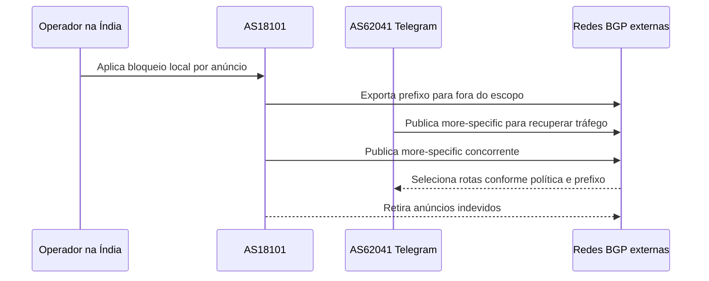

# Incidente do Telegram na Índia em 2026

Em 16 de junho de 2026, a Índia determinou um bloqueio temporário do Telegram.
Segundo a análise pública da Kentik, a implementação do bloqueio incluiu
anúncios BGP originados pelo AS18101, Rcom, antigo Reliance Communications,
para atrair e descartar tráfego destinado a blocos do Telegram.

Este caso precisa ser tratado com precisão porque mistura decisão regulatória,
operação de telecomunicações e observação de roteamento. A ordem de bloqueio é
um fato regulatório. A origem e a propagação dos anúncios são uma análise feita
a partir de dados públicos pela Kentik. A alegação de que usuários fora da
Índia foram afetados não deve ser convertida automaticamente em uma afirmação
sobre intenção global do governo ou do operador.

A fonte técnica principal é a análise [When Local Blocks Go Global: The India-Telegram
BGP Incident](https://www.kentik.com/blog/when-local-blocks-go-global-the-india-telegram-bgp-incident/).

## O que um bloqueio local pretendia fazer

Um bloqueio doméstico precisa limitar o tráfego dentro da jurisdição na qual a
ordem deve ser aplicada. Isso pode ser feito em provedores de acesso, resolutores,
firewalls ou pontos de filtragem nacionais. Quando a técnica anuncia uma rota
blackhole por BGP, ela deixa de ser apenas uma regra local: passa a depender de
políticas de importação e exportação de outros ASes.

BGP não possui um campo universal que diga "esta rota vale somente para a
Índia". O escopo é construído por sessão, communities, filtros e relações entre
provedores. Se um anúncio for exportado para um vizinho de trânsito que não
conhece a intenção, ele pode alcançar redes estrangeiras.

## O anúncio observado

Às 07:17 UTC, o AS18101 começou a originar blocos usados pelo Telegram. A
hipótese operacional é que o anúncio seria utilizado como blackhole dentro da
Índia. A Kentik observou o `91.108.4.0/22`, normalmente originado pelo AS62041
do Telegram, também associado ao AS18101 em fontes BGP externas.

A ocorrência apareceu em apenas 1,6% das fontes monitoradas. Isso não significa
que somente 1,6% dos usuários foram afetados, nem que a rota ficou confinada a
esse percentual. Coletores BGP têm distribuição própria e não medem diretamente
usuários finais. O número indica a proporção de vantage points que observaram o
estado analisado.

## Por que o RPKI reduziu o alcance

O Telegram mantinha ROAs para seus prefixos. Redes que aplicavam ROV podiam
classificar como inválida uma rota originada pelo AS18101. Isso explica por que
o anúncio não teve a mesma propagação de uma rota sem qualquer autorização
publicada.

Mas RPKI não funciona como uma barreira global. Cada rede decide se valida e o
que faz com a classificação `Invalid`. Além disso, o controle verifica a
autorização do origin ASN e o comprimento, não a intenção geográfica da ordem.
Um anúncio originado por um ASN não autorizado pode continuar existindo em
redes que não aplicam ROV.

## More-specifics como tentativa de recuperação

O Telegram passou a anunciar rotas mais específicas. BGP prefere um prefixo
mais longo quando ele está disponível e é aceito, então a técnica pode recuperar
tráfego que está sendo atraído por um anúncio menos específico.

O mecanismo tem uma condição de sucesso: o originador indevido precisa não
conseguir, ou não tentar, anunciar a mesma granularidade. Às 16:14 UTC, o
AS18101 também começou a anunciar more-specifics. A disputa fez a mitigação
perder parte do efeito até a retirada dos anúncios.

Esse detalhe é importante para runbooks. More-specific não é um botão de
desfazer. É uma intervenção que altera a tabela global e pode escalar a disputa
se o outro originador continuar ativo. A decisão precisa ser acompanhada por
monitoramento de propagação, estado RPKI, capacidade do originador e plano de
retirada.

## O que foi feito corretamente

### Os ROAs do Telegram reduziram a propagação

A autorização publicada permitiu que redes com ROV rejeitassem a origem
indevida. Isso não resolveu a falha, mas transformou um possível evento global
em um evento observado por uma parcela menor da Internet.

### A resposta técnica observou o plano de roteamento

A análise não ficou restrita a relatos de usuários. Ela comparou origens,
prefixos, more-specifics e vantage points. Esse método é necessário porque uma
aplicação pode estar saudável no data center e ainda assim ficar inalcançável
por parte dos usuários.

### A mitigação considerou o algoritmo real

Anunciar more-specifics é uma técnica conhecida. O próprio comportamento da
rota concorrente mostrou rapidamente a limitação, o que é mais útil que uma
mitigação declarada como sucesso sem observar o resultado externo.

## O que falhou

### O escopo político não virou escopo técnico

Uma ordem nacional foi implementada por um mecanismo que não conhece fronteiras
políticas. O anúncio podia escapar da relação doméstica porque não havia uma
política de exportação capaz de impor o limite.

### O bloqueio usou o plano de controle global

Se a finalidade é descartar tráfego dentro de uma operadora, anunciar prefixos
para o restante da Internet adiciona dependências e amplia o blast radius. A
solução pode ser tecnicamente eficaz no ponto local e ainda ser insegura como
operação BGP.

### A proteção dependia do comportamento dos receptores

ROV estava disponível, mas não era aplicado por todas as redes. A segurança da
rota dependia de uma cadeia de decisões externas que o operador do bloqueio não
controlava.

## O que poderia ter sido evitado

1. Aplicar o blackhole dentro da infraestrutura nacional sem exportar o prefixo
   global.
2. Se BGP fosse realmente indispensável, usar communities de não exportação,
   filtros explícitos e sessões cujo escopo fosse verificável.
3. Configurar `max-prefix`, validação de origem e monitoramento de AS path nos
   provedores que poderiam propagar a mudança.
4. Consultar coletores externos antes e depois da alteração para provar que o
   anúncio não saiu do país.
5. Ter um procedimento de retirada que não dependesse do mesmo caminho de rede
   afetado pelo bloqueio.
6. Publicar a janela, a motivação, o escopo e o canal de contestação para que
   operadores legítimos conseguissem reportar dano colateral.

## Limites da evidência

A Kentik descreve o comportamento observado nos dados de BGP e considera
provável que o anúncio tivesse relação com o bloqueio. Isso permite afirmar que
o escopo técnico não ficou restrito, mas não permite afirmar sozinho quem
ordenou cada configuração, se houve intenção de atingir usuários estrangeiros ou
qual ação administrativa produziu cada anúncio.

Essa separação é uma prática importante de post-mortem. Confundir observação de
rota com atribuição de intenção pode gerar uma narrativa forte, mas fraca como
evidência. O aprendizado operacional continua válido mesmo quando a intenção
permanece incerta.

## Aprendizado

BGP não conhece jurisdição. Ele conhece prefixos, ASNs e políticas de troca de
rotas. Qualquer sistema que dependa de um bloqueio nacional precisa tratar a
propagação como uma propriedade a ser testada, não como uma consequência
automática do pedido regulatório.

O caso também mostra que uma mitigação de emergência pode criar uma segunda
falha. More-specifics podem recuperar tráfego, mas também podem iniciar uma
disputa. A equipe deve definir critérios de parada, autoridade para retirar
anúncios e evidências para confirmar que a correção melhorou o estado.

## Como interpretar a porcentagem de coletores

Uma porcentagem de vantage points BGP não é uma porcentagem de usuários, de
operadoras ou de países. Coletores possuem localizações, políticas de peering e
frequências de observação diferentes. Um anúncio visto por poucos coletores pode
afetar uma rede grande, enquanto um anúncio visto por muitos coletores pode não
interceptar usuários finais se os caminhos preferidos forem outros.

Para transformar a observação em impacto operacional, combine o estado BGP com
probes de aplicação em ASNs afetados, medições de DNS, testes TCP e registros de
falha no serviço. O resultado deve preservar a origem de cada dado. Uma rota
observada não prova que houve conexão aceita pelo equipamento que a originou.

## Limites de uma mitigação por more-specific

More-specifics não são uma técnica neutra de recuperação. Eles podem:

- superar a rota indevida em algumas redes e não em outras;
- ser classificados como inválidos por ROV;
- alcançar limites de filtragem, como prefixos IPv4 pequenos demais;
- aumentar a carga de tabelas e a complexidade da retirada;
- criar uma disputa se o originador indevido anunciar o mesmo comprimento.

Antes de usá-los, a equipe deve estimar o espaço de anúncios, a política dos
receptores e o custo de retirar a mitigação. Uma resposta que melhora uma região
e piora outra precisa ser tratada como estado intermediário, não como sucesso.

## Fonte

- [Kentik, incidente BGP do Telegram na Índia](https://www.kentik.com/blog/when-local-blocks-go-global-the-india-telegram-bgp-incident/).
