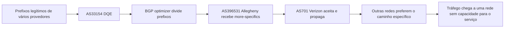

# Vazamento da Verizon em 2019

Em 24 de junho de 2019, uma combinação de BGP optimizer, anúncios mais
específicos e ausência de filtragem fez com que rotas destinadas a Cloudflare,
Amazon, Linode e outros serviços fossem preferidas através de uma rede pequena
na Pensilvânia.

Esse caso é diferente de um hijack deliberado. O resultado externo pode parecer
idêntico, porque tráfego legítimo é atraído para uma rede que não deveria
recebê-lo, mas a cadeia descrita pela Cloudflare aponta para uma otimização de
rotas que ultrapassou sua fronteira de exportação. A distinção entre acidente e
ataque muda a resposta de segurança, mas não elimina a obrigação de conter o
anúncio.

O relato primário é [How Verizon and a BGP Optimizer Knocked Large Parts of the
Internet Offline](https://blog.cloudflare.com/how-verizon-and-a-bgp-optimizer-knocked-large-parts-of-the-internet-offline-today/).

## O que era o BGP optimizer

Ferramentas de otimização podem dividir um prefixo em anúncios mais específicos
para influenciar o caminho escolhido por outros ASes. O objetivo pode ser
reduzir latência, distribuir tráfego ou usar melhor links múltiplos.

Essa técnica só é segura quando o anúncio tem escopo controlado. Um more-specific
que faz sentido dentro de uma rede pode virar uma rota global preferível se for
exportado a um cliente e depois a um provedor de trânsito. BGP não conhece a
intenção operacional do administrador. Ele aplica política local, comprimento
do prefixo e atributos recebidos.

## A cadeia do anúncio

O ponto de falha não foi somente a geração de more-specifics. Houve uma cadeia
de confiança em que cada AS aceitou e exportou anúncios que deveriam ter sido
limitados. O último provedor com grande conectividade tornou o erro visível em
uma fração ampla da Internet.

## Impacto

No pior momento, a Cloudflare observou perda de aproximadamente 15% do tráfego
global. A rede que recebeu os anúncios não era o destino correto e não tinha
capacidade para atuar como caminho de serviço para todos os prefixos atraídos.
Usuários perceberam timeouts e falhas de conexão, enquanto os originadores
continuavam saudáveis.

Esse é um padrão importante de diagnóstico. Uma queda no tráfego da origem pode
ser confundida com erro de aplicação ou de DNS, embora o tráfego esteja sendo
desviado antes de alcançar o serviço. A observabilidade precisa olhar volume por
origem, caminho BGP e ponto de entrada, não apenas métricas HTTP.

## Por que a rota mais específica vence

BGP combina vários atributos e políticas, mas o roteador primeiro precisa
resolver quais prefixos cobrem o endereço. Entre `203.0.113.0/24` e
`203.0.113.128/25`, o segundo é mais específico. Se os dois estiverem na tabela,
o `/25` pode ser escolhido antes de comparações de preferência entre caminhos.

Essa propriedade é necessária para engenharia legítima de tráfego, mas também
permite que uma rota indevida atraia uma parte precisa do espaço de endereços.
Por isso, o filtro de origem precisa verificar não apenas o ASN, mas também o
comprimento máximo autorizado e o relacionamento de exportação.

## O que foi feito corretamente

### A rota foi investigada fora da aplicação

A Cloudflare comparou anúncios, AS paths e tráfego observado, em vez de assumir
que todos os erros eram defeitos do serviço. Isso encurtou a investigação e
permitiu conversar com os ASes que estavam no caminho.

### O contato operacional teve efeito

Quando a DQE parou de anunciar os more-specifics para a Allegheny, o tráfego
começou a estabilizar. A existência de contatos de NOC e de evidência objetiva
é um controle operacional tão importante quanto o filtro automático.

### O post-mortem identificou controles concretos

O relatório discutiu IRR, RPKI, `max-prefix` e filtros de cliente. Isso é melhor
que uma recomendação abstrata para "ter mais cuidado", porque cada controle pode
ser transformado em configuração e teste.

## O que falhou

### A otimização não tinha fronteira de exportação

O optimizer produzia anúncios úteis para uma decisão local, mas o desenho não
impedia que esses anúncios saíssem da relação prevista. Uma ferramenta de
tráfego precisa conhecer o caminho permitido para cada prefixo, não somente o
resultado que deseja produzir.

### Os receptores confiaram em mudança anormal

Um aumento abrupto de prefixos, origin ASes e comprimentos deveria ter acionado
uma barreira. Aceitar qualquer anúncio de um cliente transforma o cliente em um
roteador de trânsito não declarado.

### Filtros de origem e quantidade eram insuficientes

IRR e RPKI não são substitutos perfeitos um do outro. IRR descreve intenção de
roteamento, mas depende da qualidade dos registros. RPKI fornece autorização
criptográfica de origem, mas não modela sozinho todo caminho de exportação.
`max-prefix` limita volume, mas não identifica uma rota individual legítima.
Uma operação madura combina controles com responsabilidades diferentes.

## Como evitar uma repetição

1. Gerar filtros por sessão, com prefixos e comprimentos máximos esperados.
2. Aplicar `max-prefix` com comportamento de contenção e alerta verificável.
3. Validar RPKI e rejeitar rotas inválidas conforme a política do ambiente.
4. Restringir exportações por communities e políticas explícitas de cliente,
   peer e trânsito.
5. Testar o optimizer em laboratório ou em uma sessão sem exportação global.
6. Medir prefix count, origin ASN, AS path, more-specifics e volume de tráfego.
7. Fazer rollback automático quando a mudança exceder o número esperado de
   prefixos ou alcançar um vizinho não previsto.
8. Manter runbook e contatos de NOC para retirada urgente de anúncios.

## O que este caso ensina sobre supply chain de rede

Uma ferramenta de terceiros pode alterar a tabela BGP sem modificar o código da
aplicação. Isso faz do optimizer uma parte da supply chain operacional. Ele deve
ter versão controlada, revisão de mudança, permissões mínimas, testes de saída e
telemetria independente.

O mesmo raciocínio vale para controladores de SDN, automação de firewalls e
operadores de anúncios Kubernetes. O erro não precisa estar no protocolo para
causar uma falha global. Basta que uma abstração local produza uma política que
seja válida localmente e perigosa quando exportada.

## Diferença entre hijack, leak e falha de configuração

Os termos não são intercambiáveis. Em um hijack, um ASN origina um prefixo sem
autorização do titular ou fora do acordo esperado. Em um route leak, o ASN pode
ter recebido uma rota legítima, mas a exporta para uma relação que não deveria
recebê-la. Uma falha de configuração pode produzir qualquer uma das duas formas
sem que exista intenção maliciosa.

Essa distinção muda a investigação. Para um hijack, a pergunta principal é se o
origin ASN era autorizado e se a rota está em conformidade com o ROA. Para um
leak, é necessário reconstruir as relações entre cliente, peer e trânsito e
verificar filtros de exportação. Para uma falha no optimizer, além da rede é
preciso revisar a origem da configuração, a versão da ferramenta, o processo de
aprovação e a capacidade de interromper a publicação.

## Controles que precisam ser testados juntos

`max-prefix` limita quantidade, não legitimidade. IRR descreve intenção, mas
depende de registros atualizados. RPKI valida origem e comprimento, mas não
expressa toda a política comercial de exportação. Communities carregam intenção
entre ASes, mas só funcionam quando os receptores documentam e aplicam seu
significado.

Um teste real deve combinar os controles em uma sessão isolada, publicar uma
rota deliberadamente inválida, verificar a decisão do vizinho e confirmar que o
alerta chega por um caminho independente. Testar apenas o arquivo gerado pelo
optimizer não cobre a transformação feita pelos roteadores intermediários.

## Fonte

- [Cloudflare, vazamento de rotas de junho de 2019](https://blog.cloudflare.com/how-verizon-and-a-bgp-optimizer-knocked-large-parts-of-the-internet-offline-today/).
