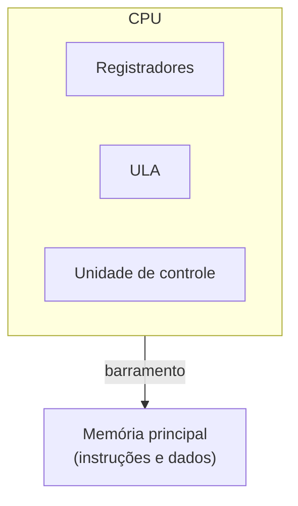
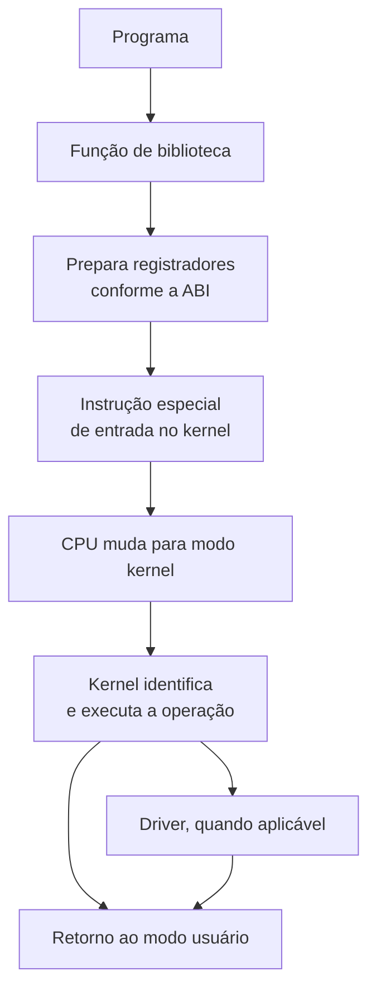
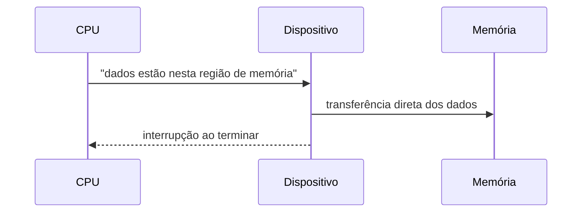
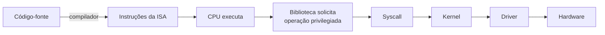

# Como a CPU executa instruções, modos de privilégio e chamadas de sistema

Um programa em execução parece, à primeira vista, uma sequência contínua de comandos de alto nível: abrir um arquivo, somar dois números, imprimir um texto. Nada disso, porém, é o que o processador realmente enxerga.

Uma CPU não interpreta uma chamada de função de alto nível como abrir um arquivo ou formatar um texto; ela executa apenas instruções da sua própria arquitetura, como mover um valor, somar, comparar ou desviar o fluxo, cada uma codificada como uma sequência específica de bytes.

Um programa compilado é, no fundo, essa sequência de bytes gravada em disco, algo como `48 89 E5 48 83 EC 10 ...`, que só ganha sentido quando a CPU a busca, decodifica e executa na ordem correta.

Esta página segue uma ordem deliberada: começa pelo ciclo que a CPU repete para processar cada instrução e pela distinção entre instrução e dado, sobe para o mecanismo de privilégio que impede um programa comum de acessar hardware diretamente, e mostra o caminho completo que uma chamada de sistema percorre entre o programa e o kernel.

Desce, em seguida, ao papel de interrupções e DMA na comunicação com dispositivos, e fecha esclarecendo o que os termos RISC e CISC realmente descrevem sobre o conjunto de instruções que a CPU entende.

## O ciclo de busca, decodificação e execução

Independentemente da arquitetura, uma CPU processa cada instrução repetindo o mesmo ciclo básico: busca a próxima instrução na memória, decodifica o que ela representa, busca os operandos de que precisa, executa a operação correspondente e armazena o resultado. Esse ciclo, conhecido como fetch-decode-execute, é a unidade de trabalho fundamental de qualquer processador, do menor microcontrolador embarcado ao maior servidor multi-core.

Processadores modernos não executam esse ciclo de forma estritamente sequencial. Técnicas como pipeline, que sobrepõe as etapas de instruções diferentes, execução fora de ordem e predição de desvios existem justamente para manter as unidades internas da CPU ocupadas em vez de esperar cada instrução terminar por completo antes de começar a próxima.

Nada disso muda o resultado lógico do programa, apenas a velocidade com que ele é produzido; o modelo de fetch-decode-execute continua sendo a forma correta de raciocinar sobre o que uma instrução faz, mesmo que a implementação física seja mais paralela do que o ciclo sugere.

## Arquitetura de von Neumann e arquiteturas Harvard modificadas

Na arquitetura de von Neumann, instruções e dados compartilham o mesmo espaço de memória e o mesmo barramento de acesso. A CPU não tem como saber, só olhando o conteúdo de um endereço, se aquilo é uma instrução ou um valor: o significado vem do contexto em que o endereço é usado.

O mesmo padrão de bits que a CPU interpreta como "some 5 com 3" ao buscar uma instrução pode, em outro momento, ser lido como os valores 5 e 3 propriamente ditos, se o programa tratar aquele endereço como dado em vez de código.

Uma arquitetura Harvard pura resolve essa ambiguidade separando fisicamente a memória e o barramento de instruções da memória e do barramento de dados, eliminando a necessidade de inferir o papel de cada endereço pelo contexto.

Processadores de uso geral atuais não adotam nenhum dos dois modelos de forma pura: a memória principal continua unificada, no espírito de von Neumann, mas o caminho entre a CPU e essa memória passa por caches separadas de instrução e de dados, cada uma otimizada para o padrão de acesso do seu tipo de conteúdo.

É por isso que CPUs modernas costumam ser descritas como arquiteturas Harvard modificadas: unificadas no nível da memória principal, divididas no nível do cache que fica entre a CPU e essa memória.

## A ULA e os demais componentes da CPU

A Unidade Lógica e Aritmética, ou ULA (ALU em inglês), é a parte da CPU responsável por operações inteiras e lógicas: soma, subtração, AND, OR, XOR, comparações e deslocamentos de bits.

Uma expressão de alto nível como `resultado = a + b;` normalmente se traduz, depois da compilação, em uma instrução equivalente a `add rax, rbx`: a ULA recebe os dois valores já carregados em registradores, realiza a soma e grava o resultado em outro registrador, pronto para ser usado pela instrução seguinte ou devolvido à memória.

A ULA, porém, é só um dos componentes internos da CPU. Os principais são:

| Componente | Função |
| --- | --- |
| Registradores | Armazenamento extremamente rápido dentro da própria CPU, usado para operandos e resultados imediatos. |
| Unidade de controle | Decodifica cada instrução e coordena a sequência de sinais que faz os demais componentes executá-la. |
| ULA | Operações inteiras e lógicas. |
| FPU | Operações de ponto flutuante, separadas da ULA por exigirem um formato de representação numérica diferente. |
| SIMD/vetorial | Aplica a mesma operação sobre vários valores simultaneamente, a base de otimizações em multimídia e computação numérica. |
| MMU | Traduz endereços virtuais, os que o programa enxerga, para endereços físicos de memória de fato, viabilizando isolamento de memória entre processos. |
| Cache | Mantém instruções e dados usados recentemente fisicamente próximos da CPU, reduzindo a latência de acesso à memória principal. |
| Branch predictor | Tenta antecipar o resultado de um desvio condicional antes de ele ser de fato resolvido, para manter o pipeline ocupado. |

Um processador moderno de uso geral combina várias unidades de execução operando em paralelo, não uma ULA única processando uma instrução de cada vez; a tabela acima descreve o papel lógico de cada componente, não a contagem física de quantas cópias dele existem no silício.

## Instrução, dado e entrada e saída

Uma instrução é uma ordem que a CPU sabe executar, como `add x0, x1, x2` (equivalente a `x0 = x1 + x2`). Um dado é o valor sobre o qual essa instrução opera: um inteiro, um trecho de texto, um endereço, parte de uma imagem, um campo de uma estrutura.

Para a memória, a distinção entre os dois não existe fisicamente; tudo é apenas uma sequência de bits, e o significado é inteiramente atribuído pelo programa que os interpreta. O byte 01000001, por exemplo, pode representar o número 65, o caractere ASCII A, parte de uma instrução ou parte de uma imagem, dependendo exclusivamente de como o código em execução decide tratá-lo.

Entrada e saída (I/O) é a comunicação da CPU com dispositivos externos ao processador e à memória principal: disco, teclado, mouse, placa de rede, GPU, USB, áudio. Existem duas formas principais de a CPU alcançar esses dispositivos.

Em I/O mapeado em memória, os registradores do próprio dispositivo aparecem em endereços específicos do espaço de memória; a CPU escreve nesse endereço como se estivesse escrevendo em memória comum, e o controlador do dispositivo interpreta essa escrita como um comando. É o modelo predominante em ARM e cada vez mais comum em geral.

Em I/O por portas, usado historicamente pela arquitetura x86, existe um espaço de endereçamento separado, dedicado a dispositivos, acessado por instruções próprias como `in` e `out`. Mesmo em x86, porém, boa parte da comunicação com dispositivos atuais já migrou para memória mapeada, deixando o I/O por portas como um mecanismo legado ainda suportado, não o caminho principal.

## Modo usuário e modo kernel

Um programa comum não deveria poder acessar livremente o disco, a placa de rede ou qualquer endereço físico de memória: se pudesse, um processo qualquer conseguiria ler a memória de outro processo, corromper o sistema de arquivos de outro programa, ou reconfigurar um dispositivo que não lhe pertence.

Esse isolamento não é uma convenção do sistema operacional; é uma capacidade da própria CPU, que reserva certas operações para um modo de execução mais privilegiado e as bloqueia no modo em que aplicações comuns rodam.

Em uma simplificação válida para praticamente qualquer sistema operacional de propósito geral, a CPU opera em dois modos relevantes para este raciocínio: modo usuário, onde uma aplicação comum roda com acesso restrito, e modo kernel, onde o sistema operacional pode configurar a MMU, acessar dispositivos diretamente, gerenciar interrupções, executar drivers, mapear páginas de memória e controlar processos.

A diferença entre os dois modos não é uma convenção de software, é imposta pelo próprio hardware da CPU, que rejeita certas instruções privilegiadas quando executadas em modo usuário.

Cada arquitetura implementa essa separação com um mecanismo próprio. Em x86, os níveis de privilégio são chamados de rings, numerados de 0 a 3; na prática, sistemas operacionais modernos usam apenas o Ring 0 para o kernel e o Ring 3 para aplicações, deixando os Rings 1 e 2 praticamente sem uso.

Em ARM, o mecanismo equivalente são os Exception Levels: EL0 para aplicações, EL1 para o kernel, EL2 para um hypervisor quando presente, e EL3 para firmware e o secure monitor. Os nomes e a contagem de níveis mudam entre arquiteturas, mas o princípio é o mesmo em qualquer uma delas: aplicações rodam em um nível sem acesso direto a hardware, e uma camada mais privilegiada existe especificamente para mediar esse acesso.

## API e ABI: duas camadas diferentes de contrato

Quando um programa precisa de um serviço que só o modo kernel pode fornecer, como ler um arquivo do disco, ele não invoca o kernel como invocaria uma função comum da própria biblioteca. O kernel não expõe uma biblioteca compartilhada que o programa simplesmente linka e chama; em vez disso, ele expõe uma ABI, interface binária de chamadas de sistema, um contrato bem mais rígido do que uma API de código-fonte.

A distinção entre as duas camadas importa porque cada uma resolve um problema diferente. Uma API, como a assinatura `ssize_t read(int fd, void *buffer, size_t count);`, é uma interface em nível de código-fonte: descreve nomes, tipos e parâmetros que um programador lê e usa ao escrever código.

Uma ABI é o contrato binário que faz esse mesmo chamado funcionar em tempo de execução, sem o código-fonte por perto: qual registrador contém o número da chamada de sistema, qual registrador contém cada argumento, qual instrução exata transfere o controle para o kernel, e como o resultado retorna ao chamador. Um programa compilado só precisa da ABI para funcionar; a API existe para que humanos escrevam esse programa de forma legível.

## O caminho de uma chamada de sistema

O fluxo geral de uma chamada de sistema (syscall) segue sempre a mesma estrutura, independentemente da arquitetura ou do sistema operacional: o programa chama uma função de biblioteca, essa função prepara os registradores de acordo com a ABI vigente, e executa uma instrução especial de entrada no kernel.

A CPU então muda de modo usuário para modo kernel, o kernel identifica qual operação foi solicitada e a executa, ou delega a um driver, e o controle retorna ao modo usuário com o resultado já disponível para o chamador.

A instrução específica que dispara essa transição muda por arquitetura, não por sistema operacional: em x86-64, o mecanismo moderno é a instrução `syscall`; em ARM, é `svc`.

Versões antigas de Linux em x86 usavam a interrupção de software `int 0x80` para o mesmo propósito, um mecanismo mais lento que syscall e mantido hoje apenas por compatibilidade com binários muito antigos.

Um programa em C que executa `int fd = open("dados.txt", O_RDONLY); read(fd, buffer, 1024); close(fd);` percorre, no Linux, um caminho concreto entre a aplicação e o dispositivo de armazenamento: da aplicação para a biblioteca C (glibc ou musl), dessa biblioteca para a chamada de sistema `openat`, dali para o kernel Linux, que consulta a VFS, a camada que abstrai diferentes sistemas de arquivos.

A VFS delega ao driver do sistema de arquivos específico (ext4, Btrfs, XFS ou outro), esse driver passa pela camada de bloco genérica do kernel, e finalmente chega ao driver do dispositivo físico, NVMe, SATA, ou outro barramento de armazenamento.

O kernel devolve ao programa um descritor de arquivo, um número inteiro que não é o arquivo em si, apenas uma referência que o programa usa para se referir a ele nas chamadas seguintes. Todo processo já nasce com três descritores abertos por convenção, 0 para entrada padrão, 1 para saída padrão, 2 para erro padrão; descritores de valor 3 em diante são atribuídos conforme o programa abre arquivos, sockets ou pipes adicionais.

O programa nunca recebe o objeto interno que o kernel mantém para representar aquele arquivo aberto; ele recebe apenas o número que serve de índice para essa estrutura, mantida inteiramente do lado do kernel.

## DMA: acesso direto à memória

O fluxo entre uma chamada de sistema e o hardware segue, de forma geral, o caminho aplicação para syscall, para subsistema do kernel, para driver, para controlador do dispositivo, para dispositivo físico.

Em uma operação de rede, por exemplo, uma chamada `send()` desce pela pilha TCP/IP do kernel até o driver da placa de rede, que enfileira a transmissão para a própria placa.

A CPU não precisa participar dessa transferência copiando cada byte manualmente. Ela pode configurar DMA (Direct Memory Access, acesso direto à memória): informa ao dispositivo em qual região de memória os dados estão, e o próprio dispositivo transfere esses dados diretamente, sem exigir que a CPU movimente byte por byte entre a memória e o controlador.

Isso libera a CPU para executar outro trabalho enquanto a transferência acontece em paralelo, um ganho que se torna significativo em cargas de rede ou disco de alto volume.

## Interrupções

Quando a transferência termina, ou quando qualquer outro evento assíncrono acontece, como um pacote de rede que chegou, uma operação de disco que terminou, uma tecla pressionada ou um timer que expirou, o dispositivo ou o próprio hardware da CPU gera uma interrupção. Uma interrupção pausa temporariamente o fluxo de execução atual e transfere o controle para um manipulador específico do kernel, responsável por tratar aquele evento antes de devolver a CPU ao que estava rodando.

Em cargas de trabalho muito intensas, onde o volume de eventos tornaria as interrupções custosas demais, sistemas operacionais também recorrem a polling ou a mecanismos híbridos, verificando o estado do dispositivo periodicamente em vez de reagir a cada interrupção individual.

## Quatro mecanismos que parecem, mas não são, a mesma coisa

Chamada de função comum, chamada de sistema, interrupção de hardware e exceção são frequentemente confundidas porque todas envolvem, em algum sentido, transferir o controle para outro lugar. Elas diferem, porém, em quem inicia a transferência e em que privilégio ela ocorre.

Uma chamada de função comum, como `strlen(texto);`, acontece inteiramente em modo usuário: uma função chama outra e o fluxo continua no mesmo nível de privilégio, sem qualquer envolvimento do kernel. Uma chamada de sistema, como `read(fd, buffer, size);`, é iniciada deliberadamente pelo programa, que solicita um serviço privilegiado e provoca a mudança para modo kernel descrita acima.

Uma interrupção de hardware, como a chegada de um pacote de rede, é iniciada por um dispositivo externo, de forma assíncrona em relação ao que a CPU estava executando, sem que o programa em modo usuário tenha pedido nada naquele instante exato.

Uma exceção, por fim, é um evento causado pela própria execução de uma instrução, como divisão por zero, um page fault, uma instrução inválida ou um acesso de memória proibido: não é solicitada pelo programa, mas também não vem de um dispositivo externo, é uma consequência direta da instrução que acabou de rodar.

Uma chamada de sistema, tecnicamente, também usa um mecanismo de exceção controlada ou trap para atravessar para o modo kernel, mas se diferencia das exceções de erro por ser intencional: o programa pediu exatamente aquilo.

## Exemplo de ponta a ponta: `printf("Olá\n")`

Amarrando todo o raciocínio anterior, considere o que acontece quando um programa executa `printf("Olá\n");`. O printf primeiro formata o texto inteiramente em espaço de usuário, sem qualquer envolvimento do kernel até esse ponto.

Em seguida, a biblioteca C chama `write()`, que prepara os registradores segundo a ABI da syscall: o número da chamada, o descritor 1 (saída padrão), o endereço do texto formatado e a quantidade de bytes a escrever.

A CPU executa a instrução `syscall` (ou `svc`, dependendo da arquitetura) e muda para modo kernel.

O kernel valida a chamada, confere que o endereço fornecido é acessível ao processo e que o descritor existe, e então encaminha a escrita ao destino correspondente, um terminal, um pipe ou um arquivo, conforme o que o descritor 1 estiver apontando naquele processo.

O driver ou subsistema responsável realiza a operação, o kernel coloca o resultado em um registrador de retorno, a CPU volta ao modo usuário, `write()` retorna esse resultado para printf, e printf retorna para o programa que o chamou.

O ponto central deste raciocínio está resumido nesse exemplo: um programa não chama o kernel como chamaria uma função comum. Ele atravessa uma interface binária controlada, entra no kernel por uma instrução especial reservada para esse fim, e recebe de volta referências abstratas, como descritores de arquivo, handles ou Mach ports, em vez de acesso direto ao hardware ou às estruturas internas que o sistema operacional mantém para si.

## RISC e CISC: o que os termos realmente descrevem

RISC e CISC descrevem estilos de conjunto de instruções, ou ISA (instruction set architecture), a interface entre o software e o processador: quais instruções existem, quais registradores estão disponíveis, o formato de codificação de cada instrução, os tipos de dado suportados nativamente, o modelo de memória e os próprios níveis de privilégio descritos acima.

A escolha entre os dois estilos não é uma medida de qualidade; é uma filosofia de design com trade-offs próprios, e a distinção importa menos hoje do que importou historicamente.

O exemplo mais relevante de arquitetura CISC (Complex Instruction Set Computer) em uso atual é x86 e sua extensão de 64 bits, x86-64. Historicamente, arquiteturas CISC se caracterizam por um número grande de instruções disponíveis, instruções de tamanhos variáveis (uma instrução x86 pode ocupar de 1 a 15 bytes), vários modos de endereçamento diferentes, e a existência de instruções únicas capazes de realizar operações relativamente complexas, incluindo acesso à memória combinado com a operação aritmética em uma única instrução.

Um exemplo conceitual é `add rax, [memoria]`: essa instrução lê um valor da memória e já realiza a soma, sem exigir uma instrução separada de carga antes da soma.

ARM, RISC-V, MIPS e SPARC são exemplos de arquiteturas RISC (Reduced Instruction Set Computer). Tradicionalmente, esse estilo se caracteriza por um conjunto de instruções mais regular, um modelo load/store, em que operações aritméticas trabalham apenas com registradores, nunca acessando a memória diretamente como parte da mesma instrução, menos modos de endereçamento e uma decodificação mais simples de cada instrução.

No modelo load/store, a mesma soma do exemplo anterior exige três instruções separadas: carregar o valor da memória para um registrador, somar os registradores, e gravar o resultado de volta na memória, algo como `load x1, [memoria]; add x2, x1, x3; store x2, [memoria]`.

Um processador x86 moderno recebe instruções CISC do programa, mas internamente as converte em micro-operações que se comportam de maneira muito próxima a instruções RISC: o decodificador quebra cada instrução complexa em unidades menores antes de entregá-las às unidades internas de execução. Ao mesmo tempo, arquiteturas ARM modernas incorporam instruções sofisticadas, extensões SIMD, execução fora de ordem e predição de desvios, recursos que a distinção RISC/CISC original não previa como exclusivos de um lado ou de outro.

O resultado prático é que RISC e CISC continuam descrevendo bem a ISA, o contrato externo que o software vê, mas dizem cada vez menos sobre a complexidade real de implementação dentro do processador.

Linux, Windows e macOS não estão presos a uma única família de ISA: os três rodam tanto em x86-64 quanto em ARM64, ainda que com pesos históricos diferentes. macOS rodou predominantemente em x86-64 (Intel) até a transição para Apple Silicon, quando ARM64 passou a ser a arquitetura principal; Android, apesar de também usar o kernel Linux, roda quase exclusivamente em ARM64.

O mesmo conceito de syscall existe em qualquer uma dessas combinações, mas a instrução exata que dispara a transição para modo kernel muda conforme a arquitetura, `syscall` em x86-64 e `svc` em ARM64, em qualquer um desses sistemas. O kernel de cada sistema operacional precisa ser compilado especificamente para a arquitetura de destino; não existe um binário de kernel único capaz de rodar indistintamente em x86-64 e ARM64.

## Continue por aqui

[Como Linux, Windows e macOS expõem seus serviços](como-os-expoe-servicos.md) mostra como cada sistema operacional constrói, por cima do mecanismo genérico de syscall descrito aqui, sua própria pilha de bibliotecas e convenções de identificador.
