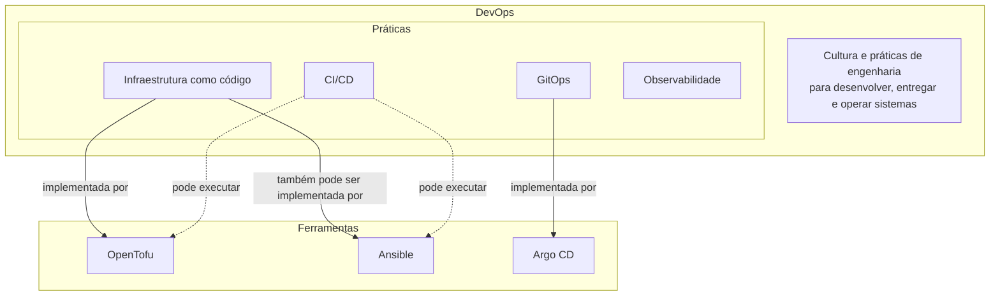
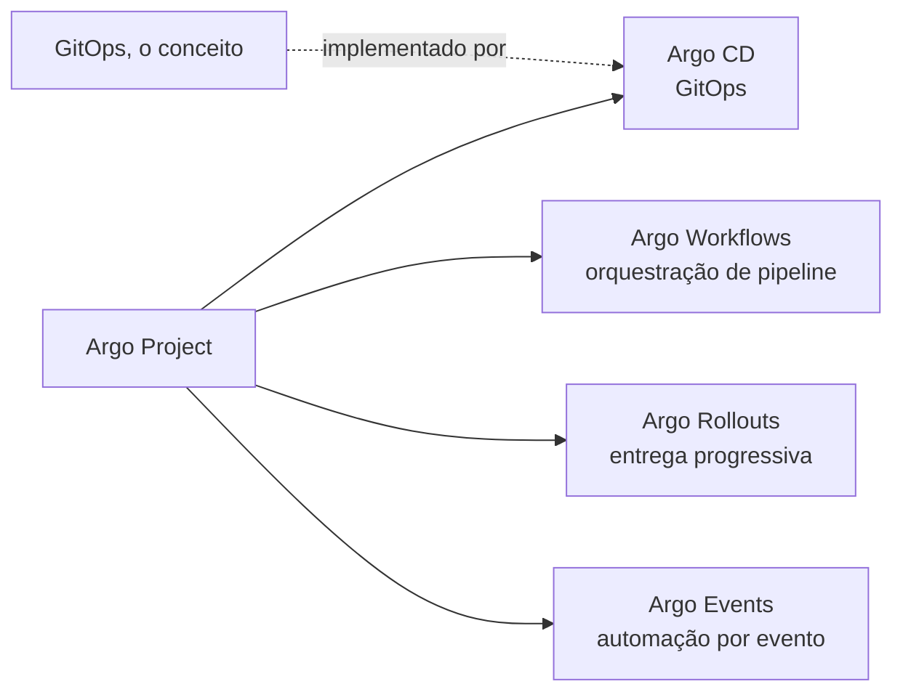

# DevOps, IaC e GitOps: o que é conceito e o que é ferramenta

Uma confusão comum ao ler sobre este tipo de repositório é tratar prática e ferramenta como sinônimos: dizer que "o [Ansible](ansible.md) é DevOps" ou que "o Argo é [GitOps](argocd.md)" mistura dois níveis diferentes de abstração. DevOps é a cultura e o conjunto de práticas de engenharia para desenvolver, entregar e operar sistemas; dentro dele existem práticas mais específicas, como [infraestrutura como código](iac-provisionamento.md), [GitOps](argocd.md), [integração contínua](ci-cd.md) e observabilidade; e cada uma dessas práticas é implementada por uma ou mais ferramentas concretas, que por sua vez não pertencem exclusivamente a uma única prática.

A relação entre infraestrutura como código e suas ferramentas já tem uma página própria, [Infraestrutura como código](iac-provisionamento.md), que separa a família de provisionamento (Terraform, Pulumi, [OpenTofu](../arquitetura/opentofu.md), que criam e destroem recursos) da família de gestão de configuração ([Ansible](ansible.md), Puppet, Chef, que configuram uma máquina que já existe). O ponto que vale reforçar aqui é que essas duas famílias não são práticas concorrentes: uma ferramenta de provisionamento cria a máquina, uma de configuração prepara o que roda dentro dela, e um mesmo projeto pode perfeitamente usar as duas em sequência, uma entregando o resultado para a outra.

## Uma ferramenta pode pertencer a mais de uma prática

[Ansible](ansible.md) é o exemplo mais direto: ele implementa [infraestrutura como código](iac-provisionamento.md) quando o assunto é configuração de máquina, mas o mesmo Ansible também orquestra, via módulo de comando ou de API, chamadas que não têm nada de declarativo, como rodar um comando pontual de manutenção. Chamar Ansible de "a ferramenta de IaC deste projeto" simplificaria demais o que ele faz de fato.

O mesmo cuidado vale para conjuntos de ferramentas publicados sob um nome guarda-chuva. O Argo Project, por exemplo, é uma coleção de projetos distintos mantidos sob o mesmo guarda-chuva CNCF: Argo CD ([GitOps](argocd.md) para [Kubernetes](k3s.md)), Argo Workflows (orquestração de pipelines dentro do cluster), Argo Rollouts (entrega progressiva, canário e blue-green) e Argo Events (automação disparada por evento). [GitOps](argocd.md) é a prática; [ArgoCD](argocd.md) é uma implementação dela. O Argo Project não está contido em GitOps, é o inverso parcial: um dos projetos do Argo implementa [GitOps](argocd.md), os outros três resolvem problemas diferentes que nada têm a ver com sincronizar um cluster a partir de um repositório git.

## O fluxo real neste repositório

Reduzindo isso ao que o hl-infrastructure de fato faz hoje: o [Ansible](ansible.md) parte de um Raspberry Pi que já existe fisicamente e prepara o sistema operacional e o cluster [k3s](k3s.md); a partir do momento em que o [Argo CD](argocd.md) sobe, ele passa a reconciliar continuamente o estado do cluster a partir deste mesmo repositório, sem depender do Ansible rodar de novo para isso. O [OpenTofu](../arquitetura/opentofu.md) também aparece, mas não substitui o Ansible: não há máquina para provisionar, o próprio hardware já existe antes do primeiro commit. Os módulos dele declaram o que vive fora do node e fora do cluster, numa API externa que nem o Ansible nem o Argo CD alcançam: o túnel e o DNS do blog na Cloudflare, o split DNS interno da tailnet do Tailscale, e os realms do Keycloak.

A fronteira ganhou uma terceira peça quando o blog precisou de um túnel e de DNS na Cloudflare, e depois cresceu de novo quando a identidade e o acesso remoto passaram a ser declarados da mesma forma: o [Ansible](ansible.md) cuida do que já existe fisicamente, o [Argo CD](argocd.md) cuida de tudo que roda dentro do cluster a partir do momento em que ele existe, e o [OpenTofu](../arquitetura/opentofu.md) cuida do que vive numa API externa e não pertence a nenhum dos dois. A página [OpenTofu: a camada da Cloudflare](../arquitetura/opentofu.md) explica por que ele declara esses recursos mas nunca vê o token que o cloudflared usa, e lista cada módulo além do da Cloudflare.

## Continue por aqui

[Infraestrutura como código](iac-provisionamento.md) aprofunda a distinção entre provisionamento e gestão de configuração; [Ansible](ansible.md) e [ArgoCD e GitOps](argocd.md) detalham cada ferramenta específica; [CI/CD](ci-cd.md) cobre a terceira prática citada aqui. Na arquitetura, [Ansible: as roles do bootstrap](../arquitetura/ansible.md) e ["GitOps: root e satélites"](../arquitetura/gitops-root-e-satelites.md) mostram como o hl-infrastructure aplica tudo isso na prática.
