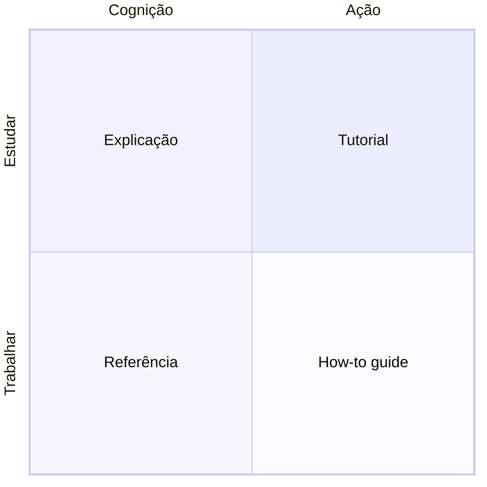

# Diátaxis

Diátaxis é um framework para organizar documentação técnica, criado por Daniele Procida, que parte de uma observação simples: a maior parte da documentação mistura tipos de conteúdo que servem propósitos diferentes, e essa mistura é o que a torna difícil de escrever bem e difícil de navegar. Um exemplo clássico é um tutorial cheio de "se você já tem X, pule para o passo 4" ou "para o caso avançado Y, veja a nota no final": isso é um guia de referência disfarçado de tutorial, e tentar servir aos dois públicos ao mesmo tempo deixa ambos mal atendidos.

O framework separa o conteúdo em duas dimensões, não uma lista de categorias soltas. A primeira dimensão é se o texto serve para *estudar* (aprender algo novo, sem uma tarefa concreta em mente ainda) ou para *trabalhar* (já se sabe o que fazer, falta só o como). A segunda é se o texto lida com *ação* (o que fazer, passo a passo) ou com *cognição* (o que entender, o modelo mental por trás). Cruzando as duas, nascem quatro quadrantes: tutorial (estudar mais ação, uma lição guiada do começo ao fim), how-to guide (trabalhar mais ação, resolver uma tarefa específica), explicação (estudar mais cognição, entender o porquê e o contexto mais amplo) e referência (trabalhar mais cognição, consultar um fato preciso rapidamente).

## Como isso se encaixa na taxonomia deste repositório

As três seções desta documentação, aprender, arquitetura e operacional, não são os quatro quadrantes do Diátaxis original, mas nasceram inspiradas na mesma separação. Aprender ocupa o espaço de explicação e, quando o conceito pede, de tutorial: ensina o que uma ferramenta é, independente deste repositório específico. Arquitetura é explicação pura, focada neste sistema: o porquê de cada decisão, não o passo a passo de executá-la. Operacional é how-to guide: cada página resolve uma tarefa concreta que quem já conhece o repositório precisa fazer, sem reexplicar conceito.

O quadrante que falta de propósito é referência isolada. Este repositório não tem uma seção de referência separada porque o conteúdo que normalmente viraria referência (nomes de variável, valores de configuração, esquema de um recurso) já vive no próprio código, que é a fonte da verdade; duplicá-lo em prosa criaria uma segunda cópia para manter sincronizada. Quando uma página operacional ou de arquitetura precisa apontar para um valor exato, ela linka o arquivo que o declara em vez de repeti-lo.

## Continue por aqui

[Contribuindo](../contribuindo/index.md) explica como essa separação em três partes se aplica na prática, incluindo o teste de "isso deveria ser duas páginas" para conteúdo que mistura como fazer com por que funciona assim.
