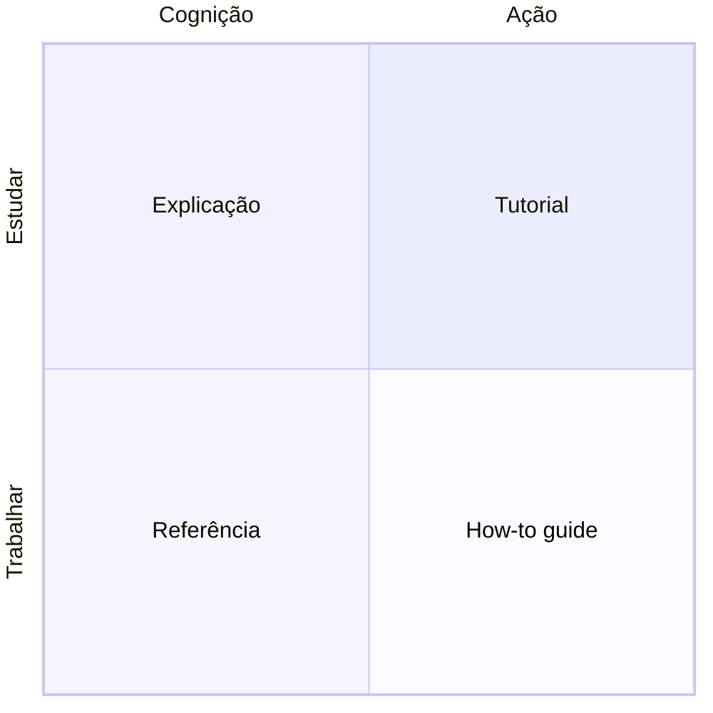

# Diátaxis

Diátaxis é um framework para organizar documentação técnica, criado por Daniele Procida, que parte de uma observação simples: a maior parte da documentação mistura tipos de conteúdo que servem propósitos diferentes, e essa mistura é o que a torna difícil de escrever bem e difícil de navegar. Um exemplo clássico é um tutorial cheio de "se você já tem X, pule para o passo adiante" ou "para o caso avançado Y, veja a nota no final": isso é um guia de referência disfarçado de tutorial, e tentar servir ambos os públicos ao mesmo tempo deixa quem estuda e quem trabalha mal atendidos. O desvio acontece por boa intenção, porque cada ressalva foi acrescentada por alguém que tropeçou nela. O custo só aparece depois, quando ninguém mais consegue seguir a página do começo ao fim sem decidir, a cada passo, se aquele passo é para si.

O framework separa o conteúdo em dimensões, não uma lista de categorias soltas. Uma dimensão é se o texto serve para *estudar* (aprender algo novo, sem uma tarefa concreta em mente ainda) ou para *trabalhar* (já se sabe o que fazer, falta só o como). A outra é se o texto lida com *ação* (o que fazer, passo a passo) ou com *cognição* (o que entender, o modelo mental por trás). Cruzando essas dimensões, nascem os quadrantes: tutorial (estudar mais ação, uma lição guiada do começo ao fim), how-to guide (trabalhar mais ação, resolver uma tarefa específica), explicação (estudar mais cognição, entender o porquê e o contexto mais amplo) e referência (trabalhar mais cognição, consultar um fato preciso rapidamente).

## Como isso se encaixa na taxonomia deste repositório

As seções desta documentação, aprender, [arquitetura](../arquitetura/index.md), [operacional](../operacional/index.md) e [referência](../referencia/index.md), não são os quadrantes do Diátaxis original, mas nasceram inspiradas na mesma separação. Aprender ocupa o espaço de explicação e, quando o conceito pede, de tutorial: ensina o que uma ferramenta é, independente deste repositório específico. Arquitetura é explicação pura, focada neste sistema: o porquê de cada decisão, não o passo a passo de executá-la. Operacional é how-to guide: cada página resolve uma tarefa concreta que quem já conhece o repositório precisa fazer, sem reexplicar conceito.

Referência é o quadrante mais estreito propositalmente: cobre sintaxe de comando de ferramentas genéricas (git, tmux, systemd, kubectl) e catálogos externos (blogs, certificações, eventos), conhecimento que não muda com um commit deste repositório. Nomes de variável, valores de configuração e o esquema de um recurso deste repositório especificamente não entram nessa seção, porque já vivem no próprio código, que é a fonte da verdade; duplicá-los em prosa criaria uma segunda cópia para manter sincronizada, e uma cópia desatualizada é pior do que a ausência dela, porque continua parecendo confiável. Quando uma página operacional ou de arquitetura precisa apontar para um valor exato deste repositório, ela linka o arquivo que o declara em vez de repeti-lo; a regra geral por trás dessa escolha é ter sempre uma única fonte canônica para qualquer comando ou valor, e fazer todo o resto apontar para ela em vez de repeti-la, o mesmo princípio que evita duas páginas divergirem silenciosamente sobre a mesma informação com o tempo.

## Continue por aqui

[Contribuindo](../contribuindo/index.md) explica como essa separação se aplica na prática, incluindo o teste de "isso deveria virar páginas separadas" para conteúdo que mistura como fazer com por que funciona assim.
