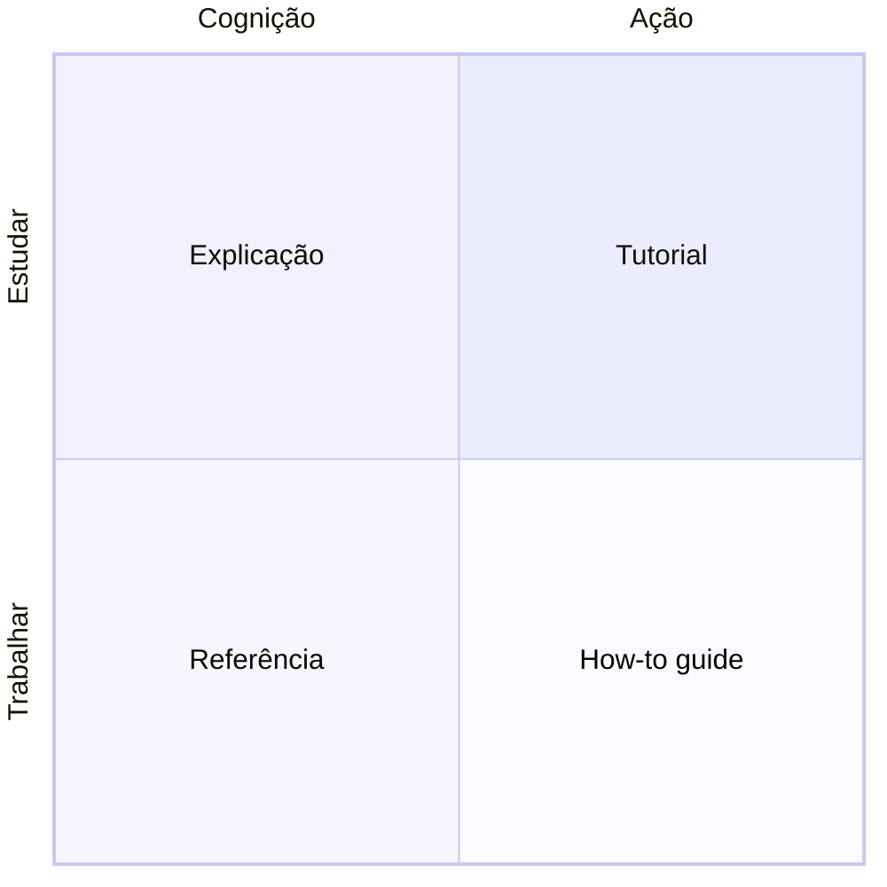

# Diátaxis

Diátaxis é um framework para organizar documentação técnica, criado por Daniele Procida, que parte de uma observação simples: a maior parte da documentação mistura tipos de conteúdo que servem propósitos diferentes, e essa mistura é o que a torna difícil de escrever bem e difícil de navegar. Um exemplo clássico é um tutorial cheio de "se você já tem X, pule para o passo adiante" ou "para o caso avançado Y, veja a nota no final": isso é um guia de referência disfarçado de tutorial, e tentar servir ambos os públicos ao mesmo tempo deixa quem estuda e quem trabalha mal atendidos. O desvio acontece por boa intenção, porque cada ressalva foi acrescentada por alguém que tropeçou nela. O custo só aparece depois, quando ninguém mais consegue seguir a página do começo ao fim sem decidir, a cada passo, se aquele passo é para si.

O framework separa o conteúdo em dimensões, não uma lista de categorias soltas. Uma dimensão é se o texto serve para *estudar* (aprender algo novo, sem uma tarefa concreta em mente ainda) ou para *trabalhar* (já se sabe o que fazer, falta só o como). A outra é se o texto lida com *ação* (o que fazer, passo a passo) ou com *cognição* (o que entender, o modelo mental por trás). Cruzando essas dimensões, nascem os quadrantes: tutorial (estudar mais ação, uma lição guiada do começo ao fim), how-to guide (trabalhar mais ação, resolver uma tarefa específica), explicação (estudar mais cognição, entender o porquê e o contexto mais amplo) e referência (trabalhar mais cognição, consultar um fato preciso rapidamente).

## Continue por aqui

[Categorização e organização](../contribuindo/categorizacao-e-organizacao.md) explica como este repositório adapta essa separação nas suas próprias seções, incluindo onde e por que diverge do framework original.
