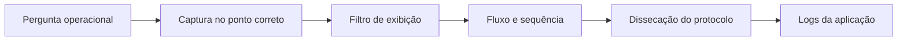

# Wireshark

Wireshark é um analisador de protocolos que captura ou abre tráfego em formato
pcap e apresenta os pacotes por camadas. Ele é útil para confirmar o que de fato
atravessou uma interface, mas não enxerga pacotes que foram descartados antes
da captura, criptografia que não pode decifrar ou caminhos diferentes do ponto
onde o arquivo foi coletado.

## Captura e dissecação

A captura copia frames de uma interface ou lê um arquivo produzido por tcpdump,
dumpcap e outras ferramentas. A dissecação interpreta Ethernet, VLAN, IP, TCP,
TLS, HTTP, DNS e centenas de outros protocolos. Uma interpretação colorida ou
um campo decodificado não é prova de que a aplicação aceitou o conteúdo; é uma
hipótese baseada nos bytes e no contexto conhecido.

Filtros de captura limitam o que é gravado e usam a sintaxe do libpcap. Filtros
de exibição selecionam pacotes já capturados e usam a linguagem própria do
Wireshark. Confundir os dois pode remover evidência antes da análise ou produzir
um resultado que parece capturar, mas apenas filtra a tela.

## Fluxo de investigação

Comece com uma pergunta observável: houve DNS, SYN, resposta, retransmissão,
reset ou handshake TLS? Capture nos pontos necessários, sincronize relógios e
registre interface, VLAN, modo promíscuo, direção e filtros. Depois siga uma
conversa com `Follow TCP Stream`, estatísticas e análise de sequência.

Um arquivo pode conter dados pessoais, tokens, payloads e material de
autenticação. Restrinja permissões, cifre o armazenamento, reduza a duração e
destrua a captura quando a investigação terminar. Não envie um pcap completo a
um terceiro quando um recorte sanitizado responde à pergunta.

## Limites

Em switches, uma captura local normalmente vê somente o tráfego da interface;
é necessário port mirroring, TAP ou captura no endpoint. Offloads de checksum,
segmentation e coalescing podem fazer a captura parecer diferente do que saiu
fisicamente no fio. Ajuste ou registre offloads antes de concluir que há um
checksum inválido ou uma retransmissão impossível.

TLS protege o conteúdo contra observadores sem as chaves e contexto necessários.
Mesmo assim, é possível observar endereços, tamanhos, timing, SNI em versões e
partes do handshake, resets e falhas de negociação. Não trate a ausência de
payload legível como ausência de evidência.

## Relações

- [tcpdump](tcpdump.md) oferece captura CLI simples e reproduzível.
- [Termshark](termshark.md) usa uma interface terminal para análise de capturas.
- [Wireshark display filters](https://www.wireshark.org/docs/man-pages/wireshark-filter.html) explica a linguagem de filtros.

## Fontes primárias

- [Wireshark User's Guide](https://www.wireshark.org/docs/wsug_html/)
- [Wireshark Wiki](https://wiki.wireshark.org/)
- [libpcap filter syntax](https://www.tcpdump.org/manpages/pcap-filter.7.html)
