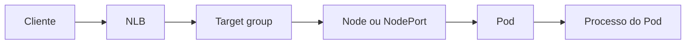

# Service

Service fornece um endpoint lógico para um conjunto de Pods. Ele desacopla o
cliente dos IPs efêmeros dos Pods e permite que o Kubernetes mantenha a
associação entre selector, Endpoints ou EndpointSlices e o modo de exposição
escolhido.

## Seleção e descoberta

Um Service com selector observa labels e cria objetos de endpoints para os
Pods correspondentes. Readiness influencia quais endpoints recebem tráfego.
Um Service sem selector pode representar um destino externo ou uma associação
gerenciada de outra forma, mas perde a descoberta automática por labels.

DNS interno resolve o nome do Service para um endereço estável. O DNS não
prova que há Pods prontos e não substitui timeout, retry ou circuit breaking
no cliente.

## Tipos de exposição

`ClusterIP` expõe dentro do cluster. `NodePort` abre uma porta em cada nó
elegível. `LoadBalancer` pede integração com um provedor de balanceamento.
`ExternalName` publica um alias DNS e não cria proxy ou healthcheck local.
Gateway API e Ingress tratam HTTP e outros protocolos na borda, acima do
endpoint lógico do Service.

## Service LoadBalancer no Amazon EKS

`type: LoadBalancer` é uma abstração do Kubernetes, não o nome de um produto
específico da AWS. Um controller observa o Service e cria ou configura um
load balancer, target group, listeners, health checks e registros de targets.
No EKS, esse trabalho pode ser feito pelo AWS Load Balancer Controller, pelo
controller integrado ao modo usado pelo cluster ou pelo EKS Auto Mode. As
annotations aceitas e o responsável pela reconciliação precisam ser
confirmados para a versão instalada; uma annotation documentada para o AWS
Load Balancer Controller não deve ser copiada cegamente para outro controller.

Para um Service L4 atendido por um Network Load Balancer, o caminho de dados
mais comum é:



O target group pode registrar instâncias ou endereços IP. Em `instance` mode,
o NLB normalmente encaminha para um NodePort e o tráfego ainda passa pelo
caminho de serviço do nó. Em `ip` mode, o controller registra os endereços
dos Pods diretamente, desde que o CNI e a rede da VPC permitam esse caminho.
Escolher `ip` não transforma o Service em um load balancer HTTP: o NLB ainda
opera no nível de conexão.

## PROXY protocol no Service

O PROXY protocol v2 é uma decisão do target group do NLB. Quando habilitado,
o NLB coloca o cabeçalho antes dos bytes TCP que envia ao target. O Pod, o
sidecar ou o proxy que recebe a conexão precisa consumi-lo antes de tentar
interpretar TLS, HTTP, gRPC ou qualquer outro protocolo. O Kubernetes não
remove esse cabeçalho e o processo da aplicação não passa a entendê-lo apenas
porque o Service possui uma annotation.

No AWS Load Balancer Controller, a annotation abaixo habilita PROXY protocol
v2 nos target groups do Service:

```yaml
metadata:
  annotations:
    service.beta.kubernetes.io/aws-load-balancer-type: "external"
    service.beta.kubernetes.io/aws-load-balancer-nlb-target-type: "ip"
    service.beta.kubernetes.io/aws-load-balancer-proxy-protocol: "*"
```

Também existe a configuração de atributos do target group:

```yaml
metadata:
  annotations:
    service.beta.kubernetes.io/aws-load-balancer-target-group-attributes: >-
      proxy_protocol_v2.enabled=true
```

Não se deve definir as duas formas sem conferir a precedência da versão do
controller. Na documentação atual do AWS Load Balancer Controller, a
annotation `aws-load-balancer-proxy-protocol` tem precedência sobre o atributo
genérico para esse ajuste. Uma configuração port-specific pode ser necessária
quando somente algumas portas do Service recebem o cabeçalho.

O efeito é incompatível com um backend que espera o primeiro byte do TLS ou a
primeira linha HTTP sem preâmbulo. Ative o emissor e o receptor na mesma
mudança, ou use uma porta de migração. Uma rota que contorna o NLB também não
pode ser aceita pelo mesmo listener como se fosse confiável, pois permitiria
que qualquer cliente inventasse um endereço de origem.

## IP de origem e `externalTrafficPolicy`

`externalTrafficPolicy: Local` tenta manter a origem observada no caminho do
Service e evita encaminhar a conexão para um nó que não possui endpoint local.
Isso pode preservar o IP sem PROXY protocol em alguns caminhos, mas reduz a
distribuição quando os Pods estão concentrados em poucos nós e altera a
semântica dos health checks. `Cluster` distribui endpoints entre nós com mais
liberdade, mas pode ocultar a origem por SNAT ou por outra etapa do caminho.

PROXY protocol e `externalTrafficPolicy` resolvem problemas diferentes. O
primeiro transporta metadados da conexão entre um proxy e seu target. O segundo
altera como o Service encaminha tráfego entre nós. Não ative os dois por hábito:
defina qual componente precisa do IP, qual componente lê o cabeçalho e como o
health check alcança um endpoint pronto.

## Health checks

O NLB verifica o target group, enquanto o Kubernetes verifica a prontidão do
Pod. São filtros diferentes. Um Pod pode estar pronto para o Kubernetes e
falhar no health check do NLB, ou o NLB pode considerar a porta aberta enquanto
a aplicação não atende uma rota de negócio.

Se PROXY protocol v2 estiver habilitado, o health check HTTP ou HTTPS precisa
ser compatível com esse contrato no caminho configurado pelo controller. Caso
contrário, todos os targets podem parecer não saudáveis mesmo que a aplicação
responda corretamente a uma conexão comum. Um health check TCP verifica menos
semântica, mas pode esconder falha de HTTP, TLS ou dependência. O contrato deve
registrar protocolo, porta, caminho, headers, origem permitida e se o check
recebe ou não PROXY protocol.

## Quando usar Ingress ou Gateway API

Um Service `LoadBalancer` é adequado quando o workload precisa de um endpoint
L4 próprio, como TCP, TLS pass-through ou UDP. Para HTTP e HTTPS com regras por
host, path, redirect, autenticação na borda ou roteamento por headers, use um
Ingress ou Gateway API com o controller correspondente. No EKS, o AWS Load
Balancer Controller pode criar um ALB para um Ingress. Nesse caminho o ALB
normalmente encaminha HTTP e usa headers como `X-Forwarded-For`; isso não é a
mesma coisa que inserir PROXY protocol v2 antes do HTTP.

Colocar um NLB na frente de um ingress controller também é válido quando o
controller interno precisa receber TCP, TLS pass-through ou PROXY protocol.
Nesse caso, o ingress controller precisa estar configurado para ler o
preâmbulo, e somente o NLB deve alcançar a porta de entrada dos Pods.

## Relações

- [Pod](pod.md) fornece os endpoints potenciais.
- [Ingress](../networking/ingress.md) e [Gateway API](../../gateway-api.md)
  publicam rotas para Services.
- [NetworkPolicy](../networking/network-policy.md) controla conectividade,
  não seleção de endpoints.
- [Amazon EKS](../../plataforma/cloud/aws/eks.md) relaciona Service, Ingress,
  NLB, ALB e o AWS Load Balancer Controller.
- [PROXY protocol](../../rede/proxy/proxy-protocol.md) explica o contrato do
  cabeçalho e os riscos de confiança.

## Fonte primária

- [Service](https://kubernetes.io/docs/concepts/services-networking/service/)
