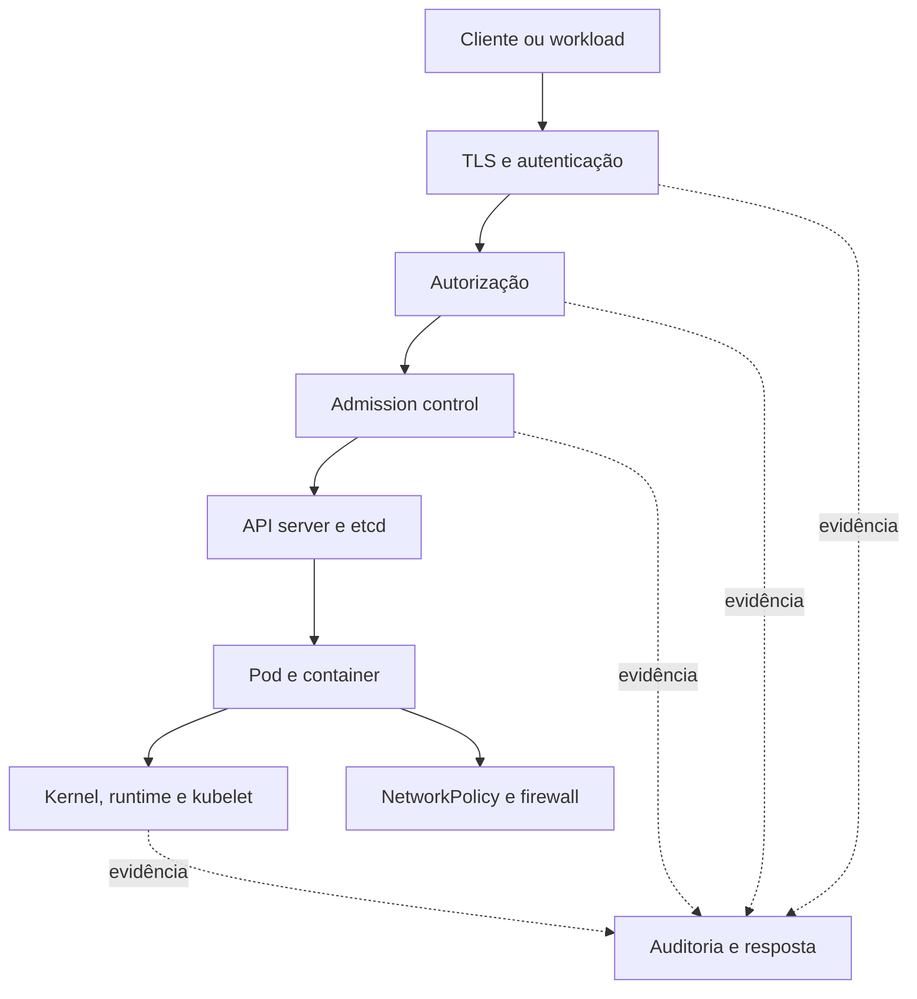

# Segurança de um cluster Kubernetes

A segurança de um cluster Kubernetes não é uma propriedade de um único
manifesto ou de um único componente. Ela resulta da combinação entre
identidade, autorização, admissão, isolamento de workloads, proteção do
control plane, segurança do nó, proteção dos dados e operação contínua.

O modelo de ameaça também é maior que o de uma aplicação. É preciso proteger
o API server contra clientes não autorizados, impedir que um workload alcance
o nó ou outro Namespace indevidamente, proteger o etcd contra leitura e
escrita arbitrárias, reduzir o raio de dano de credenciais e manter evidências
que permitam investigar uma ação depois que ela aconteceu.

Esta seção adapta e organiza a orientação da documentação oficial de
[segurança de um cluster Kubernetes](https://kubernetes.io/docs/tasks/administer-cluster/securing-a-cluster/)
em páginas canônicas. Ela não substitui a documentação da versão instalada,
do distribuidor do Kubernetes, do runtime de containers ou do provedor de
cloud.

## Modelo de defesa em profundidade

Uma requisição que altera um objeto normalmente atravessa várias fronteiras.
O transporte precisa ser protegido por TLS. A identidade precisa ser
autenticada. A autorização decide se essa identidade pode executar aquele
verbo sobre aquele recurso. Admission control pode rejeitar ou alterar o
objeto antes da persistência. Depois disso, políticas do workload, do nó, da
rede e do runtime limitam o que o processo realmente consegue fazer.

Essas camadas não são intercambiáveis. RBAC não restringe syscalls, uma
NetworkPolicy não impede uma identidade autorizada de apagar um Secret, e um
SecurityContext não protege um API server exposto com autenticação fraca.
Cada controle deve ser avaliado pelo tipo de ameaça que cobre e pelo tipo de
falha que não cobre.

## Fronteiras que precisam ser tratadas

### API server

O API server é a fronteira administrativa principal. Todo cliente precisa
ser autenticado, inclusive kubelets, schedulers, controllers, proxies,
plugins de volume e componentes de integração. Depois da autenticação, a
requisição ainda precisa passar por autorização e admissão.

TLS deve proteger o tráfego da API e os endpoints HTTP locais que não forem
necessários devem permanecer desabilitados. A existência de um endpoint sem
TLS em loopback ou em uma interface acessível pelo nó pode transformar uma
restrição de rede em uma falsa sensação de segurança.

### Kubelet e nós

O endpoint HTTPS do Kubelet oferece operações de diagnóstico e execução que
podem ter impacto equivalente ao acesso privilegiado ao nó. Em produção, a
autenticação e a autorização do Kubelet precisam estar habilitadas, o acesso
deve ser filtrado por rede e a porta somente leitura deve permanecer
desabilitada.

O nó também é uma fronteira de confiança. Um Pod privilegiado, um container
com acesso ao filesystem do host ou um processo capaz de carregar módulos do
kernel pode sair do modelo de isolamento esperado. Por isso, a segurança do
workload não pode ser analisada sem considerar runtime, kernel, permissões do
processo e colocação do Pod.

### etcd e dados persistidos

Quem consegue ler ou escrever livremente no etcd pode ler ou modificar o
estado do cluster, inclusive credenciais e Secrets armazenados pela API.
O acesso deve ser restrito aos API servers, protegido por autenticação mútua
e filtrado por firewall. Backups do etcd, do storage e das chaves de
criptografia têm de receber proteção equivalente à do banco original.

### Workloads e dependências externas

Um workload pode ser comprometido sem que o control plane esteja comprometido.
Nesse caso, RBAC mínimo, tokens não montados por padrão, NetworkPolicy,
SecurityContext, seccomp, limites de recursos e isolamento de nó reduzem o
raio de dano. O mesmo raciocínio vale para controllers e webhooks de terceiros:
um componente que consegue criar Pods ou ler todos os Secrets pode escalar seu
privilégio de forma indireta.

## Pré-requisitos para uma revisão

Antes de revisar a configuração, identifique a distribuição e a versão do
Kubernetes, o container runtime, o CNI, o provedor de cloud, o datastore, os
componentes de admission e os pontos de entrada publicados. A análise deve
considerar pelo menos:

- os endpoints públicos e privados do API server;
- os certificados, tokens, ServiceAccounts e identidades externas;
- as Roles, ClusterRoles e bindings realmente usadas;
- os Pods privilegiados e os Namespaces com exceções de segurança;
- o acesso dos Pods a rede, DNS, metadados de cloud e volumes;
- o acesso do Kubelet, runtime e sistema operacional;
- os registros de auditoria e o procedimento de retenção;
- os backups, chaves de criptografia e o teste de restauração;
- os mecanismos de atualização e divulgação de vulnerabilidades.

A recomendação de testar em um cluster com pelo menos dois nós de workload é
útil para separar controles de scheduling, isolamento e disponibilidade. Um
cluster de nó único ainda deve aplicar as mesmas fronteiras, mas algumas
propriedades, como isolamento físico de workloads, não poderão ser obtidas.

## Critério de revisão

Uma revisão madura não pergunta apenas se o manifesto foi aceito. Ela pergunta
qual identidade pode executar cada ação, qual dado essa identidade alcança,
qual componente pode alterar o objeto, qual rede é necessária, qual falha
acontece quando uma dependência está indisponível e como a ação será
investigada depois.

O objetivo é reduzir privilégios sem bloquear a operação legítima. Quando uma
exceção for necessária, ela deve ser pequena, nomeada, observável e revisada
periodicamente. Exceções amplas em `kube-system`, `default`, ServiceAccounts
compartilhadas ou ClusterRoleBindings genéricas tendem a aumentar o blast
radius sem deixar claro quem realmente precisa daquele acesso.

## Páginas desta categoria

- [Acesso ao API server](api-access.md) explica TLS, autenticação,
  autorização e escalada indireta por recursos.
- [Acesso ao Kubelet](kubelet-access.md) trata autenticação, autorização,
  endpoints e isolamento de rede do agente de nó.
- [Controles de workloads](workload-controls.md) reúne quotas, LimitRange,
  SecurityContext, tokens e Pod Security.
- [Isolamento de nós e rede](node-isolation.md) trata posicionamento,
  NetworkPolicy, módulos do kernel e fronteiras do host.
- [Metadados de cloud](cloud-metadata.md) explica por que APIs de metadados
  precisam ser tratadas como credenciais.
- [Segurança do etcd](etcd-security.md) cobre transporte, autenticação,
  firewall, backup e privilégio do datastore.
- [Auditoria](audit.md) explica como registrar, proteger e consultar eventos.
- [Criptografia em repouso](encryption-at-rest.md) trata Secrets, ConfigMaps,
  objetos da API e chaves de criptografia.
- [Integrações de terceiros](third-party-integrations.md) define como revisar
  controllers, webhooks, operadores e componentes que criam Pods.
- [Credenciais e atualização](credentials-and-updates.md) trata rotação,
  credenciais de bootstrap, feature gates e resposta a vulnerabilidades.

## Fontes primárias

- [Securing a Cluster](https://kubernetes.io/docs/tasks/administer-cluster/securing-a-cluster/)
- [Security checklist](https://kubernetes.io/docs/concepts/security/security-checklist/)
- [Kubernetes security](https://kubernetes.io/docs/reference/issues-security/security/)
