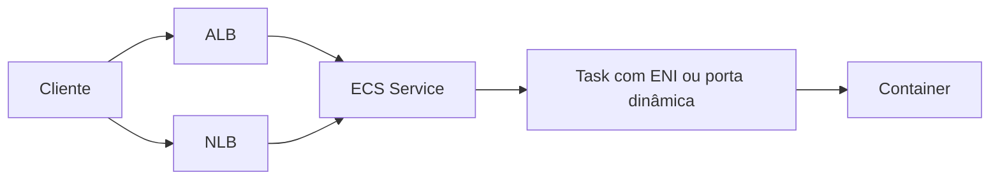
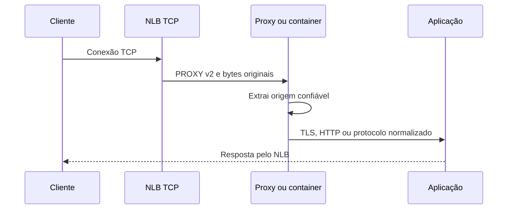

# Amazon ECS

Amazon Elastic Container Service, ECS, é um orquestrador de containers da AWS.
Uma task é uma execução de uma task definition; um service mantém o número
desejado de tasks e pode registrá-las em target groups do Elastic Load
Balancing. ECS não é Kubernetes e não possui `Service`, `Ingress` ou
`externalTrafficPolicy`. O vínculo entre uma aplicação e a borda é configurado
diretamente no serviço ECS, na task definition e nos recursos do load balancer.

## Modelo de rede

Em `awsvpc`, cada task recebe uma interface de rede elástica e endereços próprios
na VPC. Por isso, quando um service ECS usa ALB ou NLB, o target group deve
registrar targets do tipo `ip`, não instâncias. O security group da interface da
task deve aceitar somente os listeners ou security groups necessários.

Em tasks com outros modos de rede, o target pode ser uma instância e uma porta
dinâmica, conforme o launch type e a configuração do service. O target type não
é uma propriedade que se troca de forma casual depois de criar o target group:
ele define como o balanceador encontra o processo e como o ECS registra e remove
targets durante deployments.

## ALB e NLB

Escolha ALB quando a entrada é HTTP ou HTTPS e a aplicação precisa de roteamento
por host, path, headers, redirects, HTTP/2 ou gRPC. Escolha NLB quando a entrada
é TCP, TLS pass-through, UDP ou outro protocolo que não deve ser interpretado na
camada HTTP.



Um service ECS pode usar o load balancer para registrar e desregistrar tasks à
medida que elas entram e saem. Health checks e deregistration delay determinam
se uma task nova recebe tráfego e quanto tempo uma task antiga permanece drenando
conexões. Se uma task falha no health check, o ECS pode interrompê-la e iniciar
outra, criando um ciclo de substituição quando o endpoint ou o contrato da porta
está incorreto.

## PROXY protocol no NLB

O PROXY protocol v2 é configurado no target group do NLB, não na task definition
do ECS. O NLB coloca um cabeçalho binário antes do fluxo TCP enviado ao target.
O container, ou um proxy dentro da task, precisa estar configurado para consumir
esse cabeçalho antes de ler TLS, HTTP, gRPC ou o protocolo próprio da aplicação.
O ECS registra o target, mas não interpreta os bytes da conexão.

O atributo pode ser aplicado pela AWS CLI:

```bash
aws elbv2 modify-target-group-attributes \
  --target-group-arn "$TARGET_GROUP_ARN" \
  --attributes Key=proxy_protocol_v2.enabled,Value=true
```

Em CloudFormation, o mesmo contrato é representado em
`TargetGroupAttributes`:

```yaml
TargetGroupAttributes:
  - Key: proxy_protocol_v2.enabled
    Value: "true"
```

O primeiro byte esperado pelo processo muda quando o atributo é habilitado. Se
o container espera `ClientHello`, uma linha HTTP ou um protocolo binário próprio
sem preâmbulo, a conexão falha. A alteração precisa ser coordenada com a imagem
que recebe a porta, os health checks e qualquer outro target group que possa
alcançar o mesmo processo.

Um NLB com listener TCP é o caminho mais direto para preservar TLS pass-through:



Se o NLB terminar TLS, o backend não recebe o mesmo handshake do cliente. Isso
altera onde mTLS, SNI, certificados e revogação são aplicados. Não escolha
listener TLS apenas porque o nome parece mais seguro: compare a fronteira de
terminação com a responsabilidade que a task deve assumir.

## ALB não é PROXY protocol

No caminho ALB para ECS HTTP, o ALB decodifica a requisição e encaminha HTTP ou
HTTPS ao target. O mecanismo normal para origem e contexto são headers escritos
pelo ALB, como `X-Forwarded-For`, e não um preâmbulo PROXY v2 antes da requisição.
O container deve confiar nesses headers somente quando o security group impedir
que um cliente alcance diretamente a porta da task e injete valores próprios.

Também é necessário remover ou substituir os headers de forwarding vindos do
cliente na borda. Caso contrário, a aplicação pode registrar ou autorizar com
uma cadeia de proxies forjada. A origem de rede do ALB, a configuração do target
group e a política da aplicação formam um único contrato.

## Tasks Fargate e tasks EC2

Fargate usa a rede da task e exige target IP para workloads em `awsvpc`. Em ECS
sobre EC2, `awsvpc` também associa a task a uma ENI e conserva essa exigência.
Outros modos podem encaminhar para a instância e para uma porta dinâmica, mas
isso cria um salto adicional e muda a origem observada pelo processo.

Não misture as duas hipóteses ao interpretar logs. Um endereço de instância pode
ser o target do load balancer, enquanto a aplicação está em uma porta dinâmica
de um container. Em `awsvpc`, o endereço do target é o da ENI da task. Em ambos
os casos, a aplicação deve identificar a origem segundo o contrato do listener,
e não inferir a topologia a partir de um único IP.

## Health checks e deployments

O health check do target group responde à pergunta do load balancer: este target
aceita a conexão e devolve uma resposta conforme o protocolo configurado? O
service ECS também acompanha estado da task, status da aplicação e capacidade
desejada. Um processo que escuta a porta, mas não consegue atender a operação
real, pode passar em um check TCP e falhar logo depois.

Quando PROXY protocol está habilitado, o listener da task e o health check
precisam seguir a mesma decisão de protocolo. Teste se o health checker envia o
preâmbulo esperado para a combinação específica de listener e target group. O
NLB pode acrescentar o header ao tráfego TCP, e um backend que não o consome
pode parecer indisponível durante todo o deployment.

Durante a substituição de tasks, configure `deregistration_delay` para que
conexões em andamento terminem sem manter targets defeituosos por tempo
excessivo. Em aplicações com conexões longas, avalie explicitamente como
WebSocket, streaming, gRPC e keep-alive reagem à drenagem. Blue/green exige
target groups separados e uma política clara para mover tráfego e retornar ao
grupo anterior.

## IAM e registro de targets

Um service ECS que usa Elastic Load Balancing precisa da service-linked role
correspondente para registrar e desregistrar targets. A task role e a execution
role possuem funções diferentes: uma autoriza a aplicação, outra permite que o
runtime obtenha imagem, logs e secrets. Nenhuma delas deve ser usada como
substituta da permissão do ECS para administrar o load balancer.

Restringir o security group da task ao security group do ALB ou NLB reduz rotas
de bypass. Para NLB, confirme também o comportamento de preservação de IP e
se a rede de retorno está correta. Para ALB, restrinja os headers de forwarding
à origem esperada. PROXY protocol não é autenticação: ele só é confiável depois
que a rede impede uma origem não autorizada de abrir a mesma porta.

## Diagnóstico

Ao depurar ECS atrás de um load balancer, separe os seguintes pontos:

1. task em execução e ENI ou porta registrados;
2. target group com protocolo, target type e porta corretos;
3. health check alcançando o listener da aplicação;
4. security groups permitindo tráfego de ida e volta;
5. listener entregando o protocolo esperado;
6. parser do container aceitando ou não PROXY v2;
7. aplicação diferenciando erro do balanceador de erro do próprio processo.

Um erro imediato no handshake geralmente indica que o listener, o target group e
o processo discordam sobre TLS ou PROXY protocol. Um target que alterna entre
`healthy` e `unhealthy` pode indicar timeout, porta dinâmica incorreta, regra de
security group ou um health check incompatível com o preâmbulo. Logs do ECS,
estado do target group, métricas do NLB ou ALB e logs do container precisam ser
correlacionados pelo horário e pelo identificador da task.

## Relações

- [Amazon EKS](eks.md) mostra como Service e Ingress formam o caminho equivalente no Kubernetes.
- [Balanceadores AWS](load-balancing.md) compara ALB, NLB e GWLB.
- [PROXY protocol](../../../rede/proxy/proxy-protocol.md) explica versões, parsing e confiança.
- [Amazon Web Services](index.md) apresenta regiões, VPC, IAM e responsabilidade compartilhada.

## Fontes primárias

- [Amazon ECS](https://docs.aws.amazon.com/AmazonECS/latest/developerguide/Welcome.html)
- [Usar NLB com Amazon ECS](https://docs.aws.amazon.com/AmazonECS/latest/developerguide/nlb.html)
- [Balanceamento de carga em services ECS](https://docs.aws.amazon.com/AmazonECS/latest/developerguide/service-load-balancing.html)
- [Rede `awsvpc` de tasks ECS](https://docs.aws.amazon.com/AmazonECS/latest/developerguide/task-networking-awsvpc.html)
- [Atributos de target group do NLB](https://docs.aws.amazon.com/elasticloadbalancing/latest/network/edit-target-group-attributes.html)
