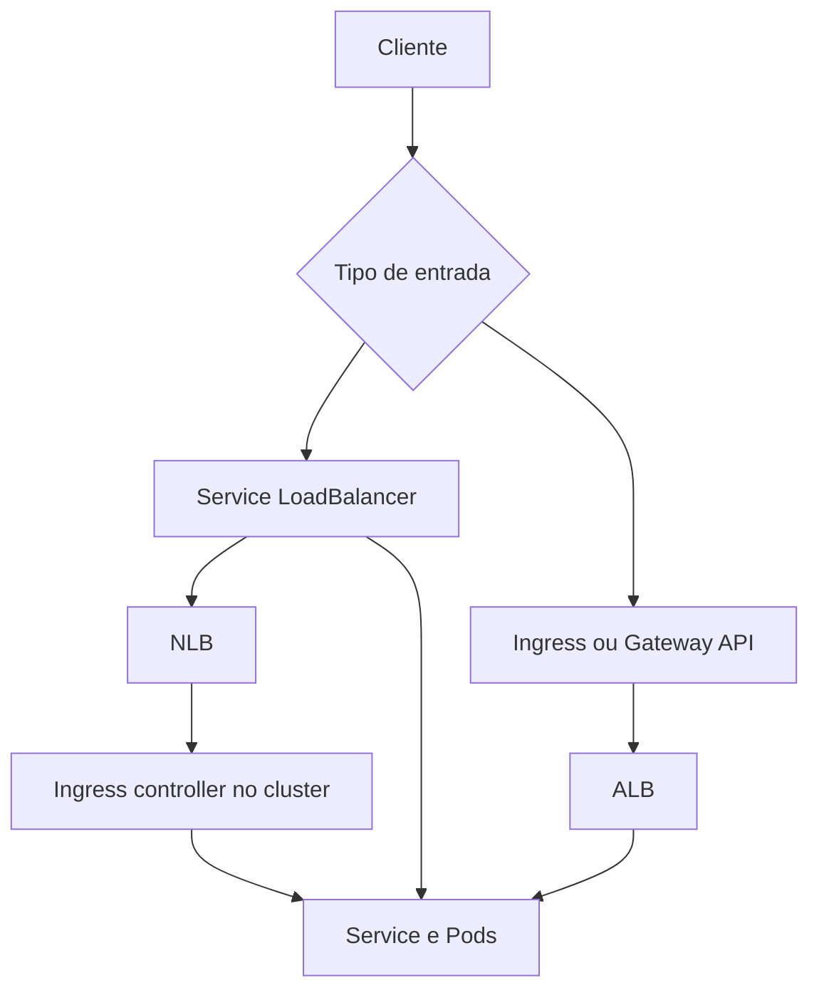

# Amazon EKS

Amazon Elastic Kubernetes Service, EKS, é um serviço gerenciado para executar
clusters Kubernetes na AWS. O serviço reduz a operação direta de parte do
control plane, mas não elimina as decisões sobre nós, identidade, CNI, Services,
Ingress, armazenamento, observabilidade, políticas de rede ou segurança do
workload.

## O que o EKS gerencia

O plano de controle do EKS inclui a API do Kubernetes, componentes de controle e
o datastore operado pela AWS dentro do contrato do serviço. A equipe continua
responsável por declarar objetos, escolher a versão suportada, atualizar addons,
gerenciar nodes ou Fargate, configurar acesso à API, proteger workloads e testar
recuperação.

O EKS não transforma qualquer objeto Kubernetes em recurso AWS. Um `Service` só
cria um load balancer quando existe um controller que observa esse tipo de objeto.
Um `Ingress` também precisa de um controller. O `IngressClass`, a versão do
AWS Load Balancer Controller, o modo do cluster e, em alguns casos, o EKS Auto
Mode determinam qual implementação reconcilia o recurso.

## Caminhos de entrada

Há três desenhos comuns para publicar um workload:



O primeiro caminho é uma exposição L4 normalmente atendida por NLB. O segundo é
uma exposição L7 atendida por ALB, com regras HTTP e HTTPS. O terceiro combina
NLB com um ingress controller, o que permite que Nginx, Envoy ou HAProxy termine
TLS e faça roteamento dentro do cluster. Os caminhos podem coexistir, mas cada
porta deve ter um contrato único para TLS, PROXY protocol e origem confiável.

## Service e NLB

Um `Service` com `type: LoadBalancer` expressa a intenção de expor a porta. O
AWS Load Balancer Controller cria listeners, target groups, health checks e
registros de target a partir do Service. As annotations são configuração do
controller, não uma API universal do Kubernetes.

Um exemplo de Service L4 que usa targets IP e PROXY protocol v2 é:

```yaml
apiVersion: v1
kind: Service
metadata:
  name: tls-gateway
  namespace: edge
  annotations:
    service.beta.kubernetes.io/aws-load-balancer-type: "external"
    service.beta.kubernetes.io/aws-load-balancer-scheme: "internet-facing"
    service.beta.kubernetes.io/aws-load-balancer-nlb-target-type: "ip"
    service.beta.kubernetes.io/aws-load-balancer-proxy-protocol: "*"
spec:
  type: LoadBalancer
  selector:
    app: tls-gateway
  ports:
    - name: tls
      port: 443
      targetPort: tls
      protocol: TCP
```

O processo que recebe a porta `tls` precisa ler PROXY v2 antes do ClientHello.
Se o processo não suporta o protocolo, coloque um proxy compatível no target ou
remova a annotation. Não habilite o atributo no NLB esperando que o kube-proxy,
o CNI ou o runtime de containers retirem o cabeçalho.

Em `instance` mode, o target group registra nós e o tráfego chega ao NodePort.
Em `ip` mode, o target group registra os endereços dos Pods e elimina o salto
NodePort, mas depende do CNI da VPC e de regras de segurança que permitam o
tráfego do NLB até os Pods. Fargate e workloads com `awsvpc` não devem ser
tratados como targets de instância.

## IP do cliente no EKS

O IP que a aplicação observa depende de várias decisões:

| Caminho | Informação que pode chegar ao workload |
| --- | --- |
| ALB para HTTP | Headers escritos pelo ALB, como `X-Forwarded-For` |
| NLB com preservação de IP | Origem de rede, quando a combinação de protocolo e target permite |
| NLB com PROXY v2 | Origem declarada no cabeçalho, consumida pelo receptor |
| Service em `Cluster` | Pode haver SNAT ou outro salto entre nós |
| Service em `Local` | Pode preservar origem no caminho local, com distribuição e health checks diferentes |

Não use o valor recebido para autorização sem validar a origem do intermediário.
Um Pod alcançável por outro caminho pode receber um header forjado ou um PROXY
header criado pelo cliente. Security groups, NetworkPolicies, portas privadas e
autenticação na aplicação precisam impedir esse bypass.

`externalTrafficPolicy` não substitui PROXY protocol. Ele decide como o Service
trata a origem e a escolha do endpoint; PROXY protocol define um contrato entre
o NLB e o target. Se ambos forem usados, documente qual valor vence em logs,
rate limiting, auditoria e políticas de segurança.

## Ingress, ALB e Gateway API

O AWS Load Balancer Controller pode reconciliar um Ingress em um ALB. O ALB
termina ou encaminha HTTP e HTTPS, avalia host, path, headers e prioridades e
seleciona target groups. Essa é uma camada diferente do `Service`.

PROXY protocol v2 não é o mecanismo normal para entregar o IP do cliente a uma
aplicação HTTP atrás de ALB. O ALB decodifica HTTP e escreve headers de proxy.
O backend deve remover headers recebidos do cliente, aceitar os valores somente
de uma origem de rede conhecida e configurar a lista de proxies confiáveis.

Quando o requisito é TLS pass-through, UDP, um protocolo não HTTP ou uma política
de mTLS dentro do cluster, um NLB ou um ingress controller L4 é mais adequado.
Quando o requisito é roteamento HTTP, autenticação na borda e regras por host ou
path, o ALB ou outro controller L7 é a escolha natural. Gateway API acrescenta
uma API mais expressiva, mas não elimina a necessidade de escolher e configurar
um controller.

## PROXY protocol e health checks

O health check do NLB e a readiness probe do Pod são decisões independentes. O
Pod pode estar `Ready` e ainda ser considerado não saudável pelo target group.
Quando o target group usa PROXY protocol v2, os health checks HTTP ou HTTPS
precisam ser compatíveis com o formato que chega à porta configurada. Um erro
comum é habilitar o cabeçalho no tráfego e manter um health check que envia uma
requisição HTTP sem o preâmbulo esperado.

O check TCP reduz a dependência da semântica HTTP, mas também pode mascarar um
processo que aceita conexão e falha ao carregar a aplicação. Prefira um endpoint
leve e específico, com timeout, porta, protocolo e origem documentados. Não faça
o health check executar uma operação editorial pesada, nem o faça depender de
todas as dependências se a política de recuperação aceita degradação parcial.

## IAM e segurança operacional

O controller precisa de uma identidade AWS com permissões para observar recursos
e administrar load balancers, target groups, security groups e registros de
targets. O escopo deve ser limitado por cluster, namespace e recurso quando o
modelo de IAM permitir. IRSA ou EKS Pod Identity são preferíveis a access keys
embutidas em Secrets ou imagens.

A API do cluster também é uma fronteira de segurança. Separe quem pode criar um
Service público, quem pode alterar annotations, quem pode administrar Ingress e
quem pode editar NetworkPolicies. Uma annotation que muda `scheme`, target type,
security groups ou PROXY protocol pode alterar a exposição de um workload sem
mudar o código da aplicação.

## Operação e diagnóstico

Ao investigar uma falha de entrada, siga a cadeia inteira:

1. confirme DNS, subnets e security groups do load balancer;
2. examine listeners e target groups criados pelo controller;
3. compare target type, portas e health checks com o Service;
4. verifique endpoints ou EndpointSlices e readiness dos Pods;
5. capture os primeiros bytes no receptor quando houver PROXY protocol;
6. compare o erro do NLB ou ALB com o erro retornado pelo Pod;
7. confirme que não existe uma rota direta que aceite o mesmo tráfego sem o contrato da borda.

Em incidentes de PROXY protocol, procure primeiro um erro de contrato, não um
problema de aplicação. TLS, HTTP inválido, timeout de health check e reset logo
após conectar são sinais frequentes de emissor habilitado com receptor desativado,
versão incompatível ou porta usada por mais de um caminho.

## Relações

- [Service](../../../kubernetes/core/service.md) explica o objeto e sua exposição.
- [Ingress](../../../kubernetes/networking/ingress.md) explica a API HTTP.
- [Balanceadores AWS](load-balancing.md) compara ALB, NLB e GWLB.
- [Kong Gateway](../../../rede/api-gateway/kong.md) detalha trusted IPs e origem
  do cliente quando um gateway está dentro do EKS.
- [PROXY protocol](../../../rede/proxy/proxy-protocol.md) explica o cabeçalho e a confiança na origem.
- [Amazon ECS](ecs.md) compara a integração de NLB e ALB com serviços fora do Kubernetes.

## Fontes primárias

- [Amazon EKS](https://docs.aws.amazon.com/eks/latest/userguide/what-is-eks.html)
- [AWS Load Balancer Controller](https://kubernetes-sigs.github.io/aws-load-balancer-controller/latest/)
- [Annotations do AWS Load Balancer Controller](https://kubernetes-sigs.github.io/aws-load-balancer-controller/latest/guide/service/annotations/)
- [NLB no AWS Load Balancer Controller](https://kubernetes-sigs.github.io/aws-load-balancer-controller/latest/guide/service/nlb/)
- [Service Kubernetes](https://kubernetes.io/docs/concepts/services-networking/service/)
- [Ingress Kubernetes](https://kubernetes.io/docs/concepts/services-networking/ingress/)
