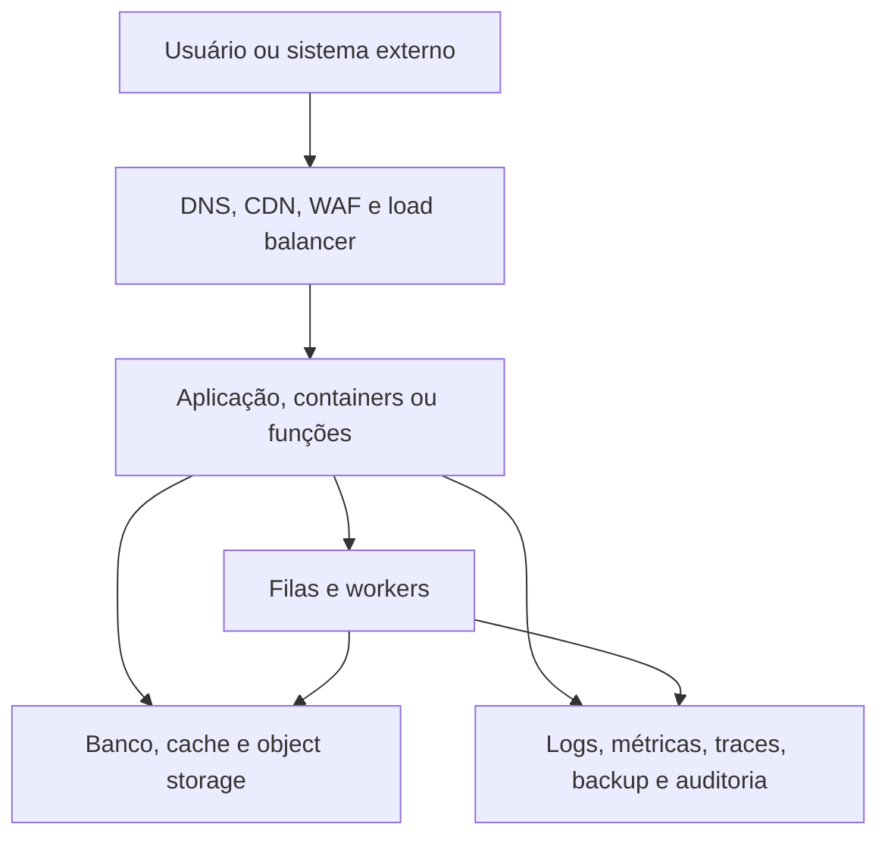

# Amazon Web Services

Amazon Web Services, AWS, é uma nuvem pública de escala global. Ela oferece infraestrutura sob demanda e um catálogo amplo de serviços de computação, rede, armazenamento, bancos de dados, identidade, observabilidade, análise e inteligência artificial. A unidade operacional não é apenas uma máquina virtual: conta, região, zona de disponibilidade, identidade, rede virtual, políticas e serviços gerenciados formam o ambiente.

## Modelo de plataforma

EC2 representa computação virtual controlada pelo cliente. S3 representa armazenamento de objetos. RDS representa bancos relacionais gerenciados. EKS oferece Kubernetes gerenciado, e Lambda oferece execução orientada a eventos. Esses nomes são exemplos de famílias de serviço, não uma arquitetura obrigatória. Uma aplicação também pode combinar VPC, IAM, load balancer, filas, cache, observabilidade e serviços de dados.

Regiões são áreas geográficas independentes e zonas de disponibilidade são domínios separados dentro de uma região. A escolha precisa considerar latência, residência dos dados, preço, serviços disponíveis e estratégia de recuperação. Distribuir instâncias em zonas diferentes ajuda contra falhas locais, mas não substitui backup, teste de restauração ou planejamento para falha regional.

Uma conta AWS é uma fronteira de cobrança, quotas e, em muitos casos, de isolamento
administrativo. Organizações podem agrupar contas em unidades organizacionais e
aplicar políticas em uma hierarquia, mas uma policy de organização não substitui as
policies de IAM do recurso. Separar produção, desenvolvimento, segurança e auditoria
reduz o alcance de credenciais e torna o billing mais legível.

Uma região possui vários domínios de disponibilidade, mas serviços diferentes têm
modelos diferentes de escopo. Um recurso pode ser regional, zonal ou global. Uma
subnet é associada a uma zona; um load balancer pode usar várias zonas; uma policy de
IAM pode ter escopo global; um bucket de S3 tem uma região de criação, mas seu nome
participa de um namespace amplo. A documentação da arquitetura precisa registrar o
escopo de cada dependência para não confundir replicação com alta disponibilidade.

## Modelo de responsabilidade

O provedor opera data centers, hardware, hipervisor e partes dos serviços gerenciados.
O cliente continua responsável por escolher a região, configurar identidades, aplicar
patches quando usa máquinas ou containers, controlar dados, restringir rede, proteger
segredos, configurar backups e responder a incidentes.

Em EC2, a equipe opera o sistema operacional, o agente, o filesystem, o runtime e a
aplicação. Em RDS, o provedor opera mais componentes do banco, mas a equipe continua
responsável por schema, permissões, consultas, retenção, restore testado e impacto de
migrações. Em Lambda, a unidade de operação muda para função, evento, permissões,
timeout, concorrência e observabilidade. Gerenciado não significa sem operação; muda
o que pode ser configurado e quem corrige a camada inferior.

## Organização de uma aplicação

Uma composição típica separa as responsabilidades em camadas:

Não é obrigatório usar todos os serviços da AWS. O diagrama serve para identificar
fronteiras: quem termina TLS, quem autoriza, onde os dados persistem, qual componente
processa operações assíncronas e qual plano recupera cada camada.

Uma aplicação pública pode usar ALB para HTTP, NLB para passthrough TCP, NAT para
saída IPv4 privada e endpoints para serviços AWS. Esses componentes não são
intercambiáveis. [Balanceadores AWS](load-balancing.md) explica onde cada listener
termina ou encaminha uma conexão. [NAT na VPC AWS](nat.md) explica por que saída não
é uma entrada pública.

## Pontos fortes

AWS é especialmente forte quando a equipe precisa de um catálogo grande, integrações prontas, múltiplas regiões, serviços gerenciados maduros e um ecossistema amplo de parceiros e profissionais. Também é adequada quando a organização precisa separar contas, políticas, ambientes e responsabilidades em escala empresarial.

## Limitações e custos

A amplitude aumenta a carga cognitiva. IAM, redes, políticas, quotas, logs e cobrança exigem governança desde o começo. Custos podem surgir de transferência de saída, endereços, armazenamento, requisições, logs e serviços auxiliares, não apenas de instâncias. A adoção de muitos serviços específicos também pode elevar o custo de migração.

AWS não é automaticamente a melhor escolha para um site simples, um pequeno VPS ou uma equipe que não precisa de serviços gerenciados. Nesses casos, a complexidade operacional pode superar o benefício do catálogo.

## Identidade e segurança

IAM deve ser modelado antes de criar serviços. Prefira roles temporárias, federação e
identidades de workload em vez de access keys distribuídas em arquivos ou imagens.
Separe quem administra a conta, quem implanta aplicações, quem lê logs e quem acessa
dados. Negue ações por padrão, restrinja recursos e condições e revise permissões
efetivas, não somente a policy mais visível.

VPC, security groups e NACLs não são a mesma camada. Security groups são stateful e
associados a interfaces ou recursos; NACLs atuam nas sub-redes e não substituem regras
de aplicação. Uma rede privada não elimina autenticação: ela reduz a exposição e
deve ser combinada com TLS, mTLS, autorização e segmentação.

Chaves KMS, Secrets Manager, Parameter Store e secrets de orquestradores têm modelos
de acesso diferentes. O segredo não deve ser colocado em `user-data`, imagem Docker,
state de IaC ou variável de CI sem uma justificativa e controle de exposição. Logs e
traces também podem capturar tokens e dados pessoais se os filtros não forem
definidos.

## Operação e recuperação

Cada serviço precisa de um dono, uma métrica de saúde, um limite, um backup quando
houver estado e um procedimento de recuperação. Availability Zones reduzem o impacto
de falhas locais, mas não protegem contra exclusão lógica, credencial comprometida,
erro de deployment ou corrupção propagada para todas as réplicas.

Backups precisam ser restaurados em uma conta ou ambiente isolado e comparados com o
RPO e o RTO definidos. Replicação síncrona melhora disponibilidade de leitura ou
escrita, mas não substitui backup, pois um erro lógico pode ser replicado. Para
object storage, versionamento, retenção e política de lifecycle devem ser avaliados
junto com a proteção contra exclusão.

Observabilidade deve distinguir erro do edge, erro do serviço, erro de dependência e
erro de autorização. Métricas agregadas de um load balancer não bastam para provar
que uma operação de negócio foi processada. Correlation IDs, logs estruturados e
tracing precisam cruzar os limites entre listener, aplicação, worker e banco sem
registrar secrets.

## Custos e lock-in

O custo real combina computação, armazenamento, requisições, transferência, logs,
snapshots, IPs, NAT, suporte e serviços auxiliares. NAT Gateway e tráfego entre zonas
podem ser significativos em workloads que parecem pequenos pela CPU. Aplique tags,
budgets, alertas e relatórios por conta, ambiente e produto.

Antes de escolher um serviço específico, defina como os dados serão exportados, como
o workload será reconstruído em outra região e quais APIs são essenciais. Usar uma
abstração própria pode facilitar migração, mas esconder diferenças importantes cria
uma falsa portabilidade. O objetivo não é eliminar toda dependência, e sim conhecer
qual dependência foi escolhida e qual é o caminho de saída.

## Rede

[Balanceadores AWS](load-balancing.md) explica ALB, NLB e GWLB, incluindo os
locais de terminação TLS, os modos de mTLS e o uso de PROXY protocol. [NAT na VPC
AWS](nat.md) trata o caminho de saída das sub-redes privadas, tabelas de rotas,
Internet Gateway e endpoints. Essas páginas separam o serviço de computação da
topologia de rede que o torna alcançável.

## Região, zona e edge

Uma região é um agrupamento geográfico de infraestrutura. Uma Availability Zone
é um domínio de falha separado dentro de uma região, com energia, rede e
capacidade que não devem ser tratados como uma única máquina. Distribuir réplicas
entre zonas reduz alguns efeitos de falhas locais, mas não impede uma falha
regional, uma política de identidade errada ou a propagação de uma exclusão
lógica.

Os serviços de edge, como distribuição de conteúdo, DNS e pontos de entrada,
ficam em outra camada. Eles podem continuar respondendo enquanto a origem está
indisponível, mas isso não significa que uma operação de escrita foi processada.
Cache, health check e fallback precisam declarar se servem dados antigos, se
aceitam escrita ou se apenas preservam uma página estática.

## Controle, dados e responsabilidade

Cada serviço gerenciado possui um plano de controle que cria e configura
recursos e um plano de dados que atende requisições. Uma falha no primeiro pode
impedir mudanças sem necessariamente interromper o segundo; uma falha no
segundo pode deixar a configuração visível no console sem que a aplicação
funcione. O diagnóstico deve perguntar em qual plano ocorreu o problema.

O modelo de responsabilidade compartilhada também muda por serviço. A AWS
protege a infraestrutura que fornece o serviço, enquanto o cliente continua
responsável por identidade, permissões, dados, configuração de rede, imagem,
criptografia e resposta às vulnerabilidades do seu workload. Um serviço
gerenciado reduz manutenção de hardware, mas não transfere automaticamente a
responsabilidade pelo desenho de recuperação.

## Perguntas antes de adotar um serviço

Antes de transformar um serviço da AWS em dependência estrutural, responda:

1. Qual é o estado persistente e como ele é exportado?
2. O que acontece se a região, a conta ou o plano de controle estiverem
   indisponíveis?
3. Qual identidade pode ler, alterar e excluir o recurso?
4. Como o custo cresce com requisições, transferência, logs e NAT?
5. O health check verifica a dependência real ou apenas a porta do processo?
6. Como uma versão anterior será restaurada sem sobrescrever dados novos?
7. Qual parte do contrato depende de uma API específica da plataforma?

Essas perguntas devem estar respondidas antes do módulo de IaC ser tratado como
reutilizável. Uma abstração que esconde a região, o IAM ou o modelo de backup
pode facilitar o primeiro deploy e dificultar a operação posterior.

## Critérios de avaliação

Antes de adotar AWS, valide a região necessária, o modelo de identidade, o orçamento de transferência, o plano de backup, as quotas, o suporte, a exportação de dados e a automação por IaC. Para ambientes críticos, separe contas e ambientes, use credenciais temporárias, aplique least privilege e trate o billing como parte da arquitetura.

## Fontes primárias

- [AWS overview](https://docs.aws.amazon.com/whitepapers/latest/aws-overview/introduction.html)
- [AWS global infrastructure](https://docs.aws.amazon.com/global-infrastructure/latest/regions/)
- [AWS products](https://aws.amazon.com/products/)
