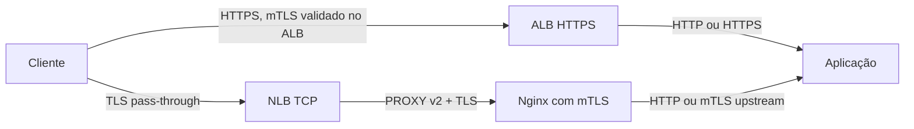
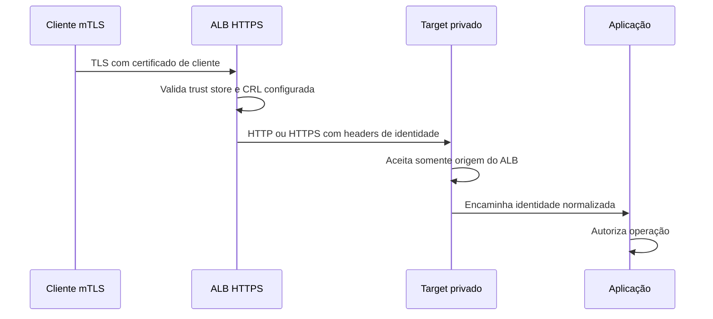
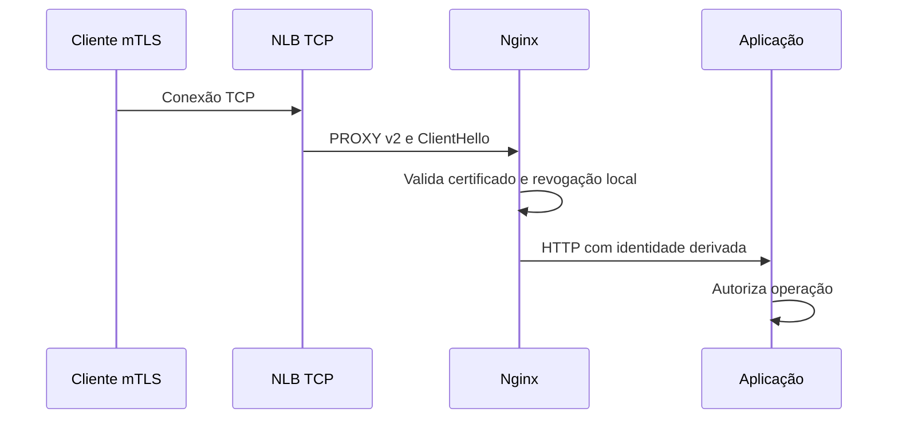

# Balanceadores AWS

Os balanceadores da AWS não formam uma única camada abstrata. Cada família termina
ou encaminha protocolos diferentes, possui um modelo próprio de listener e expõe
metadados de conexão de maneira distinta. A escolha correta depende de onde TLS é
terminado, quem valida o cliente, qual informação o backend precisa preservar e se o
roteamento depende do conteúdo HTTP.

## ALB

O Application Load Balancer, ALB, opera na camada de aplicação para HTTP e HTTPS.
Um listener recebe a conexão, avalia regras por host, path, cabeçalhos ou outras
condições e encaminha a requisição para um target group. O target group mantém os
destinos registrados e executa health checks próprios.

ALB é adequado quando a plataforma precisa de roteamento HTTP, redirecionamentos,
integração com WebSocket, HTTP/2, gRPC ou terminação TLS centralizada. Ele também
suporta mTLS no listener HTTPS, com modo de verificação ou passthrough. No modo de
verificação, o ALB valida o certificado do cliente contra o trust store e pode
consultar CRLs configuradas. No modo passthrough, ele envia a cadeia do cliente ao
backend, que precisa fazer a validação.

## NLB

O Network Load Balancer opera principalmente na camada de transporte. Ele atende TCP,
TLS, UDP e QUIC, sendo apropriado para conexões de alta escala, protocolos que não
sejam HTTP e TLS pass-through. Um listener TLS pode terminar o TLS do servidor, mas o
NLB não suporta mTLS nesse modo.

Para manter mTLS no serviço, use listener TCP e deixe o Nginx ou a aplicação receber
o handshake. O NLB pode adicionar PROXY protocol v2 no target group, e o receptor
precisa estar configurado para ler o cabeçalho antes dos bytes do TLS. Essa combinação
preserva o endereço de origem e deixa a decisão de confiança no terminador escolhido.

Um NLB escolhe o destino com base no fluxo, e não no conteúdo de cada requisição
HTTP. Isso preserva protocolos que o balanceador não entende e evita terminar TLS na
borda, mas também significa que regras por host ou path pertencem ao serviço atrás
dele. Conexões longas, como WebSocket ou streams, permanecem associadas ao destino
escolhido; adicionar um target novo não move automaticamente uma conexão já aberta.

O comportamento do endereço de origem depende do tipo de listener, do tipo de target
e dos atributos escolhidos. Não suponha que o backend sempre verá o IP do cliente ou
sempre verá o IP do NLB. Documente a combinação efetiva e use PROXY protocol v2
quando a preservação explícita for necessária, lembrando que o target precisa
consumir o cabeçalho.

## Outros balanceadores

O Gateway Load Balancer, GWLB, conecta appliances virtuais de rede e é orientado à
inserção transparente de firewalls, inspeção ou outros appliances intermediários. Ele não é um
substituto do ALB para regras HTTP. O Classic Load Balancer é uma geração anterior e
deve ser tratado como compatibilidade de ambientes existentes, não como a escolha
normal para uma implantação nova.

## Componentes da camada de aplicação

Um ALB possui nós nas zonas habilitadas, listeners, regras e target groups. O DNS do
ALB aponta os clientes para os nós disponíveis, enquanto cada nó usa as regras do
listener e seleciona um destino saudável. O target group não é apenas uma lista de
IPs: ele define protocolo, porta, tipo de target, health check, algoritmo e tempo de
drenagem durante a remoção.

Uma regra HTTP precisa de uma ação padrão para o caso em que nenhuma condição
específica corresponde. Regras adicionais devem ser ordenadas por prioridade e
testadas com host, path, método e cabeçalhos reais. Um health check verde prova
somente que o endpoint escolhido responde conforme o contrato; ele não prova que
qualquer rota da aplicação esteja saudável.

Quando um target é removido, o ALB pode mantê-lo em draining para concluir
requisições em andamento. O tempo de drenagem precisa ser compatível com timeout do
cliente, timeout do proxy e duração máxima das requisições. Um valor muito curto
interrompe respostas legítimas; um valor muito longo retém capacidade durante uma
falha.

## Exposição e distribuição

Um load balancer internet-facing possui interfaces alcançáveis a partir da internet.
Um load balancer interno recebe apenas de redes que tenham conectividade até as
interfaces privadas. O adjetivo interno não substitui security groups, NACLs,
autorização ou mTLS; ele apenas descreve a exposição do endpoint do balanceador.

As zonas habilitadas formam parte do domínio de disponibilidade. O DNS do serviço
pode retornar endereços diferentes, e cada nó seleciona targets segundo o tipo de
balanceador, a saúde e os atributos do target group. Uma aplicação que registra
targets somente em uma zona pode continuar respondendo, mas criar tráfego entre zonas
ou uma capacidade muito menor durante uma falha local.

Cross-zone load balancing reduz a diferença entre a quantidade de targets por zona,
mas pode aumentar tráfego entre zonas. A decisão deve considerar distribuição de
capacidade, custo de transferência e comportamento durante a perda de uma zona. Não
confunda alta disponibilidade do balanceador com alta disponibilidade do target: se
há um único pod, banco ou appliance atrás dele, o balanceador apenas expõe melhor o
mesmo ponto de falha.

## Health checks não são testes da aplicação inteira

O health check deve representar a menor condição necessária para receber tráfego. Um
endpoint que faz uma consulta pesada ao banco pode transformar a recuperação do
balanceador em uma tempestade de consultas. Um endpoint que sempre retorna `200` pode
deixar passar um processo que não consegue atender a rota real.

Separe, quando necessário, prontidão de processo, prontidão de dependências e
disponibilidade de uma operação específica. O target deve retornar falha quando não
pode aceitar novas requisições, mas não deve bloquear o health check esperando uma
dependência externa sem timeout.

O health check também tem seu próprio protocolo, porta, caminho, host, intervalo,
timeout e limiar de sucesso ou falha. Um target pode estar saudável na porta HTTP e
indisponível na porta HTTPS, ou responder em `/health` e falhar em `/api`. Sempre
teste o caminho que o listener realmente encaminha.

## Timeouts e conexões

Uma requisição atravessa vários limites: timeout do cliente, listener, target group,
proxy interno, aplicação e banco. Se o timeout externo for menor que o interno, o
cliente pode desistir enquanto a aplicação continua trabalhando. Se o interno for
muito curto, respostas legítimas podem ser interrompidas e gerar retries duplicados.

Documente pelo menos:

- tempo máximo de conexão e de inatividade;
- tempo de resposta do health check;
- timeout de leitura e escrita do target;
- duração do draining;
- política de retry do cliente ou de outro proxy;
- comportamento para WebSocket, HTTP/2 e streams;
- limite de conexões e portas disponíveis no target.

Retries em uma operação não idempotente podem duplicar efeitos. O load balancer não
deve ser tratado como uma camada invisível que pode repetir qualquer requisição.
Defina idempotência e chave de deduplicação na aplicação antes de ativar retries em
clientes ou gateways.

## Caminhos de TLS

No primeiro caminho, o ALB é o terminador e a aplicação precisa confiar apenas nos
metadados que o ALB injeta em uma rede que impeça bypass. No segundo, o NLB não
interpreta o TLS; o Nginx recebe o certificado do cliente e controla a cadeia, a
revogação local e a autorização derivada da identidade.

No modo de verificação do mTLS, o ALB usa um trust store associado ao listener e
valida a cadeia do certificado do cliente. A aplicação pode receber headers
`X-Amzn-Mtls-*` com dados da identidade, mas esses headers não devem ser aceitos de
um caminho que não passe pelo ALB. Security groups devem impedir acesso direto ao
target, ou o serviço precisa validar uma prova adicional que não dependa apenas do
header.

No modo passthrough, o ALB encaminha a cadeia apresentada pelo cliente e o target
assume a responsabilidade pela validação. Isso preserva mais controle no serviço,
mas também distribui a complexidade de trust store, política, revogação e
observabilidade. O modo não deve ser escolhido apenas porque evita configurar uma
CA no ALB; ele muda o componente que precisa permanecer operacional para cada
conexão.

O trust store do ALB usa bundles de CAs e pode associar listas de revogação conforme
os limites do serviço. A atualização de um bundle substitui o conjunto enviado, por
isso a rotação deve manter as CAs antiga e nova durante a sobreposição planejada.
Sessões TLS também precisam ser consideradas: durante uma migração, conexões
reutilizadas podem não representar imediatamente o novo caminho de validação.

| Modo do ALB | O que o ALB faz | O que o target ainda precisa fazer |
| --- | --- | --- |
| Verificação | Termina TLS, valida cadeia, uso e revogação conforme o trust store | Autorizar a identidade e confiar somente nos headers da borda |
| Passthrough | Termina a camada HTTP, mas encaminha dados da identidade conforme o contrato | Validar a cadeia e decidir revogação e autorização |

No modo de verificação, a identidade encaminhada pelo ALB é metadado de uma fronteira
de rede. O target não deve ser público nem aceitar os mesmos headers por uma rota
alternativa. Security groups que permitem somente a origem do ALB são parte da
autenticação do desenho, não apenas uma otimização de firewall.

No modo passthrough, o target precisa receber a cadeia e possuir a CA, o trust store,
a política de revogação e os limites de timeout. Se a aplicação não entende mTLS,
um Nginx ou sidecar pode assumir essa função, mas o domínio de confiança continua
no target. Não há ganho arquitetural em escolher passthrough e depois confiar em um
header sem prova do componente que o produziu.

Durante a rotação do trust store, mantenha CA antiga e nova pelo tempo necessário para
que clientes e targets sejam atualizados. Depois de retirar a CA antiga, monitore
falhas de `unknown issuer` e não as trate como falhas de revogação. São diagnósticos
e ações de recuperação diferentes.

## Arquiteturas de referência

### ALB terminando e verificando mTLS

Nesse desenho, o ALB possui um listener HTTPS associado a um trust store. O cliente
faz o handshake com o ALB, que valida o certificado e encaminha HTTP ou HTTPS ao
target. A aplicação recebe headers específicos do ALB e deve confiar neles somente
porque a rede bloqueia qualquer outro caminho.

Esse desenho reduz a distribuição de certificados de cliente para os pods e
centraliza métricas de handshake. O custo é concentrar uma decisão de segurança no
ALB e depender de security groups, rotas e configuração dos headers para impedir
bypass. O target não deve ser público e não deve aceitar `X-Amzn-Mtls-*` de qualquer
origem.

### NLB TCP com Nginx terminando mTLS

Nesse desenho, o NLB não termina TLS. Ele encaminha TCP e pode adicionar PROXY
protocol v2. O Nginx recebe o cabeçalho, o ClientHello e o certificado do cliente,
valida a cadeia e a CRL e então encaminha para a aplicação.

Esse modelo preserva o controle do TLS no workload e permite que a política seja
igual à de outros Nginx fora da AWS. Ele exige distribuir CA, CRL, certificados,
permissões e reloads para cada réplica. O listener TCP também não pode ser tratado
como HTTP pelo NLB, e o health check precisa alcançar uma porta que aceite o contrato
de PROXY protocol.

### Decisão entre os modelos

| Critério | ALB com verificação | NLB TCP com Nginx |
| --- | --- | --- |
| Terminação TLS | ALB | Nginx ou aplicação |
| CRL e trust store | No trust store do ALB | Em cada terminador |
| Roteamento por host ou path | No ALB | Depois da terminação no Nginx |
| Certificado chega ao backend | Não necessariamente | Sim, no handshake do Nginx |
| Operação de certificados | Centralizada | Distribuída |
| Bypass a impedir | Acesso direto ao target | Acesso direto à aplicação |
| PROXY protocol | Opcional conforme target | Útil para preservar origem |

Escolha ALB quando a validação centralizada e o roteamento HTTP forem mais
importantes que o controle local do handshake. Escolha NLB TCP quando o serviço
precisar conservar o TLS, operar protocolos não HTTP ou aplicar a mesma política de
mTLS no próprio terminador. Em ambos os casos, documente quem revoga, quem atualiza
o trust store e como uma conexão já estabelecida é encerrada durante um incidente.

## Segurança entre o balanceador e o target

Um target group HTTPS faz o balanceador abrir TLS até o destino, mas a documentação
da AWS informa que o ALB não valida o certificado apresentado pelo target. Isso
protege a conexão por criptografia, mas não constitui autenticação forte do backend.
Quando a identidade do target importa, use uma topologia que restrinja a rede e
configure validação mútua ou outra autenticação explícita no serviço.

Security groups, NACLs e rotas devem permitir apenas os fluxos necessários. Health
checks precisam chegar à porta e ao protocolo corretos, e o backend deve impedir
acesso direto que permita contornar as regras do listener ou forjar cabeçalhos de
identidade.

O ALB pode usar HTTP ou HTTPS até o target. HTTPS cifra o segundo trecho, mas a
documentação do serviço informa que o ALB não valida o certificado apresentado pelo
target. Se autenticar o backend for requisito, use mTLS no serviço, uma identidade de
workload ou outra política explícita; a simples presença de HTTPS não prova que o
target correto foi alcançado.

Os sinais de diagnóstico devem distinguir quatro pontos: resolução DNS e escolha do
nó do balanceador, negociação do listener, seleção do target e resposta da aplicação.
Um `5xx` gerado no ALB tem significado operacional diferente de um `5xx` devolvido
pelo target. Correlacione access logs, métricas do target group, health checks,
security groups e logs do serviço antes de aumentar timeout ou retirar a proteção.

## Critério de escolha

| Necessidade | Escolha inicial |
| --- | --- |
| Roteamento por host ou path | ALB |
| HTTP, HTTPS, HTTP/2 ou gRPC | ALB |
| TCP, UDP ou TLS pass-through | NLB |
| mTLS terminado na borda HTTP | ALB com mTLS |
| mTLS controlado pelo Nginx ou aplicação | NLB TCP até o target |
| PROXY protocol v2 para o target | NLB com atributo do target group |
| Inserção de appliance de rede | GWLB |

Essa tabela é um ponto de partida, não uma autorização para misturar terminação TLS
e cabeçalhos de identidade sem testar. O contrato entre listener, target group e
aplicação precisa ser documentado, incluindo quem valida, quem autoriza e como a
origem é preservada.

## Fluxo de uma requisição

O DNS seleciona um nome do balanceador, o listener aceita a conexão e a política
do listener escolhe uma ação. O balanceador então seleciona um target saudável,
abre ou reutiliza uma conexão até ele e traduz os metadados conforme o protocolo
e os atributos configurados. A aplicação pode receber o endereço do cliente no
header, no PROXY protocol ou somente no log do balanceador. Não se deve presumir
que esses três valores sejam equivalentes.

O health check é uma decisão do balanceador, não uma prova de que o fluxo de
negócio está funcionando. Um endpoint que retorna `200` sem consultar banco,
fila, segredo ou dependência pode manter um target no pool enquanto as operações
reais falham. Por outro lado, um health check que depende de todos os serviços
pode retirar todos os targets durante uma falha parcial e dificultar a
recuperação. A profundidade do check precisa corresponder à função que ele deve
proteger.

## Diferenças que não aparecem no nome do recurso

ALB e NLB não são apenas duas interfaces para o mesmo balanceamento. O ALB
entende HTTP e pode tomar decisões por host, caminho, header e prioridade. O NLB
trabalha no nível de conexão e preserva opções de TCP ou TLS pass-through. Isso
afeta timeout, reutilização de conexão, observabilidade, origem do cliente e o
local onde o certificado é validado.

GWLB tem outra finalidade: inserir appliances de rede em um fluxo. O appliance
precisa preservar estado, suportar o modo de encapsulamento e ter capacidade
compatível com o tráfego. Usá-lo como se fosse um ALB ou NLB mistura inspeção de
tráfego com roteamento de aplicação e torna o diagnóstico mais difícil.

## Testes mínimos de produção

Antes de promover uma configuração, teste separadamente:

1. target saudável e target que falha no health check;
2. timeout do backend, reset de conexão e resposta lenta;
3. cliente IPv4 e IPv6 quando ambos forem publicados;
4. certificado inválido, CA ausente e certificado expirado;
5. perda de uma zona ou de uma parte dos targets;
6. preservação do IP original e rejeição de headers forjados;
7. rotação do certificado sem derrubar conexões legítimas;
8. diferença entre erro gerado pelo balanceador e erro devolvido pelo target.

O teste precisa observar access logs, métricas do listener, estado do target
group, logs da aplicação e traces correlacionados. Um teste que verifica apenas
que o DNS retorna um endereço não cobre seleção de target, TLS, autorização nem
recuperação.

## Relações

- [NAT na VPC AWS](nat.md) explica o caminho de saída de sub-redes privadas.
- [PROXY protocol](../../../rede/proxy/proxy-protocol.md) explica o cabeçalho de
  conexão usado pelo NLB.
- [Amazon EKS](eks.md) aplica esses caminhos a Services, Ingress e Pods.
- [Amazon ECS](ecs.md) aplica esses caminhos a tasks, ENIs e services ECS.
- [mTLS no Nginx](../../../seguranca/tls/nginx-mtls.md) mostra o terminador no target.
- [TLS termination](../../../seguranca/tls/termination.md) compara terminação e
  pass-through.

## Fontes primárias

- [Elastic Load Balancing](https://docs.aws.amazon.com/elasticloadbalancing/)
- [Application Load Balancer components](https://docs.aws.amazon.com/elasticloadbalancing/latest/application/introduction.html)
- [ALB mutual TLS](https://docs.aws.amazon.com/elasticloadbalancing/latest/application/mutual-authentication.html)
- [NLB listeners](https://docs.aws.amazon.com/elasticloadbalancing/latest/network/load-balancer-listeners.html)
- [NLB target group attributes](https://docs.aws.amazon.com/elasticloadbalancing/latest/network/edit-target-group-attributes.html)
