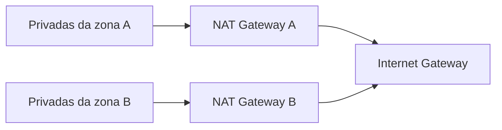

# NAT na VPC AWS

Network Address Translation, NAT, altera o endereço de origem de uma conexão para
permitir que uma rede privada alcance outro destino sem expor diretamente seus
endereços internos. Na AWS, o NAT Gateway é principalmente um mecanismo de saída
para sub-redes privadas. Ele não transforma uma sub-rede privada em um destino
publicamente acessível e não substitui um load balancer para tráfego de entrada.

## Topologia básica

O NAT Gateway público precisa ficar em uma sub-rede pública, com rota para um
Internet Gateway e um endereço IPv4 público associado. A sub-rede privada aponta
seu destino padrão para o NAT Gateway. O retorno é permitido como parte do estado
das conexões iniciadas de dentro, enquanto uma conexão nova iniciada pela internet
não alcança a instância privada por esse caminho.

Uma sub-rede não é pública ou privada por causa do nome, da tag ou do fato de uma
instância ter endereço privado. Ela é pública quando sua tabela de rotas oferece um
caminho para um Internet Gateway e a instância possui endereçamento e regras que
permitam o uso desse caminho. A classificação deve ser lida nas rotas, nos gateways,
nos security groups e nas NACLs em conjunto.

O NAT mantém uma tabela de traduções. Uma conexão iniciada por uma instância privada
é convertida para o endereço do gateway, com portas e estado suficientes para
associar respostas ao fluxo original. Isso não cria uma porta de entrada estável para
a instância e não torna seguro publicar um serviço privado com base apenas no fato de
que o retorno de uma conexão existente funciona.

## O que exatamente é traduzido

Em IPv4, o fluxo costuma sair com o endereço privado e uma porta efêmera da
instância. O NAT substitui a origem pelo endereço associado ao gateway e mantém uma
entrada que relaciona destino, porta, protocolo e estado. Quando a resposta volta,
essa entrada permite devolver o pacote à interface privada correta.

Essa tabela tem limites. Muitos workloads abrindo conexões para o mesmo destino
podem consumir portas disponíveis mesmo que a CPU da aplicação esteja folgada. Uma
aplicação que cria uma conexão nova para cada operação pode, portanto, falhar no NAT
antes de atingir o limite do banco ou do serviço externo.

Reuse de conexões, pools com limites, timeouts coerentes e endpoints privados reduzem
esse risco. Aumentar o número de NAT Gateways pode melhorar isolamento e capacidade
por zona, mas não corrige um cliente que não fecha conexões ou um retry sem limite.

O NAT também não é uma política de identidade. O destino externo vê o endereço de
saída, mas não sabe automaticamente qual pod, instância ou usuário iniciou a
conexão. Para auditoria, associe logs da aplicação, Flow Logs e o horário do fluxo,
sem usar o IP público como identificador único de workload.

## NAT não é balanceamento

O NAT mantém fluxos e traduz endereços e portas. Ele não escolhe um target saudável,
não executa regras por host ou path, não termina necessariamente TLS e não entrega
uma identidade de cliente à aplicação. Um ALB distribui requisições HTTP, enquanto
um NLB distribui conexões ou pacotes UDP conforme o listener e o target group.

Um serviço privado que precisa receber tráfego deve usar uma entrada controlada,
como ALB, NLB, VPN, peering ou outro mecanismo de conectividade. O NAT continua
sendo útil para atualizações, chamadas a APIs externas, publicação de imagens e
outras operações iniciadas pelo workload.

## Rotas e endpoints

O destino padrão `0.0.0.0/0` pode enviar todo o tráfego IPv4 para o NAT, mas isso
nem sempre é a melhor opção. Rotas mais específicas podem usar gateway endpoints
para serviços AWS ou conexões privadas para evitar custo, latência e exposição
desnecessária ao caminho público.

Um gateway endpoint para serviços compatíveis evita passar pelo NAT e pode manter o
tráfego dentro da rede AWS. Interface endpoints usam interfaces de rede e políticas
próprias, enquanto peering, Transit Gateway ou VPN resolvem conectividade entre
redes. A rota mais específica vence a rota padrão, mas a segurança ainda depende de
DNS, endpoint policy, security group e autorização do serviço de destino.

Em workloads IPv6, NAT Gateway também pode participar de DNS64 e NAT64 para alcançar
destinos somente IPv4, mas isso não deve ser confundido com uma tradução genérica
para qualquer desenho dual stack. Verifique a resolução DNS, as rotas e o suporte do
serviço antes de assumir que o caminho é equivalente ao IPv4.

Para saída IPv6 sem tradução para IPv4, um egress-only Internet Gateway pode
permitir conexões iniciadas pela VPC e bloquear novas conexões iniciadas na internet.
O modelo não é uma cópia literal do NAT Gateway: endereços IPv6 não precisam de
NAT para serem globalmente roteáveis, e o controle de entrada precisa ser feito com
rotas, security groups e NACLs.

## Alternativas ao NAT Gateway

| Opção | Uso típico | Trade-off |
| --- | --- | --- |
| NAT Gateway gerenciado | Saída IPv4 de sub-redes privadas | Simples de operar, mas cobra por hora e dados processados |
| NAT instance | Laboratório ou cenário com controle do host | Exige patching, escala, failover e regras de forwarding |
| Gateway endpoint | Acesso a serviços AWS compatíveis | Evita NAT, mas vale somente para serviços suportados |
| Interface endpoint | Acesso privado a serviços via ENI | Tem custo, security groups e DNS próprios |
| Egress-only Internet Gateway | Saída IPv6 | Não traduz IPv6 para IPv4 |
| VPN ou Transit Gateway | Conectividade com redes privadas | Exige roteamento, capacidade e operação de túneis |

Escolha a alternativa pela direção e pelo destino do tráfego. Um endpoint privado
para object storage pode ser melhor que atravessar o NAT; uma API pública de terceiro
continua precisando de um caminho de saída. Um NAT instance pode ser adequado para
um laboratório, mas criar um único appliance como dependência de toda a produção
contradiz a finalidade da sub-rede distribuída.

## Domínios de falha

O padrão mais simples coloca um NAT Gateway em uma sub-rede pública e aponta várias
sub-redes privadas para ele. Isso funciona, mas o gateway e a rota tornam-se um
domínio de falha e uma concentração de custo. Um desenho por zona usa uma tabela de
rotas e um gateway por zona, mantendo o tráfego local quando uma zona está saudável.

Esse padrão não impede uma falha regional, uma falha no Internet Gateway ou uma
indisponibilidade do destino. Ele reduz o impacto de uma zona e a transferência
entre zonas. O plano de recuperação deve declarar se é aceitável perder a saída,
se existe um caminho alternativo e quais workloads podem continuar operando sem
internet.

## Disponibilidade, custo e diagnóstico

Um único NAT Gateway por região ou por VPC pode se tornar dependência de capacidade,
custo e disponibilidade. Colocar um gateway por zona reduz dependência de tráfego
entre zonas, mas multiplica recursos e custo. A decisão precisa considerar volume de
egress, requisitos de falha, endpoints privados e o número de sub-redes consumidoras.

O NAT Gateway também cobra processamento de dados e pode concentrar muito egress em
um único ponto. Um desenho por zona normalmente associa cada sub-rede privada ao
gateway da mesma zona, evitando que o tráfego atravesse zonas sem necessidade. Isso
melhora o domínio de falha e pode reduzir custo de transferência, mas não elimina a
necessidade de monitorar capacidade, portas efêmeras e falha de uma zona inteira.

Quando uma instância privada não alcança a internet, confira a rota da sub-rede,
a rota do NAT até o Internet Gateway, o estado do NAT Gateway, security groups,
NACLs e a resolução DNS. Flow Logs ajudam a diferenciar ausência de rota, bloqueio e
falha do destino, mas não substituem a inspeção da tabela de rotas.

Quando apenas um destino falha, compare DNS, security group e a rota específica desse
destino antes de culpar o NAT. Quando todos os destinos externos falham, verifique o
estado do gateway, a associação da tabela de rotas, a rota do gateway público ao
Internet Gateway e as NACLs. Quando a falha ocorre somente sob carga, observe
conexões, portas efêmeras, bytes processados e o limite de cada dependência, em vez
de aumentar permissões indiscriminadamente.

## IPv6, endpoints e exceções ao NAT

NAT Gateway é uma solução para saída IPv4 de sub-redes privadas. Ele não é a
forma geral de conectar qualquer workload à internet e não deve ser adicionado
quando o problema real é acesso a um serviço AWS que poderia permanecer dentro
da rede privada.

Para serviços suportados, VPC endpoints reduzem a passagem pelo NAT e podem
evitar custo de processamento e dependência de saída pública. A escolha entre
gateway endpoint e interface endpoint depende do serviço, do DNS privado, da
rota e da política de segurança. A regra de segurança ainda precisa permitir o
fluxo, e o endpoint também se torna um recurso com limite e observabilidade
próprios.

Em IPv6, o desenho usual para saída somente de egress usa um egress-only
Internet Gateway. Não se deve aplicar a intuição de NAT44 diretamente a IPv6:
endereços globais, security groups, NACLs, rotas e política de exposição são
decisões diferentes. Se o workload precisa ser privado, restrinja o caminho por
firewall e rota em vez de confiar em tradução como controle de identidade.

## Portas, estado e limites

NAT mantém estado de conexões e usa portas efêmeras para representar muitos
clientes perante um destino. Um workload com grande concorrência pode esgotar
portas disponíveis para o mesmo destino antes de consumir toda a CPU. Pooling de
conexões, destinos distribuídos, endpoints privados e limites explícitos podem
ser mais eficazes que aumentar réplicas sem analisar o padrão de saída.

Observe bytes processados, conexões ativas, erros de alocação, latência de
conexão e distribuição por destino. Logs de fluxo ajudam a ver quem tentou
conectar, mas não mostram por si só a decisão de aplicação no destino. Combine
com métricas do cliente e do serviço remoto.

## Critério de desenho

Escolha o NAT somente depois de classificar cada fluxo:

| Fluxo | Opção inicial |
| --- | --- |
| Sub-rede privada para endpoint público IPv4 | NAT Gateway, com rota e segurança explícitas |
| Sub-rede privada para serviço AWS compatível | VPC endpoint |
| Saída IPv6 sem entrada iniciada pela internet | Egress-only Internet Gateway |
| Comunicação entre VPCs ou redes | Transit Gateway, peering ou VPN, conforme topologia |
| Acesso administrativo | Caminho privado, bastion ou serviço de acesso, não NAT como identidade |

Essa classificação evita usar um componente de saída como substituto de
segmentação, autenticação ou conectividade privada.

## Relações

- [Balanceadores AWS](load-balancing.md) trata ALB, NLB, GWLB e terminação TLS.
- [Tabela de rotas](../../../rede/route.md) explica destino, próximo salto e
  associação de rotas.
- [VPC networking](https://docs.aws.amazon.com/vpc/latest/userguide/what-is-amazon-vpc.html)
  apresenta o modelo de rede da AWS.

## Fontes primárias

- [AWS route tables](https://docs.aws.amazon.com/vpc/latest/userguide/RouteTables.html)
- [AWS routing options](https://docs.aws.amazon.com/vpc/latest/userguide/route-table-options.html)
- [AWS NAT gateways](https://docs.aws.amazon.com/vpc/latest/userguide/vpc-nat-gateway.html)
- [AWS NAT Gateway troubleshooting](https://docs.aws.amazon.com/vpc/latest/userguide/nat-gateway-troubleshooting.html)
