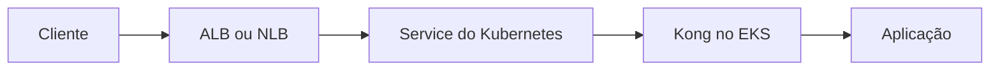
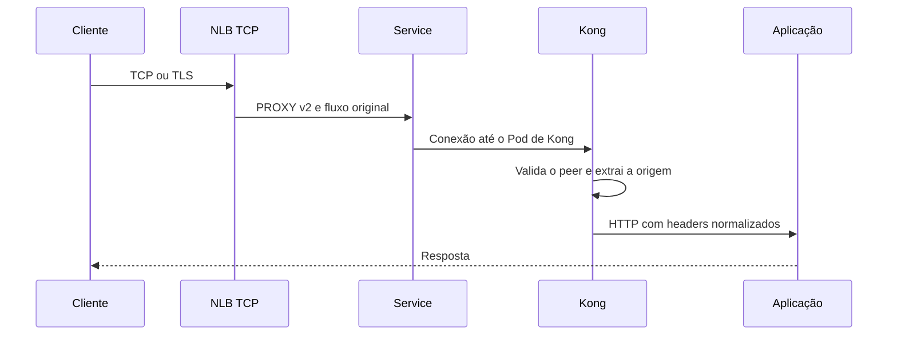

# Kong Gateway

Kong Gateway é um API gateway que combina roteamento, autenticação, plugins,
rate limiting, transformação e observabilidade. Ele implementa o conceito de
gateway, mas não substitui o domínio da aplicação nem define sozinho o contrato
de cada serviço.

## Catálogo com banco

No modo tradicional, o Kong guarda serviços, rotas, consumers e configuração de
plugins em um banco relacional. No Kong atual, PostgreSQL é a opção principal;
versões anteriores também suportavam Cassandra. O banco introduz uma dependência
operacional, credenciais e um estado compartilhado que precisa ser protegido
durante migrações ou múltiplas instalações.

O decK sincroniza um arquivo declarativo com o catálogo por meio da API
administrativa. Ele calcula a diferença entre estado desejado e estado real e
permite revisar a mudança antes de aplicá-la, sem editar o banco diretamente.

## Modo sem banco

No modo DB-less, o gateway carrega o catálogo de um arquivo declarativo YAML ou
de uma configuração enviada ao endpoint apropriado. Leituras continuam
disponíveis, mas escritas incrementais pela API administrativa não são a fonte
de verdade. Uma alteração substitui o documento completo e exige recarga.

Esse modo remove o banco externo, mas não elimina o estado: ele passa a viver no
arquivo e no processo de publicação. Plugins que precisam persistir estado entre
requisições podem não oferecer o mesmo comportamento. A compatibilidade deve ser
verificada para cada versão e plugin usado.

## Kong Ingress Controller

No Kubernetes, o Kong Ingress Controller traduz recursos como Ingress ou CRDs do
Kong em configuração do gateway. O catálogo passa a ser representado por
objetos do cluster e pode seguir o fluxo GitOps dos demais manifests. O preço é
acoplar as rotas ao modelo de objetos e ao ciclo de reconciliação do Kubernetes.

## Kong no EKS e o endereço real do cliente

Kong dentro do EKS normalmente não recebe a conexão diretamente do cliente. Há
um ou mais saltos antes dele: CloudFront, WAF, ALB, NLB, Service, kube-proxy,
ingress controller ou outro proxy. Cada salto pode terminar TLS, criar uma nova
conexão, fazer SNAT ou acrescentar informações de forwarding. Por isso, o
endereço que Kong encontra no socket pode ser o endereço privado do load balancer,
de um nó, de um Pod intermediário ou de uma subnet, e não o endereço do cliente.



O problema não é resolvido simplesmente lendo `remote_addr`. Esse valor descreve
o último peer de rede que abriu a conexão observada por Kong. Também não é seguro
aceitar qualquer `X-Forwarded-For` enviado pelo cliente, porque o cliente pode
enviar uma cadeia falsa antes de chegar ao primeiro proxy confiável.

A solução depende da camada que termina a conexão:

| Entrada até Kong | Fonte da origem do cliente | Configuração de Kong |
| --- | --- | --- |
| ALB termina HTTP ou HTTPS | `X-Forwarded-For` escrito pelo ALB | `real_ip_header=x-forwarded-for` |
| NLB encaminha TCP ou TLS | PROXY protocol v2 do NLB | `real_ip_header=proxy_protocol` |
| Service sem proxy L4 confiável | Origem do caminho Kubernetes | `externalTrafficPolicy` e rede do cluster |
| Cadeia de gateways | Header normalizado pelo gateway anterior | Confiar somente nos CIDRs dos proxies conhecidos |

ALB e NLB não devem ser tratados como equivalentes. ALB entende HTTP e entrega
headers de forwarding depois de decodificar a requisição. NLB trabalha no nível
de conexão e pode adicionar PROXY protocol v2 antes dos bytes TCP, preservando a
origem para o próximo terminador sem transformar o tráfego em HTTP.

## Trusted IPs não são uma lista de clientes

`KONG_TRUSTED_IPS` deve conter os endereços ou CIDRs dos intermediários que têm
permissão para declarar a origem anterior. Ele não deve ser preenchido com a lista
de clientes finais e nem com `0.0.0.0/0` em produção apenas para fazer o problema
desaparecer.

Em uma entrada por ALB, a lista normalmente precisa cobrir as subnets nas quais
os nós do ALB podem abrir conexões até Kong. Em uma entrada por NLB, ela precisa
corresponder ao peer que efetivamente chega ao socket de Kong, conforme o target
type, a preservação de IP e o caminho do Service. O valor correto não deve ser
adivinhado a partir do endereço que o header declara. Observe o endereço antes da
substituição, restrinja o acesso por security group ou NetworkPolicy e então
defina os CIDRs mínimos necessários.

Confiar em uma subnet inteira é mais amplo que confiar somente no load balancer.
Se outro workload dessa subnet puder alcançar a porta do Kong, ele poderá tentar
forjar headers ou PROXY protocol. `KONG_TRUSTED_IPS` e o firewall cumprem funções
complementares: a primeira controla quais peers podem fornecer metadados de
origem, enquanto o segundo reduz quem consegue chegar ao listener.

Quando Kong aceita uma conexão com PROXY protocol, o fato de o cabeçalho conter o
IP real não prova que ele veio do NLB. O protocolo não é assinado. A prova de
confiança vem da combinação entre rota de rede exclusiva, security groups,
NetworkPolicies, listener correto e lista restrita de peers confiáveis.

## NLB com PROXY protocol v2

Em EKS, um NLB L4 pode preservar o cliente mesmo quando o caminho interno do
Service faria SNAT. O NLB escreve o cabeçalho v2 e depois os bytes originais:



O listener de Kong precisa aceitar PROXY protocol na porta correspondente. Em
uma instalação gerenciada por Helm, o contrato pode ser representado por
variáveis equivalentes a estas:

```yaml
env:
  trusted_ips: "10.0.16.0/20,10.0.32.0/20"
  real_ip_header: "proxy_protocol"
  real_ip_recursive: "off"
  proxy_listen: "0.0.0.0:8000 proxy_protocol, 0.0.0.0:8443 ssl proxy_protocol"
```

Os CIDRs são apenas exemplos estruturais. Devem ser substituídos pelos ranges
reais dos intermediários da instalação e revisados quando subnets, target types
ou controllers mudarem. `real_ip_recursive` não deve ser ativado para percorrer
uma cadeia arbitrária. Ele só é seguro quando cada proxy que pode escrever a
cadeia está inventariado e incluído na política de confiança.

Uma configuração possível do Service do Kong com o AWS Load Balancer Controller
é:

```yaml
metadata:
  annotations:
    service.beta.kubernetes.io/aws-load-balancer-type: "external"
    service.beta.kubernetes.io/aws-load-balancer-nlb-target-type: "ip"
    service.beta.kubernetes.io/aws-load-balancer-proxy-protocol: "*"
```

O processo de Kong deve ser preparado antes de aplicar a annotation. Se o NLB
começar a enviar PROXY v2 para uma porta que espera HTTP ou ClientHello, os
health checks e o tráfego de usuário falharão. O mesmo vale para qualquer rota
de administração ou status que compartilhe o listener.

## ALB e headers de forwarding

Se o ALB termina HTTPS e envia HTTP para Kong, o cliente original chega como
header, não como endereço do socket. Kong precisa confiar no peer do ALB antes
de usar `X-Forwarded-For`, `X-Forwarded-Proto` ou `X-Forwarded-Host`:

```yaml
env:
  trusted_ips: "10.0.16.0/20,10.0.32.0/20"
  real_ip_header: "x-forwarded-for"
  real_ip_recursive: "on"
```

Essa configuração só é válida se a porta de Kong aceitar tráfego dos ALBs
esperados e não puder ser alcançada diretamente por clientes. O ALB precisa
sobrescrever ou normalizar os headers de forwarding, e Kong precisa gerar uma
nova cadeia controlada ao encaminhar para o upstream. A aplicação final deve
confiar somente em Kong, não em qualquer `X-Forwarded-For` que veio da internet.

Se houver CloudFront, outro WAF ou um proxy adicional antes do ALB, o CIDR de
confiança e a semântica da cadeia mudam. O header pode conter vários valores,
mas a posição de um valor não é uma prova de qual proxy o escreveu. Documente a
ordem, a política de sobrescrita e o conjunto exato de peers que podem conectar
em cada salto.

## `externalTrafficPolicy` não resolve toda cadeia

Em alguns Services, `externalTrafficPolicy: Local` preserva o IP no caminho de
rede do Kubernetes porque o tráfego não é encaminhado para um nó sem endpoint
local. Isso pode ser suficiente quando Kong recebe diretamente o tráfego L4 e o
provedor suporta essa semântica. Também pode causar distribuição desigual,
targets sem endpoint local e health checks diferentes.

Com AWS Load Balancer Controller e NLB, PROXY protocol v2 pode ser usado com
`externalTrafficPolicy: Cluster` para que a origem seja transportada pelo
balanceador mesmo quando o Service distribui internamente. As duas configurações
não devem ser habilitadas sem uma razão: uma influencia o roteamento do Service,
a outra o contrato de bytes entre NLB e Kong.

## Falhas e diagnóstico

Quando Kong registra somente o IP de uma subnet ou do load balancer, compare os
valores em cada camada:

1. endereço do cliente observado no edge;
2. header que ALB ou outro proxy escreveu;
3. peer de transporte que chega ao Service ou ao Pod;
4. origem extraída do PROXY protocol por Kong;
5. headers que Kong enviou ao upstream;
6. endereço finalmente registrado pela aplicação.

Capture os primeiros bytes apenas em uma rede controlada. No caminho NLB, a
assinatura PROXY v2 deve aparecer antes do TLS ou do protocolo da aplicação. No
caminho ALB, o primeiro byte entregue ao Kong já pertence ao protocolo HTTP ou
HTTPS escolhido para o target group. Confundir esses caminhos produz erros como
handshake inválido, requisição HTTP ilegível ou health check `unhealthy`.

Também procure uma rota de bypass. Um Pod acessível por NodePort, um Service
interno exposto por outra interface ou uma NetworkPolicy permissiva pode permitir
que um cliente chegue a Kong sem passar pelo intermediário que deveria ser
confiável. Nesse caso, corrigir apenas `KONG_TRUSTED_IPS` não resolve o problema:
é preciso remover a rota alternativa ou separar listeners e políticas.

## Modo híbrido

O modo híbrido separa control plane e data plane. O control plane mantém o
catálogo e a coordenação; os data planes recebem a configuração e processam o
tráfego sem precisar de um banco local. Isso permite distribuir o processamento
e isolar a superfície administrativa, mas adiciona canais de sincronização,
certificados e estados intermediários para operar.

## Konnect

Konnect é o control plane gerenciado do ecossistema Kong. O operador mantém um
ou mais data planes e entrega a gestão do catálogo a um serviço externo. Isso
reduz infraestrutura própria, mas cria dependência de conectividade, política de
dados e licenciamento. O fato de o tráfego continuar passando pelo data plane
local não elimina a importância de proteger o canal de gestão.

## Quando escolher

DB-less faz sentido quando configuração declarativa imutável e ausência de banco
são prioridades. O modo com banco é mais adequado quando mudanças incrementais,
plugins e gestão centralizada são necessários. O modo híbrido ajuda quando a
escala ou a separação entre gestão e tráfego justifica a complexidade. Em um
ambiente pequeno, o gateway deve ser comparado ao custo de um reverse proxy com
políticas menores.

## Relações

- [API gateway](index.md) define a categoria e a fronteira com reverse proxy.
- [Service](service.md), [Route](route.md), [Plugin](plugin.md) e
  [Consumer](consumer.md) descrevem as principais abstrações do catálogo.
- [Gateway API](../../gateway-api.md) apresenta o padrão Kubernetes que pode
  ser usado pelo controlador.
- [Rate limiting](../rate-limiting/index.md) descreve políticas de consumo.
- [Amazon EKS](../../plataforma/cloud/aws/eks.md) explica NLB, ALB, Services e
  target types na AWS.
- [PROXY protocol](../proxy/proxy-protocol.md) explica o formato, o parsing e
  o limite de confiança do cabeçalho.
- [Nginx com PROXY protocol](../proxy/nginx-proxy-protocol.md) mostra o mesmo
  problema em outro terminador.

## Fontes primárias

- [Kong Gateway concepts](https://docs.konghq.com/gateway/latest/)
- [decK](https://docs.konghq.com/deck/latest/)
- [Kong DB-less mode](https://docs.konghq.com/gateway/latest/production/deployment-topologies/db-less-and-declarative-config/)
- [Kong Ingress Controller](https://docs.konghq.com/kubernetes-ingress-controller/latest/)
- [Preserve Client IP no Kong Ingress Controller](https://docs.konghq.com/kubernetes-ingress-controller/latest/guides/security/client-ip/)
- [Configuração `trusted_ips` do Kong](https://docs.konghq.com/gateway/latest/reference/configuration/)
