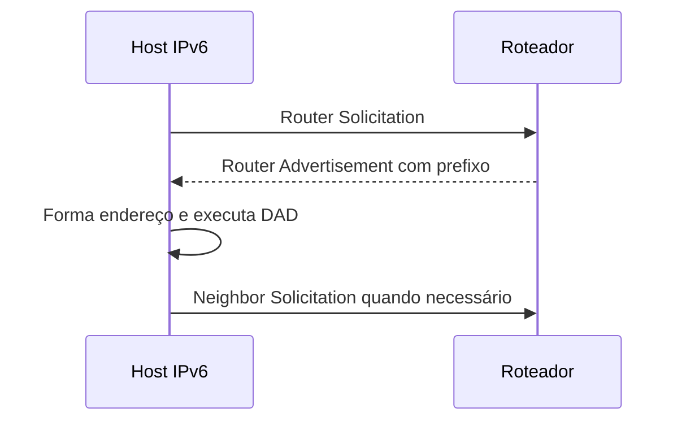

# SLAAC

Stateless Address Autoconfiguration, SLAAC, é o mecanismo pelo qual um host
IPv6 forma endereços a partir de Router Advertisements e de um prefixo recebido
do roteador. O host não precisa consultar um servidor DHCPv6 para obter o
endereço básico, mas ainda precisa descobrir gateway, validade, DNS e outras
políticas conforme a rede.

## Neighbor Discovery

SLAAC faz parte do IPv6 Neighbor Discovery, que usa ICMPv6. O host envia Router
Solicitation quando precisa de informação; o roteador responde Router
Advertisement com prefixos, flags, lifetime e parâmetros. O host combina o
prefixo com um identificador de interface ou endereço temporário e verifica
duplicidade antes de usar o endereço.

O endereço tem preferred lifetime e valid lifetime. Um prefixo pode deixar de
ser preferido para novas conexões e continuar válido para conexões existentes
durante uma transição. Ignorar lifetimes causa endereços obsoletos, falhas após
renumeração e tráfego que continua usando um prefixo retirado.

## Privacidade e estabilidade

Um identificador derivado diretamente do MAC pode facilitar correlação. Endereços
temporários reduzem rastreamento para conexões de saída, enquanto um endereço
estável pode ser necessário para servidores, firewall e DNS. A escolha precisa
ser compatível com a função do host, logs e política de rotação.

SLAAC não é sinônimo de ausência de DHCPv6. A flag M pode indicar configuração
stateful adicional, e a flag O pode indicar outras informações. DNS pode ser
anunciado por RA, DHCPv6 ou configuração local. A rede precisa escolher uma
política coerente para não produzir dois caminhos concorrentes e difíceis de
diagnosticar.

## Segurança

Rogue Router Advertisements podem redirecionar tráfego ou inserir prefixos
maliciosos. Switches e pontos de acesso devem aplicar mecanismos de proteção
adequados, e hosts precisam filtrar ICMPv6 sem bloquear Neighbor Discovery
legítimo. Firewall IPv6 que copia regras IPv4 sem permitir ICMPv6 essencial pode
quebrar DAD, descoberta de vizinhos e Path MTU Discovery.

## Relações

- [IPv6](ipv6.md) apresenta endereçamento e Neighbor Discovery.
- [NDP](../neighbor.md) explica a descoberta de vizinhos.
- [DHCPv6](https://datatracker.ietf.org/doc/html/rfc8415) complementa configuração stateful.

## Fontes primárias

- [RFC 4862, IPv6 Stateless Address Autoconfiguration](https://www.rfc-editor.org/rfc/rfc4862)
- [RFC 4861, Neighbor Discovery](https://www.rfc-editor.org/rfc/rfc4861)
- [RFC 7217, stable IPv6 interface identifiers](https://www.rfc-editor.org/rfc/rfc7217)
