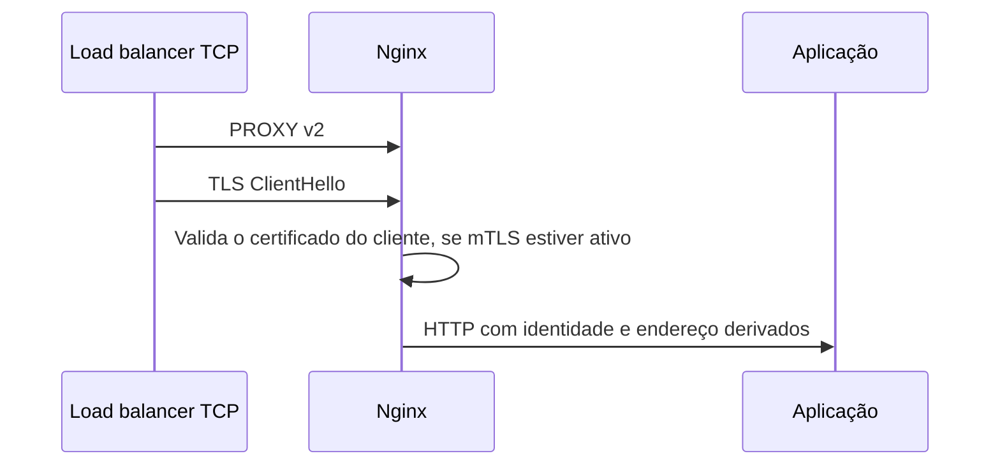

# Nginx com PROXY protocol

O Nginx pode receber PROXY protocol no socket de escuta e expor o endereço original
por variáveis próprias. Essa configuração é útil quando um Network Load Balancer,
HAProxy ou outro proxy mantém a conexão TCP até o Nginx e o serviço precisa registrar
o cliente real sem confiar em um cabeçalho HTTP enviado pelo próprio cliente.

O protocolo precisa ser habilitado no mesmo `listen` que recebe a conexão. O Nginx
então lê o cabeçalho antes de interpretar TLS ou HTTP. A configuração só é correta
quando todos os remetentes possíveis daquela porta enviam PROXY protocol.

## Receptor HTTP

Um exemplo mínimo para TLS pass-through até o Nginx é:

```nginx
http {
    log_format with_client '$proxy_protocol_addr [$time_iso8601] $host "$request" $status';

    server {
        listen 443 ssl proxy_protocol;
        server_name api.example.test;

        ssl_certificate /etc/nginx/tls/server/fullchain.pem;
        ssl_certificate_key /etc/nginx/tls/server/privkey.pem;

        set_real_ip_from 10.0.0.0/8;
        real_ip_header proxy_protocol;
        real_ip_recursive off;

        access_log /var/log/nginx/access.log with_client;

        location / {
            proxy_pass http://application;
            proxy_set_header X-Real-IP $proxy_protocol_addr;
            proxy_set_header X-Forwarded-For $proxy_protocol_addr;
        }
    }
}
```

O bloco real precisa declarar o upstream ou outro destino válido. O ponto importante
é que `proxy_protocol` no `listen` habilita a leitura, enquanto `real_ip_header`
define qual fonte o módulo de endereço real usa para atualizar o endereço visto pelo
Nginx. `$proxy_protocol_addr` continua disponível para logs e cabeçalhos explícitos.

O parâmetro pertence ao socket, não a uma requisição individual. Portanto, uma porta
que recebe tanto conexões diretas quanto conexões de um balanceador não pode ser
configurada de forma ambígua: o Nginx esperará o cabeçalho em todos os fluxos daquela
escuta. Separe listeners, sub-redes ou endereços quando a migração exigir que os
dois contratos convivam temporariamente.

## Lista de origens confiáveis

`set_real_ip_from` não autoriza um cliente a inventar o endereço original. Ele apenas
define quais endereços podem fornecer a informação que o módulo de endereço real
aceitará. A filtragem principal deve ocorrer antes do Nginx, por security group,
firewall, ACL de rede ou uma topologia que impeça acesso direto.

Não use uma rede ampla como `0.0.0.0/0`. O intervalo deve corresponder às sub-redes
ou endereços reais dos intermediários. Depois de uma mudança no balanceador, revise
também as rotas e os health checks, porque uma porta configurada para PROXY protocol
não aceita uma conexão comum de diagnóstico.

## TLS no mesmo socket

Quando o Nginx termina TLS, a ordem dos bytes é:



Não se deve colocar um terminador TLS comum na frente de uma porta Nginx que espera
PROXY protocol sem confirmar o contrato entre os dois saltos. Se o terminador não
envia o cabeçalho, o Nginx interpretará o ClientHello como um cabeçalho PROXY
inválido. Se dois intermediários adicionarem cabeçalhos, determine qual deles é a
fonte autorizada e teste a cadeia completa.

Quando o Nginx termina TLS, `listen 443 ssl proxy_protocol` é suficiente para
consumir o cabeçalho antes do handshake. Quando ele apenas encaminha TLS, o módulo
`stream` pode ler o cabeçalho e encaminhar o restante sem descriptografar o tráfego:

```nginx
stream {
    upstream tls_backend {
        server 10.0.2.15:443;
    }

    server {
        listen 443 proxy_protocol;
        proxy_pass tls_backend;
        proxy_protocol_timeout 5s;
    }
}
```

Esse modo não permite ao Nginx tomar decisões por path, cabeçalho HTTP ou identidade
do certificado sem terminar TLS. Ele é apropriado quando o backend possui a política
de mTLS ou quando a borda precisa preservar exatamente o handshake. O backend deve
também entender que o primeiro conteúdo recebido não é o ClientHello, mas o
envelope PROXY protocol.

## Modo stream

O módulo `stream` também possui suporte a PROXY protocol para serviços TCP e UDP
compatíveis. A ideia é a mesma, mas não há um pedido HTTP para receber os cabeçalhos
`X-Forwarded-*`. O serviço atrás do Nginx precisa entender PROXY protocol ou o Nginx
deve remover a informação antes do protocolo original, quando o desenho permitir.

## Verificação

Valide a configuração antes de recarregar:

```bash
nginx -t
systemctl reload nginx
```

Teste a porta a partir do caminho real do balanceador e observe o log de acesso. Um
teste direto no endereço do backend não é equivalente, pois pode não carregar o
cabeçalho. Para investigar, compare `$remote_addr`, `$realip_remote_addr` e
`$proxy_protocol_addr`, sem registrar certificados completos ou outros dados
sensíveis desnecessariamente.

Use `nginx -T` para confirmar a configuração efetiva, incluindo arquivos incluídos,
e verifique que não existe outro `server` escutando o mesmo endereço com contrato
divergente. Em seguida, confira o target group, o listener do balanceador e as regras
de rede. Uma configuração correta no Nginx continua falhando se o health check chega
por uma porta sem PROXY protocol ou se o balanceador usa v1 enquanto o caminho foi
documentado como v2.

Para uma investigação reproduzível, registre temporariamente o endereço recebido,
o endereço derivado do cabeçalho e o resultado do handshake. Capture somente em uma
rede controlada, porque uma captura pode conter tokens, certificados e dados de
aplicação depois do cabeçalho. Remova o log adicional após confirmar o caminho e não
use a captura como prova de que o cliente é autorizado.

## Atualização sem indisponibilidade

A troca precisa considerar o par emissor e receptor. Primeiro prepare um listener ou
backend que aceite o formato novo, valide health checks e teste uma pequena fração do
tráfego. Só depois altere o balanceador para escrever o cabeçalho. Para voltar, a
rota antiga precisa continuar disponível ou o receptor precisa ser revertido junto
com o emissor; reiniciar apenas o Nginx não corrige um contrato incompatível.

O reload mantém workers que atendem conexões antigas e inicia workers com a nova
configuração. Isso ajuda a evitar corte brusco, mas não corrige conexões que já foram
abertas com o protocolo errado. Defina timeout de drenagem e observe a taxa de erros
durante a janela de sobreposição.

## Segurança

PROXY protocol carrega metadados, não uma prova criptográfica de identidade. Não use
`$proxy_protocol_addr` como autorização por si só. Para autorização de cliente,
combine a origem de rede confiável com mTLS, credenciais da aplicação ou uma política
de autorização adequada.

O Nginx também precisa impedir que cabeçalhos de origem trazidos pelo cliente
cheguem ao upstream. Uma configuração que apenas adiciona um novo
`X-Forwarded-For` pode preservar um valor falso enviado anteriormente. O proxy deve
limpar os headers de entrada e reconstruí-los a partir do valor que o módulo realip
aceitou, e o backend deve ser inacessível por caminhos que contornem o Nginx.

O endereço derivado do PROXY protocol pode ser útil para logs e rate limit, mas a
política precisa considerar NAT, proxies legítimos e IPv6. Um endereço não é uma
identidade estável. Se uma decisão de autorização depender dele, documente a
origem do dado, a janela de validade e o que acontece quando a conexão passa por
mais de um intermediário.

## Health checks e migração de listeners

Há dois contratos independentes para verificar durante uma mudança: o contrato do
health check e o contrato do tráfego de usuário. Se o target group envia PROXY
protocol, o health check precisa enviá-lo ou chegar a uma porta que não o exige.
Se uma camada termina TLS, o health check deve usar o protocolo e o SNI que o
Nginx espera. Um target marcado como `unhealthy` pode ser consequência de um
contrato de probe incorreto, não de uma falha da aplicação.

Para uma migração sem ambiguidade, publique o listener novo, valide o caminho
completo, mova uma pequena parcela do tráfego e observe erros por origem e por
versão do cabeçalho. Só retire o listener antigo depois de drenar conexões e
confirmar que não existem clientes legítimos fora do inventário. O rollback deve
alterar emissor, receptor e health check como uma unidade.

## Relações

- [PROXY protocol](proxy-protocol.md) explica o formato e o limite de confiança.
- [mTLS no Nginx](../../seguranca/tls/nginx-mtls.md) explica a autenticação por
  certificado.
- [Nginx](https://nginx.org/en/docs/) fornece a documentação completa dos módulos.

## Fontes primárias

- [Nginx HTTP core module](https://nginx.org/en/docs/http/ngx_http_core_module.html)
- [Nginx real IP module](https://nginx.org/en/docs/http/ngx_http_realip_module.html)
- [Nginx stream proxy module](https://nginx.org/en/docs/stream/ngx_stream_proxy_module.html)
