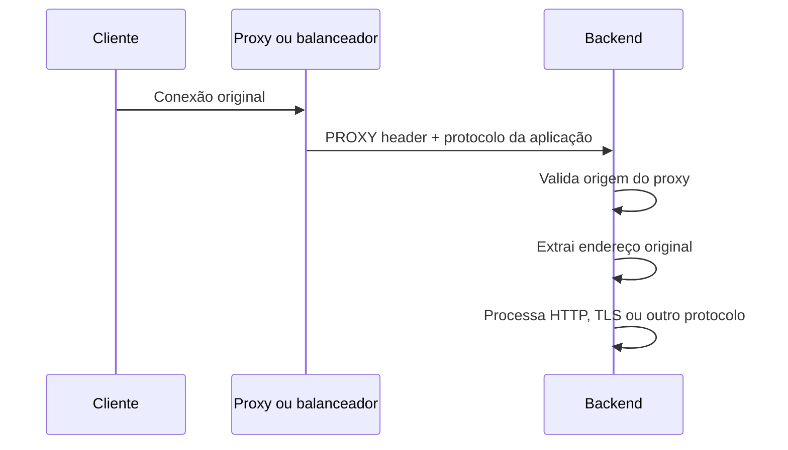
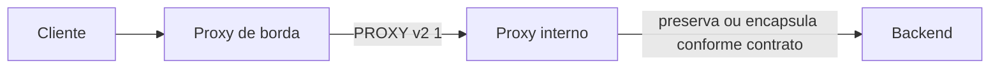

# PROXY protocol

PROXY protocol é um protocolo de metadados de conexão. Um proxy, balanceador ou
outro intermediário escreve um cabeçalho antes dos bytes do protocolo da aplicação,
informando ao próximo salto o endereço e a porta originais do cliente e do destino.
O receptor remove esse cabeçalho antes de entregar o restante ao servidor HTTP, TLS,
SMTP ou outro protocolo que esteja sendo transportado.

Ele resolve um problema específico: quando um intermediário abre uma nova conexão
com o backend, o backend pode enxergar o endereço do próprio intermediário em vez do
endereço do cliente. PROXY protocol preserva essa informação na camada de transporte,
mas não autentica o cliente e não substitui TLS, autorização ou uma política de
origem confiável.

## Fluxo



O cabeçalho precisa ser o primeiro conteúdo recebido no socket. Em uma conexão TCP
com TLS pass-through, o backend recebe primeiro o cabeçalho PROXY e só depois o
ClientHello. Em uma conexão HTTP, o cabeçalho PROXY aparece antes dos bytes que o
servidor HTTP espera, portanto o software precisa estar explicitamente configurado
para entendê-lo.

## Versões

O PROXY protocol v1 usa uma linha de texto terminada por `CRLF`. É fácil de
inspecionar, mas ocupa mais bytes e possui menos espaço para metadados estruturados.
O v2 usa um cabeçalho binário com uma assinatura fixa, campos de endereço e TLVs.
Os TLVs podem transportar informações como protocolo negociado, identificador da
conexão e dados de TLS fornecidos pelo intermediário.

O v2 não é uma camada de criptografia. Os dados do cabeçalho podem ser lidos ou
alterados por quem controlar o caminho, salvo quando estiverem protegidos pelo
protocolo de transporte ou por uma camada autenticada posterior. Mesmo em uma rede
privada, o receptor deve aceitar o cabeçalho somente de endereços que pertençam ao
proxy esperado.

## Compatibilidade entre versões

O emissor e o receptor precisam concordar sobre a versão e o ponto de leitura. Um
receptor configurado para v1 pode interpretar os primeiros bytes de v2 como uma
linha inválida. Um receptor configurado para v2 pode rejeitar uma linha v1 antes de
chegar ao TLS. Algumas implementações aceitam as duas versões, mas isso deve ser
confirmado na documentação do produto e registrado no contrato da porta.

Durante uma migração, não altere emissor e receptor em momentos independentes se a
porta não suporta sobreposição. Existem três estratégias seguras:

1. criar uma porta nova com v2 e migrar targets gradualmente;
2. habilitar um receptor que aceite v1 e v2, testar e depois retirar v1;
3. colocar um adaptador conhecido entre os componentes durante uma janela curta.

Health checks são parte da mesma migração. Se o balanceador envia PROXY protocol
para uma porta e o health check usa uma conexão comum, o Nginx pode marcar todos os
targets como indisponíveis. O teste precisa atravessar a mesma combinação de listener,
header, TLS e porta que o tráfego de produção usa.

## TLVs e informação de TLS

O PROXY v2 pode transportar TLVs. Alguns emissores acrescentam informações sobre ALPN,
SNI, conexão TLS ou resultado de uma terminação anterior. Esses valores descrevem o
que o intermediário observou; não são, por si só, uma nova prova de que o cliente
possui a chave privada ou de que o certificado foi autorizado pela aplicação.

O receptor deve aceitar apenas os TLVs documentados para aquela rota. O tamanho
declarado precisa ser limitado antes da alocação, tipos desconhecidos devem ser
ignorados ou rejeitados conforme a especificação, e os valores não devem ser usados
em autorização sem uma origem autenticada. Um TLV que diz que TLS foi usado não
substitui a validação do handshake quando o backend é o terminador.

Se o proxy termina TLS, o backend não pode reconstruir o certificado do cliente a
partir de um TLV genérico. A identidade mTLS precisa ser encaminhada por um contrato
específico e autenticado, ou o TLS precisa continuar até o backend. Misturar
metadados de transporte com material de autenticação cria uma fronteira difícil de
auditar.

## Estrutura do cabeçalho

No v1, uma conexão IPv4 típica começa assim:

```text
PROXY TCP4 198.51.100.20 192.0.2.10 54321 443\r\n
```

O primeiro endereço é o cliente original, o segundo é o destino observado pelo
proxy, e os números seguintes são as portas de origem e destino. O texto é legível,
mas o receptor precisa limitar o tamanho da linha e rejeitar tokens inválidos para
evitar que o parser consuma bytes indefinidamente.

No v2, os primeiros doze bytes formam uma assinatura binária fixa. Depois vêm o
comando, a família de endereço, o protocolo, o tamanho do bloco de endereço e os
TLVs opcionais. O receptor deve respeitar o tamanho declarado, ignorar extensões que
não conhece segundo a especificação e limitar o total aceito antes de alocar memória.

| Parte | Função |
| --- | --- |
| Assinatura | Diferencia o cabeçalho v2 de dados comuns. |
| Comando | Indica conexão enviada por um proxy ou conexão local. |
| Família e transporte | Descreve IPv4, IPv6, Unix e TCP ou UDP. |
| Endereços e portas | Transporta origem e destino vistos pelo primeiro proxy. |
| TLVs | Carregam extensões, como ALPN, autoridade e dados de TLS. |

Os TLVs não possuem a mesma semântica em todos os produtos. Um receptor deve
documentar quais tipos aceita, de qual intermediário eles vêm e se o valor pode
participar de logs, roteamento ou autorização. Tratar qualquer TLV desconhecido como
uma identidade seria transformar uma extensão de transporte em uma política de acesso.

## Cadeia de proxies

Uma cadeia pode preservar vários saltos, mas cada salto precisa ter um contrato
explícito. O primeiro proxy pode escrever a origem do cliente; o segundo pode
preservar o cabeçalho anterior, adicionar outro ou substituí-lo. O backend não deve
adivinhar essa política olhando apenas para o número de cabeçalhos recebidos.



Se a topologia aceita rotas alternativas, uma rota que chega diretamente ao backend
pode inserir um cabeçalho falso ou omitir o cabeçalho legítimo. O controle precisa
ser feito por rede, identidade do proxy e configuração do receptor, não por uma
comparação textual do endereço informado.

## PROXY protocol e cabeçalhos HTTP

`X-Forwarded-For` existe dentro do protocolo HTTP e só aparece depois que TLS foi
terminado e uma requisição foi decodificada. PROXY protocol fica antes do protocolo
transportado e também serve para TCP bruto, SMTP, banco de dados e TLS pass-through.

Isso permite preservar a origem antes de um handshake TLS, mas não permite ao backend
ler host, path ou método. Um desenho pode usar os dois: PROXY protocol para a origem
da conexão e cabeçalhos HTTP para a cadeia de proxies, desde que a borda remova
valores enviados pelo cliente e reescreva a informação com base em fontes confiáveis.

## Contrato operacional

Antes de ativar o protocolo, registre quatro decisões no desenho da rota:

1. qual salto escreve o cabeçalho e qual versão usa;
2. qual salto o lê e se ele termina ou repassa o protocolo seguinte;
3. quais endereços de origem podem abrir a conexão;
4. como logs, rate limit e autorização distinguem origem observada de origem declarada.

A mudança deve ser implantada como uma unidade. Habilitar o envio primeiro derruba
backends que ainda esperam TLS ou HTTP; habilitar a leitura primeiro derruba clientes
que ainda chegam por uma rota sem o cabeçalho. Uma porta de migração separada ou uma
janela coordenada reduz essa indisponibilidade.

## Diagnóstico

Comece pela captura no primeiro salto do backend, não pelo log da aplicação. Confirme
se a assinatura v1 ou v2 aparece antes do protocolo esperado, se o endereço declarado
corresponde à conexão que o proxy recebeu e se existe mais de um cabeçalho. Depois
compare a configuração do listener, o target group e o módulo do receptor.

Um erro TLS no primeiro byte, uma mensagem HTTP inválida ou um timeout imediato são
sinais de contrato incompatível. Um log que registra somente o endereço do proxy,
sem erro de protocolo, costuma indicar que o cabeçalho não foi enviado, não foi
habilitado no receptor ou foi descartado num salto intermediário.

## Limite de confiança

O endereço carregado pelo cabeçalho só é confiável depois que a conexão foi aceita de
um intermediário autenticado pela rede. Se um cliente da internet alcançar
diretamente a porta configurada para PROXY protocol, ele poderá enviar um cabeçalho
com um endereço inventado. Isso contamina logs, regras de rate limit, auditoria e
políticas que dependem de IP.

O desenho seguro separa a porta pública da porta de backend, restringe a origem com
firewall ou security group e configura a aplicação para reconhecer PROXY protocol
apenas nessa interface. Também é preciso impedir caminhos alternativos até o backend;
caso contrário, uma requisição que contorna o proxy pode apresentar informação de
origem com uma semântica diferente.

## Composição com TLS

PROXY protocol e TLS podem ser usados juntos, mas ocupam posições diferentes no
fluxo. Quando o Nginx termina TLS, ele precisa ler o cabeçalho PROXY antes de iniciar
o handshake. Quando o balanceador termina TLS, o próximo salto normalmente recebe
HTTP e pode usar `X-Forwarded-For` ou outro cabeçalho controlado pelo balanceador,
não o cabeçalho PROXY original.

Isso também define onde o mTLS acontece. Se o balanceador usa TCP e encaminha o TLS
até o Nginx, o Nginx pode validar o certificado do cliente e ainda receber o endereço
original via PROXY protocol. Se o balanceador termina TLS, a validação mTLS precisa
ser feita nele ou o certificado e sua cadeia precisam ser transmitidos por uma
interface autenticada até o backend.

## Falhas comuns

Um backend que espera PROXY protocol e recebe TLS ou HTTP diretamente geralmente
produz erro de protocolo, handshake inválido ou uma mensagem ilegível no log. O caso
inverso também falha: se o proxy envia o cabeçalho e o backend não está configurado,
o primeiro conteúdo parece uma requisição inválida.

Também há risco de cabeçalhos duplicados quando mais de um intermediário adiciona
PROXY protocol. O receptor deve saber qual salto é confiável e se o produto preserva
ou substitui um cabeçalho anterior. A documentação do Network Load Balancer da AWS,
por exemplo, alerta que o cabeçalho v2 pode ser acrescentado ao tráfego que já
contém outro cabeçalho.

## Parsing e proteção contra entrada malformada

O receptor deve tratar o cabeçalho como entrada de rede não confiável até provar
que a conexão veio do intermediário correto. No v1, isso significa limitar o
comprimento da linha, aceitar somente famílias e transportes previstos e
rejeitar caracteres ou portas inválidas. No v2, significa conferir a assinatura,
o comando, a família, o transporte e o comprimento total antes de ler endereços
ou TLVs.

O campo de comprimento do v2 não deve ser usado para alocar memória sem limite.
O parser precisa impor um teto compatível com os TLVs que a arquitetura realmente
usa e interromper a conexão quando o cabeçalho estiver incompleto além do timeout.
Se o produto suportar o TLV de CRC, ele pode verificar corrupção acidental e
alteração durante o transporte, mas não transforma o cabeçalho em uma mensagem
autenticada contra um proxy malicioso.

O limite de confiança deve ser aplicado antes da informação ser usada por logs,
rate limit ou autorização. Registrar um endereço declarado por uma origem não
confiável pode contaminar auditoria e facilitar bloqueio do cliente errado. Quando
o protocolo é usado em uma cadeia, cada salto precisa documentar se preserva,
substitui ou ignora os metadados recebidos.

## Disponibilidade e drenagem

O cabeçalho é parte do protocolo de conexão, então uma mudança de configuração
pode quebrar conexões novas enquanto as antigas continuam funcionando. O rollout
deve observar novas conexões, não somente requisições por segundo. Um backend pode
parecer saudável porque conexões existentes continuam abertas, mesmo que todos os
novos handshakes estejam sendo rejeitados.

Durante a drenagem, mantenha a versão antiga e a nova somente se o receptor souber
distinguir os contratos. Caso contrário, crie listeners separados. Health checks,
probes e conexões de administração devem usar o mesmo caminho que o tráfego real,
ou declarar explicitamente que são exceções.

## Relações

- [Amazon EKS](../../plataforma/cloud/aws/eks.md) mostra o contrato em Services,
  Ingress e Pods.
- [Amazon ECS](../../plataforma/cloud/aws/ecs.md) mostra o contrato em tasks,
  ENIs e target groups.
- [Nginx com PROXY protocol](nginx-proxy-protocol.md) mostra a configuração do
  receptor e a recuperação do endereço original.
- [Reverse proxy](reverse-proxy.md) explica a responsabilidade do intermediário.
- [mTLS no Nginx](../../seguranca/tls/nginx-mtls.md) mostra a validação de identidade
  no terminador TLS.
- [Balanceadores AWS](../../plataforma/cloud/aws/load-balancing.md) compara ALB,
  NLB e os modos de mTLS e PROXY protocol disponíveis.

## Fontes primárias

- [PROXY protocol specification](https://www.haproxy.org/download/3.0/doc/proxy-protocol.txt)
- [Nginx HTTP core module](https://nginx.org/en/docs/http/ngx_http_core_module.html)
- [AWS NLB target group attributes](https://docs.aws.amazon.com/elasticloadbalancing/latest/network/edit-target-group-attributes.html)
