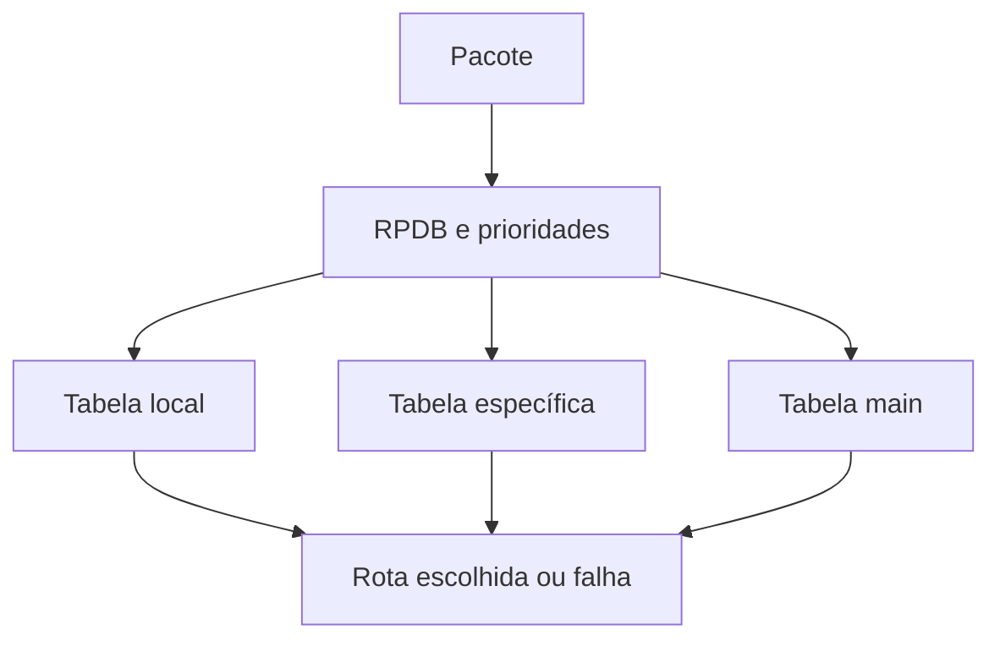

# RPDB

Routing Policy Database, RPDB, é o conjunto de regras usado pelo Linux para
selecionar tabelas de roteamento além da tabela principal. O comando `ip rule`
consulta a RPDB por prioridade e pode escolher uma tabela conforme endereço de
origem, destino, marca, interface ou outras propriedades do pacote.

## Ordem de decisão

O kernel avalia as regras em ordem crescente de prioridade. Uma regra aponta
para uma tabela; a tabela procura uma rota. Se a rota encontrada não for
utilizável, a consulta pode continuar conforme o resultado. As regras padrão
normalmente consultam a tabela local, a principal e a tabela default, mas uma
política explícita pode alterar essa sequência.

## Policy routing

Policy routing é útil para múltiplos uplinks, VPNs, namespaces, redes de
containers e caminhos assimétricos. A regra precisa considerar o caminho de
retorno. Encaminhar uma requisição por uma interface e responder por outra pode
falhar em firewall stateful, reverse path filtering ou NAT.

Marcas de firewall, `fwmark`, exigem que o componente que marca o pacote e a
RPDB concordem sobre o valor e a ordem. Uma marca aplicada depois da consulta
de rota não produz o efeito esperado. Documente também a interação com
conntrack, namespaces e regras de netfilter.

## Diagnóstico

Use `ip rule list`, `ip route show table all`, `ip route get` com origem e
interface explícitas e `ip monitor rule` ou `ip monitor route` durante mudanças.
Não conclua pela tabela `main` apenas: uma regra anterior pode desviar o fluxo.
Registre prioridade, tabela, prefixo, métrica, marca, interface e rota de
retorno no diagnóstico.

## Relações

- [Roteamento Linux](index.md) apresenta rotas e tabelas.
- [Netlink](../../sistemas/kernel/netlink.md) é a interface usada por `ip`.
- [Reverse path filtering](urpf.md) trata um motivo comum de assimetria.

## Fontes primárias

- [ip-rule](https://man7.org/linux/man-pages/man8/ip-rule.8.html)
- [ip-route](https://man7.org/linux/man-pages/man8/ip-route.8.html)
- [Linux Advanced Routing and Traffic Control](https://www.kernel.org/doc/Documentation/networking/policy-routing.txt)
