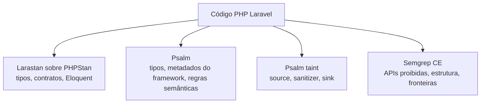

# SAST em Laravel

Aplicações Laravel precisam de mais de uma forma de análise estática porque o framework concentra comportamento em tipos dinâmicos, facades, métodos mágicos, relações Eloquent, configuração carregada em runtime e convenções descobertas por composição de serviços. Uma ferramenta que entende somente PHP genérico pode não compreender uma relação de modelo, enquanto uma ferramenta que entende tipos pode não acompanhar a origem de uma URL até uma requisição HTTP.

Este documento trata a análise do código Laravel como uma composição de três perspectivas. Psalm com o plugin Laravel acompanha tipos, metadados do framework e fluxos de dados contaminados. Larastan, sobre PHPStan, verifica tipos e contratos específicos do ecossistema Laravel. Semgrep CE complementa as duas ferramentas com regras estruturais, APIs proibidas e fronteiras arquiteturais.

O objetivo não é executar três cópias da mesma verificação. Cada gate deve responder a uma pergunta diferente.

| Gate | Pergunta principal | Evidência produzida |
| --- | --- | --- |
| Larastan sobre PHPStan | Os tipos, contratos, modelos e relações são coerentes? | Diagnósticos de tipo e regras Laravel |
| Psalm com plugin Laravel | O código é semanticamente consistente e dados não confiáveis alcançam sinks perigosos? | Diagnósticos de tipo, taint e regras do framework |
| Semgrep CE | O código respeita regras explícitas de segurança e arquitetura? | Findings estruturais, APIs proibidas e limites entre camadas |

## Larastan sobre PHPStan

[PHPStan](https://phpstan.org/user-guide/getting-started) analisa o código sem executá-lo como uma requisição. Ele infere tipos a partir das assinaturas, PHPDoc, retornos, genéricos e fluxo de controle. Isso permite encontrar chamadas incompatíveis, retornos incorretos, propriedades inexistentes e caminhos que podem receber `null`.

[Larastan](https://github.com/larastan/larastan) adiciona conhecimento sobre Laravel. Entre os pontos relevantes estão modelos Eloquent, relações, builders, collections, factories, views, facades e convenções do container. O analisador consegue interpretar muitos usos que pareceriam `mixed` para o PHPStan puro.

O gate deve usar o mesmo arquivo de configuração local do projeto e o mesmo `composer.lock` usado pela aplicação. Um exemplo mínimo é:

```neon
includes:
    - vendor/larastan/larastan/extension.neon
    - phpstan-baseline.neon

parameters:
    level: 5
    paths:
        - app
```

A execução deve falhar quando aparece um diagnóstico novo fora do baseline:

```sh
vendor/bin/phpstan analyse \
  --configuration=phpstan.neon \
  --memory-limit=512M
```

O baseline é uma fronteira temporária para dívida conhecida. Ele não transforma um erro em comportamento correto. Cada entrada precisa ter uma razão para existir, uma localização estável e, quando possível, uma tarefa de remoção. Não se deve gerar baseline a partir de findings de segurança, nem atualizar o baseline automaticamente para esconder regressões.

### O que o Larastan encontra

O gate é particularmente útil para verificar:

- retorno de handlers, readers e DTOs;
- tipos de paginator, collections e builders;
- relações declaradas em modelos;
- propriedades acessadas por convenções Eloquent;
- parâmetros de policies, resources, jobs e listeners;
- contratos entre controllers, camada de aplicação e read models;
- chamadas de métodos que o Laravel resolve magicamente, mas que não existem no modelo;
- inconsistências introduzidas quando um campo editorial muda de tipo.

PHPStan não é um detector geral de SQL injection. Uma chamada que possui tipos corretos ainda pode construir uma consulta insegura. Essa limitação é uma das razões para manter Psalm em modo taint.

## Psalm com plugin Laravel

[Psalm](https://psalm.dev/docs/) oferece inferência de tipos e análise de fluxo. O [plugin Laravel do Psalm](https://github.com/psalm/psalm-plugin-laravel) inicializa o framework em um contexto controlado e fornece stubs, metadados de modelos, relações, atributos e sinks específicos do Laravel.

O plugin não precisa abrir uma conexão com o banco para inferir as relações. Ele pode examinar migrations e dumps de schema para obter nomes e tipos de colunas. Isso é importante para o gate: análise estática deve ser reproduzível e não deve depender da disponibilidade de PostgreSQL, de dados editoriais ou de um cluster externo.

A configuração básica habilita o plugin:

```xml
<plugins>
    <pluginClass class="Psalm\LaravelPlugin\Plugin">
        <resolveDynamicWhereClauses value="true" />
    </pluginClass>
</plugins>
```

### Dois modos no Psalm 6

Na linha do plugin que usa Psalm 6, análise de tipos e análise de taint são execuções distintas. O pipeline deve executar as duas:

```sh
vendor/bin/psalm --config=psalm.xml --no-diff --no-progress
vendor/bin/psalm --config=psalm.xml --taint-analysis --no-diff --no-progress
```

O primeiro comando verifica tipos e regras semânticas. O segundo acompanha dados marcados como não confiáveis desde uma source até um sink. Não se deve configurar `runTaintAnalysis="true"` no XML dessa linha, pois isso transformaria toda execução em uma varredura de taint e deixaria o gate de tipos de fora.

### Vulnerabilidades acompanhadas pelo plugin

O plugin possui modelos para classes de falha que são difíceis de detectar por comparação textual:

- SQL injection em builders, queries raw, `orderBy` dinâmico e statements;
- XSS em respostas HTML, `HtmlString` e conteúdo que não foi escapado;
- shell injection em execução de processos;
- path traversal em filesystem e Storage;
- SSRF em clientes HTTP com URLs controladas por entrada;
- open redirect em redirecionamentos derivados de entrada;
- comparação variável de segredos, quando `hash_equals` seria necessário;
- fluxos de prompt e saída de modelos, quando a integração de IA estiver instalada.

Por exemplo, validar apenas que uma variável é `string` não torna uma URL segura:

```php
$url = (string) $request->input('url');
Http::get($url);
```

O fluxo correto precisa restringir esquema, host, resolução DNS, endereços privados, portas e redirecionamentos. Quando a validação está em um helper, a garantia deve ser expressa para o analisador por uma anotação de taint ou por uma API cuja saída represente explicitamente o valor validado. Essa anotação só é correta quando o helper realmente impõe todos os invariantes de segurança.

Para SQL, parâmetros devem continuar separados do texto da consulta:

```php
DB::select(
    'select * from findings where identifier = :identifier',
    ['identifier' => $identifier],
);
```

O binding não resolve nomes de coluna, ordem ou fragmentos de SQL. Esses valores devem ser escolhidos a partir de um mapa fechado, nunca concatenados diretamente a partir de uma requisição.

### Baseline do Psalm

Um projeto existente pode ter dívida de tipagem antes da ativação do gate. O procedimento seguro é executar o modo de tipos, revisar os erros, corrigir os riscos reais e gerar um baseline somente para os diagnósticos remanescentes de tipagem:

```sh
vendor/bin/psalm --config=psalm.xml --set-baseline=psalm-baseline.xml
```

O comando de taint nunca deve gerar esse arquivo. Se um finding de `TaintedSSRF`, `TaintedSql`, `TaintedHtml` ou equivalente for colocado no baseline, a proteção de segurança deixa de bloquear a regressão. O modo de taint deve usar `--ignore-baseline` quando o projeto possuir um baseline compartilhado:

```sh
vendor/bin/psalm \
  --config=psalm.xml \
  --taint-analysis \
  --ignore-baseline \
  --no-diff \
  --no-progress
```

A política adequada é corrigir o finding, modelar o sanitizer real ou ajustar o fluxo para tornar a validação explícita. Suppression ampla no arquivo inteiro deve ser tratada como uma falha de desenho do gate.

## Semgrep CE

[Semgrep](https://semgrep.dev/docs/) trabalha sobre a estrutura sintática do código. Ele não substitui os analisadores de tipos nem o taint interprocedural do Psalm, mas é excelente para regras locais e de alta intenção.

No Laravel, o Semgrep CE deve ser usado para quatro classes de regra:

1. Secure coding, como padrões de APIs perigosas ou respostas construídas de modo inseguro.
2. Banned APIs, como execução de processo direta sem um adapter autorizado.
3. Architectural boundaries, como acesso direto ao banco a partir de controllers que deveriam delegar para a camada de aplicação.
4. Regras próprias, derivadas de decisões concretas do projeto e mantidas junto ao código.

Uma regra de API proibida pode ser pequena e determinística:

```yaml
rules:
  - id: laravel-banned-process-execution
    languages:
      - php
    message: Use an approved application service instead of a direct process execution API.
    severity: ERROR
    pattern-either:
      - pattern: shell_exec(...)
      - pattern: exec(...)
      - pattern: system(...)
      - pattern: passthru(...)
```

Uma regra arquitetural deve ser estreita o bastante para evitar falsos positivos. Por exemplo, proibir `DB::table`, `DB::select`, `DB::statement`, `DB::unprepared` e `DB::raw` somente em `app/Http/Controllers` não impede readers ou adapters de usar a infraestrutura no local correto. A regra não deve proibir todo uso de `query` em um controller, porque `Request::query` é leitura de entrada HTTP e não acesso ao banco.

O comando do gate combina as regras automáticas do Semgrep com as regras locais:

```sh
semgrep scan \
  --config auto \
  --config .config/semgrep/laravel.yml \
  --error \
  app config routes
```

Regras locais devem ter identificador estável, severidade explícita, categoria, confiança e uma área de aplicação clara. Uma regra nova precisa ser testada contra um exemplo positivo e um exemplo negativo antes de ser habilitada como bloqueante.

## Composição dos gates

As três ferramentas formam camadas complementares:



O diagrama é conceitual. Cada gate deve continuar executável de forma independente, para que um diagnóstico possa ser reproduzido localmente sem precisar rodar toda a CI.

Neste repositório, o gate Laravel é chamado pelo recipe de verificação da aplicação. A execução passa pelo Compose para usar a mesma imagem PHP e o mesmo `vendor` que a aplicação usa. O `just check` também mantém as verificações já existentes do frontend, incluindo TypeScript, lint, regras AST, duplicação, dependências, secrets, vulnerabilidades e Semgrep automático. Ativar análise PHP não substitui esses gates do `public-app`.

Uma ordem prática para feedback é:

1. executar PHPStan/Larastan para erros baratos de contrato;
2. executar Psalm em modo de tipos;
3. executar Psalm em modo de taint;
4. executar Semgrep local e automático;
5. executar testes unitários, de integração e de contrato.

O pipeline pode paralelizar os quatro primeiros passos, mas o diagnóstico deve conservar o nome do gate. Misturar todas as saídas em uma única etapa torna difícil distinguir regressão de tipo, vulnerabilidade de fluxo e violação de arquitetura.

## O que cada ferramenta não garante

Nenhum desses gates prova que o sistema é seguro. Larastan não valida autorização de negócio, Psalm não conhece sozinho toda a topologia de rede e Semgrep não compreende necessariamente o comportamento de um serviço registrado dinamicamente no container.

Também permanecem fora do escopo direto:

- configuração efetiva do ingress, proxy, firewall e banco;
- permissões reais de produção;
- segredos fornecidos pelo ambiente;
- dependências comprometidas depois da análise;
- comportamento emergente de filas, concorrência e timeouts;
- vulnerabilidades que só aparecem com a aplicação em execução.

SAST deve ser combinado com SCA, secret scanning, revisão de código, testes de autorização, DAST, observabilidade e hardening de runtime. Um resultado verde significa que os contratos modelados pelos gates foram respeitados, não que todas as ameaças desapareceram.

## Tratamento de findings

Quando um gate falhar, o primeiro passo é reproduzir somente a ferramenta que produziu o finding. Depois é preciso classificar o resultado como vulnerabilidade real, bug de tipo, violação arquitetural, falso positivo ou limitação do modelo.

Findings reais devem ser corrigidos no código ou na fronteira que valida a entrada. Falsos positivos devem ser reduzidos melhorando a regra, o stub ou o modelo de sanitizer. Suppression local só é aceitável quando a garantia está escrita na própria API ou em uma validação verificável. Suppression global, baseline sem proprietário e regra desabilitada por causa de ruído removem a função do gate.

## Referências

- [Psalm](https://psalm.dev/docs/)
- [Psalm Laravel Plugin](https://github.com/psalm/psalm-plugin-laravel)
- [Psalm security analysis](https://psalm.dev/docs/security_analysis/)
- [PHPStan](https://phpstan.org/user-guide/getting-started)
- [Larastan](https://github.com/larastan/larastan)
- [Semgrep documentation](https://semgrep.dev/docs/)
- [Laravel security](https://laravel.com/docs/12.x/security)
