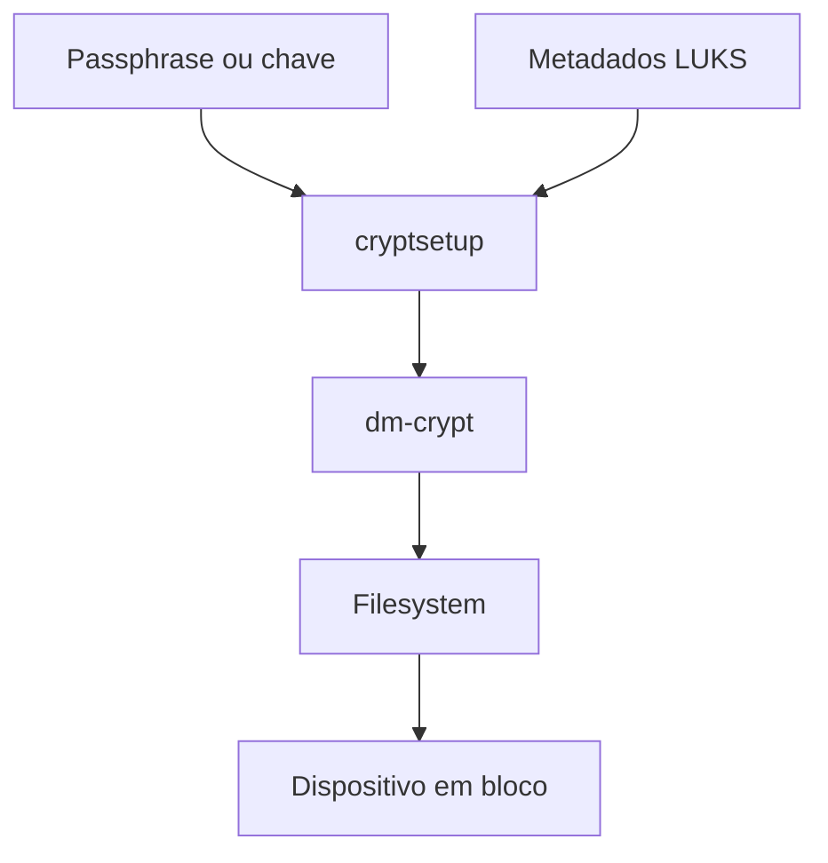

# LUKS

Linux Unified Key Setup, LUKS, é um formato para criptografia de volumes em
bloco no Linux. Ele define metadados, slots de chave e a relação com o
device-mapper, normalmente por meio do `dm-crypt`. LUKS protege dados em
repouso quando o dispositivo está desligado ou bloqueado; não protege um
filesystem já montado contra um processo que possui acesso autorizado ao
conteúdo.

## Modelo de camadas

O fluxo típico é:

O filesystem fica acima do mapeamento criptográfico. Particionar um disco,
criar um volume LVM e formatar um filesystem são operações diferentes de criar
o contêiner LUKS. A ordem das camadas muda o que é possível redimensionar e
como o backup deve ser restaurado.

## Slots de chave

O cabeçalho LUKS contém slots que protegem a chave mestra do volume usando
passphrases ou chaves diferentes. Adicionar uma nova passphrase não recifra
todo o conteúdo: cria outro mecanismo para desbloquear a mesma chave mestra.
Isso permite rotação e recuperação, desde que haja uma janela planejada para
remover o slot antigo.

LUKS2 possui metadados mais extensíveis, suporte a políticas de desbloqueio e
integrações modernas. O cabeçalho é parte do acesso ao volume. Perder o
dispositivo e o cabeçalho, ou sobrescrever sua área, pode impedir a abertura
mesmo que os blocos de dados ainda estejam intactos. Mantenha um backup do
header em local protegido, separado do disco, e valide sua restauração.

## Chaves e boot

Uma passphrase humana tem propriedades diferentes de uma chave aleatória. TPM,
rede, FIDO2, `systemd-cryptenroll` e agentes externos podem participar do
desbloqueio, mas cada integração cria uma dependência de boot e recuperação.
Não elimine a passphrase de recuperação até provar que o caminho automático
funciona em um boot limpo, em uma troca de hardware e em um cenário de restaure.

Criptografia de disco não corrige permissões, malware em um sistema desbloqueado,
exposição de chaves na memória ou apagamento lógico. Ela reduz o valor de um
disco roubado, mas a política precisa incluir senha, backup, secure boot,
atualizações e resposta a comprometimento.

## Operação segura

Antes de alterar um volume, identifique o dispositivo por UUID, confirme os
backups e registre a camada de armazenamento. Não execute `luksFormat` em uma
partição que contém dados sem uma confirmação explícita. Para rotação, adicione
e teste o novo slot, valide o desbloqueio após reinício e só então remova o
slot antigo. Em volumes de produção, monitore espaço de metadados e o estado
dos mapeamentos antes de redimensionar partições ou filesystems.

## Relações

- [Filesystem Linux](../../sistemas/armazenamento/filesystems/index.md) explica a camada acima do volume.
- [LVM](../../sistemas/armazenamento/lvm.md) organiza volumes sobre ou sob uma camada criptográfica.
- [TPM](../hardware/tpm.md) explica um possível ancoramento de chaves no hardware.
- [Secure Boot](../../sistemas/boot/firmware/secure-boot/index.md) trata a integridade do caminho de inicialização.

## Fontes primárias

- [cryptsetup](https://gitlab.com/cryptsetup/cryptsetup)
- [LUKS2 specification](https://gitlab.com/cryptsetup/LUKS2-docs)
- [dm-crypt no kernel Linux](https://www.kernel.org/doc/html/latest/admin-guide/device-mapper/dm-crypt.html)
