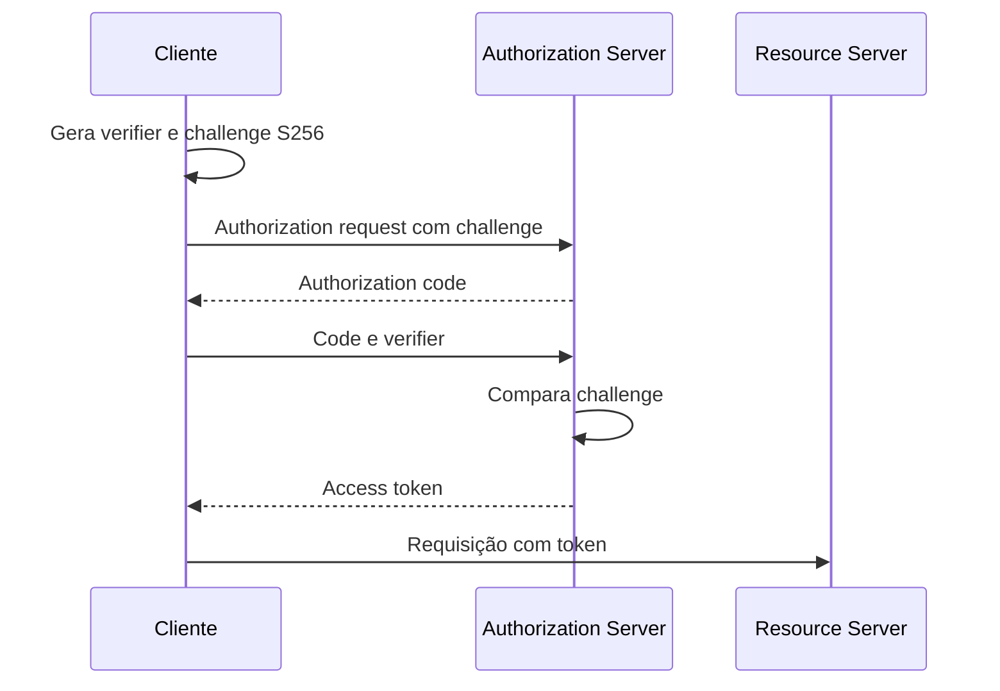

# PKCE

Proof Key for Code Exchange, PKCE, é uma extensão do fluxo Authorization Code
do OAuth 2.0. O cliente cria um segredo temporário, envia apenas sua derivação
na autorização e prova o conhecimento do segredo ao trocar o code por tokens.
Isso reduz o risco de um código de autorização interceptado ser resgatado por
outro cliente, especialmente em aplicações móveis, desktop e outros clientes
públicos que não conseguem guardar um client secret com segurança.

## Fluxo

O cliente gera um `code_verifier` aleatório e calcula:

```text
code_challenge = BASE64URL(SHA256(code_verifier))
```

Na autorização, envia `code_challenge` e `code_challenge_method=S256`. Depois
do redirect, o cliente envia o `authorization_code` e o `code_verifier` ao
token endpoint. O servidor recalcula a derivação e rejeita a troca quando os
valores não correspondem.



O `state` continua necessário para proteger o callback contra mistura de
respostas entre transações. PKCE não substitui `state`, redirect URI exata,
TLS, validação de issuer ou escopo mínimo. O método `S256` deve ser preferido;
`plain` só deve existir quando uma especificação compatível exigir e a política
aceitar seu risco.

## O que PKCE não resolve

PKCE protege a troca do code, mas não impede roubo de um access token já emitido,
malware no dispositivo, redirect URI permissiva ou uma aplicação que recebe um
escopo maior que o necessário. Também não transforma um cliente público em
cliente confidencial. Tokens precisam de expiração, audience, scopes, rotação
quando aplicável e armazenamento compatível com a plataforma.

Não use PKCE para esconder um client secret dentro de JavaScript distribuído.
O verifier é um segredo transitório da transação; não é uma credencial de
identidade permanente do cliente.

## Relações

- [OAuth 2.0](oauth2.md) apresenta autorização e token endpoints.
- [OpenID Connect](openid-connect.md) adiciona identidade sobre OAuth.
- [State em OAuth](https://www.rfc-editor.org/rfc/rfc6749) e [RFC 7636](https://www.rfc-editor.org/rfc/rfc7636) definem o fluxo.

## Fontes primárias

- [RFC 7636, PKCE](https://www.rfc-editor.org/rfc/rfc7636)
- [OAuth 2.0 Security Best Current Practice](https://www.rfc-editor.org/rfc/rfc9700)
- [OAuth 2.0](https://www.rfc-editor.org/rfc/rfc6749)
