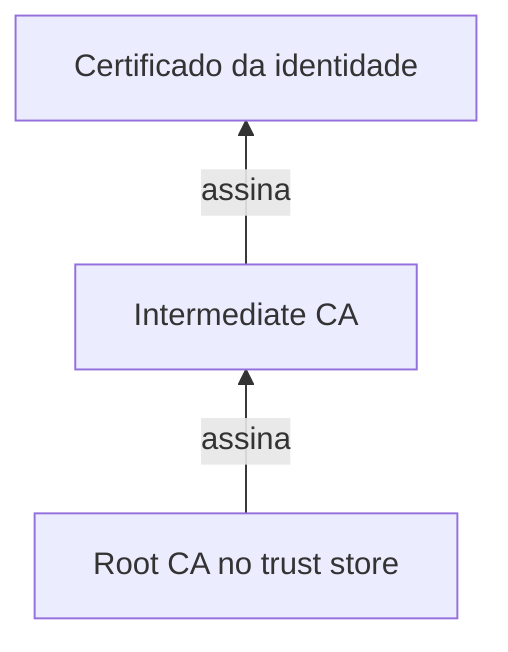
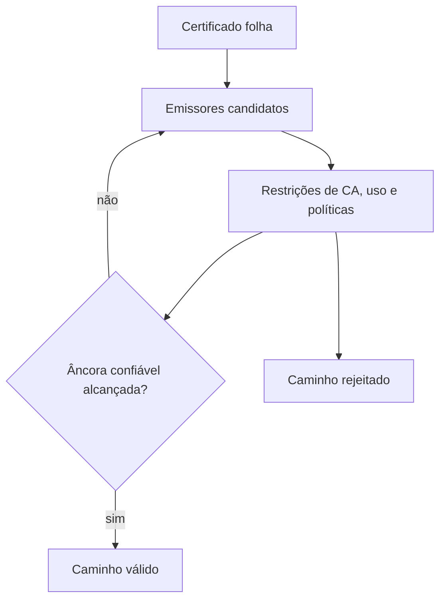

# Cadeia de certificados

Uma cadeia de certificados liga o certificado apresentado por uma identidade a uma
âncora que o verificador confia. A folha identifica o servidor ou cliente, uma CA
intermediária assina a folha e uma raiz, instalada no trust store, fecha o caminho.
O caminho pode ter mais de uma intermediária, desde que as restrições e a profundidade
permitam essa composição.

Uma cadeia não é apenas a ordem em que os certificados aparecem num arquivo. Ela é
um caminho construído pelo verificador a partir de emissores possíveis, âncoras
instaladas e políticas do uso. A mesma folha pode produzir resultados diferentes em
dois clientes porque os trust stores, as bibliotecas, o horário ou as políticas de
revogação são diferentes.

## Caminho de confiança



O certificado contém a chave pública e a assinatura do emissor, não a chave privada
que corresponde àquela identidade. Para construir o caminho, o verificador procura
um emissor compatível, confere a assinatura com a chave pública do emissor e repete
o processo até alcançar uma âncora que já considera confiável. A raiz não precisa
ser validada por uma CA acima dela, porque sua confiança veio de uma instalação
administrativa ou de uma política do runtime.

## O que o verificador confere

Validar a cadeia não é apenas seguir assinaturas. O verificador também confere o
período de validade, `basicConstraints`, `keyUsage`, `extendedKeyUsage`, políticas,
restrições de nome, comprimento máximo do caminho e, para um servidor TLS, o SAN
contra o nome solicitado. Em mTLS, o mesmo raciocínio é aplicado à cadeia do cliente,
com uso compatível com `clientAuth`.

Um certificado pode ter sido assinado por uma CA correta e ainda ser recusado porque
foi emitido para outro nome, tem uso incompatível, está expirado ou não pode ser
encadeado ao trust store daquele cliente. A cadeia apresentada pelo servidor e as
âncoras instaladas no cliente são entradas diferentes da validação.

O verificador também precisa rejeitar uma intermediária que não tenha `CA:TRUE`, uma
assinatura feita com uso incompatível ou um caminho maior que o permitido por
`pathLenConstraint`. `authorityKeyIdentifier` e `subjectKeyIdentifier` ajudam a
encontrar relações, mas não substituem a verificação criptográfica. Um nome ou um
identificador coincidente nunca deve ser tratado como prova de que o emissor assinou
o certificado.

## Construção do caminho

Construir uma cadeia é um problema de busca com restrições, não uma simples leitura
de uma lista enviada pelo servidor. O verificador começa pela folha, procura um
certificado cujo nome seja o emissor e cuja chave possa verificar a assinatura,
aplica as restrições dessa autoridade e repete o processo até alcançar uma âncora
confiável.



O conjunto de candidatos pode vir do handshake, do trust store, de um diretório
local, de um cache ou de uma busca AIA. Muitos clientes não baixam a intermediária
automaticamente, seja por segurança, privacidade, previsibilidade ou ausência de
conectividade. Um servidor deve, portanto, enviar as intermediárias necessárias em
vez de depender de uma busca que o cliente pode nunca fazer.

Quando existem duas intermediárias com o mesmo nome, o verificador precisa comparar
chaves, identificadores, assinatura e restrições. Escolher pelo texto de `subject`
seria insuficiente. Uma CA antiga e uma CA nova podem ter nomes parecidos, mas
produzir caminhos com algoritmos, validade e políticas diferentes.

## Restrições que mudam o resultado

`basicConstraints` diz se o certificado pode ser uma CA. `pathLenConstraint` limita
quantas autoridades subordinadas podem aparecer abaixo dela. `keyUsage` restringe
operações criptográficas, enquanto `extendedKeyUsage` separa finalidades como
`serverAuth`, `clientAuth`, assinatura de código ou proteção de email.

`nameConstraints` limita nomes que uma CA intermediária pode emitir. É uma proteção
útil para autoridades delegadas, mas sua compatibilidade precisa ser testada com
clientes reais. Políticas de certificado, restrições de algoritmo e regras locais
também podem excluir um caminho que seria matematicamente válido.

A folha pode ser válida para uma conexão de servidor e inválida para autenticação de
cliente. O mesmo caminho pode ser aceito em um processo que pede `serverAuth` e
rejeitado em outro que pede `clientAuth`. Por isso, testes de cadeia devem declarar
o propósito, o hostname e o ambiente de confiança.

## AIA não é garantia de recuperação

O campo `authorityInfoAccess` pode apontar para a intermediária ou para um respondedor
OCSP. Usá-lo automaticamente exige uma decisão de rede e de segurança: o cliente
precisaria baixar um certificado de uma origem externa durante a validação, lidar
com timeout e validar esse material antes de continuar. Muitos runtimes não fazem
isso ou fazem somente em configurações específicas.

Em sistemas privados, prefira distribuir intermediárias por imagem, trust store,
Secret, bundle ou mecanismo próprio de configuração. A distribuição deve ser
versionada e ter rollback. AIA pode continuar publicado para clientes compatíveis,
mas não deve ser a única forma de garantir que um workload consiga montar a cadeia.

## Cadeia enviada e cadeia confiável

O bundle usado para apresentar um certificado não é o mesmo que o trust store usado
para verificar o par. O servidor normalmente envia folha e intermediárias. O cliente
mantém a raiz ou a CA intermediária confiável. Enviar a raiz não torna uma CA nova
confiável e pode ocultar um problema de distribuição do trust store.

| Material | Deve conter | Deve evitar |
| --- | --- | --- |
| Bundle do servidor | Folha e intermediárias necessárias | Chave privada e raiz sem necessidade |
| Trust store do cliente | Âncoras aprovadas para servidores | Todas as CAs encontradas na internet |
| Bundle de mTLS do servidor | CA ou intermediárias de clientes aceitos | CAs de ambientes não relacionados |
| Cadeia do cliente | Folha e intermediárias exigidas pelo servidor | Raiz privada como substituto de confiança |

Separar esses materiais reduz a chance de instalar uma autoridade de cliente como
uma autoridade de servidor ou de confiar em toda uma raiz quando apenas uma
intermediária deveria ser aceita.

## Cross-signing e caminhos alternativos

Uma autoridade pode aparecer em mais de um caminho, por exemplo, por assinatura
cruzada durante a transição entre raízes. Clientes diferentes podem escolher
caminhos diferentes por causa da data de validade das raízes, dos algoritmos aceitos,
do trust store instalado e das regras de preferência da biblioteca.

Durante uma migração de CA, teste pelo menos clientes antigos, clientes atualizados,
containers, navegadores, proxies e runtimes de linguagem. Remover uma raiz do
servidor não a remove do trust store do cliente; adicionar uma raiz no servidor
também não instala confiança no cliente.

O objetivo de uma cadeia cruzada é compatibilidade transitória, não acumular todas
as combinações para sempre. Depois que os consumidores migraram, retire caminhos
desnecessários e monitore quais certificados ainda dependem deles antes de encerrar
a autoridade antiga.

## O que o servidor apresenta

Um servidor normalmente envia o certificado folha seguido das intermediárias, na
ordem que permite ao cliente montar o caminho. Ele normalmente não envia a raiz:
além de ser redundante, enviar uma raiz inesperada pode confundir diagnósticos sobre
qual âncora o cliente realmente considera confiável.

Uma falha recorrente é instalar apenas a folha no servidor. O certificado pode ser
válido quando testado com um arquivo local que já contém a intermediária, mas falhar
em clientes que não conseguem buscá-la por AIA ou que deliberadamente não fazem esse
download. O pacote de cadeia deve ser testado com os mesmos trust stores e clientes
do ambiente real.

## CA raiz e intermediária

A raiz deve permanecer offline ou em uma custódia mais protegida, pois seu
comprometimento afeta todos os certificados abaixo dela. A intermediária é a
autoridade normalmente usada para emissão diária. Ela pode ter validade menor,
escopo restrito e uma política de revogação mais operacional.

Separar raiz e intermediária também permite renovar a autoridade de emissão sem
redistribuir imediatamente uma nova raiz para todos os consumidores. Durante uma
rotação, pode haver duas intermediárias confiáveis por um período de sobreposição,
desde que a política aceite as duas cadeias.

Na troca de raiz, a sobreposição é mais delicada. Clientes precisam confiar na raiz
nova antes de receberem folhas assinadas por ela, enquanto a raiz antiga precisa
continuar disponível até que nenhum certificado válido dependa dela. Em sistemas com
clientes antigos, uma cadeia cruzada pode ampliar a compatibilidade, mas também cria
mais caminhos possíveis e exige testes com cada trust store.

## Diagnóstico

Use `openssl s_client -showcerts` para observar a cadeia apresentada e
`openssl verify -CAfile` com `-untrusted` para testar uma construção explícita do
caminho. Compare o resultado com o trust store do navegador, do sistema, do proxy e
da linguagem usada pela aplicação, pois esses stores podem ser diferentes.

Um procedimento reproduzível separa a cadeia recebida, a âncora e o propósito:

```bash
openssl s_client \
  -connect api.example.test:443 \
  -servername api.example.test \
  -showcerts \
  -verify_return_error </dev/null

openssl verify \
  -CAfile root-ca.pem \
  -untrusted intermediate-ca.pem \
  -purpose sslserver \
  -verify_hostname api.example.test \
  server.cert.pem
```

`s_client` mostra o que o endpoint realmente enviou; `verify` mostra se o caminho
construído com os arquivos selecionados é aceito. Se o primeiro funcionar e o segundo
falhar, a extração ou a âncora usada no teste está diferente. Se o segundo funcionar
e um cliente real falhar, investigue trust store, hostname, propósito, horário,
algoritmos e política de revogação desse cliente.

Para mTLS, repita a análise com `-purpose sslclient` e a CA que autoriza identidades
de cliente. Não teste somente uma folha de servidor e conclua que a cadeia de mTLS
está correta: uso estendido, intermediária e trust store podem ser diferentes nos
dois sentidos.

Não trate a mensagem "unable to get local issuer certificate" como prova de que a
folha está errada. Ela pode indicar que o servidor não enviou uma intermediária, que
o cliente não possui a raiz correta ou que uma CA privada não foi distribuída ao
consumidor.

| Sintoma | Causa provável | Verificação |
| --- | --- | --- |
| `unable to get local issuer` | Intermediária ausente ou CA privada não instalada | Inspecione a cadeia enviada e o trust store. |
| `certificate has expired` | Relógio incorreto ou certificado vencido | Compare horário, `notBefore` e `notAfter`. |
| Nome rejeitado | SAN não contém o hostname usado | Verifique SAN, SNI e o nome real da conexão. |
| Uso inválido | `serverAuth` e `clientAuth` não correspondem | Inspecione `extendedKeyUsage`. |
| Funciona no OpenSSL, falha no app | Trust store ou política diferente | Teste com a biblioteca e o container reais. |

O diagnóstico deve começar pelo certificado recebido na rede. Inspecione a saída de
`openssl s_client -showcerts`, extraia cada PEM, confira emissor e serial e então
repita a validação com o trust store do processo. Não corrija uma falha de cadeia
instalando a raiz aleatoriamente no cliente: isso pode mascarar uma emissão errada e
ampliar a confiança além do necessário.

## Construção do caminho em clientes diferentes

Uma cadeia enviada pelo servidor não é necessariamente o caminho que o cliente
vai construir. O servidor normalmente envia a folha e as intermediárias, enquanto
o cliente escolhe uma âncora confiável que já existe no trust store. A biblioteca
pode tentar mais de uma intermediária, seguir referências AIA, rejeitar uma
restrição de nome ou escolher uma cadeia cross-signed diferente da esperada.

Por isso, "o servidor enviou a cadeia" e "o cliente confia na cadeia" são
afirmações distintas. O teste precisa usar o trust store real do processo, a
versão real da biblioteca, o hostname real e o relógio do ambiente real. Um
certificado instalado no sistema operacional pode não ser usado por um container,
um runtime Java ou um cliente que mantém o próprio bundle.

## Restrições que mudam a autorização

Mesmo com assinaturas válidas, a validação pode falhar ou a política pode negar o
uso. `basicConstraints` distingue uma CA de uma folha; `keyUsage` limita operações
criptográficas; `extendedKeyUsage` separa servidor e cliente; `nameConstraints`
pode limitar namespaces; e o SAN define a identidade que o protocolo deve
comparar. Uma cadeia tecnicamente válida não autoriza qualquer finalidade.

Em uma auditoria, registre a âncora, o caminho escolhido, o propósito, o hostname,
o resultado de revogação e a versão do trust store. Sem esses dados, duas
máquinas podem receber o mesmo certificado e produzir decisões diferentes sem que
o operador saiba qual premissa mudou.

## Relações

- [Trust store](trust-store.md) explica onde a âncora é instalada.
- [Root CA](root-ca.md) explica a autoridade no topo do caminho.
- [Intermediate CA](intermediate-ca.md) explica a autoridade de emissão diária.
- [Certificado X.509](certificate.md) detalha os campos da folha.
- [OpenSSL para PKI](openssl.md) mostra geração, assinatura e verificação.

## Fontes primárias

- [RFC 5280, path validation](https://www.rfc-editor.org/rfc/rfc5280)
- [Nginx SSL certificate chains](https://nginx.org/en/docs/http/configuring_https_servers.html#chains)
