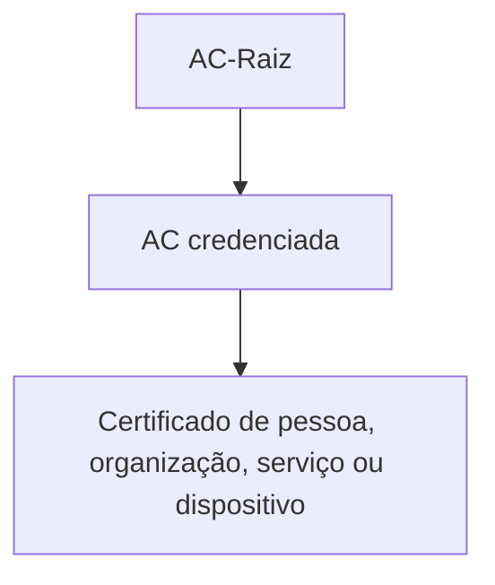

# ICP-Brasil

A Infraestrutura de Chaves Públicas Brasileira, conhecida como ICP-Brasil, é a
infraestrutura nacional para emissão, distribuição, uso, validação e revogação
de certificados digitais com presunção jurídica definida pela legislação
brasileira. Ela não é um único tipo de certificado nem um produto de uma
autoridade certificadora. É um conjunto de políticas, autoridades, serviços,
procedimentos e repositórios que formam uma cadeia de confiança.

A ICP-Brasil deve ser distinguida da Web PKI usada por navegadores para confiar
em certificados TLS de sites. Um certificado emitido dentro da ICP-Brasil não
se torna automaticamente confiável em qualquer navegador, sistema operacional
ou biblioteca TLS. O software precisa possuir a raiz correspondente em seu
trust store, ou receber essa confiança por uma configuração explícita.

## Quem decide e quem opera

O Comitê Gestor da ICP-Brasil define as políticas, os critérios de
credenciamento e as normas técnicas e operacionais da infraestrutura. Ele
estabelece o contexto regulatório em que as autoridades e os prestadores devem
atuar.

O Instituto Nacional de Tecnologia da Informação, o ITI, exerce a função de
Autoridade Certificadora Raiz da ICP-Brasil. O ITI mantém a raiz de confiança,
credencia e supervisiona entidades conforme as competências previstas para a
infraestrutura, emite certificados para autoridades de nível inferior e
mantém serviços de publicação e auditoria da cadeia.

A separação é importante: o Comitê Gestor define políticas, enquanto a
AC-Raiz executa funções técnicas e operacionais de confiança. O ITI não é a
autoridade que normalmente cadastra cada cidadão ou empresa e emite o
certificado final usado pelo titular.

## A hierarquia da cadeia

Uma cadeia típica possui estes níveis:

1. A AC-Raiz, operada pelo ITI, é a âncora de confiança.
2. Uma ou mais Autoridades Certificadoras, as ACs, recebem certificados da
   AC-Raiz e operam de acordo com políticas e declarações de práticas
   aprovadas.
3. Uma Autoridade de Registro, a AR, atende o solicitante, confere sua
   identidade e reúne as evidências necessárias para o processo de emissão.
4. O certificado final é emitido para uma pessoa, organização, sistema,
   equipamento ou serviço, conforme a política aplicável.

O caminho de validação normalmente é construído do certificado final para sua
AC emissora, da AC emissora para a autoridade superior e, por fim, para uma
raiz que o verificador já considera confiável. A assinatura de cada
certificado comprova que a autoridade superior assinou a chave pública e os
atributos daquele certificado. Ela não prova, sozinha, que o certificado ainda
está válido ou que pode ser usado para qualquer finalidade.

Uma cadeia pode ser representada conceitualmente assim:

Certificados intermediários permitem separar a chave da raiz das operações
diárias. A raiz pode permanecer protegida e ser usada raramente, enquanto as
ACs subordinadas fazem emissões em maior volume. Os campos `Basic Constraints`,
`Key Usage`, `Extended Key Usage`, `Subject`, `Issuer`, `Authority Key
Identifier` e `Subject Key Identifier` ajudam o verificador a interpretar os
papéis e as relações entre os certificados.

## O papel da AC e da AR

A AR é a interface de registro entre o titular e a AC. Ela valida a identidade,
confere documentos e executa os procedimentos exigidos pela política de
certificação. A AR não substitui a AC e não deve ser confundida com a entidade
que assina o certificado.

A AC avalia a solicitação conforme sua política, emite e assina o certificado,
mantém os registros necessários e publica informações de revogação. Em alguns
modelos, também opera certificados de AC subordinadas. O alcance exato de suas
responsabilidades depende da política de certificação e da declaração de
práticas aplicável.

O titular possui um par de chaves. A chave pública é incorporada ao
certificado, junto com a identidade e as extensões autorizadas. A chave
privada deve permanecer sob controle do titular. Se ela for copiada, exposta
ou usada por outra pessoa, a identidade do titular deixa de ser uma proteção
suficiente.

## Como um certificado é emitido

O fluxo concreto varia conforme o tipo de certificado, a política e o método
de identificação, mas a sequência conceitual é a seguinte:

1. O solicitante escolhe a política e a finalidade do certificado.
2. Um par de chaves é criado. A chave privada deve ser gerada e protegida em
   um dispositivo ou serviço compatível com o nível de segurança exigido.
3. O solicitante cria uma CSR contendo a chave pública e os atributos da
   solicitação, e assina a CSR com a chave privada correspondente.
4. A AR verifica a identidade e os documentos exigidos.
5. A AC confere a solicitação, aplica a política e assina o certificado.
6. O titular recebe o certificado e, quando necessário, a cadeia intermediária
   usada pelos verificadores.

A CSR não é o certificado. Ela é uma solicitação assinada que demonstra posse
da chave privada correspondente à chave pública solicitada. O certificado só
passa a existir depois que uma AC o emite.

## Como a cadeia é validada

Um verificador precisa realizar mais do que conferir uma assinatura. Em geral,
ele precisa:

- construir um caminho até uma raiz confiável;
- validar as assinaturas de cada elo;
- verificar o período de validade de cada certificado;
- conferir se o nome, o identificador ou o domínio corresponde ao uso;
- respeitar `Key Usage` e `Extended Key Usage`;
- verificar restrições de CA, políticas e comprimento do caminho;
- consultar o estado de revogação quando o protocolo e o ambiente exigirem;
- confirmar que a cadeia está completa e que a raiz veio de uma fonte confiável.

A ausência de um intermediário no arquivo enviado pelo servidor não significa
necessariamente que a AC o omitiu. O servidor deve entregar os intermediários
necessários, enquanto a raiz normalmente é distribuída pelo sistema ou pela
aplicação. Em aplicações que usam ICP-Brasil, é necessário instalar e manter a
cadeia publicada pelo ITI ou por uma fonte institucional confiável, verificando
também os hashes publicados.

## Revogação, expiração e renovação

Expiração é o fim do período de validade definido no certificado. Revogação é
a invalidação antecipada. Uma AC pode revogar um certificado quando a chave
privada é comprometida, os dados estão incorretos, o vínculo com o titular
deixa de ser válido ou uma regra da política exige a medida.

Listas de certificados revogados, as CRLs, permitem consultar conjuntos
publicados pela autoridade. O OCSP permite consultar o estado de um certificado
individualmente, quando o serviço e o verificador suportam esse mecanismo.
Esses mecanismos dependem de disponibilidade, atualização e configuração. Uma
assinatura feita enquanto o certificado estava válido também pode exigir
carimbo do tempo e evidências de validação para continuar verificável no
futuro.

Renovar não é o mesmo que reativar um certificado revogado. A renovação cria
um novo certificado conforme a política vigente. O ciclo deve incluir proteção
da nova chave, distribuição da cadeia, atualização dos consumidores e
revogação controlada da credencial antiga quando necessário.

## A1, A3 e o modo de proteção da chave

As designações A1 e A3 são usadas no ecossistema brasileiro para distinguir
formas de armazenamento e proteção da chave privada. Elas não representam
níveis diferentes na hierarquia da ICP-Brasil e não indicam que uma AC seja
superior à outra.

Na prática, a escolha afeta portabilidade, disponibilidade, recuperação,
integração com aplicações e proteção contra cópia. Uma chave armazenada em
dispositivo criptográfico pode oferecer controles diferentes de uma chave
armazenada em arquivo. A análise deve considerar o risco do uso, a custódia da
chave, os requisitos do sistema e a capacidade de recuperação, sem tratar o
rótulo do tipo como substituto de uma avaliação de segurança.

## Assinatura, autenticação e criptografia

Um certificado identifica uma chave pública e declara usos autorizados. Ele
pode participar de uma assinatura digital, de autenticação de cliente ou de
um mecanismo de criptografia, mas essas finalidades não são intercambiáveis.

Para assinar, o titular usa a chave privada e o verificador usa a chave pública
do certificado. Para autenticar um cliente, o servidor pode exigir que o
cliente prove posse da chave privada durante um protocolo como TLS com
certificado de cliente. Para criptografar uma mensagem, o remetente usa a
chave pública do destinatário, que precisa da chave privada para decifrá-la.

O `Key Usage`, o `Extended Key Usage`, a política do certificado e as regras do
protocolo devem ser compatíveis com o uso pretendido. Ter uma cadeia válida não
autoriza automaticamente qualquer operação.

## O que administrar em produção

Uma implantação que depende da ICP-Brasil precisa tratar a cadeia como parte
do software e da operação, não como um arquivo esquecido no servidor. É
necessário manter inventário de certificados, titulares, usos, autoridades,
datas de expiração, pontos de publicação e responsáveis pela renovação.

Também é importante testar a validação no mesmo sistema que consumirá o
certificado. Um certificado pode funcionar em uma aplicação que possui a
cadeia instalada e falhar em outra que usa um trust store diferente. Imagens de
container, Java, navegadores, OpenSSL, dispositivos móveis e appliances podem
ter fontes de confiança distintas.

A cadeia oficial deve ser obtida do repositório do ITI. Não se deve instalar
uma raiz encontrada em um fórum, copiar uma cadeia sem conferir sua origem ou
desabilitar a validação para contornar um erro de configuração. Quando a cadeia
é atualizada, a mudança deve ser tratada como alteração de confiança, com
teste, revisão e distribuição controlada.

## Fontes primárias

- [ICP-Brasil, ITI](https://www.gov.br/iti/pt-br/assuntos/icp-brasil)
- [Entes da ICP-Brasil](https://www.gov.br/iti/pt-br/assuntos/icp-brasil/entes-da-icp-brasil)
- [Perguntas frequentes sobre a ICP-Brasil](https://www.gov.br/iti/pt-br/acesso-a-informacao/perguntas-frequentes/icp-brasil)
- [Comitê Gestor da ICP-Brasil](https://www.gov.br/iti/pt-br/assuntos/comite-gestor)
- [Autoridades Certificadoras](https://www.gov.br/iti/pt-br/assuntos/icp-brasil/autoridades-certificadoras)
- [Repositório de certificados das ACs](https://www.gov.br/iti/pt-br/assuntos/repositorio/certificados-das-acs-da-icp-brasil-arquivo-unico-compactado)
- [Navegadores e cadeia ICP-Brasil](https://www.gov.br/iti/pt-br/assuntos/navegadores)
- [DOC-ICP-15.03, validação de assinaturas digitais](https://www.gov.br/iti/pt-br/assuntos/legislacao/documentos-principais/IN2021_03_DOCICP15.03_compilada.pdf)
