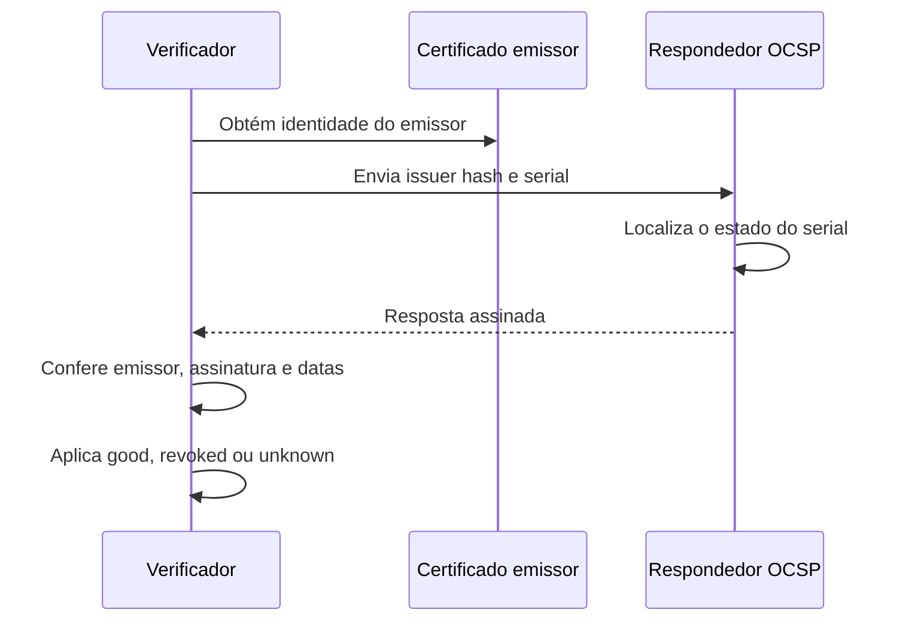
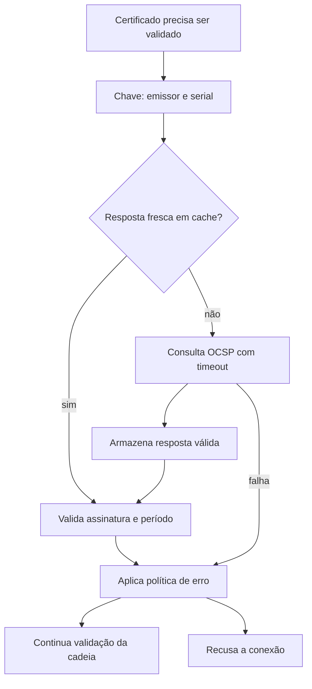
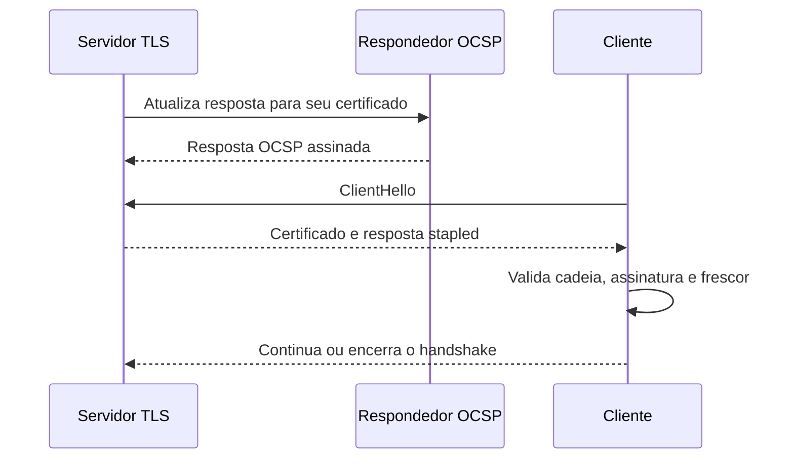

# OCSP

Online Certificate Status Protocol, OCSP, permite consultar se um certificado
está `good`, `revoked` ou `unknown` conforme uma resposta assinada pela autoridade
emissora ou por um respondedor delegado. Ele foi criado para evitar que cada cliente
precise baixar uma CRL completa quando precisa do estado de um único certificado.

OCSP é um protocolo de estado, não um substituto para a validação da cadeia. Uma
resposta `good` não confirma o nome do servidor, o uso permitido pela extensão
`KeyUsage`, o `ExtendedKeyUsage`, a validade temporal ou a assinatura do handshake.
Ela somente informa o estado do serial consultado perante uma CA específica.

## Como o cliente encontra o respondedor

O certificado pode trazer o endereço no campo `Authority Information Access`, usando
o método `id-ad-ocsp`. O cliente precisa primeiro identificar a CA que assinou a folha
e então escolher uma URL compatível com sua rede. Em ambientes privados, a URL pública
do emissor pode não ser alcançável pelo pod, host ou dispositivo que está validando a
conexão. Nesse caso, o sistema precisa de uma URL interna, um proxy de saída ou uma
resposta stapled previamente obtida pelo terminador.

A presença da URL não obriga o runtime a usá-la. A biblioteca pode estar configurada
para CRL apenas, pode ter OCSP desabilitado, pode operar em modo offline ou pode
aceitar a cadeia sem qualquer consulta. A política de revogação deve ser verificada
na documentação e em um teste real do runtime usado em produção.

## Anatomia da consulta

Uma requisição OCSP identifica o emissor e o certificado consultado. O identificador
inclui o hash do nome da CA, o hash da chave pública da CA e o serial da folha. O
respondedor não deve receber apenas o serial sem o contexto da CA, porque o mesmo
número pode aparecer em autoridades diferentes.



Uma resposta contém, entre outros campos, o estado do certificado, `thisUpdate`,
`nextUpdate` quando presente e o momento em que a resposta foi produzida. O cliente
deve conferir se o `SingleResponse` corresponde ao certificado pedido e se o
respondedor é autorizado a assinar a resposta. Uma resposta assinada por uma CA
ou por um certificado delegado para OCSP pode ser válida; uma resposta assinada por
qualquer certificado da mesma rede não é suficiente.

O nonce pode vincular a resposta a uma requisição específica e reduzir o risco de
replay, mas nem todos os respondedores lidam com nonce da mesma maneira. A política
precisa dizer se o cliente exige nonce, aceita respostas sem nonce e como trata uma
resposta cujo nonce não corresponde. Não desative essa verificação apenas para fazer
um teste passar sem entender a consequência.

## Estados e validade temporal

`good` significa que o respondedor não conhece uma revogação para o certificado no
período coberto pela resposta. Não significa que a emissão foi correta nem que a
folha pode ser usada para a operação atual.

`revoked` informa que o serial foi revogado. A resposta também pode indicar quando a
revogação ocorreu e o motivo. A aplicação deve recusar a credencial mesmo que o
certificado ainda esteja dentro do período de validade nominal.

`unknown` significa que o respondedor não consegue afirmar o estado. Pode ocorrer
por emissor incorreto, certificado desconhecido, erro de delegação ou ausência de
informação. Converter `unknown` em `good` é um erro de política; o consumidor precisa
decidir entre fallback para CRL, falha fechada ou um modo explicitamente tolerante.

`thisUpdate` indica a partir de quando a informação é válida. `nextUpdate`, quando
presente, indica até quando o emissor pretende que ela seja usada. Um cache que ignora
essas datas pode aceitar uma resposta antiga depois que o certificado foi revogado.
O sistema deve aplicar também um limite local de idade quando a criticidade exigir
uma janela menor.

## Consulta direta e cache

Consulta direta em todo handshake é simples de descrever, mas ruim como arquitetura
de produção. Ela adiciona latência, cria dependência de DNS e rede, pode expor ao
respondedor quais certificados estão sendo verificados e pode causar uma avalanche
quando muitos clientes iniciam conexões simultaneamente.

Um cache deve ser indexado pelo emissor e pelo serial. A entrada precisa guardar a
resposta assinada, a hora de obtenção, `thisUpdate`, `nextUpdate` e o resultado da
validação. O vencimento do cache não pode ser posterior ao período aceito da própria
resposta.

Quando várias threads ou workers perguntam pelo mesmo certificado, o
cliente pode coalescer a consulta em andamento. O primeiro consumidor busca a
resposta e os demais aguardam a mesma operação, com timeout comum. Isso evita abrir
centenas de conexões para o mesmo respondedor, mas não deve fazer com que uma falha
de rede bloqueie indefinidamente o pool de conexões.



O cache deve ser atualizado fora do caminho crítico sempre que possível. Um job de
refresh pode buscar estados para certificados conhecidos, enquanto a consulta durante
o handshake permanece como fallback limitado. Um cache compartilhado, como uma base
de dados ou serviço de memória, reduz o número de consultas externas, mas não elimina
a validação da assinatura no consumidor que toma a decisão.

Não use um cache global com a chave apenas no fingerprint textual do certificado se a
política também depende da CA, do uso ou do ambiente. O mesmo certificado pode ser
aceito em uma fronteira e recusado em outra por razões de autorização, mesmo que o
estado criptográfico de revogação seja igual.

## OCSP stapling

No stapling, o servidor que possui o certificado obtém uma resposta OCSP e a apresenta
durante o handshake TLS. O cliente valida a resposta sem fazer uma consulta direta.
Esse modelo reduz latência, preserva a privacidade do cliente e evita que o respondedor
seja consultado por todos os visitantes.



Stapling desloca a responsabilidade pela consulta, mas não elimina a validação no
cliente. O cliente precisa verificar a autoridade da resposta, o serial, as datas e o
estado. O servidor precisa renovar o staple antes de `nextUpdate` e expor métricas
quando não consegue fazê-lo.

Stapling do certificado do servidor não valida automaticamente certificados de cliente
em mTLS. São caminhos diferentes. Um Nginx pode entregar um staple correto para sua
folha e ainda precisar de `ssl_crl` ou de outra política para revogar certificados
apresentados pelos clientes.

## OCSP no mTLS

Em mTLS, a validação do certificado do cliente ocorre no handshake. Se o servidor
precisa consultar OCSP diretamente, a biblioteca TLS ou o componente que constrói a
cadeia deve fazer isso antes de disponibilizar a conexão HTTP para a aplicação.
Um middleware que roda depois do handshake não consegue desfazer uma decisão de
confiança já tomada sem implementar uma política adicional.

Quando um gateway termina mTLS, ele pode executar a consulta e encaminhar uma
identidade autenticada para o backend. Isso só é seguro se o backend não for exposto
diretamente e se os headers forem removidos e reescritos pelo gateway. Em passthrough,
a responsabilidade permanece no serviço que termina o TLS.

O resultado de OCSP também não substitui autorização. Depois de confirmar que o
certificado não está revogado, a aplicação ainda precisa verificar SAN, emissor,
ambiente, finalidade e permissão da identidade.

## Falhas e privacidade

Uma consulta OCSP direta informa ao operador da CA qual certificado está sendo
verificado. Isso pode revelar relações entre clientes e serviços. Stapling reduz essa
exposição para certificados de servidor, mas não resolve todos os casos de mTLS.

A queda do respondedor também cria uma decisão de disponibilidade. Falhar fechado
protege contra um estado de revogação desconhecido, mas pode derrubar conexões
legítimas. Falhar aberto mantém o serviço disponível, mas aceita uma credencial
retirada até o cache vencer ou até a conexão ser encerrada.

Defina o comportamento para pelo menos:

- timeout do respondedor;
- resposta `unknown`;
- resposta expirada;
- resposta sem `nextUpdate`;
- falha de DNS ou rota;
- assinatura inválida;
- ausência de suporte a OCSP no cliente;
- impossibilidade de atualizar o staple.

O modo de falha deve ser observável. Um contador de `unknown` não deve ser misturado
com erros de transporte, e uma decisão de fail-open precisa produzir um evento que o
operador consiga relacionar ao certificado e ao emissor sem registrar material
secreto.

## Diagnóstico

Comece inspecionando o certificado e confirmando o endereço de OCSP:

```bash
openssl x509 \
  -in client.cert.pem \
  -noout \
  -text
```

Uma consulta de teste pode ser feita com `openssl ocsp`:

```bash
openssl ocsp \
  -issuer intermediate-ca.pem \
  -cert client.cert.pem \
  -url http://ocsp.example.test \
  -CAfile root-ca.pem \
  -resp_text
```

O diagnóstico deve separar as etapas. Primeiro confirme que a cadeia é confiável,
depois que a URL é alcançável, depois que a resposta é assinada por uma autoridade
aceita e finalmente que o estado do serial é interpretado pela biblioteca. Um `200`
HTTP do respondedor não significa uma resposta OCSP válida.

Em um serviço real, registre o emissor, o serial ou um identificador derivado,
`thisUpdate`, `nextUpdate`, estado e latência. Não registre a chave privada. Se o
ambiente usa stapling, inspecione o handshake do servidor e compare o tempo da
resposta com o limite operacional definido.

## Cache, nonce e respostas antigas

Uma resposta OCSP possui um período de validade próprio. `thisUpdate` informa até
que ponto o respondedor conhecia o estado, `nextUpdate` limita por quanto tempo a
resposta deve ser aceita e `producedAt` informa quando ela foi produzida. O cliente
precisa verificar assinatura, emissor, serial e janela temporal, não somente o
status textual `good`.

O nonce pode vincular uma consulta a uma resposta em implementações que o
suportam, mas sua adoção não é uniforme e respostas stapled normalmente seguem
outras regras de cache. Um sistema que exige nonce sem confirmar compatibilidade
com todos os respondentes pode transformar uma proteção em indisponibilidade.
O desenho deve definir se aceita resposta cacheada, qual idade máxima permite e
como trata `unknown`.

## OCSP em um sistema distribuído

O certificado pode ser apresentado por vários terminadores. Se cada um consulta o
respondedor em tempo real, latência e indisponibilidade externa entram no caminho
de cada handshake. Se cada um mantém um cache local, versões diferentes da
resposta podem existir durante a rotação.

Uma arquitetura previsível distribui o estado com versão, monitora a idade em
cada réplica e define uma política para expiração. O identificador de versão pode
ser a combinação de emissor, serial, `thisUpdate` e `nextUpdate`. O alerta precisa
dizer se o problema é ausência de resposta, resposta inválida, estado `unknown`
ou cache vencido. Esses casos não devem ser condensados em um único contador de
falhas TLS.

## Relações

- [Revogação](revocation.md) compara CRL, OCSP, stapling e rotação.
- [Cadeia de certificados](certificate-chain.md) explica como o emissor é localizado.
- [mTLS no Nginx](../tls/nginx-mtls.md) mostra onde o terminador valida o cliente.
- [Certificado X.509](certificate.md) define as extensões que anunciam OCSP.

## Fontes primárias

- [RFC 6960](https://www.rfc-editor.org/rfc/rfc6960)
- [RFC 5280](https://www.rfc-editor.org/rfc/rfc5280)
- [Nginx SSL module](https://nginx.org/en/docs/http/ngx_http_ssl_module.html)
- [Java PKIXRevocationChecker](https://docs.oracle.com/en/java/javase/17/docs/api/java.base/java/security/cert/PKIXRevocationChecker.html)
