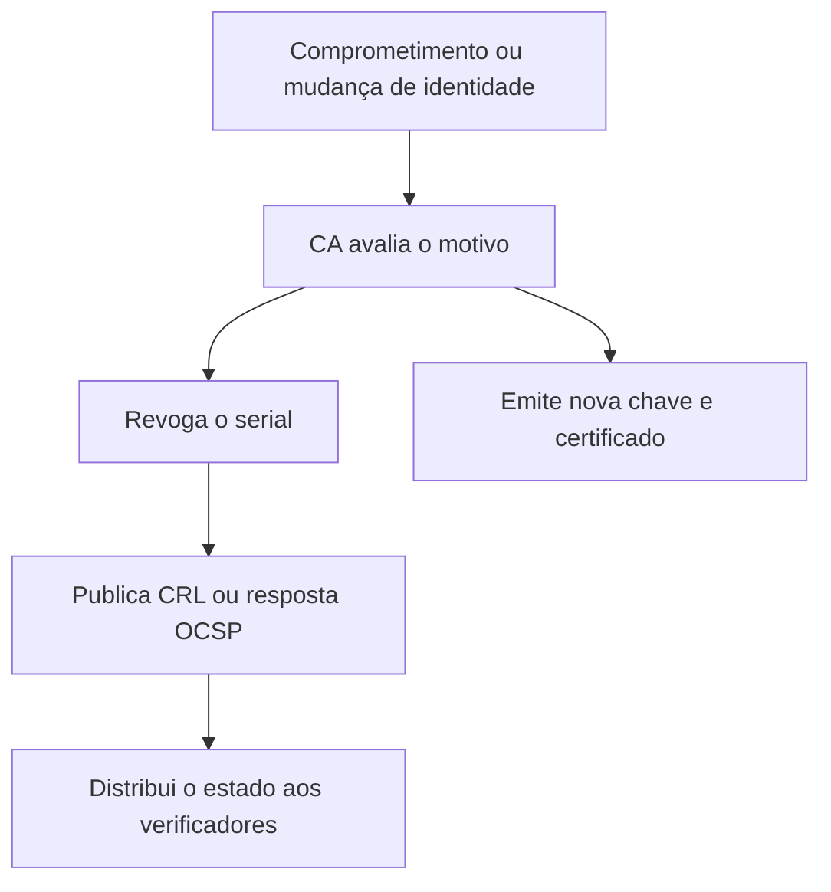
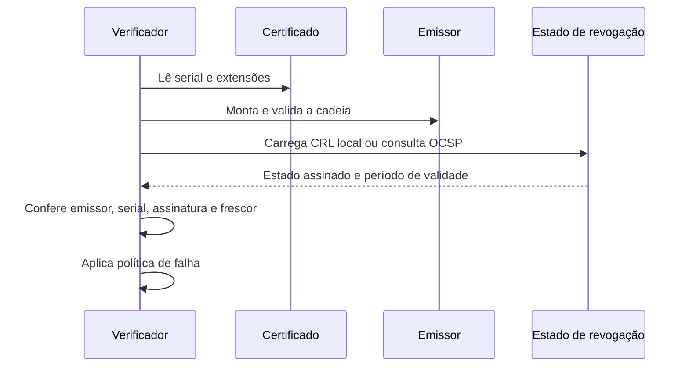
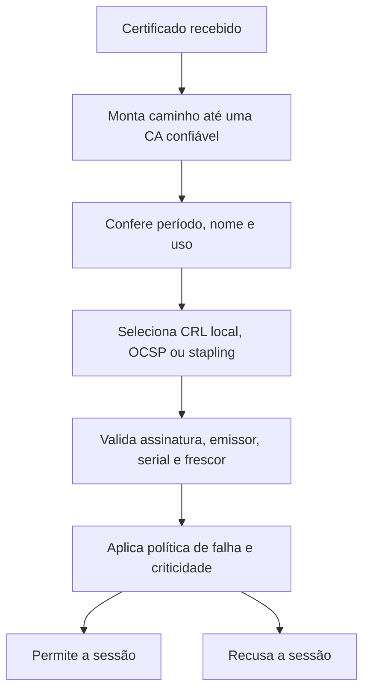

# Revogação de certificados

Revogação invalida um certificado antes da data de expiração quando a chave
privada foi exposta, a identidade mudou, a emissão foi incorreta ou a política
exige retirada antecipada. Expiração é previsível e pode ser planejada; revogação é
uma resposta a uma mudança de confiança e precisa chegar aos verificadores sem
depender apenas do ciclo normal de renovação.

O ponto mais importante para a implementação é que uma URL de CRL ou OCSP dentro de
um certificado não obriga, por si só, uma aplicação a fazer uma consulta. O
certificado apenas publica metadados que permitem descobrir onde o estado pode ser
obtido. O runtime, o terminador TLS, o gateway ou a própria aplicação precisa estar
configurado para usar essa informação e precisa definir o que fazer quando ela não
estiver disponível.

## Fluxo de resposta



Revogar o certificado não apaga a chave privada nem retira a credencial de todos os
clientes. A resposta completa bloqueia o serial, publica o novo estado, substitui a
chave, distribui o certificado novo e remove a identidade antiga dos serviços. Se a
chave da CA foi comprometida, o alcance da resposta muda: pode ser necessário
substituir a CA, redistribuir uma nova raiz e invalidar uma classe inteira de
certificados.

O motivo também importa para a operação. Compromise, key compromise, cessação da
relação com o titular e emissão incorreta exigem ações diferentes de comunicação,
retenção de evidências e reemissão. O serial é o identificador que os mecanismos
X.509 usam para localizar a credencial; revogar todos os certificados de um usuário
ou workload exige localizar cada serial no inventário, não apenas marcar um nome como
inativo.

## Como o consumidor descobre o estado

O caminho usual começa pela extensão do certificado, mas continua com informações
do emissor e da política local.

`cRLDistributionPoints` pode conter um ou mais endereços para CRLs. A aplicação
precisa escolher um ponto compatível com seu ambiente, baixar a lista e verificar se
ela foi emitida pela CA correta. O campo não deve ser tratado como uma autorização
para baixar qualquer conteúdo daquela URL: a lista recebida ainda precisa ser
validada criptograficamente e semanticamente.

`authorityInfoAccess`, com o método `id-ad-ocsp`, pode indicar um respondedor OCSP.
O cliente constrói uma requisição com a identificação da CA emissora e o serial do
certificado. Uma resposta válida precisa corresponder ao certificado consultado,
estar assinada por uma entidade autorizada e estar dentro do período de validade da
resposta.

O emissor da cadeia também pode ser descoberto ou fornecido fora do certificado,
por exemplo, pelo bundle enviado no handshake, pelo trust store do sistema ou por
uma configuração do gateway. Sem identificar corretamente a CA emissora, o
consumidor não sabe qual CRL ou respondedor deve ser usado e não pode confiar em um
estado assinado por outra autoridade.



O consumidor pode obter esse estado de quatro formas principais:

1. carregar uma CRL local que foi distribuída por um agente de configuração;
2. consultar OCSP durante a construção da cadeia;
3. validar uma resposta OCSP stapled apresentada pelo terminador TLS;
4. receber do gateway uma identidade já validada, com uma fronteira de confiança
   explícita.

Essas formas não são equivalentes. CRL local e OCSP direto fazem o consumidor
participar da decisão. Stapling transfere a consulta para o servidor TLS. A
validação no gateway transfere a decisão para uma camada anterior e exige que a
aplicação impeça acesso direto que permita falsificar os metadados de identidade.

## Pipeline de decisão

Uma implementação segura separa a construção da cadeia da consulta de revogação.
Primeiro o sistema verifica se o certificado foi assinado por uma CA confiável e se
é adequado ao uso. Depois consulta o estado do certificado e somente então autoriza
a sessão ou a requisição.



Uma resposta `good` não significa que o certificado é válido para qualquer uso. Ela
apenas informa o estado do serial perante a CA consultada. O cliente ainda deve
validar cadeia, período, nome, uso e assinatura do handshake. Uma resposta `unknown`
também não deve ser convertida automaticamente em `good`; a política precisa
definir se a sessão será recusada ou se haverá outro mecanismo de confiança.

Uma implementação pode expressar a decisão de forma semelhante ao pseudocódigo
abaixo. A ordem é importante: um cache só é consultado depois de a identidade do
emissor estar definida, e um estado `good` só é usado depois de sua assinatura e seu
período serem validados.

```text
path = build_certificate_path(leaf, trust_store, purpose)
if path.is_invalid:
    reject("invalid path")

key = (path.issuer.identifier, leaf.serial)
status = revocation_cache.get(key)

if status.missing or status.expired:
    status = fetch_or_load_status(path.issuer, leaf)
    if status.signature_invalid or status.subject_mismatch:
        reject("invalid revocation response")
    revocation_cache.put(key, status)

if status.state == "revoked":
    reject("revoked certificate")

if status.state == "unknown":
    apply_unknown_policy()

if status.state == "good":
    continue_with_authorization(path, leaf)
```

O pseudocódigo não define se a aplicação falha aberta ou fechada. Essa decisão fica
em `apply_unknown_policy` e precisa receber o contexto da operação. Uma consulta que
falha ao acessar um dashboard administrativo pode ser tratada de modo diferente de
uma consulta de um dispositivo offline, mas a diferença deve estar na política, não
em uma exceção silenciosa do código.

## CRL

Uma CRL publica uma lista assinada de certificados revogados por uma CA. Cada entrada
normalmente contém o serial, a data da revogação e um motivo. O consumidor baixa a
lista, verifica a assinatura, respeita `thisUpdate` e `nextUpdate` e procura o serial
do certificado durante a validação.

CRLs simplificam a consulta local e podem funcionar em redes sem acesso online, mas
podem ficar grandes e desatualizadas entre publicações. O publicador precisa de
monitoramento para evitar que `nextUpdate` passe sem uma nova CRL. Nginx, gateways e
outros terminadores podem exigir uma CRL local, cuja atualização deve fazer parte do
mesmo ciclo de distribuição dos certificados.

Uma CRL precisa ser assinada pela CA emissora, publicada num endereço alcançável pelo
consumidor previsto e associada ao certificado por `cRLDistributionPoints` quando a
política depender dessa descoberta. A URL não transforma a revogação em obrigatória:
o cliente pode não consultar, pode não aceitar o formato ou pode decidir falhar
aberto. Em redes privadas, uma cópia local reduz a dependência de conectividade, mas
cria a obrigação de atualizar e monitorar esse artefato.

### Atualização segura de uma CRL local

O download da CRL não deve ocorrer no caminho de cada requisição HTTP. Um agente,
sidecar, job ou processo de inicialização pode atualizar o artefato em intervalos
compatíveis com `nextUpdate`. O processo deve:

1. baixar a lista para um arquivo temporário;
2. verificar a assinatura e confirmar que o emissor corresponde à CA configurada;
3. conferir `thisUpdate`, `nextUpdate` e o tamanho esperado;
4. substituir o arquivo ativo de forma atômica;
5. recarregar ou notificar o componente que mantém a lista em memória;
6. publicar métricas sobre a idade e o resultado da atualização.

Nunca substitua o arquivo ativo por uma resposta HTTP que ainda não foi validada.
Uma troca atômica evita que o processo leia uma DER ou PEM incompleta. O último
artefato válido pode ser mantido para rollback, mas isso não deve esconder uma CRL
expirada: a idade do estado precisa gerar alerta e, conforme o risco, bloquear novas
conexões.

Em um cluster, cada instância precisa ter a mesma política de atualização. É possível
distribuir a CRL por uma imagem, volume, Secret ou agente, mas o mecanismo precisa
ser capaz de atualizar todas as réplicas e confirmar que elas carregaram a versão
esperada. Uma aplicação que atualiza apenas o pod que recebeu o evento deixa o
balanceador com decisões diferentes entre réplicas.

Uma estratégia prática é manter três estados operacionais:

| Estado da CRL | Conduta típica |
| --- | --- |
| Válida e dentro de `nextUpdate` | Aceitar ou rejeitar o serial conforme a lista |
| Ainda válida, mas próxima do vencimento | Continuar a validar e alertar o operador |
| Expirada, ausente ou inválida | Aplicar a política de risco, normalmente falhar fechado em mTLS administrativo |

O limite de tolerância após `nextUpdate`, se existir, deve ser explícito e curto. Ele
não pode ser uma consequência acidental de um cache sem expiração.

## OCSP direto

Na consulta direta, o cliente ou runtime cria uma requisição OCSP para o certificado
e seu emissor. A requisição identifica a CA pelo hash do nome e da chave pública e
identifica o certificado pelo serial. O respondedor retorna um `SingleResponse` para
aquele certificado, com estado, `thisUpdate` e, quando aplicável, `nextUpdate`.

O consumidor deve verificar:

- se a resposta corresponde ao emissor e ao serial solicitados;
- se o respondedor é a CA emissora ou um responder delegado autorizado;
- se a assinatura da resposta é válida;
- se o estado está dentro do período de validade;
- se o resultado é `good`, `revoked` ou `unknown`;
- se a política de nonce, quando usada, foi atendida;
- se a resposta não é uma cópia antiga reapresentada fora da janela aceita.

O resultado deve ser armazenado em cache por uma chave que inclua o emissor e o
serial. Não é seguro indexar somente pelo serial, pois CAs diferentes podem emitir
certificados com o mesmo número. O cache precisa respeitar o período da resposta e
um limite local menor quando a aplicação exige informação mais recente.

A consulta deve possuir timeout, limite de tamanho, proteção contra avalanche e
telemetria. Quando milhares de conexões consultam o mesmo certificado ao mesmo
tempo, use coalescência de requisições: uma consulta é executada e as demais
aguardam o mesmo resultado. O mecanismo de cache não deve transformar a
indisponibilidade do respondedor em uma espera indefinida dentro do handshake.

OCSP stapling é preferível quando o protocolo e o servidor suportam essa arquitetura.
O servidor obtém a resposta, mantém o cache e a entrega ao cliente durante o
handshake. Isso reduz latência e evita que cada cliente revele ao respondedor qual
site está validando. O cliente ainda precisa validar a resposta stapled e aplicar
sua própria política de frescor.

## Onde a consulta acontece

### Nginx

Para certificados de cliente em mTLS, `ssl_crl` faz o Nginx usar uma CRL local no
handshake. O Nginx não deve ser configurado para buscar uma URL remota em cada
requisição. A CRL é atualizada por um processo externo, validada e carregada por um
reload controlado.

Para o certificado do próprio servidor, `ssl_stapling on` e
`ssl_stapling_verify on` tratam de OCSP stapling apresentado aos clientes TLS. Isso
é diferente da revogação dos certificados de cliente. Ativar stapling para o
certificado do servidor não faz o Nginx consultar automaticamente o OCSP para cada
certificado de cliente recebido.

Essa distinção evita uma configuração enganosa: o site pode estar entregando um
staple válido para sua própria folha enquanto aceita um certificado de cliente
revogado porque nenhuma CRL local ou verificação OCSP para o cliente foi configurada.

### Load balancer e gateway

Um balanceador que termina mTLS pode validar a cadeia e a revogação antes de enviar a
requisição para a aplicação. Nesse modelo, o backend deve aceitar tráfego somente do
balanceador por rede autenticada e deve remover ou sobrescrever cabeçalhos de
identidade antes de inserir os valores validados.

Se o balanceador opera em passthrough TCP, ele não toma a decisão. O handshake chega
ao Nginx, service mesh ou aplicação, e esse componente precisa possuir a CA, a CRL ou
o mecanismo OCSP. O desenho precisa indicar em qual salto a conexão deixa de ser
apenas bytes encaminhados e passa a ser uma identidade confiável.

Um gateway pode encaminhar o serial, o emissor ou o SAN para autorização. Esses
valores devem ser tratados como afirmações confiáveis somente se a rede e a
autenticação do gateway forem protegidas. Um cliente nunca deve conseguir alcançar o
backend e enviar diretamente `X-Client-Verify: SUCCESS` ou um identificador equivalente.

### Bibliotecas e runtimes

Cada runtime possui uma política própria. Não presuma que validar a cadeia ativa
revogação automaticamente.

#### OpenSSL

Na linha de comando, `openssl verify` pode carregar uma CRL e exigir a checagem do
certificado final ou de toda a cadeia:

```bash
openssl verify \
  -CAfile root-ca.pem \
  -untrusted intermediate-ca.pem \
  -CRLfile issuer.crl.pem \
  -crl_check_all \
  client.cert.pem
```

`-crl_check` verifica o certificado final. `-crl_check_all` estende a verificação
para os certificados da cadeia. Se a CRL necessária não estiver disponível, a
verificação falha, o que é diferente de aceitar silenciosamente uma informação
ausente.

Em uma aplicação, o mesmo princípio precisa ser configurado no `X509_STORE` ou na
API de validação usada pelo programa. O certificado pode carregar uma URL de CRL,
mas a aplicação ainda precisa implementar o transporte, o cache, a atualização e a
política de erro quando não usa um agente externo.

#### Java

O caminho de validação de certificados possui `PKIXRevocationChecker`, que permite escolher
OCSP, CRL, fallback e comportamento em falhas. Um fluxo explícito pode ser escrito
assim:

```java
PKIXParameters parameters = new PKIXParameters(trustAnchors);
parameters.setRevocationEnabled(true);

PKIXRevocationChecker checker =
    (PKIXRevocationChecker) CertPathValidator.getInstance("PKIX")
        .getRevocationChecker();
checker.setOptions(EnumSet.of(
    PKIXRevocationChecker.Option.PREFER_OCSP,
    PKIXRevocationChecker.Option.NO_FALLBACK));
parameters.addCertPathChecker(checker);

CertPathValidator.getInstance("PKIX").validate(certPath, parameters);
```

O código é apenas um esqueleto: o trust store, o `CertPath`, os timeouts e a
política de `SOFT_FAIL` precisam ser definidos pela aplicação. Ativar a validação
Essa validação sem confirmar a política de OCSP do runtime pode resultar em CRL apenas,
fallback inesperado ou tolerância a indisponibilidade.

#### .NET

Em .NET, `X509ChainPolicy` expõe o modo e o alcance da revogação. Um consumidor que
precisa de consulta online pode configurar a cadeia de forma explícita:

```csharp
using var chain = new X509Chain();
chain.ChainPolicy.RevocationMode = X509RevocationMode.Online;
chain.ChainPolicy.RevocationFlag = X509RevocationFlag.ExcludeRoot;
chain.ChainPolicy.UrlRetrievalTimeout = TimeSpan.FromSeconds(2);
chain.ChainPolicy.VerificationFlags = X509VerificationFlags.NoFlag;

if (!chain.Build(certificate))
{
    throw new SecurityException("Certificate chain is not trusted");
}
```

`Online` e `Offline` têm efeitos que dependem do backend criptográfico e do sistema
operacional, incluindo caches do sistema. Se a aplicação precisa de comportamento
determinístico em container, confirme de onde vêm o trust store e o cache de
revogação, e monitore a conectividade para as URLs de CRL e OCSP.

#### Go

`crypto/x509` fornece a construção e a verificação da cadeia por meio de
`VerifyOptions`, além de parsing de listas de revogação. A verificação de cadeia não
deve ser confundida com uma consulta automática de CRL ou OCSP. Uma aplicação Go
precisa escolher uma biblioteca ou implementar explicitamente a etapa de revogação,
validar a assinatura da lista ou resposta, armazenar o resultado e aplicar a
política de frescor.

Um fluxo mínimo para uma CRL local é:

```go
revocationList, err := x509.ParseRevocationList(crlBytes)
if err != nil {
    return err
}

if err := revocationList.CheckSignatureFrom(issuer); err != nil {
    return err
}

for _, entry := range revocationList.RevokedCertificateEntries {
    if entry.SerialNumber.Cmp(certificate.SerialNumber) == 0 {
        return errors.New("certificate revoked")
    }
}
```

O trecho não substitui a validação da cadeia nem a conferência de `ThisUpdate` e
`NextUpdate`. A aplicação também precisa definir o que fazer quando o serial não
aparece, quando o arquivo está expirado e quando o respondedor está indisponível.
Consulte a API da versão de Go usada pelo projeto ao implementar o acesso às
entradas.

## Aplicação, terminador e autorização

Revogação não é autorização. O certificado pode provar que uma chave foi emitida
para um workload, mas a aplicação ainda precisa decidir se aquele workload pode
acessar a rota, recurso ou operação.

Quando o terminador valida o certificado, a aplicação pode receber uma identidade
normalizada, como emissor, SAN ou identificador de workload. A fronteira precisa
ser protegida por rede privada, autenticação entre proxy e backend e remoção de
headers fornecidos pelo cliente. Se a aplicação também precisa de revogação em
tempo real, ela não deve assumir que o gateway continuará consultando o estado após
o handshake.

Quando a própria aplicação termina TLS, a consulta ocorre antes da criação da sessão
de aplicação. Middleware HTTP é tarde demais para rejeitar um certificado que o
handshake já aceitou; nesse caso a validação deve ser configurada no servidor TLS ou
na biblioteca que cria a conexão.

Para conexões longas, como WebSocket, HTTP/2 ou canais de mensageria, uma revogação
posterior não necessariamente encerra uma sessão já estabelecida. A política pode
exigir revalidação periódica, encerramento por evento de comprometimento ou limite
de duração da conexão. Sem essa regra, revogar o certificado bloqueia apenas novos
handshakes.

## Atualização em produção

O componente que consulta revogação precisa ser operado como parte da cadeia de
identidade, não como um download incidental. Registre pelo menos:

- idade da CRL ou resposta OCSP usada;
- tempo até `nextUpdate`;
- quantidade de respostas `revoked` e `unknown`;
- falhas de assinatura e de parsing;
- timeouts e indisponibilidade dos respondedores;
- número de conexões rejeitadas por revogação;
- versão do bundle carregado em cada réplica.

O refresh deve acontecer fora do caminho crítico, com jitter para evitar que todas as
réplicas consultem a CA ao mesmo tempo. Um cache compartilhado pode reduzir tráfego,
mas não elimina a necessidade de verificar a assinatura em cada consumidor que toma
a decisão. Se o cache for preenchido por um serviço auxiliar, proteja esse serviço e
trate seus dados como não confiáveis até a verificação criptográfica local terminar.

Durante a rotação, publique o certificado novo antes de revogar o antigo quando o
risco permitir sobreposição. Quando a chave foi comprometida, a prioridade muda:
revogue primeiro, interrompa ou limite sessões existentes e só então conclua a
substituição. A ordem precisa estar documentada para cada classe de identidade.

## Decisão de falha

Uma política precisa dizer o que acontece quando CRL ou OCSP está indisponível. Falhar
fechado reduz o risco de aceitar uma identidade revogada, mas pode interromper
clientes por uma falha de infraestrutura de revogação. Falhar aberto preserva
disponibilidade, mas amplia a janela em que uma credencial retirada continua sendo
aceita.

| Contexto | Política geralmente adequada | Motivo |
| --- | --- | --- |
| Administração e acesso a segredos | Falhar fechado | Uma credencial revogada tem alto impacto |
| mTLS entre serviços críticos | CRL local fresca e falha fechada | Evita depender do respondedor durante o handshake |
| Site público com certificados de servidor | Stapling ou certificados curtos | Reduz latência sem deixar cada visitante consultar a CA |
| Cliente offline | CRL distribuída e limite de idade | A rede não pode ser pressuposta no momento da validação |
| Identidade de curta duração | Janela curta e renovação | Reduz a dependência de consulta, sem eliminar emergência |

Não copie essa tabela como uma política universal. O responsável pelo sistema deve
registrar o modo, o tempo máximo de informação aceita e o procedimento para revogar
quando o respondedor estiver indisponível. A decisão deve considerar a criticidade,
o tempo de vida do certificado e a capacidade de cortar sessões já abertas.

Certificados de curta duração reduzem a janela sem depender de consulta para cada
uso, mas não substituem revogação emergencial. Um certificado ainda pode valer por
horas suficientes para causar dano, e um cliente pode continuar usando a chave
privada depois que o certificado foi retirado.

## Teste controlado

Antes de confiar no mecanismo, inspecione as extensões que apontam para o estado:

```bash
openssl x509 \
  -in client.cert.pem \
  -noout \
  -text
```

Procure `CRL Distribution Points` e `Authority Information Access`. Em seguida,
valide uma cadeia com uma CRL conhecida:

```bash
openssl verify \
  -CAfile root-ca.pem \
  -untrusted intermediate-ca.pem \
  -CRLfile issuer.crl.pem \
  -crl_check_all \
  client.cert.pem
```

Para OCSP, use o emissor e o certificado da folha, confirme a URL do respondedor e
inspecione a resposta antes de transformar o teste em uma regra operacional:

```bash
openssl ocsp \
  -issuer intermediate-ca.pem \
  -cert client.cert.pem \
  -url http://ocsp.example.test \
  -CAfile root-ca.pem \
  -resp_text
```

O teste deve cobrir certificado válido, serial revogado, resposta `unknown`, CRL
expirada, OCSP indisponível, assinatura incorreta, cadeia incompleta e cliente sem
acesso ao endereço de distribuição. Em mTLS, confirme se a falha acontece no
handshake ou na autorização HTTP. Em um cluster, execute o teste contra cada
réplica e compare a versão de revogação carregada.

## Limitações

Nem todo cliente verifica revogação de forma obrigatória e nem todo ambiente consegue
alcançar o respondedor. A existência de uma URL de CRL ou OCSP no certificado não
garante que a biblioteca da aplicação a consultará. Por isso, o desenho deve combinar
validade curta quando apropriado, rotação, controle de acesso, inventário de chaves e
monitoramento de falhas de emissão e revogação.

O plano de resposta deve incluir uma lista de consumidores, o local onde a chave é
armazenada, o mecanismo de distribuição, o reload necessário e a confirmação de que
o certificado antigo deixou de ser aceito. Faça um teste de revogação em ambiente
controlado para descobrir se o Nginx, o load balancer, o runtime e o cliente realmente
consultam a informação. Sem esse teste, uma CRL publicada pode criar uma sensação de
controle que não existe no caminho de dados.

## Resposta emergencial a uma chave comprometida

Revogar um certificado não é uma operação completa se a chave privada continua
aceita por uma sessão, por um token derivado ou por um cliente que nunca consulta
o estado de revogação. O procedimento precisa identificar a identidade, retirar
o certificado do trust store local quando necessário, bloquear sessões de longa
vida, rotacionar a chave e confirmar que a nova credencial foi distribuída.

Uma resposta prática separa três tempos:

1. contenção, impedir novas conexões e limitar o uso da credencial suspeita;
2. revogação, publicar CRL ou estado OCSP com uma validade compatível;
3. substituição, emitir chave e certificado novos e remover material antigo.

O tempo de propagação precisa ser medido por consumidor. Uma CRL publicada no
servidor da CA não altera imediatamente um Nginx, um cliente Java, um serviço Go
ou um balanceador que mantém o próprio cache. O inventário de consumidores é parte
do controle de revogação, não uma documentação opcional.

## Relação entre revogação e sessões

O handshake pode ter validado o certificado antes da revogação. Se a sessão TLS
continuar aberta, a aplicação precisa decidir se a revogação encerra a sessão ou
se vale somente para novas conexões. O mesmo vale para conexões keep-alive, pools
de banco, WebSockets e tokens emitidos depois da autenticação mTLS.

Uma política que promete retirada imediata precisa ter autoridade para fechar
essas sessões ou usar credenciais de curta duração. Caso contrário, documente a
janela real de exposição e trate a rotação da chave como a medida que encerra o
risco residual.

## Relações

- [OCSP](ocsp.md) aprofunda a consulta de estado, cache e stapling.
- [Cadeia de certificados](certificate-chain.md) valida a autoridade emissora.
- [Certificado X.509](certificate.md) explica o lifecycle completo.
- [OpenSSL para PKI](openssl.md) mostra um fluxo de CRL com uma CA local.
- [mTLS no Nginx](../tls/nginx-mtls.md) aplica uma política de revogação no terminador.

## Fontes primárias

- [RFC 5280](https://www.rfc-editor.org/rfc/rfc5280)
- [RFC 6960](https://www.rfc-editor.org/rfc/rfc6960)
- [OpenSSL verification options](https://docs.openssl.org/4.0/man1/openssl-verification-options/)
- [Java PKIXRevocationChecker](https://docs.oracle.com/en/java/javase/17/docs/api/java.base/java/security/cert/PKIXRevocationChecker.html)
- [Java PKI Programmer's Guide](https://docs.oracle.com/en/java/javase/23/security/java-pki-programmers-guide.html)
- [.NET X509ChainPolicy](https://learn.microsoft.com/dotnet/api/system.security.cryptography.x509certificates.x509chainpolicy)
- [Go crypto/x509](https://pkg.go.dev/crypto/x509)
- [Nginx SSL module](https://nginx.org/en/docs/http/ngx_http_ssl_module.html)
