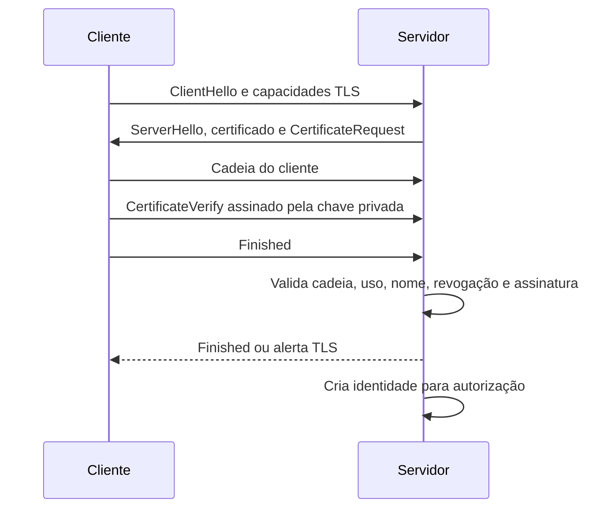

# Mutual TLS

Mutual TLS, mTLS, usa autenticação por certificado nos dois lados da conexão.

No TLS de servidor comum, o cliente valida a identidade do servidor. Em mTLS, o servidor também solicita e valida certificado do cliente.

mTLS autentica identidade criptográfica; autorização continua sendo uma decisão separada. Um certificado válido não concede automaticamente permissão para qualquer operação.

## O que é autenticado

O servidor autentica o cliente pela posse da chave privada correspondente ao
certificado e pela cadeia que liga esse certificado a uma CA aceita. Isso é diferente
de apenas receber um arquivo PEM ou confiar no Common Name escrito nele. A prova
ocorre durante o handshake, quando o cliente assina dados específicos daquela
conexão e o servidor verifica a assinatura com a chave pública apresentada.

O certificado também possui período de validade, usos permitidos, SAN, emissor e
serial. A política precisa decidir quais desses campos identificam a entidade e como
ela se relaciona com autorização. Uma CA pode provar que o certificado foi emitido
para um workload, mas não deve decidir sozinha se esse workload pode ler um banco,
publicar uma mensagem ou acessar uma rota administrativa.

## Dois caminhos de confiança

Há uma validação do servidor pelo cliente e outra do cliente pelo servidor. O cliente
precisa de um trust store que contenha a CA do servidor. O servidor precisa de um
trust store ou bundle que contenha a CA dos clientes. É possível usar uma raiz comum,
mas CAs separadas reduzem o raio de uma emissão indevida e deixam a revogação mais
específica.

Em uma conexão de serviço para serviço, o certificado do cliente costuma representar
um workload ou uma conta de serviço, não uma pessoa. A emissão deve estar vinculada
ao inventário e à identidade do workload. Distribuir o mesmo certificado para vários
serviços elimina a capacidade de atribuir ações e de revogar somente o consumidor
comprometido.

## Posições possíveis

O mTLS pode ser terminado no load balancer, no reverse proxy ou na própria
aplicação. Terminar no load balancer centraliza a validação e reduz trabalho nos
backends, mas exige uma forma autenticada de transportar a identidade até eles e
impedir bypass. Terminar no serviço preserva a decisão junto do consumidor, ao custo
de distribuir trust stores, certificados e política por mais workloads.

Em um caminho TCP, um Network Load Balancer pode encaminhar o handshake até um Nginx
ou serviço. Um Application Load Balancer pode validar certificados de cliente em seu
listener HTTPS usando um trust store, em modo de verificação ou passthrough. Esses
modelos não são equivalentes: no passthrough, o backend precisa validar a cadeia;
na verificação, o balanceador faz a validação da camada de transporte, mas a
aplicação ainda precisa autorizar a identidade recebida.

O ponto de terminação muda o domínio de confiança. Se um gateway valida o cliente e
encaminha apenas um header, o backend precisa garantir que esse header não possa ser
forjado por uma rota alternativa. Se o backend recebe o TLS original, ele pode
validar diretamente a cadeia, mas cada réplica precisa receber trust store, CRL,
certificados e regras de renovação. A escolha é uma decisão de operação e não só de
desempenho.

## O que acontece no handshake

O certificado não é uma senha enviada ao servidor. Durante o handshake, o servidor
envia um desafio vinculado aos parâmetros negociados da conexão. O cliente prova que
possui a chave privada assinando esse contexto na mensagem `CertificateVerify`. O
servidor valida a assinatura usando a chave pública da folha e só então considera que
o apresentador controla a identidade criptográfica.



O cliente não precisa enviar a chave privada, e o servidor não deve tentar inferi-la
a partir do PEM recebido. A prova de posse é específica da conexão, o que evita que
um certificado copiado sozinho seja suficiente para autenticar. Ainda assim, um
atacante que roube a chave privada pode se passar pelo workload até a credencial ser
revogada, expirar ou ser retirada de todos os clientes.

O servidor pode solicitar certificado em todas as conexões, somente em determinados
listeners ou de forma opcional. `optional` não significa que clientes sem identidade
estejam autorizados: significa apenas que o handshake pode continuar. A aplicação
precisa separar o caminho anônimo do caminho autenticado e impedir que a ausência de
certificado seja interpretada como uma identidade vazia.

## Do certificado à autorização

O resultado da autenticação deve ser uma identidade normalizada. O SAN costuma ser
mais adequado que o Common Name porque pode representar DNS, URI, email ou endereço,
e porque é o campo usado por políticas modernas de hostname. Uma política de serviço
pode usar, por exemplo, uma URI de workload e o emissor confiável:

```text
emissor = Example Workload Issuing CA
san_uri = spiffe://example.test/workload/payments
uso = clientAuth
ambiente = production
```

Essa identidade ainda não é uma permissão. Uma camada de autorização pode mapear a
URI para operações, namespaces ou recursos. O mapeamento precisa tratar emissor,
ambiente e uso como parte da chave, pois duas CAs diferentes podem emitir o mesmo
texto de SAN para políticas distintas.

Não faça autorização somente pelo fingerprint quando a renovação for frequente. O
fingerprint muda com a troca da folha. Também não autorize somente pelo Common Name,
porque ele pode não ser único e sua semântica varia entre emissores. Registre o
identificador estável no inventário de emissão e valide a correspondência no gateway
ou na aplicação.

## Escolha do ponto de terminação

| Terminação | Quem valida o certificado | Vantagem | Risco principal |
| --- | --- | --- | --- |
| Load balancer | Balanceador | Política centralizada e menos configuração nos pods | Bypass ou headers forjados no backend |
| Reverse proxy | Nginx, Envoy ou HAProxy | Controle de TLS junto do ingress | Distribuição de CAs, CRLs e reloads |
| Serviço | Aplicação ou sidecar | Identidade chega ao consumidor original | Mais certificados e mais superfícies de configuração |
| Pass-through | Componente após o balanceador | Preserva o handshake e a decisão local | Cada destino precisa entender TLS e revogação |

O ponto escolhido precisa aparecer no diagrama e no contrato da rede. Dizer que uma
API usa mTLS não informa se o certificado é validado no ALB, no Nginx, no sidecar ou
na própria aplicação. Essa diferença determina onde procurar logs, onde distribuir a
CA e onde uma revogação passa a ter efeito.

Quando o gateway encaminha headers com a identidade, o backend deve aceitar conexões
somente das origens autorizadas e remover headers recebidos antes de inserir os seus.
Uma alternativa é encaminhar uma prova assinada ou usar mTLS também entre gateway e
backend. Um header em uma rede que permite acesso direto não é uma fronteira de
autenticação.

## Trust stores e distribuição

Existem pelo menos quatro artefatos que costumam ser confundidos:

| Artefato | Usado por | Conteúdo |
| --- | --- | --- |
| Trust store do servidor | Validação de clientes | Raízes ou intermediárias aceitas para `clientAuth` |
| Trust store do cliente | Validação do servidor | Raízes ou intermediárias aceitas para `serverAuth` |
| Cadeia de apresentação | Lado que envia o certificado | Folha e intermediárias, sem a raiz em geral |
| CRL ou resposta OCSP | Validação de revogação | Estado assinado dos seriais emitidos |

Instalar o trust store da CA de clientes no cliente não faz o cliente confiar no
servidor. São direções de confiança diferentes. Em uma malha de serviços, a
distribuição deve ser versionada e observável: cada réplica deve informar qual bundle
carregou, qual data de validade ele tem e qual política de revogação está ativa.

Durante a rotação de uma CA, distribua a CA nova antes de emitir certificados que
dependam dela. Mantenha a CA antiga durante a sobreposição necessária e remova-a
somente depois de confirmar que não há folhas legítimas dependentes dela. Ao remover
uma CA cedo demais, a falha aparece como `unknown issuer`, não como revogação, e pode
derrubar clientes que ainda não foram renovados.

## Sessões, conexões longas e revogação

Revogar uma folha impede novos handshakes que realmente consultem o estado. Não
encerra automaticamente um TCP, uma sessão TLS resumida, um WebSocket ou um canal de
mensageria que já foi estabelecido. Para identidades de alto risco, defina uma das
seguintes estratégias:

- limitar a duração máxima da conexão;
- exigir reautenticação periódica;
- encerrar sessões quando o inventário publicar um evento de comprometimento;
- validar a identidade novamente antes de operações sensíveis;
- usar certificados de curta duração e rotação frequente.

A sessão TLS resumida também precisa obedecer à política do servidor. Não assuma que
o cliente apresentará novamente toda a cadeia a cada reconexão. A biblioteca deve
documentar como trata resumption, mudança de trust store e revogação durante a vida
da sessão.

## Matriz de falhas

| Falha | Camada | Resultado esperado |
| --- | --- | --- |
| Cliente não envia certificado | Handshake | Alerta TLS ou caminho anônimo explicitamente permitido |
| CA do cliente não é confiável | Cadeia | Handshake recusado |
| Certificado expirado | Validade | Handshake recusado |
| SAN ou uso incompatível | Identidade | Handshake recusado |
| Serial revogado | Revogação | Handshake recusado conforme política |
| Certificado válido sem permissão | Autorização | Handshake conclui e a aplicação responde `403` |
| Header de identidade sem gateway confiável | Rede | Conexão rejeitada antes da autorização |
| CRL ou OCSP indisponível | Política de revogação | Fail-open ou fail-closed explícito e observável |

Essa separação é importante para o suporte. Um `403` do HTTP não prova que o mTLS
falhou; pode indicar apenas falta de autorização. Da mesma forma, um reset durante o
handshake não deve ser diagnosticado como erro da aplicação antes de verificar a
cadeia, o uso e a política de revogação.

## Teste operacional

Teste cada direção separadamente. Primeiro, confirme que o cliente confia no
servidor usando a CA de servidor. Depois, use uma folha de cliente com `clientAuth`
e a chave correspondente. Por fim, teste uma folha com a mesma aparência, mas
assinada por uma CA errada, com uso `serverAuth`, vencida e revogada.

```bash
openssl s_client \
  -connect private.example.test:443 \
  -servername private.example.test \
  -CAfile server-ca.pem \
  -cert client.cert.pem \
  -key client.key.pem \
  -verify_return_error \
  -state \
  -tlsextdebug
```

Anote se a falha ocorre antes de `SSL handshake has read`, durante a validação do
certificado ou depois da resposta HTTP. Em produção, use IDs de correlação para
relacionar o handshake do terminador à decisão da aplicação sem gravar a chave ou o
certificado completo.

## Falhas e observabilidade

Uma falha de confiança durante o handshake pode resultar em conexão encerrada sem
status HTTP. Uma falha de autorização ocorre depois e deve produzir uma resposta
observável pela aplicação. Registre motivo, emissor, serial ou identificador seguro,
versão da política e endpoint, mas evite registrar a chave privada ou o certificado
completo como texto de log.

Teste ausência de certificado, CA errada, certificado expirado, SAN incompatível,
uso de chave incorreto, serial revogado e cadeia incompleta. Teste também a renovação
sem indisponibilidade e o comportamento quando a CRL ou o mecanismo de distribuição
estiver atrasado. mTLS que funciona somente no caminho feliz não é uma política
operacional completa.

## Autenticação, autorização e identidade de workload

mTLS estabelece uma identidade criptográfica no handshake. Ele não decide sozinho
se essa identidade pode acessar uma rota, publicar em um tópico ou ler um banco.
Depois da validação, o terminador precisa mapear emissor, SAN, EKU e ambiente para
uma política de autorização. O mapeamento deve ser estável durante a renovação e
não deve depender de uma string livre no Common Name.

Em workloads dinâmicos, o certificado pode representar serviço, instância,
namespace ou workload identity. A política precisa declarar se duas réplicas
compartilham identidade e como uma réplica revogada é retirada. Usar o mesmo
certificado em todos os serviços torna a rotação simples no começo, mas amplia o
blast radius de uma chave comprometida.

## Resumption e revogação

TLS session resumption pode reduzir o custo do handshake, mas introduz uma
pergunta operacional: a política verifica a identidade novamente em cada nova
conexão ou aceita uma sessão derivada de uma validação anterior? A resposta
depende da biblioteca, do terminador e do mecanismo de tickets.

Se a revogação precisa produzir efeito imediato, a equipe deve testar sessões
retomadas, conexões longas, keep-alive e pools. Caso o sistema só reavalie a
identidade em novos handshakes, a política precisa limitar a duração da sessão ou
ter um mecanismo separado para encerrar conexões já estabelecidas.

## Relações

- [mTLS no Nginx](nginx-mtls.md) mostra validação no reverse proxy.
- [Cadeia de certificados](../pki/certificate-chain.md) explica a construção do
  caminho até uma âncora confiável.
- [Revogação](../pki/revocation.md) explica como retirar uma identidade antes da
  expiração.
- [Balanceadores AWS](../../plataforma/cloud/aws/load-balancing.md) compara ALB,
  NLB e os modos de mTLS.
