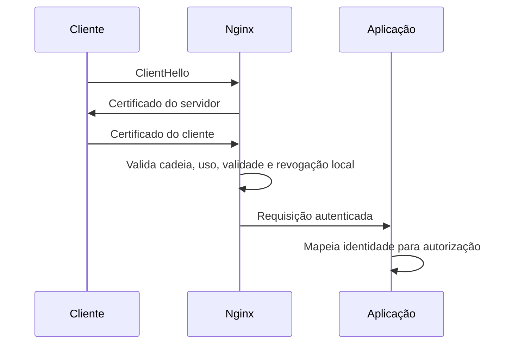

# mTLS no Nginx

No mTLS, o Nginx apresenta um certificado de servidor e também exige um certificado
do cliente. O certificado do cliente é validado contra uma CA confiável, o período de
validade e as extensões de uso são conferidos, e a conexão é encerrada quando a prova
de identidade falha. Essa validação autentica uma identidade criptográfica, mas a
autorização final ainda precisa ser feita pela aplicação ou por uma política de
gateway.

## Fluxo de validação



O cliente precisa confiar na CA que assinou o certificado do Nginx, enquanto o Nginx
precisa confiar na CA que assina os certificados dos clientes. Essas duas direções
podem usar a mesma hierarquia, mas não precisam. Separar CAs ou intermediárias por
função reduz o alcance de uma falha e facilita revogar uma classe de identidades.

Durante o handshake, o servidor envia uma mensagem `CertificateRequest` indicando
que deseja um certificado de cliente. O cliente envia sua cadeia e uma mensagem
`CertificateVerify`, assinada pela chave privada correspondente à folha. O Nginx
confere a assinatura da mensagem, monta o caminho até uma CA confiável e aplica as
restrições do certificado antes de permitir que a requisição HTTP exista.

Essa ordem é relevante para o diagnóstico. Um cliente sem certificado ou com uma
cadeia rejeitada falha no handshake e pode nem receber um status HTTP. Um cliente com
certificado válido que não possui autorização deve completar o handshake e receber
uma resposta da política da aplicação, como `403`. Misturar essas duas falhas em uma
mensagem genérica torna a operação e a rotação mais difíceis.

## Configuração básica

```nginx
server {
    listen 443 ssl;
    server_name private.example.test;

    ssl_certificate /etc/nginx/tls/server/fullchain.pem;
    ssl_certificate_key /etc/nginx/tls/server/privkey.pem;
    ssl_protocols TLSv1.2 TLSv1.3;

    ssl_client_certificate /etc/nginx/tls/client/ca-bundle.pem;
    ssl_verify_client on;
    ssl_verify_depth 2;

    location / {
        proxy_set_header X-Client-Verify $ssl_client_verify;
        proxy_set_header X-Client-Subject $ssl_client_s_dn;
        proxy_set_header X-Client-Issuer $ssl_client_i_dn;
        proxy_set_header X-Client-Serial $ssl_client_serial;
        proxy_pass http://application;
    }
}
```

`ssl_client_certificate` fornece as CAs usadas para validar o cliente e pode enviar
essa lista durante o handshake. `ssl_verify_client on` torna o certificado
obrigatório. `ssl_verify_depth` limita a profundidade da cadeia apresentada, por
isso deve corresponder ao desenho da CA, incluindo a folha e as intermediárias.

O arquivo de `ssl_client_certificate` deve conter as CAs que emitem identidades de
cliente, não um certificado de servidor aleatório. Se a organização possui várias
intermediárias, o bundle precisa ser formado de maneira deliberada e ter a rotação
planejada. `ssl_trusted_certificate` tem outra finalidade em diretivas que consultam
confiança sem necessariamente anunciar a lista ao cliente; não troque os dois
arquivos sem verificar o comportamento da versão do Nginx.

O Nginx disponibiliza variáveis como `$ssl_client_verify`, `$ssl_client_s_dn` e
`$ssl_client_serial`. Esses valores podem ajudar a aplicação a localizar uma
identidade, mas os cabeçalhos só são confiáveis quando o backend é alcançável
exclusivamente pelo Nginx. O firewall deve impedir que um cliente envie os mesmos
nomes de cabeçalho diretamente para a aplicação.

## Configuração de produção

Um listener de produção precisa tornar explícitas as quatro decisões: qual
certificado o Nginx apresenta, quais CAs de cliente aceita, como revogação é
consultada e como a identidade autenticada chega ao upstream.

```nginx
http {
    log_format mtls '$remote_addr $ssl_protocol $ssl_cipher '
        '$ssl_client_verify $ssl_client_serial $status $request_time';

    upstream application {
        server 10.0.2.20:8443;
    }

    server {
        listen 443 ssl;
        server_name private.example.test;

        ssl_certificate /etc/nginx/tls/server/fullchain.pem;
        ssl_certificate_key /etc/nginx/tls/server/privkey.pem;
        ssl_protocols TLSv1.2 TLSv1.3;
        ssl_session_cache shared:mtls:10m;
        ssl_session_timeout 10m;

        ssl_client_certificate /etc/nginx/tls/client/ca-bundle.pem;
        ssl_trusted_certificate /etc/nginx/tls/client/ca-bundle.pem;
        ssl_crl /etc/nginx/tls/client/clients.crl.pem;
        ssl_verify_client on;
        ssl_verify_depth 2;

        access_log /var/log/nginx/mtls.access.log mtls;

        location / {
            proxy_set_header X-Client-Verify $ssl_client_verify;
            proxy_set_header X-Client-Subject $ssl_client_s_dn;
            proxy_set_header X-Client-Issuer $ssl_client_i_dn;
            proxy_set_header X-Client-Serial $ssl_client_serial;
            proxy_ssl_server_name on;
            proxy_ssl_name application.internal.example;
            proxy_ssl_trusted_certificate /etc/nginx/tls/upstream/ca-bundle.pem;
            proxy_ssl_verify on;
            proxy_ssl_verify_depth 2;
            proxy_ssl_certificate /etc/nginx/tls/nginx-client/fullchain.pem;
            proxy_ssl_certificate_key /etc/nginx/tls/nginx-client/privkey.pem;
            proxy_pass https://application;
        }
    }
}
```

O exemplo usa mTLS nos dois trechos: o cliente autentica no Nginx, e o Nginx
autentica no upstream. Se o segundo trecho for HTTP em uma rede isolada, retire as
diretivas `proxy_ssl_*`, mas registre essa decisão como uma redução deliberada do
domínio de confiança. Criptografar somente o primeiro trecho não autentica o
processo que recebe a requisição no backend.

`ssl_client_certificate` serve para a lista de CAs apresentada no
`CertificateRequest` e para a validação do cliente. `ssl_trusted_certificate` pode
fornecer certificados confiáveis sem necessariamente anunciá-los ao cliente. O
bundle deve conter somente as autoridades de cliente esperadas. Incluir uma raiz
corporativa que também emite certificados de usuário, servidor e laboratório pode
autorizar identidades que não pertencem ao serviço.

`ssl_verify_depth` não é uma medida de segurança que deve ser maximizada. Ele deve
corresponder ao número de certificados intermediários que a política aceita. Uma
profundidade excessiva pode permitir uma hierarquia que não estava no desenho; uma
profundidade pequena pode rejeitar a cadeia legítima durante uma rotação.

## Como distribuir a CRL

O processo de atualização deve acontecer fora do caminho das requisições. Uma
implementação simples em uma máquina controlada pode seguir esta sequência:

```bash
openssl ca \
  -config /etc/pki/issuing/ca.cnf \
  -gencrl \
  -out /var/lib/pki/published/clients.crl.pem

openssl crl \
  -in /var/lib/pki/published/clients.crl.pem \
  -noout \
  -issuer \
  -lastupdate \
  -nextupdate

install \
  -o root \
  -g nginx \
  -m 0640 \
  /var/lib/pki/published/clients.crl.pem \
  /etc/nginx/tls/client/clients.crl.pem.new

mv \
  /etc/nginx/tls/client/clients.crl.pem.new \
  /etc/nginx/tls/client/clients.crl.pem

nginx -t
systemctl reload nginx
```

O arquivo novo precisa ser validado antes de ser distribuído, e o `mv` deve ocorrer
no mesmo filesystem para ser atômico. Em várias réplicas, copie o arquivo para um
local temporário de cada instância, verifique assinatura, emissor e datas localmente,
troque o caminho ativo e só então faça reload. Um orquestrador pode representar a
versão do bundle como parte do rollout, mas cada Nginx ainda deve confirmar que
carregou o arquivo correto.

Se `nginx -t` falhar depois da troca, restaure imediatamente o último arquivo válido,
execute o teste novamente e gere um alerta. Não mantenha uma CRL inválida apenas para
preservar o processo ativo. Se a política não permite aceitar o último estado
conhecido depois de `nextUpdate`, bloqueie novas conexões mTLS e trate a falha como
incidente de identidade.

## Identidade e autorização no upstream

Os headers do exemplo não são magicamente confiáveis. O Nginx precisa remover valores
de entrada antes de escrevê-los e a aplicação precisa ser inacessível fora da rede
do Nginx. Em Nginx, um cliente que consegue falar diretamente com `10.0.2.20:8443`
poderia enviar os mesmos headers e forjar uma identidade.

Uma política mais segura inclui:

1. security group ou firewall que permita o upstream somente a partir do Nginx;
2. remoção de `X-Client-*` recebidos do cliente;
3. mTLS ou credencial própria entre Nginx e aplicação;
4. validação de emissor, SAN, uso e serial no componente que autoriza;
5. logs correlacionados do handshake e da decisão de autorização.

Não use `$ssl_client_s_dn` inteiro como chave de autorização sem normalização. O
subject pode conter ordem de atributos e representação diferentes entre emissores.
Prefira um identificador definido no SAN ou um registro de serial associado a uma
identidade. O valor deve ser comparado com uma política, não com uma string que o
cliente possa escolher livremente na CSR.

## Opcionalidade controlada

`ssl_verify_client optional` permite que o handshake continue sem certificado, mas
expõe à aplicação uma mistura de clientes autenticados e anônimos. Use esse modo
somente quando a política realmente possui dois caminhos e a aplicação rejeita
explicitamente o caminho que exige identidade. Para uma API privada, `on` é mais
seguro e torna o contrato visível no handshake.

`optional_no_ca` é ainda mais permissivo: o Nginx solicita o certificado, mas não
exige que ele seja assinado por uma CA confiável. Esse modo só faz sentido quando
outro componente recebe o certificado e implementa toda a validação. Encaminhar o
valor para a aplicação sem autenticar a origem do header transforma um certificado
fornecido pelo cliente em uma afirmação de identidade forjada.

## Revogação

O Nginx pode receber uma CRL local por meio de `ssl_crl` quando a política de
revogação exigir essa verificação. A CRL precisa ser atualizada e distribuída antes
de expirar; uma CRL antiga pode aceitar uma identidade que já deveria ter sido
retirada. Também é preciso validar o comportamento durante a indisponibilidade do
processo que publica a CRL, pois o Nginx não transforma automaticamente uma fonte
externa de revogação em uma decisão online para cada requisição.

`ssl_crl` é uma consulta local durante a validação do certificado de cliente. O
Nginx não baixa a URL de `cRLDistributionPoints` para cada handshake. Um agente
externo precisa buscar a CRL, verificar sua assinatura e validade, substituir o
arquivo de maneira atômica e executar um reload controlado. O processo de atualização
deve monitorar a idade da lista em cada instância, porque uma réplica com uma CRL
antiga pode tomar uma decisão diferente das outras.

Já `ssl_stapling on` e `ssl_stapling_verify on` se referem ao certificado do
servidor. Nesse modo, o Nginx obtém uma resposta OCSP da CA e a apresenta aos
clientes durante o handshake. Ativar stapling não faz o Nginx consultar OCSP para o
certificado de cliente recebido em mTLS. Para esse segundo caso, use uma CRL local ou
um componente TLS que suporte a política de revogação escolhida.

Se um gateway anterior termina o mTLS, o Nginx pode receber somente a requisição já
autenticada. Essa decisão só deve ser aceita quando a rede impede acesso direto e o
gateway remove e recria os headers de identidade. Em passthrough TCP, o Nginx ou o
serviço que termina o handshake continua responsável pela validação.

Para certificados de curta duração, a rotação frequente pode reduzir a dependência de
CRLs grandes, mas não elimina a resposta emergencial para uma chave comprometida.
Em ambos os casos, revogar ou expirar o certificado não substitui a rotação da chave
privada e a remoção das credenciais antigas dos clientes.

O Nginx não deve depender de uma consulta remota improvisada dentro de cada
requisição. Distribua CRLs ou bundles por um mecanismo versionado, valide o arquivo
antes do reload e monitore a idade da informação. Se a decisão for tomada pela
aplicação, registre qual emissor, serial, SAN e versão da política produziram a
decisão, sem registrar a chave privada ou o certificado completo em logs comuns.

## Teste com cliente

Um cliente de teste precisa de sua chave privada, seu certificado e a CA que assina
o certificado do servidor:

```bash
curl \
  --cacert server-ca.pem \
  --cert client.cert.pem \
  --key client.key.pem \
  https://private.example.test/health
```

`openssl s_client` ajuda a separar problemas de TLS de problemas HTTP:

```bash
openssl s_client \
  -connect private.example.test:443 \
  -servername private.example.test \
  -CAfile server-ca.pem \
  -cert client.cert.pem \
  -key client.key.pem \
  -verify_return_error
```

Teste também ausência de certificado, certificado assinado por outra CA, certificado
expirado, SAN incorreto, uso `serverAuth` no lugar de `clientAuth` e serial revogado.
Uma suíte mínima de testes deve verificar o código de falha e os logs do terminador,
não apenas se a conexão abriu.

## mTLS até o upstream

O Nginx também pode apresentar um certificado ao serviço upstream. Isso é diferente
de validar o cliente que chegou ao Nginx:

```nginx
location / {
    proxy_ssl_server_name on;
    proxy_ssl_name upstream.internal.example;
    proxy_ssl_trusted_certificate /etc/nginx/tls/upstream/ca-bundle.pem;
    proxy_ssl_verify on;
    proxy_ssl_verify_depth 2;
    proxy_ssl_certificate /etc/nginx/tls/nginx-client/fullchain.pem;
    proxy_ssl_certificate_key /etc/nginx/tls/nginx-client/privkey.pem;
    proxy_pass https://upstream.internal.example;
}
```

Nesse caminho, `proxy_ssl_certificate` e `proxy_ssl_certificate_key` representam a
identidade do Nginx perante o upstream. `proxy_ssl_trusted_certificate` define a
CA usada para validar o certificado do upstream, e `proxy_ssl_verify on` impede que
um servidor com certificado não confiável seja aceito apenas porque a conexão é
criptografada.

## Operação segura

Proteja as chaves privadas com permissões que permitam leitura pelo processo do
Nginx, mas não por usuários ou workloads não relacionados. Distribua o certificado
novo antes de retirar o antigo, teste o reload e monitore falhas de handshake,
expiração, CRL desatualizada e mudanças no conjunto de CAs confiáveis.

Não faça autorização baseada apenas no Common Name. Prefira SAN, identificadores
estáveis e uma política explícita que associe emissor, finalidade, ambiente e
permissões. Um certificado válido emitido pela CA certa continua podendo representar
um cliente que não deve acessar determinada rota.

Uma forma mais estável de mapear a identidade é combinar o emissor confiável com um
SAN definido pela política ou com o serial registrado no inventário. O fingerprint
pode identificar uma folha específica, mas muda durante a renovação e não deve ser
tratado como identidade permanente. O serviço precisa rejeitar headers de identidade
que venham de qualquer caminho que não seja o terminador confiável.

Se o upstream recebe a identidade por header, remova primeiro qualquer valor vindo
do cliente e defina o header novamente com as variáveis do Nginx. Restrinja a rede
do upstream para que somente esse Nginx possa alcançá-la. Sem essas duas condições,
um cliente pode contornar o handshake ou enviar `X-Client-Subject` diretamente e a
aplicação não terá como distinguir uma afirmação legítima de uma falsificada.

Quando o Nginx faz autorização por `map`, `if` ou localização, mantenha a política
pequena e testável. A presença de um certificado válido deve ser uma pré-condição,
não a única condição. Compare emissor, SAN e uso de chave com uma lista de
identidades autorizadas e responda com um erro diferente para falha de handshake e
falha de autorização HTTP.

## Sessões, renovação e disponibilidade

Certificados podem ser trocados com sobreposição. Instale a nova folha e a cadeia,
confirme que a chave pode ser lida pelo processo, execute `nginx -t`, faça reload e
só então retire a folha antiga. Clientes que reutilizam sessões TLS e conexões keep
alive podem continuar usando uma conexão anterior por algum tempo, portanto a
revogação de emergência precisa considerar a política de sessões e não apenas o
arquivo no disco.

O trust store do servidor e os certificados dos clientes são dependências de
distribuição. Uma renovação que atualiza somente o cliente, mas não instala a nova
CA no Nginx, falha no handshake; uma renovação que troca a CA do Nginx sem atualizar
os clientes produz o mesmo efeito no sentido inverso.

## Relações

- [mTLS](mtls.md) apresenta o conceito de autenticação mútua.
- [Certificado X.509](../pki/certificate.md) explica os campos e usos do certificado.
- [Revogação](../pki/revocation.md) compara CRL, OCSP e rotação.
- [PROXY protocol](../../rede/proxy/proxy-protocol.md) preserva metadados de conexão
  antes do handshake quando existe um balanceador TCP.

## Fontes primárias

- [Nginx SSL module](https://nginx.org/en/docs/http/ngx_http_ssl_module.html)
- [Nginx HTTPS configuration](https://nginx.org/en/docs/http/configuring_https_servers.html)
- [Nginx proxy module](https://nginx.org/en/docs/http/ngx_http_proxy_module.html)
