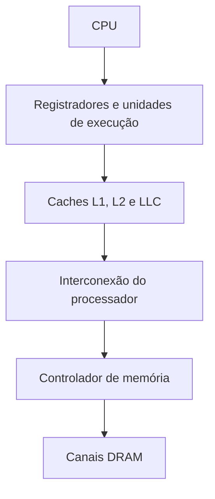
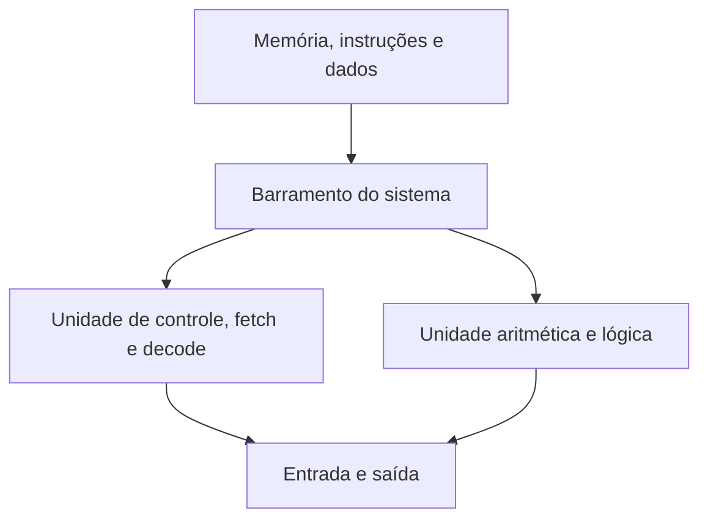

# Barramento do sistema

O barramento do sistema é o modelo que explica como CPU, memória e dispositivos de entrada e saída trocam endereços, dados e controle. Em computadores antigos, era comum imaginar um barramento compartilhado único. Em sistemas modernos, a função é distribuída por interconexões ponto a ponto, controladores integrados, switches e fabrics. O modelo continua útil, mas não deve ser confundido com um cabo ou uma única frequência.

## Componentes conceituais

O barramento de endereços indica o local da operação. O barramento de dados transporta valores. O barramento de controle transporta sinais de leitura, escrita, interrupção, arbitragem, invalidação e sincronização. Essa separação é didática; o protocolo físico e o formato dos pacotes variam entre memória, PCIe, USB e outras interconexões.

Uma operação típica envolve um mestre, como a CPU ou um dispositivo DMA, que solicita acesso; um alvo, como RAM ou um registrador de dispositivo, que responde; e uma política que determina prioridade, largura de banda, ordem e tratamento de erro.

## CPU e memória

A CPU acessa a memória virtual por meio da MMU, que traduz endereços virtuais para físicos usando tabelas de páginas e TLBs. Antes de chegar à RAM, a solicitação atravessa caches. O controlador de memória agenda acessos aos canais de DRAM e aplica as regras de coerência entre núcleos.

O caminho moderno pode ser descrito assim:

A largura do barramento não é a única medida de desempenho. Latência, paralelismo, número de canais, localidade, coerência, prefetching e contenção determinam quanto trabalho chega efetivamente à memória.

## CPU e entrada e saída

Dispositivos expõem registradores de controle e buffers por endereços de memória ou por mecanismos específicos da plataforma. A CPU configura um dispositivo escrevendo nesses registradores, recebe interrupções quando eventos ocorrem e usa DMA para transferências grandes. Polling pode reduzir a latência em alguns casos, mas consome CPU e energia.

PCI Express é uma interconexão serial ponto a ponto para GPUs, NVMe, placas de rede e outros dispositivos. USB conecta periféricos por uma hierarquia de hubs e controladores. SATA atende armazenamento com outro protocolo. Todos podem ser descritos como partes do sistema de entrada e saída, mas não compartilham a mesma camada física ou semântica.

## DMA e IOMMU

Com DMA, a CPU programa um dispositivo para transferir dados diretamente para ou da RAM. Isso evita cópias byte a byte e libera ciclos de CPU, mas cria requisitos de coerência, sincronização e segurança. Um dispositivo mal configurado ou comprometido não deve poder escrever em qualquer endereço físico.

O IOMMU traduz e restringe endereços usados por dispositivos, de modo análogo à MMU da CPU. Ele é importante para virtualização, passthrough de dispositivos e isolamento contra DMA. O agrupamento físico de dispositivos e a configuração da plataforma podem limitar a granularidade possível.

## Interconexões modernas

Em servidores e PCs, controladores de memória são frequentemente integrados ao processador. Intel usa famílias de interconexão como UPI em sistemas escaláveis; AMD usa Infinity Fabric para conectar chiplets, núcleos, I/O e memória, com detalhes que variam por geração. O nome comercial muda, mas a preocupação é a mesma: conectar produtores e consumidores de dados com latência, largura de banda e coerência aceitáveis.

Em SoCs, um network on chip ou fabric interno conecta CPU, GPU, aceleradores, memória e periféricos. No Apple Silicon, a Apple descreve o Apple Fabric como parte da conexão dos componentes à memória unificada. A topologia interna é relevante para desempenho, mas não altera a distinção entre CPU, RAM, GPU e dispositivos.

## Diagrama de von Neumann

O modelo de von Neumann reúne memória, unidade de controle, unidade aritmética e lógica e entrada e saída em um sistema no qual instruções e dados ocupam a mesma memória endereçável. A CPU busca instruções e dados por esse caminho compartilhado.

O modelo explica o programa armazenado e o ciclo de busca, decodificação e execução. CPUs reais usam caches separadas para instruções e dados, predição, execução especulativa e várias interconexões, por isso são frequentemente descritas como Harvard modificadas em partes internas, embora mantenham uma visão arquitetural compatível com o modelo de memória do programa.

## Fontes

- [Computer Systems: A Programmer's Perspective](https://csapp.cs.cmu.edu/3e/perspective.html)
- [Intel, fundamentos da arquitetura](https://www.intel.com/content/dam/www/public/us/en/documents/white-papers/ia-introduction-basics-paper.pdf)
- [PCI-SIG, PCI Express](https://pcisig.com/specifications/pciexpress)
- [USB-IF, especificações USB](https://www.usb.org/documents)
- [Apple, arquitetura de sistema do Apple Silicon](https://developer.apple.com/videos/play/wwdc2020/10686/)
