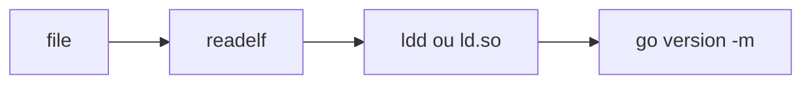

# Mapa de inspeção de binários e bibliotecas

Um programa executável não é apenas um arquivo que pode ser iniciado. Ele tem um formato, uma arquitetura, uma ABI, bibliotecas necessárias, metadados de build e regras de busca definidas pelo sistema operacional. `file`, `readelf`, `ldd`, `LD_LIBRARY_PATH` e `go version -m` respondem perguntas diferentes sobre esse conjunto.

Uma sequência útil começa pela identificação do arquivo, passa pela inspeção estrutural e termina na observação da resolução de dependências:



Essa sequência não transforma um binário desconhecido em um artefato confiável. Ela apenas torna suas propriedades observáveis. Integridade, origem, assinatura, permissões e comportamento continuam exigindo verificações próprias.

## `file`

`file` identifica um arquivo usando principalmente números mágicos e padrões conhecidos, não apenas a extensão do nome. Para um executável ELF, ele normalmente informa a classe, a arquitetura, o endianness, o tipo do arquivo e, em alguns casos, se há símbolos de debug ou se o programa é dinamicamente vinculado.

```bash
file ./programa
file /usr/bin/ssh
file --brief ./programa
```

O resultado é uma classificação inicial. Ele ajuda a distinguir, por exemplo, um executável ELF x86-64 de um ELF AArch64, uma biblioteca compartilhada de um executável e um arquivo texto de um arquivo binário. A saída não prova que o arquivo é seguro, correto ou compatível com o kernel e com as bibliotecas instaladas.

Em scripts, prefira interpretar o resultado com cuidado. A saída textual pode variar entre versões do `file` e entre sistemas. Quando o formato é conhecido, combine a inspeção com `readelf`, checksums, assinatura e validação do pacote que forneceu o arquivo.

## `readelf`

`readelf`, do projeto GNU Binutils, lê as estruturas de um arquivo ELF sem precisar executá-lo. Ele é apropriado para investigar cabeçalhos, segmentos, seções, símbolos, notas, relocations, a seção dinâmica e o build ID.

Algumas consultas frequentes são:

```bash
readelf -h ./programa
readelf -l ./programa
readelf -S ./programa
readelf -d ./programa
readelf -Ws ./programa
readelf -n ./programa
```

`-h` mostra o cabeçalho ELF, incluindo arquitetura, tipo e entry point. `-l` mostra program headers, que descrevem o que o loader precisa mapear na memória. `-S` mostra seções usadas pelo linker e pelas ferramentas de análise. `-d` mostra a seção dinâmica, onde aparecem dependências `NEEDED`, `RPATH`, `RUNPATH` e o interpretador ELF. `-n` exibe notas, como build IDs e propriedades da plataforma.

O interpretador é especialmente importante para executáveis dinamicamente vinculados. Em um ELF Linux x86-64, um valor como `/lib64/ld-linux-x86-64.so.2` identifica o programa que carrega o executável e resolve suas bibliotecas. Esse caminho não é a lista completa de dependências, mas indica qual loader será usado.

Para investigar por que uma biblioteca não é encontrada, observe primeiro a seção dinâmica:

```bash
readelf -d ./programa | grep -E 'NEEDED|RPATH|RUNPATH'
readelf -l ./programa | grep 'Requesting program interpreter'
```

Uma dependência `NEEDED` normalmente contém apenas o nome da biblioteca, como `libssl.so.3`. O caminho efetivo depende do loader, do cache de `ldconfig`, dos diretórios padrão e das variáveis de ambiente. O `readelf` revela o contrato gravado no ELF, mas não simula sozinho todas as decisões do loader.

## Bibliotecas dinâmicas e o loader

Uma biblioteca compartilhada pode ser carregada em tempo de execução para reduzir duplicação, permitir atualizações independentes e compartilhar páginas de código entre processos. O executável registra nomes de bibliotecas e símbolos; o loader encontra os objetos, mapeia seus segmentos, aplica relocations e resolve símbolos conforme necessário.

Essa flexibilidade cria uma diferença importante entre o que foi gravado no binário e o ambiente em que ele será executado. Um programa pode passar no `file` e no `readelf`, mas falhar com `error while loading shared libraries` porque o loader não encontra a versão exigida, encontra uma ABI incompatível ou não consegue carregar uma dependência transitiva.

O cache de bibliotecas do sistema é gerenciado normalmente por `ldconfig`. A política do sistema pode usar arquivos como `/etc/ld.so.conf` e `/etc/ld.so.conf.d/*.conf`, além dos diretórios padrão da distribuição. Não altere esses arquivos apenas para fazer um programa isolado funcionar: uma alteração global pode mudar a biblioteca escolhida por muitos processos.

## `LD_LIBRARY_PATH`

`LD_LIBRARY_PATH` é uma lista separada por dois-pontos de diretórios que o loader consulta durante a resolução de bibliotecas. Ele é útil para testes controlados, para executar uma versão local de uma biblioteca e para diagnosticar diferenças entre ambientes.

```bash
LD_LIBRARY_PATH="$PWD/lib" ./programa
LD_LIBRARY_PATH="$PWD/lib:/opt/vendor/lib" ./programa
```

O efeito é local ao processo iniciado dessa forma, mas pode alcançar processos filhos. Um valor vazio, um diretório gravável por usuários não confiáveis ou uma configuração exportada globalmente pode fazer um programa carregar código diferente daquele revisado pelo administrador. Por isso, não use `LD_LIBRARY_PATH` como solução permanente para empacotamento ou como mecanismo de segurança.

Há ainda uma restrição de segurança importante: o loader pode ignorar variáveis como `LD_LIBRARY_PATH` em execuções consideradas privilegiadas, como programas setuid ou setgid, por causa do modo de execução seguro. Mesmo quando a variável é aceita, o ambiente do processo não deve ser tratado como uma fonte confiável para um serviço privilegiado.

Quando o software é distribuído, prefira uma destas alternativas, conforme o caso:

- empacotar as bibliotecas e declarar dependências corretamente;
- instalar bibliotecas em um prefixo controlado e registrar a configuração do loader;
- usar `RUNPATH` ou `RPATH` somente quando a política de distribuição justificar;
- usar `$ORIGIN` para um artefato autocontido, com diretórios não graváveis por usuários não confiáveis;
- eliminar a dependência dinâmica com link estático apenas quando a licença, a segurança e o modelo de atualização permitirem.

`RUNPATH` e `RPATH` não são equivalentes. A ordem de busca depende da presença desses atributos, do loader e de variáveis de ambiente. Não deduza a ordem apenas olhando o nome de uma variável. Confirme com o loader e teste em um ambiente limpo.

## `ldd`

`ldd` apresenta as dependências dinâmicas que seriam resolvidas para um executável ou biblioteca compartilhada:

```bash
ldd ./programa
ldd /usr/bin/ssh
```

Ele é conveniente para responder rapidamente quais objetos compartilhados são encontrados e para qual caminho cada nome foi resolvido. Uma linha com `not found` indica que a resolução falhou. Uma linha terminada em `=>` mostra o caminho efetivamente selecionado, quando a ferramenta consegue determiná-lo.

`ldd` não é um analisador de confiança. Não execute essa ferramenta indiscriminadamente sobre binários recebidos de terceiros ou sobre arquivos que podem ter sido manipulados. Dependendo da implementação, da versão do loader e do tipo do arquivo, a análise pode envolver comportamento de execução. Para um artefato não confiável, prefira começar com `file` e `readelf`, em uma sandbox, e examine a documentação da distribuição antes de usar `ldd`.

Para uma observação mais controlada do loader, o próprio interpretador pode ser invocado com opções de diagnóstico quando isso fizer parte do procedimento suportado pela distribuição:

```bash
/lib64/ld-linux-x86-64.so.2 --list ./programa
```

O caminho do interpretador varia conforme a arquitetura e a distribuição. Consulte o resultado de `readelf -l` em vez de assumir um caminho fixo. Variáveis de diagnóstico como `LD_DEBUG=libs` também podem revelar a ordem de busca, mas produzem saída extensa e não devem ser deixadas ativadas em serviços de produção.

## `go version -m`

Programas Go podem carregar no executável informações de build e do grafo de módulos. `go version -m` lê esses metadados sem exigir o código-fonte do projeto:

```bash
go version -m ./programa-go
go version -m /usr/local/bin/ferramenta
```

A saída pode conter a versão do Go, o caminho do módulo principal, a versão do módulo, o checksum do módulo, dependências e flags de build. Isso é útil para responder qual revisão de uma dependência foi incorporada a um binário que chegou a um ambiente, para relacionar um artefato a um SBOM e para investigar uma vulnerabilidade sem reconstruir imediatamente o projeto.

Esses metadados dependem de como o programa foi compilado. Um binário despojado ou produzido por um fluxo que remove a seção de build info pode não fornecer todas as informações. A ausência de dados não prova que não existem dependências; significa apenas que essa fonte de evidência não está disponível.

O comando também não substitui a verificação da imagem ou do pacote. Em um container, é necessário considerar o binário, as bibliotecas do filesystem, a imagem base, os módulos Go incorporados e o processo que seleciona e publica o artefato.

## Fluxo de diagnóstico

Quando um binário funciona em um ambiente e falha em outro, separe formato, arquitetura, loader, biblioteca e metadados:

```bash
file ./programa
readelf -h ./programa
readelf -l ./programa | grep interpreter
readelf -d ./programa | grep NEEDED
ldd ./programa
go version -m ./programa
```

Se houver suspeita de que uma variável esteja alterando o comportamento, compare um ambiente limpo com um ambiente controlado:

```bash
env -u LD_LIBRARY_PATH ./programa
LD_LIBRARY_PATH="$PWD/lib" ./programa
```

Depois compare arquitetura e ABI, versão do loader, distribuição, bibliotecas transitivas, permissões, arquitetura do container e origem do artefato. Em vez de copiar uma biblioteca qualquer para `/usr/lib`, identifique o pacote responsável, verifique a compatibilidade da ABI e corrija a declaração de dependência no build ou na imagem.

## Limites e segurança

Inspeção não é validação de integridade. `file` pode reconhecer um formato, `readelf` pode mostrar uma estrutura consistente, `ldd` pode exibir dependências e `go version -m` pode revelar módulos, mas nenhum desses comandos garante que o conteúdo não foi adulterado.

Para uma cadeia de distribuição confiável, combine:

- checksum ou assinatura verificada contra uma fonte confiável;
- origem e revisão do código ou pacote;
- SBOM e proveniência do build;
- pinagem de imagem e dependências;
- execução com usuário e permissões mínimos;
- sandbox ou isolamento para análise de artefatos desconhecidos;
- testes em um ambiente que reproduza a arquitetura de produção.

Também não confunda uma dependência encontrada com uma dependência segura. Uma biblioteca pode estar presente, ser carregada corretamente e ainda conter uma vulnerabilidade, uma configuração inadequada ou uma ABI incompatível com o uso esperado.

## Fontes

- [`ld.so(8)`](https://man7.org/linux/man-pages/man8/ld.so.8.html) explica o loader, a ordem de busca e o modo seguro.
- [`ldd(1)`](https://man7.org/linux/man-pages/man1/ldd.1.html) documenta a inspeção de dependências e suas advertências de segurança.
- [`file(1)`](https://man7.org/linux/man-pages/man1/file.1.html) documenta identificação por padrões e números mágicos.
- [`readelf` no GNU Binutils](https://sourceware.org/binutils/docs/binutils/readelf.html) documenta a leitura das estruturas ELF.
- [`go version`](https://pkg.go.dev/cmd/go#hdr-Print_Go_version) documenta a leitura da versão e das informações de build de executáveis Go.
