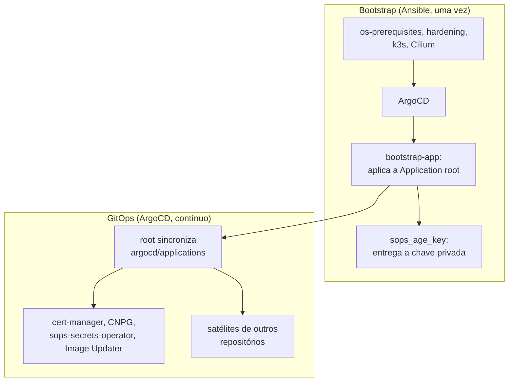
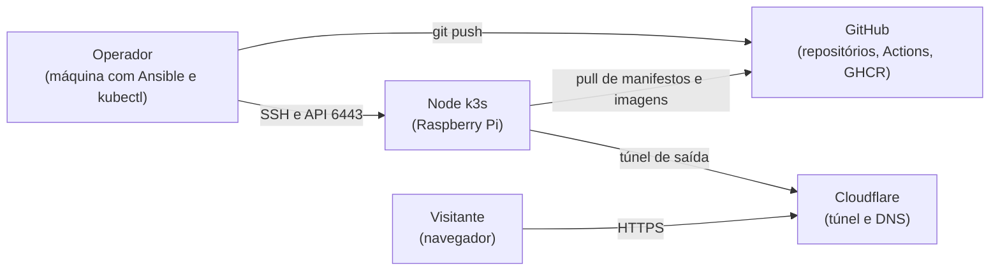
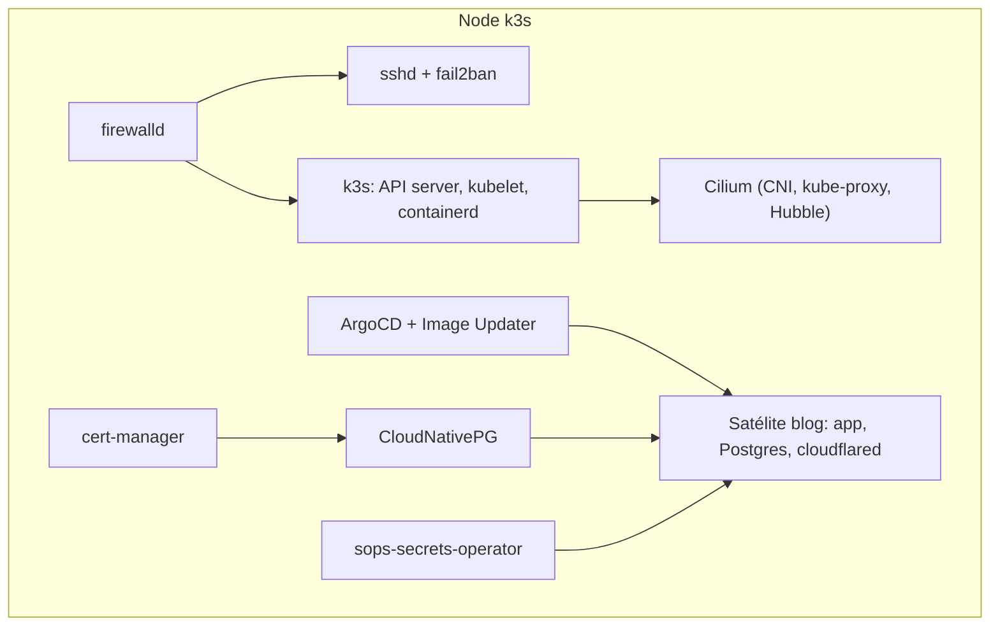

# Arquitetura

Esta seção explica como o repositório inteiro se encaixa e como cada peça individual funciona, com o raciocínio por trás de cada decisão. Para provisionar o cluster do zero na prática, comece pelo [primeiro bootstrap](../operacional/primeiro-bootstrap.md); para aprender o que é cada ferramenta antes de entender a decisão sobre ela, veja [Aprender](../aprender/index.md); para uma tarefa pontual do dia a dia, veja o [operacional](../operacional/index.md).

## Visão geral

O repositório resolve dois problemas de naturezas diferentes, com duas ferramentas diferentes.

O primeiro é o bootstrap: transformar um Raspberry Pi limpo num nó k3s com todos os componentes de plataforma instalados. Isso acontece uma única vez (ou uma vez por nó novo), via Ansible, direto por SSH. Depois que o Ansible termina, ele não precisa rodar de novo a menos que uma versão de componente mude ou um nó novo entre no cluster.

O segundo é manter o estado do cluster ao longo do tempo: quais aplicações rodam, com qual configuração, sincronizadas a partir do que está commitado no git. Isso é responsabilidade do ArgoCD, de forma contínua, sem intervenção do Ansible.

## Contexto e contêineres

O diagrama de contexto mostra quem interage com o sistema e por onde; o de contêineres abre o node e mostra o que roda dentro dele.

- [Ansible: as roles do bootstrap](ansible.md) descreve a ordem e o papel de cada role.
- [Helm e os charts](helm-e-charts.md) explica por que nenhum componente fica vendorizado como manifesto estático.
- [GitOps: root e satélites](gitops-root-e-satelites.md) descreve o padrão de app-of-apps que o ArgoCD usa.
- [OpenTofu: a camada da Cloudflare](opentofu.md) descreve o túnel e o DNS do blog, e por que o token do túnel nunca passa pelo OpenTofu.
- [Tailscale: acesso remoto e DNS interno](tailscale.md) descreve como o node entra na tailnet e por que `*.guesant.internal` só resolve lá dentro.
- [Ingress: os nomes internos pela tailnet](ingress.md) descreve o Traefik que escuta no node, a Gateway API e a CA interna que emite os certificados desses nomes.
- [A pipeline de CI](ci.md) descreve os jobs do workflow `ci` e por que eles vivem todos no mesmo arquivo.
- [Modelo de ameaças](modelo-de-ameacas.md) lista o que se protege, por onde um atacante entraria e o que barra cada caminho.
- [Mapa de controles](mapa-de-controles.md) inventaria cada garantia com a evidência que a prova.
- [Checklist de segurança](checklist-de-seguranca.md) confronta o repositório e o cluster com as recomendações de guias públicos de GitOps, DevOps, Linux, Terraform e Kubernetes, com as fontes e as lacunas.
- [Variáveis](variaveis.md) lista toda variável de `ansible/group_vars/all/`, separando versões de segredos.
