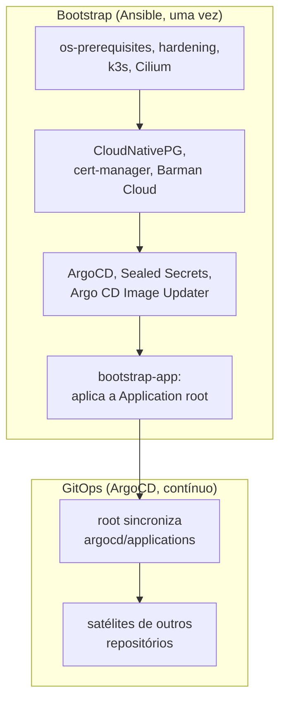

# Arquitetura

Esta seção explica como o repositório inteiro se encaixa e como cada peça individual funciona, com o raciocínio por trás de cada decisão. Para aprender a operar o repositório na prática, comece pelo [tutorial](../tutorial/index.md); para uma tarefa pontual do dia a dia, veja o [operacional](../operacional/index.md).

## Visão geral

O repositório resolve dois problemas de naturezas diferentes, com duas ferramentas diferentes.

O primeiro é o bootstrap: transformar um Raspberry Pi limpo num nó k3s com todos os componentes de plataforma instalados. Isso acontece uma única vez (ou uma vez por nó novo), via Ansible, direto por SSH. Depois que o Ansible termina, ele não precisa rodar de novo a menos que uma versão de componente mude ou um nó novo entre no cluster.

O segundo é manter o estado do cluster ao longo do tempo: quais aplicações rodam, com qual configuração, sincronizadas a partir do que está commitado no git. Isso é responsabilidade do ArgoCD, de forma contínua, sem intervenção do Ansible.

- [Ansible: as roles do bootstrap](ansible.md) descreve a ordem e o papel de cada role.
- [Helm e os charts](helm-e-charts.md) explica por que nenhum componente fica vendorizado como manifesto estático.
- [GitOps: root e satélites](gitops-root-e-satelites.md) descreve o padrão de app-of-apps que o ArgoCD usa.
- [A pipeline de CI](ci.md) descreve os jobs do workflow `ci` e por que eles vivem todos no mesmo arquivo.
- [Modelo de ameaças](modelo-de-ameacas.md) lista o que se protege, por onde um atacante entraria e o que barra cada caminho.
- [Variáveis](variaveis.md) lista toda variável de `ansible/group_vars/all.example.yml`.
