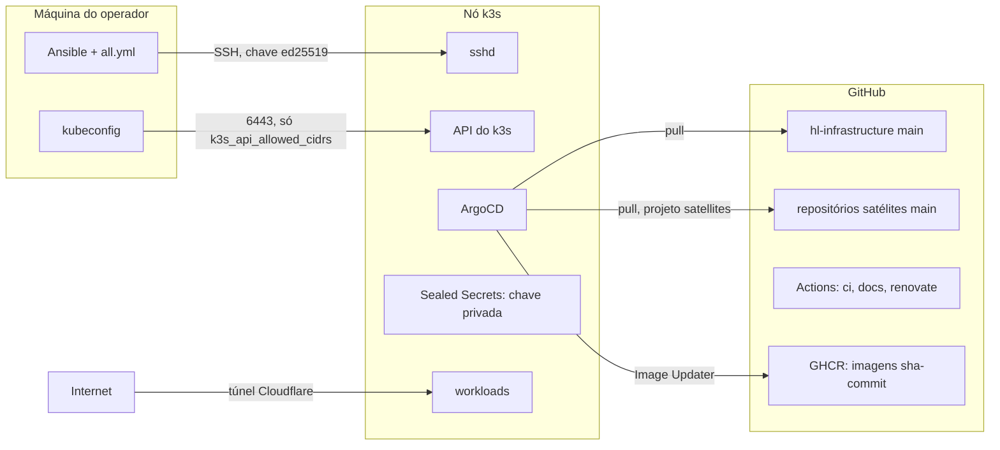
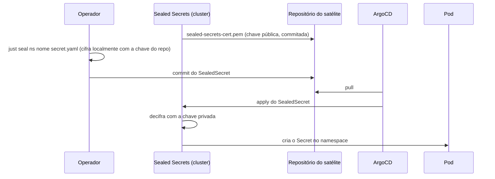

# Modelo de ameaças

Este repositório descreve, e em parte controla, um cluster k3s de um nó só que hospeda serviços públicos de uma pessoa. O modelo abaixo diz o que se está protegendo, por onde um atacante entraria, o que já barra cada caminho e o que continua em aberto. Ele existe para que uma mudança de infraestrutura possa ser julgada contra uma lista explícita, e não contra a intuição de quem a escreveu.

## O que se protege

Os ativos, em ordem de gravidade se perdidos ou comprometidos: os dados dos serviços (o Postgres do blog e seus backups), a chave privada do Sealed Secrets (quem a tem decifra todo segredo commitado em qualquer satélite), a credencial de administrador do cluster (o kubeconfig e a chave SSH de root do nó), a capacidade de publicar em `main` deste repositório e dos satélites (porque o Argo aplica o que está lá sem intervenção humana), e a disponibilidade dos serviços públicos.

## Fronteiras de confiança

Cada seta cruza uma fronteira, e cada fronteira tem um controle que a sustenta.

Da máquina do operador para o nó, a entrada é SSH com chave ed25519 declarada em `ssh_root_authorized_key`, senha desabilitada pela role `ssh_hardening` e `fail2ban` limitando tentativas. A API do k3s só aceita conexão dos CIDRs em `k3s_api_allowed_cidrs`. O que está fora desse controle: o kubeconfig e o `all.yml` ficam em texto claro no disco do operador, protegidos só pela cifragem de disco da máquina e pelo `.gitignore`; um comprometimento dessa máquina é comprometimento total do cluster, e a página [estado fora do git](../operacional/estado-fora-do-git.md) lista tudo o que vive só ali.

Do GitHub para o cluster, o Argo puxa `main` deste repositório com o projeto `infra`, que tem permissão ampla, e `main` de cada satélite de terceiro com o projeto `satellites`, que só cria recurso de namespace, mais `StorageClass`. O projeto `default` que o Argo cria na instalação está esvaziado, para que um `Application` filho não escape dessa restrição declarando outro projeto. Consequência direta: quem consegue escrever em `main` deste repositório administra o cluster, e quem consegue escrever em `main` de um satélite de terceiro administra só o namespace daquele satélite. A proteção real desses branches é a conta do GitHub com MFA e o ruleset que exige pull request; o dono do repositório pode contorná-lo, e cada push direto em `main` fica registrado como bypass no histórico do GitHub.

O único satélite deste cluster, o blog, é uma exceção deliberada a essa fronteira: suas `Application`s hoje vivem neste mesmo repositório, sob o projeto `satellites` (o teto de permissão continua o mesmo), então quem administra este repositório já administra o namespace do blog de qualquer forma, sem precisar de um segundo repositório. Isso reduz o número de lugares a proteger, não a superfície administrável por quem já escreve aqui; veja "Por que o blog deixou de ser um satélite de verdade" em [GitOps: root e satélites](gitops-root-e-satelites.md).

Do GHCR para o cluster, o Image Updater troca a imagem de um satélite sempre que aparece uma tag nova no padrão `sha-<commit>`. Quem consegue publicar nesse pacote do GHCR consegue rodar código no namespace do satélite; a barreira é a permissão de escrita no pacote, que só a pipeline do repositório do satélite tem via `GITHUB_TOKEN`. Uma tag fora do padrão é ignorada, então um `latest` reescrito não afeta o que roda.

Das Actions para o GitHub, o `ci` e o `docs` rodam com `contents: read` e sem credencial persistida no checkout, então um passo comprometido lê o repositório público e nada mais. O `renovate` é o único com token de escrita, guardado num environment restrito a `main`, e só ele pode abrir PRs; o merge continua humano. Toda action é pinada por SHA e auditada por `zizmor` a cada push.

Da Internet para os serviços, nada chega direto ao nó: o blog é exposto por um túnel Cloudflare saindo de dentro do cluster, e o firewall do nó não abre porta de serviço. O que fica exposto é a porta 22 e a 6443, ambas restritas como descrito acima. Isso não é só preferência: uma regra de firewalld filtra a chain `INPUT`, que só vê tráfego destinado ao próprio host. Uma `Service` do tipo `LoadBalancer` ou `NodePort` chega por um DNAT que muda o destino do pacote antes dele ser avaliado, então esse tráfego passa pela chain `FORWARD`, não pela `INPUT`, e uma regra de firewalld sobre a porta nunca é sequer consultada. É por isso que a role `k3s` desliga o Traefik e o ServiceLB embutidos: expor algo assim tornaria qualquer regra de firewall sobre aquela porta uma proteção falsa. A porta 6443 escapa desse problema porque o próprio processo do k3s escuta direto na interface do host, sem passar por uma `Service`, então a chain `INPUT` realmente vê e filtra esse tráfego.

Dentro do cluster, o Sealed Secrets guarda a chave privada em `kube-system`; a chave pública correspondente é `sealed-secrets-cert.pem`, commitada neste repositório, porque cifrar com ela não permite decifrar nada. Qualquer workload que consiga ler `Secret` nesse namespace decifra tudo; o projeto `satellites` não pode criar `ClusterRole`, então um satélite não consegue se conceder essa leitura por GitOps. Um `Pod` privilegiado ou com montagem do host é barrado antes de chegar ao cluster pelos gates `kube-linter`, `checkov` e `trivy config` sobre os charts renderizados, mas esses gates só cobrem os sete charts Helm deste repositório; a política de rede e de recursos de um satélite de terceiro é responsabilidade do satélite. A do blog está fora dessa exceção: como suas `NetworkPolicy`, `ResourceQuota` e `LimitRange` também vivem neste repositório agora, elas ficam sujeitas às mesmas convenções de revisão daqui, ainda que não passem pelos mesmos gates de chart Helm, por não serem chart.

## O caminho de um segredo

A sequência abaixo é o único caminho pelo qual um valor sensível chega a um pod. Em nenhum ponto o texto claro passa pelo git nem pelo Argo.

O `argocd_github_webhook_secret` e a chave SSH seguem outro caminho, mais curto: ficam em `secrets.yml` na máquina do operador e o Ansible os entrega ao node por SSH, sem passar por nenhum repositório.

## O que fica fora do modelo

Um atacante com acesso físico ao nó ou ao hipervisor. Uma vulnerabilidade zero-day no k3s, no Cilium ou no kernel antes do Renovate propor a versão corrigida e ela ser aplicada por um novo `bootstrap`. Um comprometimento da conta do GitHub do dono com MFA vencida. Esses cenários não têm mitigação declarada aqui e devem ser tratados como perda total do cluster, com reconstrução a partir do repositório e dos backups.

## Continue por aqui

O [SECURITY.md](https://github.com/guesant/hl-infrastructure/blob/main/SECURITY.md) diz como reportar uma falha que este modelo não previu. A página [GitOps: root e satélites](gitops-root-e-satelites.md) detalha as permissões de cada projeto do Argo, e [a pipeline de CI](ci.md) lista os gates que barram um manifesto perigoso antes do apply.
