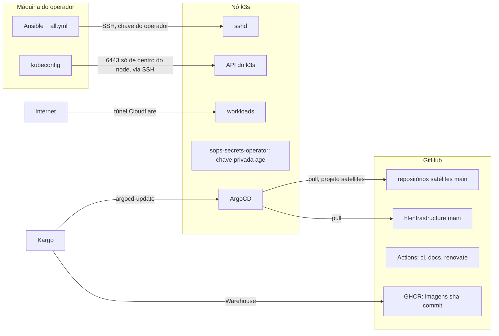
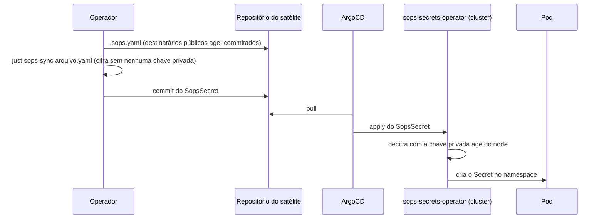

# Modelo de ameaças

<!-- source-of-trust paths=".sops.yaml .tools/sops-recipients.sh .tools/sops-drill.sh .tools/sops-sync.sh .tools/sops-rotate.sh" -->

Este repositório descreve, e em parte controla, um cluster k3s de um nó só que hospeda serviços públicos de uma pessoa. O modelo abaixo diz o que se está protegendo, por onde um atacante entraria, o que já barra cada caminho e o que continua em aberto. Ele existe para que uma mudança de infraestrutura possa ser julgada contra uma lista explícita, e não contra a intuição de quem a escreveu.

## O que se protege

Os ativos, em ordem de gravidade se perdidos ou comprometidos:

- Os dados dos serviços. O Postgres do blog não tem backup hoje, então perda de volume é perda total.
- Qualquer chave privada age listada em `.sops.yaml`, hoje a do node, a de rotina do operador na Secure Enclave e a de desastre no Bitwarden. Quem tem uma delas decifra todo `SopsSecret` commitado em qualquer satélite.
- A credencial de administrador do cluster, isto é, o kubeconfig e a chave SSH de root do nó.
- O API token da Cloudflare em `tofu/cloudflare/cloudflare.sops.env`. Quem o tem redireciona o tráfego do blog trocando o ingress do túnel ou o DNS.
- A capacidade de publicar em `main` deste repositório e dos satélites, porque o Argo aplica o que está lá sem intervenção humana.
- A disponibilidade dos serviços públicos.

## Fronteiras de confiança

Cada seta cruza uma fronteira, e cada fronteira tem um controle que a sustenta. Os parágrafos seguintes percorrem essas setas na mesma ordem, dizendo o que barra a travessia e o que o controle não alcança. Onde a proteção depende de algo que este repositório não gerencia, como a conta do GitHub ou a ACL da tailnet, isso fica dito na própria passagem.

Da máquina do operador para o nó, a entrada é SSH com a chave que o operador autorizou no nó antes do primeiro bootstrap, senha desabilitada pela role de hardening de SSH e fail2ban limitando tentativas. A API do k3s não aceita conexão de rede nenhuma, nem da rede local, nem da tailnet; o kubectl roda no próprio node, por SSH, e o kubeconfig que a role do k3s traz só serve como cópia do arquivo.

O que está fora desse controle: o kubeconfig e o arquivo de variáveis do Ansible ficam em texto claro no disco do operador, protegidos só pela cifragem de disco da máquina e pelo gitignore. Um comprometimento dessa máquina é comprometimento total do cluster, e a página [estado fora do git](../operacional/estado-fora-do-git.md) lista tudo o que vive só ali.

Do GitHub para o cluster, o Argo puxa o branch principal deste repositório com o projeto de infraestrutura, que tem permissão ampla, e o branch principal de cada satélite de terceiro com o projeto de satélites, que só cria recurso de namespace, mais classe de armazenamento. O projeto padrão que o Argo cria na instalação está esvaziado, para que uma aplicação filha não escape dessa restrição declarando outro projeto.

Consequência direta: quem consegue escrever no branch principal deste repositório administra o cluster, e quem consegue escrever no de um satélite de terceiro administra só o namespace daquele satélite. A proteção real desses branches é a conta do GitHub com MFA e o ruleset que exige pull request; o dono do repositório pode contorná-lo, e cada push direto fica registrado como bypass no histórico do GitHub.

O único satélite deste cluster, o blog, é uma exceção deliberada a essa fronteira: suas aplicações vivem neste mesmo repositório, sob o projeto de satélites, mesmo teto de permissão, então quem administra este repositório já administra o namespace do blog, sem precisar de um segundo repositório.

Isso reduz o número de lugares a proteger, não a superfície administrável por quem já escreve aqui; veja "Por que o blog não é um satélite de verdade" em [GitOps: root e satélites](gitops-root-e-satelites.md).

O custo é que nenhum satélite de terceiro exercita essa fronteira hoje: o único consumidor real desse projeto é este mesmo repositório, então uma restrição frouxa demais nele não apareceria como problema até existir um satélite que não seja nosso.

Do GHCR para o cluster, o Warehouse do Kargo observa a tag do branch principal do pacote do satélite e, a cada digest novo, o Stage escreve esse digest na aplicação do Argo (veja [Rollout de imagens](rollout-de-imagens.md)). Quem consegue publicar nesse pacote do GHCR consegue rodar código no namespace do satélite; a barreira é a permissão de escrita no pacote, que só a pipeline do repositório do satélite tem via um token de curta duração do GitHub.

O Kargo só escreve na aplicação que carrega a anotação `kargo.akuity.io/authorized-stage` apontando para aquele stage, e o que ele grava é o digest, não a tag, então mover a tag depois não muda o que roda até a próxima promoção, que fica registrada.

Das Actions para o GitHub, os workflows de CI e de docs rodam com permissão só de leitura e sem credencial persistida no checkout, então um passo comprometido lê o repositório público e nada mais. O workflow do Renovate é o único com token de escrita, guardado num ambiente restrito ao branch principal, e só ele pode abrir PRs; o merge continua humano. Toda action é pinada por SHA e auditada pelo zizmor a cada push.

Da Internet para os serviços, nada chega direto ao nó: o blog é exposto por um túnel Cloudflare saindo de dentro do cluster, e o firewall do nó não abre porta de serviço. O que fica exposto é a porta 22, restrita como descrito acima; a porta da API do k3s não abre em zona nenhuma.

O túnel inverte a direção da conexão: quem sai é o cloudflared de dentro do cluster, então não há porta de entrada para varrer, e todo tráfego que chega ao blog passou antes pelo proxy da Cloudflare.

Manter os serviços fora de um Service exposto não é preferência de estilo. Uma regra de firewalld filtra a chain `INPUT`, que só vê tráfego destinado ao próprio host, e um serviço do tipo [LoadBalancer ou NodePort](../aprender/firewalld.md) chega por um DNAT que muda o destino do pacote antes dele ser avaliado. Esse tráfego passa então pela chain `FORWARD`, e a regra de firewalld sobre a porta nunca é sequer consultada.

É por isso que a role do k3s desliga o Traefik e o ServiceLB embutidos: expor algo assim tornaria qualquer regra de firewall sobre aquela porta uma proteção falsa. Já um processo que escuta direto na interface do host, como o k3s na porta 6443 ou o Traefik na 443, é realmente visto e filtrado pela chain `INPUT`, e é o que permite deixar a 6443 fechada e a 443 aberta só na zona da tailnet.

O [ingress](ingress.md) é construído sobre essa mesma regra: o Traefik roda em modo de rede do host e escuta nas portas 80 e 443 do node, sem serviço no caminho, e a zona da tailnet no firewalld é a única que as libera, de modo que da rede local e da Internet elas continuam fechadas.

O preço é um processo sem privilégio escutando em porta baixa no namespace de rede do host, o que exigiu baixar `net.ipv4.ip_unprivileged_port_start` para 80, uma concessão registrada na role de hardening de sysctl.

Essa concessão vale para todo processo sem privilégio do node, não só para o Traefik, e é justamente por isso que ela mora numa role e não num ajuste manual: assim ela aparece no diff de quem revisa o hardening de kernel, em vez de virar um detalhe que só o node conhece.

Dentro do cluster, o sops-secrets-operator guarda a chave privada age no segredo `sops-age-key-file`, no namespace `sops`; os destinatários públicos correspondentes vivem no arquivo de configuração do SOPS, commitados neste repositório, porque cifrar com eles não permite decifrar nada. Qualquer workload que consiga ler os segredos desse namespace decifra tudo; o projeto de satélites não pode criar papéis de cluster, então um satélite não consegue se conceder essa leitura por GitOps.

Um pod privilegiado ou com montagem do host é barrado antes de chegar ao cluster pelos gates de lint, de política e de configuração sobre os charts renderizados, mas esses gates só cobrem os charts Helm deste repositório; a política de rede e de recursos de um satélite de terceiro é responsabilidade do satélite.

A do blog está fora dessa exceção: como as políticas de rede e de recursos dele também vivem neste repositório agora, elas ficam sujeitas às mesmas convenções de revisão daqui, ainda que não passem pelos mesmos gates de chart Helm, por não serem chart.

A tailnet acrescenta uma fronteira que não existia: um dispositivo autenticado no Tailscale alcança o SSH e o DNS interno do node de qualquer lugar, e nada além do node, porque ele não anuncia rota, então a rede local por trás dele continua fora da tailnet. O que define essa fronteira é a identidade Tailscale do operador e a ACL da tailnet, que este repositório não gerencia.

O que o repositório controla é o que o node aceita de quem chega por ali: só SSH e DNS na zona da tailnet no firewalld, nenhuma policy de encaminhamento, e um resolvedor que recusa qualquer nome fora do domínio interno.

Uma conta Tailscale comprometida é, portanto, equivalente a estar na rede local do operador: chega ao SSH, que continua exigindo a chave, e à API do k3s, que continua restrita aos CIDRs declarados. O ganho é o inverso: com a tailnet funcionando, o SSH pode deixar de existir na interface da rede local, o que hoje ainda não foi feito para não trancar o operador antes de a tailnet estar provada.

## O caminho de um segredo

A sequência abaixo é o único caminho pelo qual um valor sensível chega a um pod. Em nenhum ponto o texto claro passa pelo git nem pelo Argo.

O segredo do webhook do GitHub segue outro caminho, mais curto: fica cifrado no arquivo de segredos do Ansible, commitado, e o Ansible o decifra na máquina do operador e o entrega ao node por SSH; quem lê o repositório vê só o texto cifrado. A chave SSH do operador nem passa pelo Ansible: ela já precisa estar autorizada no node para o primeiro bootstrap entrar.

A chave privada age do node nem isso: ela nasce dentro do próprio node, na primeira execução da role da chave age, e nunca existe em texto claro fora dele.

O arquivo de configuração do SOPS lista destinatários numa lista age só, sob um único grupo de chaves: qualquer chave privada correspondente a qualquer entrada da lista decifra sozinha, sem depender das outras. Não há número fixo de destinatários nem papéis fixos.

A recipe de destinatários opera sobre entradas identificadas só por um rótulo em comentário, e o nome é livre; os subcomandos disponíveis estão na tabela abaixo.

O subcomando de sincronização do node é uma conveniência sobre esse mesmo mecanismo: ele sabe ler a chave pública do segredo do cluster e manter uma entrada sincronizada com ela, por padrão a do próprio node, ou qualquer outro rótulo passado, o que serve se um segundo node algum dia entrar neste cluster ou em outro que compartilhe este arquivo.

| Subcomando de `just sops-recipients` | Faz o quê |
| --- | --- |
| `add <rótulo> <chave pública>` | adiciona um destinatário |
| `update` | atualiza uma entrada existente |
| `remove` | remove um destinatário |
| `list` | lista os destinatários atuais |
| `sync-node [rótulo]` | sincroniza com a chave pública do node |

Cifrar um segredo novo com a recipe de sincronização, assim como o gate de segredos cifrados, precisa só das chaves públicas, sem chave privada nenhuma envolvida. Sem argumento, a mesma recipe faz isso para todo satélite de uma vez, arquivo por arquivo, e pede a identidade que decifra apenas no arquivo que de fato precisa ser resincronizado.

Cifrar um satélite novo num lote onde os demais já estão em dia não trava esperando chave nenhuma.

Isso rotaciona quem consegue decifrar, mas não troca a chave de conteúdo, a DEK, que cifra o valor em si; a recipe `just sops-rotate` faz exatamente isso, gera uma DEK nova para cada segredo e recifra os valores com ela, sem alterar quem tem acesso. Como todo arquivo já cifrado precisa ser decifrado antes de ganhar uma DEK nova, ela sempre exige uma identidade que decifre, mesmo rodando sobre um arquivo só.

A distinção pesa no dia em que uma chave age sai do arquivo de destinatários: remover o destinatário impede que aquela chave decifre o que for cifrado depois, mas quem guardou uma cópia antiga do arquivo continua com a DEK que abre aquele conteúdo, e só a rotação da DEK fecha essa porta.

Um arquivo de destinatários alterado sem a sincronização correspondente não é um erro silencioso: o gate de segredos cifrados compara, para cada segredo, o conjunto de destinatários gravado no arquivo contra o conjunto atual, e falha em qualquer divergência, tanto uma chave que entrou e ainda não foi propagada quanto uma que saiu e ainda decifraria o segredo.

A comparação não precisa de chave privada nenhuma, porque o conjunto de destinatários fica em texto claro nos metadados que o SOPS grava, e é por isso que esse gate pode rodar na CI, onde não existe identidade que decifre.

O que ele não alcança é o conteúdo: se o valor cifrado ainda é o valor certo, nenhum gate sabe dizer, e o prazo por arquivo do job de idade dos segredos é o único sinal que resta.

As credenciais do OpenTofu seguem o mesmo modelo, com escolhas que limitam o estrago de um vazamento. O token de API da Cloudflare tem só as permissões de túnel e DNS, e nunca a de criar outros tokens, então quem o obtém consegue desviar o tráfego do blog mas não escalar para o resto da conta.

O token do túnel nunca passa pelo OpenTofu: ele vai da API da Cloudflare direto para um segredo do cluster, então o state commitado, mesmo que alguém quebre a cifragem dele, só revela IDs e os registros DNS.

O state cifrado protege contra um vazamento do repositório; ele não protege contra quem já tem uma das chaves age, porque a passphrase é cifrada para os mesmos destinatários que o token de API.

O token de join do k3s segue o mesmo caminho, mas na direção contrária: a variável cifrada no arquivo de segredos do Ansible, para os mesmos destinatários do arquivo de configuração do SOPS, é a fonte do valor, e é a role do k3s quem o grava no node, não o contrário.

Isso amplia o que uma chave age vazada entrega: além de decifrar os segredos commitados e as credenciais do OpenTofu, ela revela um token que permite juntar um node ao cluster, o que só vira ataque para quem também alcança a porta 6443, fechada para toda rede.

A troca foi aceita porque, sem um valor declarado, perder o node levaria junto o único registro do token; com o git como fonte, a recipe de rotação converge o node para o valor já commitado, e não existe cópia separada que possa ficar desatualizada.

Hoje o repositório usa esse mecanismo para manter, além da chave do node, uma chave de rotina do operador e uma chave de desastre. A de rotina é uma identidade do plugin da Secure Enclave presa ao Mac, no formato `age1se1...`, gerada com `just age-se-keygen` e nunca exportável dali.

Ela é criada exigindo biometria ou passcode do operador (`--access-control=any-biometry-or-passcode`), então cada decifragem exige uma confirmação no momento do uso, e não só a posse física do Mac; é uma chave mestra fora de disco e com uso auditado.

A de desastre é um par age comum, cuja metade privada vive só numa nota segura do Bitwarden, gerada com `just age-keygen` e nunca escrita em disco por este repositório. Gerar o par e registrar a chave pública no arquivo de destinatários são dois passos distintos, e só o segundo faz o par decifrar algo de verdade; até esse registro acontecer, a chave de desastre existe no Bitwarden sem conseguir abrir nenhum segredo.

Ela não decifra nada no dia a dia, é redundância pura: cobre o cenário em que o node e o Mac do operador se perdem juntos, e a recipe de simulação de desastre existe para provar periodicamente que ela ainda funciona. Nada impede adicionar mais uma chave, trocar a de rotina por outra, ou remover a de desastre; o único efeito de remover uma entrada é que a chave privada correspondente para de decifrar segredos cifrados depois disso.

## O que fica fora do modelo

Um atacante com acesso físico ao nó ou ao hipervisor. Uma vulnerabilidade zero-day no k3s, no Cilium ou no kernel antes do Renovate propor a correção e ela ser aplicada por um novo bootstrap. Um comprometimento da conta do GitHub do dono com MFA vencida.

Esses cenários não têm mitigação declarada aqui e devem ser tratados como perda total do cluster, com reconstrução a partir do repositório; os dados do Postgres do blog não sobrevivem, porque não há backup hoje.

## Continue por aqui

O [SECURITY.md](https://github.com/guesant/hl-infrastructure/blob/main/SECURITY.md) diz como reportar uma falha que este modelo não previu. A página [GitOps: root e satélites](gitops-root-e-satelites.md) detalha as permissões de cada projeto do Argo, e [a pipeline de CI](ci.md) lista os gates que barram um manifesto perigoso antes do apply. O [checklist de segurança](checklist-de-seguranca.md) confronta este modelo com as recomendações de guias públicos e lista as lacunas conhecidas.
