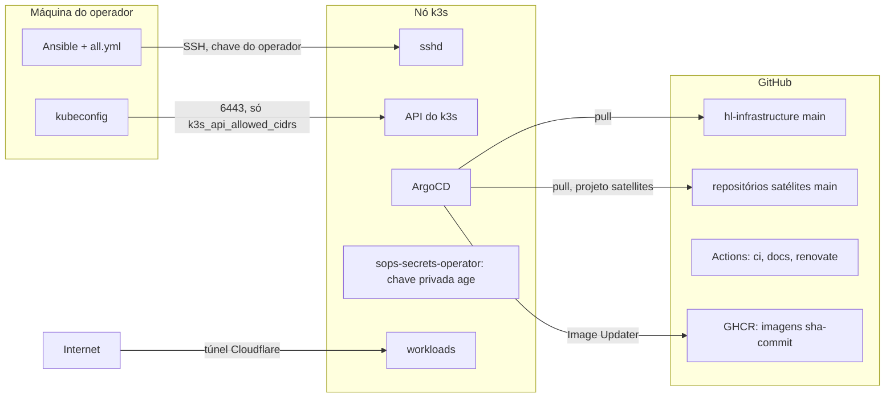
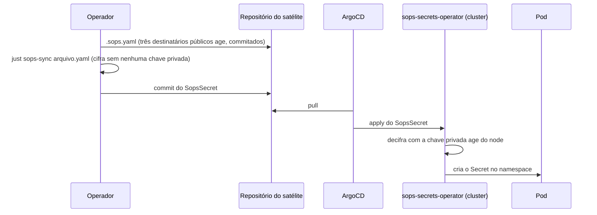

# Modelo de ameaças

<!-- source-of-trust paths=".sops.yaml .tools/sops-recipients.sh .tools/sops-drill.sh .tools/sops-sync.sh .tools/sops-rotate.sh" -->

Este repositório descreve, e em parte controla, um cluster k3s de um nó só que hospeda serviços públicos de uma pessoa. O modelo abaixo diz o que se está protegendo, por onde um atacante entraria, o que já barra cada caminho e o que continua em aberto. Ele existe para que uma mudança de infraestrutura possa ser julgada contra uma lista explícita, e não contra a intuição de quem a escreveu.

## O que se protege

Os ativos, em ordem de gravidade se perdidos ou comprometidos: os dados dos serviços (o Postgres do blog, sem backup hoje, então perda de volume é perda total), qualquer chave privada age listada em `.sops.yaml` (hoje a do node, a de rotina do operador na Secure Enclave e a de desastre no Bitwarden; quem tem uma delas decifra todo `SopsSecret` commitado em qualquer satélite), a credencial de administrador do cluster (o kubeconfig e a chave SSH de root do nó), o API token da Cloudflare em `tofu/cloudflare/cloudflare.sops.env` (quem tem ele redireciona o tráfego do blog trocando o ingress do túnel ou o DNS), a capacidade de publicar em `main` deste repositório e dos satélites (porque o Argo aplica o que está lá sem intervenção humana), e a disponibilidade dos serviços públicos.

## Fronteiras de confiança

Cada seta cruza uma fronteira, e cada fronteira tem um controle que a sustenta.

Da máquina do operador para o nó, a entrada é SSH com a chave que o operador autorizou no nó antes do primeiro bootstrap, senha desabilitada pela role `ssh_hardening` e `fail2ban` limitando tentativas. A API do k3s só aceita conexão dos CIDRs em `k3s_api_allowed_cidrs`. O que está fora desse controle: o kubeconfig e o `all.yml` ficam em texto claro no disco do operador, protegidos só pela cifragem de disco da máquina e pelo `.gitignore`; um comprometimento dessa máquina é comprometimento total do cluster, e a página [estado fora do git](../operacional/estado-fora-do-git.md) lista tudo o que vive só ali.

Do GitHub para o cluster, o Argo puxa `main` deste repositório com o projeto `infra`, que tem permissão ampla, e `main` de cada satélite de terceiro com o projeto `satellites`, que só cria recurso de namespace, mais `StorageClass`. O projeto `default` que o Argo cria na instalação está esvaziado, para que um `Application` filho não escape dessa restrição declarando outro projeto. Consequência direta: quem consegue escrever em `main` deste repositório administra o cluster, e quem consegue escrever em `main` de um satélite de terceiro administra só o namespace daquele satélite. A proteção real desses branches é a conta do GitHub com MFA e o ruleset que exige pull request; o dono do repositório pode contorná-lo, e cada push direto em `main` fica registrado como bypass no histórico do GitHub.

O único satélite deste cluster, o blog, é uma exceção deliberada a essa fronteira: suas `Application`s vivem neste mesmo repositório, sob o projeto `satellites` (o teto de permissão continua o mesmo), então quem administra este repositório já administra o namespace do blog de qualquer forma, sem precisar de um segundo repositório. Isso reduz o número de lugares a proteger, não a superfície administrável por quem já escreve aqui; veja "Por que o blog não é um satélite de verdade" em [GitOps: root e satélites](gitops-root-e-satelites.md).

Do GHCR para o cluster, o Image Updater troca a imagem de um satélite sempre que aparece uma tag nova no padrão `sha-<commit>`. Quem consegue publicar nesse pacote do GHCR consegue rodar código no namespace do satélite; a barreira é a permissão de escrita no pacote, que só a pipeline do repositório do satélite tem via `GITHUB_TOKEN`. Uma tag fora do padrão é ignorada, então um `latest` reescrito não afeta o que roda.

Das Actions para o GitHub, o `ci` e o `docs` rodam com `contents: read` e sem credencial persistida no checkout, então um passo comprometido lê o repositório público e nada mais. O `renovate` é o único com token de escrita, guardado num environment restrito a `main`, e só ele pode abrir PRs; o merge continua humano. Toda action é pinada por SHA e auditada por `zizmor` a cada push.

Da Internet para os serviços, nada chega direto ao nó: o blog é exposto por um túnel Cloudflare saindo de dentro do cluster, e o firewall do nó não abre porta de serviço. O que fica exposto é a porta 22 e a 6443, ambas restritas como descrito acima. Isso não é só preferência: uma regra de firewalld filtra a chain `INPUT`, que só vê tráfego destinado ao próprio host. Uma `Service` do tipo `LoadBalancer` ou `NodePort` chega por um DNAT que muda o destino do pacote antes dele ser avaliado, então esse tráfego passa pela chain `FORWARD`, não pela `INPUT`, e uma regra de firewalld sobre a porta nunca é sequer consultada. É por isso que a role `k3s` desliga o Traefik e o ServiceLB embutidos: expor algo assim tornaria qualquer regra de firewall sobre aquela porta uma proteção falsa. A porta 6443 escapa desse problema porque o próprio processo do k3s escuta direto na interface do host, sem passar por uma `Service`, então a chain `INPUT` realmente vê e filtra esse tráfego.

Dentro do cluster, o sops-secrets-operator guarda a chave privada age no `Secret` `sops-age-key-file`, no namespace `sops`; os destinatários públicos correspondentes vivem em `.sops.yaml`, commitados neste repositório, porque cifrar com eles não permite decifrar nada. Qualquer workload que consiga ler `Secret` nesse namespace decifra tudo; o projeto `satellites` não pode criar `ClusterRole`, então um satélite não consegue se conceder essa leitura por GitOps. Um `Pod` privilegiado ou com montagem do host é barrado antes de chegar ao cluster pelos gates `kube-linter`, `checkov` e `trivy config` sobre os charts renderizados, mas esses gates só cobrem os sete charts Helm deste repositório; a política de rede e de recursos de um satélite de terceiro é responsabilidade do satélite. A do blog está fora dessa exceção: como suas `NetworkPolicy`, `ResourceQuota` e `LimitRange` também vivem neste repositório agora, elas ficam sujeitas às mesmas convenções de revisão daqui, ainda que não passem pelos mesmos gates de chart Helm, por não serem chart.

## O caminho de um segredo

A sequência abaixo é o único caminho pelo qual um valor sensível chega a um pod. Em nenhum ponto o texto claro passa pelo git nem pelo Argo.

O `argocd_github_webhook_secret` segue outro caminho, mais curto: fica em `secrets.yml` na máquina do operador e o Ansible o entrega ao node por SSH, sem passar por nenhum repositório. A chave SSH do operador nem passa pelo Ansible: ela já precisa estar autorizada no node para o primeiro bootstrap entrar. A chave privada age do node nem isso: ela nasce dentro do próprio node, na primeira execução da role `sops_age_key`, e nunca existe em texto claro fora dele.

`.sops.yaml` lista destinatários numa lista age só, sob um único `key_group`: qualquer chave privada correspondente a qualquer entrada da lista decifra sozinha, sem depender das outras. Não há um número fixo de destinatários nem papéis fixos, `just sops-recipients add <rótulo> <chave pública>`, `update`, `remove` e `list` operam sobre entradas identificadas só por um rótulo em comentário (`# node`, `# operator-se`, o nome é livre); `sync-node [rótulo]` é só uma conveniência sobre esse mesmo mecanismo, que sabe ler a chave pública do `Secret` do cluster e manter uma entrada sincronizada com ela, `node` por padrão, ou qualquer outro rótulo passado (útil se um segundo node algum dia entrar nesse cluster ou em outro que compartilhe este `.sops.yaml`). Cifrar um `SopsSecret` novo (`just sops-sync <arquivo>`) e o gate `security-sopssecrets` só precisam das chaves públicas, nenhuma chave privada envolvida; `just sops-sync`, sem argumento, faz o mesmo para todo satélite de uma vez, arquivo por arquivo: só pede a identidade que decifra no exato arquivo que precisa mesmo de resincronizar, nunca antecipadamente para o lote inteiro, então cifrar um satélite novo num lote que já tem outros satélites cifrados e em dia não trava esperando chave nenhuma.

Isso rotaciona quem consegue decifrar, mas não troca a chave de conteúdo (a DEK) que cifra o valor em si; `just sops-rotate` faz exatamente isso, gera uma DEK nova pra cada `SopsSecret` e recifra os valores com ela, sem alterar quem tem acesso. Como todo `SopsSecret` já cifrado precisa ser decifrado antes de ganhar uma DEK nova, `sops-rotate` sempre exige `SOPS_AGE_KEY_FILE`, mesmo rodando sobre um arquivo só.

Um `.sops.yaml` alterado sem o `sops-sync` correspondente não é um erro silencioso: o gate `security-sopssecrets` compara, para cada `SopsSecret`, o conjunto de destinatários gravado no arquivo contra o conjunto atual de `.sops.yaml`, e falha em qualquer divergência, tanto uma chave que entrou e ainda não foi propagada quanto uma que saiu e ainda decifraria o segredo.

As credenciais do OpenTofu seguem o mesmo modelo, com duas escolhas que limitam o estrago de um vazamento. O API token da Cloudflare tem só as permissões de túnel e DNS, e nunca a de criar outros tokens, então quem o obtém consegue desviar o tráfego do blog mas não escalar para o resto da conta. E o token do túnel nunca passa pelo OpenTofu: ele vai da API da Cloudflare direto para um `SopsSecret`, então o `terraform.tfstate` commitado, mesmo que alguém quebre a cifragem dele, só revela IDs e os registros DNS. O state cifrado protege contra um vazamento do repositório; ele não protege contra quem já tem uma das chaves age, porque a passphrase, em `tofu/state.sops.env`, é cifrada para os mesmos destinatários que o API token.

O token de join do k3s segue o mesmo caminho: `just k3s-token-escrow` o lê do node por SSH e o grava cifrado em `node/k3s-token.sops.env`, para os mesmos destinatários de `.sops.yaml`, sem passar por arquivo em texto claro. Isso amplia o que uma chave age vazada entrega: além de decifrar os `SopsSecret` e as credenciais do OpenTofu, ela revela um token que permite juntar um node ao cluster, o que só vira ataque para quem também alcança a porta 6443, restrita aos CIDRs do operador. A troca foi aceita porque, sem essa cópia, perder o node levaria junto o único registro do token, e `just rotate-token` seguido de um novo escrow invalida a cópia antiga.

Hoje o repositório usa esse mecanismo para manter, além da chave do node, uma chave de rotina do operador (uma identidade `age-plugin-se` presa à Secure Enclave do Mac, `age1se1...`, gerada com `just age-se-keygen` e nunca exportável dali) e uma chave de desastre (um par age comum cuja metade privada vive só numa nota segura do Bitwarden, gerada com `just age-keygen` e nunca escrita em disco por este repositório). A chave de desastre não decifra nada no dia a dia, é redundância pura: cobre o cenário em que o node e o Mac do operador se perdem juntos, e o `just sops-drill-dr` existe para provar, periodicamente, que ela ainda funciona. Nada impede adicionar uma quarta chave, trocar a de rotina por outra, ou remover a de desastre; o único efeito de remover uma entrada é que a chave privada correspondente para de decifrar segredos cifrados depois disso.

## O que fica fora do modelo

Um atacante com acesso físico ao nó ou ao hipervisor. Uma vulnerabilidade zero-day no k3s, no Cilium ou no kernel antes do Renovate propor a versão corrigida e ela ser aplicada por um novo `bootstrap`. Um comprometimento da conta do GitHub do dono com MFA vencida. Esses cenários não têm mitigação declarada aqui e devem ser tratados como perda total do cluster, com reconstrução a partir do repositório; os dados do Postgres do blog não sobrevivem, porque não há backup hoje.

## Continue por aqui

O [SECURITY.md](https://github.com/guesant/hl-infrastructure/blob/main/SECURITY.md) diz como reportar uma falha que este modelo não previu. A página [GitOps: root e satélites](gitops-root-e-satelites.md) detalha as permissões de cada projeto do Argo, e [a pipeline de CI](ci.md) lista os gates que barram um manifesto perigoso antes do apply. O [checklist de segurança](checklist-de-seguranca.md) confronta este modelo com as recomendações de guias públicos e lista as lacunas conhecidas.
